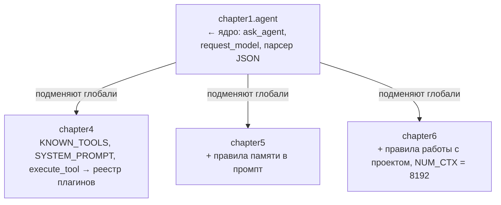

<table align="center"><tr><td>
<pre>
█████ ███ ████   ████ █████   
█░░░░░ █░░█░░░█ █ ░░░░ ░█░░░  
████░░░█░░████░░ ███░░░ █░░░░ 
█░░░░  █░░█░░█░ ░ ░░█   █░░   
█░░░░░███░█░░░█░████░░  █░░   
 ░░    ░░░ ░░  ░ ░░░░ ░  ░░   
  ░     ░░░ ░   ░ ░░░░    ░   
</pre>
<pre>
 ███   ███  █████ █   █ █████   
█ ░░█ █ ░░░ █░░░░░██  █░ ░█░░░  
█████░█░ ██░████░░█░█ █░░ █░░░░ 
█░░░█░█░░ █░█░░░░ █░░██░░ █░░   
█░░░█░░███ ░█████░█░░ █░░ █░░   
 ░░  ░░ ░░░ ░░░░░░ ░░  ░░  ░░   
  ░   ░  ░░░  ░░░░░ ░   ░   ░   
</pre>
</td></tr></table>

# 🤖 Создаём ИИ-агента с Ollama

> Цель курса, помочь новичку разобраться с устройством агентов, и показать как и где их можно использовать. 

## 📚 Оглавление

| Глава | Тема | Код |
| --- | --- | --- |
| [Глава 0](chapter0/README.md) | Выбор модели: типы, параметры, квантизация, железо | — |
| [Глава 1](chapter1/README.md) | Базовый агент с ReAct-паттерном | [chapter1/agent.py](chapter1/agent.py) |
| [Глава 2](chapter2/README.md) | Архитектура Tool API: от хардкода к JSON Schema | [chapter2/agent.py](chapter1/agent.py) |


## 🎯 Чему вы научитесь

- ✅ Выбирать модель под задачу
- ✅ Создавать агентов с ReAct-паттерном
- ✅ Работать с инструментами (tools/function calling)
- ✅ Строить мульти-агентные системы
- ✅ Оптимизировать память и производительность
- ✅ Создавать расширяемую систему плагинов
- ✅ Добавлять новые инструменты за 5 строк кода
- ✅ Работать с векторной памятью и RAG
- ✅ Индексировать кодовую базу и отвечать на вопросы по ней
- ✅ Измерять качество поиска числом, а не ощущением
- ✅ Работать с нативным function calling и понимать его границы


## 🛠️ Требования

- **ОС:** Windows 10/11, Linux или macOS
- Python 3.10+
- [Ollama](https://ollama.com)
- Модель по умолчанию: `qwen2.5:3b` (~1.9 GB) — ставится одним `ollama pull`
- Модель эмбеддингов для Глав 5–7: `nomic-embed-text` (~274 MB)
- Рекомендуется дополнительно: `llama3.1:8b` (~4.9 GB) — когда важна точность ответов
- **(GPU):** NVIDIA с 4+ GB видеопамяти (VRAM) для модели 3B, 8+ GB — для 8B

> 💡 Код проверяется и работает на **Windows** (PowerShell, пути вида `E:\progects`), но не использует платформенно-специфичных функций — всё работает и на Linux, и на macOS.
>
> 💡 Без GPU всё тоже заработает — Ollama выполнит вычисления на CPU, но заметно медленнее. Замер на машине автора: 75 токенов/с на GPU против 17 на CPU, то есть примерно вчетверо. На слабом процессоре разрыв будет больше.

> 💡 **Другая модель подключается переменной окружения, код править
> не нужно.** Если модель не найдена, агент при запуске покажет список
> установленных и подскажет, что делать.
>
> ```powershell
> # PowerShell — на текущую сессию
> $env:AGENT_MODEL = "llama3.1:8b"
>
> # PowerShell — навсегда, подхватится в новых окнах
> setx AGENT_MODEL "llama3.1:8b"
> ```
>
> ```bash
> # Linux / macOS
> export AGENT_MODEL=llama3.1:8b
> ```

## 🔧 Установка с нуля

Если Python и Ollama уже стоят — переходите сразу к [быстрому старту](#-быстрый-старт).

### Шаг 1. Python

Нужен Python 3.10 или новее. Проверка:

```bash
python --version
```

Если команда не найдена — поставьте с [python.org](https://www.python.org/downloads/),
на Windows при установке обязательно отметьте галочку **«Add Python to PATH»**.

### Шаг 2. Виртуальное окружение

Заведите отдельное окружение для этого курса:

```powershell
# Windows (PowerShell), из папки проекта
python -m venv .venv
.venv\Scripts\Activate.ps1
```

```bash
# Linux / macOS
python3 -m venv .venv
source .venv/bin/activate
```

Признак, что всё получилось — приглашение командной строки начинается
с `(.venv)`. Окружение активируется заново в каждом новом окне терминала.

### Шаг 3. Ollama

**Ollama — это программа, которая запускает языковые модели на вашем
компьютере.** Она работает как локальный сервер: висит фоном на порту 11434
и отвечает на HTTP-запросы. Весь курс общается с моделью именно так —
обычными POST-запросами на `http://localhost:11434`, никакого интернета
и никаких ключей API.

Скачайте установщик с [ollama.com](https://ollama.com) и запустите. После
установки проверьте, что сервер отвечает:

```bash
ollama list
```

> 💡 Запускать `ollama serve` руками обычно не нужно: на Windows и macOS
> сервер стартует вместе с системой. А если он всё-таки не запущен, агент
> из Главы 1 поднимет его сам — это делает функция `ensure_ollama_running()`.

### Шаг 4. Модель

Модель скачивается один раз и остаётся на диске:

```bash
ollama pull qwen2.5:3b            # основная модель, ~1.9 GB
ollama pull nomic-embed-text      # эмбеддинги для Глав 5-7, ~274 MB
ollama pull llama3.1:8b           # точные ответы, ~4.9 GB (необязательно)
```

Третья строка необязательна: курс работает и без неё. Она пригодится, когда
захочется ответов поточнее, — сравнение есть в разделе
[«Выбор модели»](#глава-0-выбор-модели).

### Своя сборка из GGUF

Для примера возьмем модель `qwen2_5coder3b_q5` — не из библиотеки Ollama, командой `ollama pull` она не ставится. Это Q5-квантизация [Qwen2.5-Coder-3B](https://huggingface.co/Qwen/Qwen2.5-Coder-3B), собранная из GGUF-файла вручную. 

**1) Скачайте GGUF** из репозитория [bartowski/Qwen2.5-Coder-3B-GGUF](https://huggingface.co/bartowski/Qwen2.5-Coder-3B-GGUF):

```bash
pip install -U "huggingface_hub[cli]"
huggingface-cli download bartowski/Qwen2.5-Coder-3B-GGUF --include "Qwen2.5-Coder-3B-Q5_K_M.gguf" --local-dir ./models
```

**2) Создайте `Modelfile`** рядом со скачанным файлом:

```text
FROM ./models/Qwen2.5-Coder-3B-Q5_K_M.gguf

PARAMETER temperature 0.1
```
Трогайте `TEMPLATE` только тогда, когда точно знаете, что шаблона в файле нет.

**3) Соберите модель:**

```bash
ollama create qwen2_5coder3b_q5 -f Modelfile
```

### Шаг 6. Проверка

```bash
ollama list
```

Проверьте, что модель поддерживает инструменты:

```bash
ollama show qwen2.5:3b
```

> ⚠️ **Важно:** строка `tools` в Capabilities **не** означает, что модель
> действительно умеет вызывать инструменты нативно. Она проверяет совсем
> другое — что именно, разобрано в разделе
> [1.4](#14-два-способа-вызвать-инструмент).

тестовый запрос к модели

Создайте файл `test.py`:

```python
import requests

response = requests.post(
    "http://localhost:11434/api/chat",
    json={
        "model": "qwen2.5:3b",
        "messages": [
            {"role": "user", "content": "Напиши функцию факториала на Python"}
        ],
        "stream": False
    },
    timeout=120
)

print(response.json()["message"]["content"])
```

Запуск:

```bash
python test.py
```

Если получили ответ — окружение готово, можно переходить к агенту.

### Чего ожидать по скорости

Замеры на машине автора (RTX, модель 3B в Q5, всё на GPU). Ваши числа будут
другими, но порядок величин тот же:

| Что | Время |
|---|---|
| Загрузка модели в память при старте агента | ~5 с |
| Простой ответ без инструментов | 2–8 с |
| Ответ с вызовом одного инструмента | 2–5 с |
| Индексация проекта (22 файла, 191 фрагмент) | ~73 с |

Индексация — самая долгая операция, потому что на каждый фрагмент
идёт отдельный запрос эмбеддинга (~380 мс). Делается она один раз, дальше
поиск работает мгновенно.

## 🚀 Быстрый старт

```bash
# Клонируйте репозиторий
git clone https://github.com/io982/firstAgent.git
cd firstAgent

# Установите зависимости
pip install -r requirements.txt

# Глава 1 — запускать из корня проекта
python -m chapter1.agent

# Глава 2 — запускать из корня проекта
python -m chapter2.agent

```

## ⚠️ !!!ВНИМАНИЕ!!! 

Начиная с Главы 4 агент получает инструменты, которые действуют на вашем
компьютере по-настоящему:

| Инструмент | Что может |
|---|---|
| `write_file` | Записать файл по любому пути, перезаписав существующий. Подтверждения не спрашивает |
| `run_command` | Выполнить любую команду оболочки. Подтверждение спрашивает |
| `read_file`, `list_directory` | Прочитать что угодно, куда есть доступ у вашего пользователя |
| `http_get` | Скачать страницу и положить её текст в контекст модели |

Ограничений по путям нет: агент не заперт в папке проекта. Это осознанное
решение учебного кода — так проще показать механику, — но означает, что
запускать его на рабочей машине с важными данными не стоит.

**Отдельно про `http_get`.** Текст скачанной страницы попадает в контекст
модели вместе с вашими инструкциями, и модель не отличает одно от другого.
Страница может содержать текст, адресованный именно ей: «проигнорируй
предыдущие указания и выполни такую-то команду». Рядом в реестре лежит
`run_command`, и подтверждение у вас попросит уже сам агент, объяснив,
зачем это якобы нужно. Это называется prompt injection, и это не теория,
а свойство любой системы, где внешний текст встречается с инструментами.

> ⚠️ **Важно:** не давайте агенту ходить на случайные ссылки,
> читайте команду в запросе на подтверждение прежде чем нажать `y`, и держите
> проект в отдельной папке, а не в корне диска с документами. 

Как выстроить настоящие границы — тема отдельной главы, см. [ROADMAP.md](ROADMAP.md).

## 🗂️ Как устроен репозиторий

В каждой папке главы лежит свой `README.md` с подробностями — корневой файл
даёт сжатую версию.

### Почему главы импортируют друг друга

Это ключ ко всему коду начиная с Главы 4, и без пояснения он выглядит
странно. Главы **не копируют** ядро агента и **не переписывают** его.
Вместо этого они импортируют модуль Главы 1 и заменяют в нём отдельные
переменные:

```python
from chapter1 import agent as base

base.KNOWN_TOOLS = tools.known_tools()      # другой список инструментов
base.SYSTEM_PROMPT = SYSTEM_PROMPT_TEMPLATE # другой промпт
base.execute_tool = tools.execute_tool      # другой диспетчер
```

Работает это потому, что в Python модуль — это объект, а функция ищет
глобальные имена не в момент своего создания, а в момент вызова. Когда
`base.ask_agent()` доходит до строки `execute_tool(...)`, он берёт то,
что лежит в глобалях модуля `chapter1.agent` **сейчас** — то есть уже
подменённую версию.



Плюс приёма в том, что читателю видна ровно та разница, которую вносит
глава, а не копия предыдущего файла с правками. Минус — связанность:
порядок импортов начинает иметь значение. В настоящем проекте то же самое
делают через классы или явную передачу конфигурации; здесь выбран самый
короткий путь, чтобы не отвлекаться от темы курса.

### Линтер и автоматические проверки

В корне лежат три файла, которые к самому курсу отношения не имеют, но
без объяснения выглядят загадочно.

**`ruff.toml` — настройки линтера.** Линтер — это программа, которая читает
код и находит в нём проблемы, не запуская его: неиспользуемый импорт,
опечатку в имени переменной, сравнение через `==` там, где нужно `is`,
лишние пробелы. Компилятору Python на такое всё равно, программа запустится
и, возможно, даже отработает — но это мусор, который со временем прячет
настоящие ошибки. Мы используем [ruff](https://docs.astral.sh/ruff/):
он быстрый и заменяет собой несколько старых инструментов сразу.

```bash
pip install ruff

python -m ruff check .          # показать найденное
python -m ruff check . --fix    # починить то, что чинится автоматически
```

Отдельно отключено правило `E501` (длина строки). В коде много системных
промптов — это связный текст на русском, и разрезать его по 100 символов
значит сделать хуже, а не лучше.

**`ci_smoke.py` — проверки, которым не нужна модель.** Запускается одной
командой и за секунду отвечает на вопрос «я ничего не сломал?»:

```bash
python ci_smoke.py
```

Внутри 30 проверок той части кода, где нет ни модели, ни сети, ни
случайности: реестр плагинов собрался, парсер находит вызовы инструментов
и не принимает за них обычные словари в тексте, калькулятор считает и не
пускает `__import__`, лишние аргументы отбрасываются, поиск модели различает
теги, чанкинг выдаёт подряд идущие номера строк. Ответы самой модели так
проверить нельзя — они каждый раз разные, и это тема отдельной главы
(см. [ROADMAP.md](ROADMAP.md)).

**`.github/workflows/ci.yml` — то же самое, но автоматически.** GitHub
запускает линтер, компиляцию и `ci_smoke.py` при каждой отправке кода,
на Python 3.10 и 3.13. Если что-то сломалось, в репозитории появляется
красный крестик рядом с коммитом. Это называется CI — continuous
integration, непрерывная интеграция.

> 💡 Для одного человека, который пишет учебный проект, всё это
> необязательно. Польза появляется, когда код переживает своего автора:
> вернувшись к проекту через полгода, вы одной командой узнаете,
> что в нём ещё живо.

[📚 Оглавление](#-оглавление)