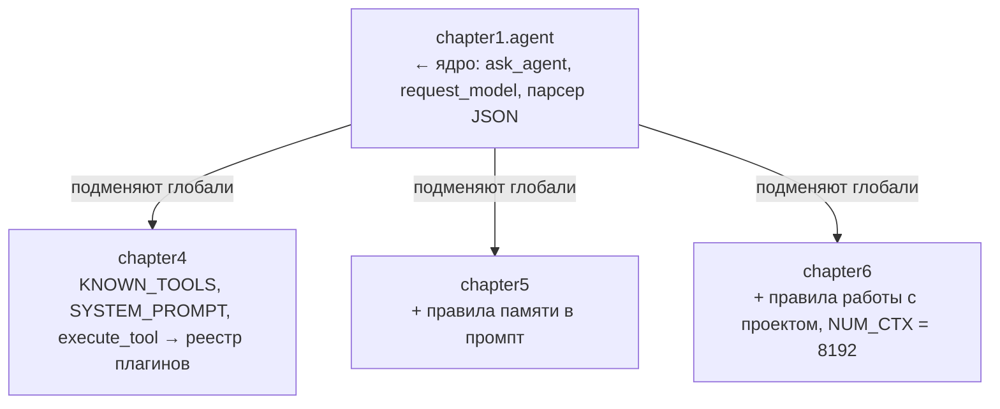
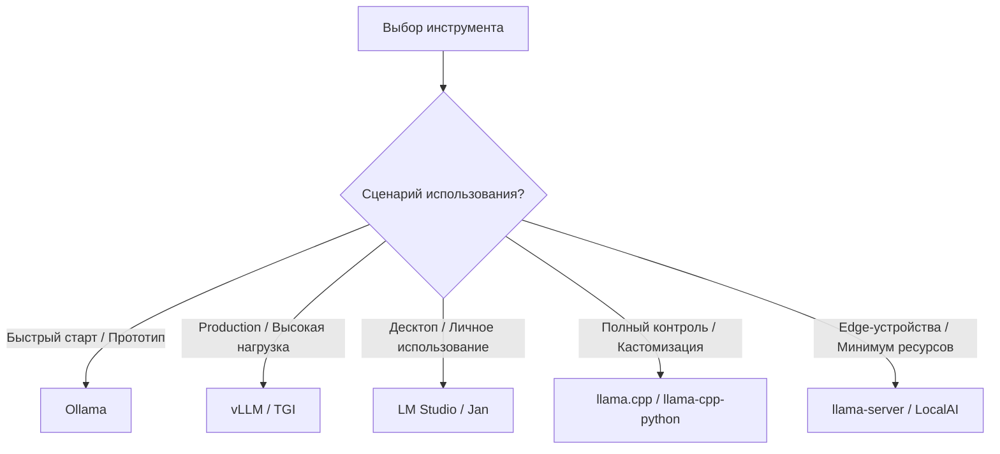
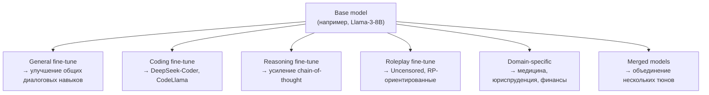
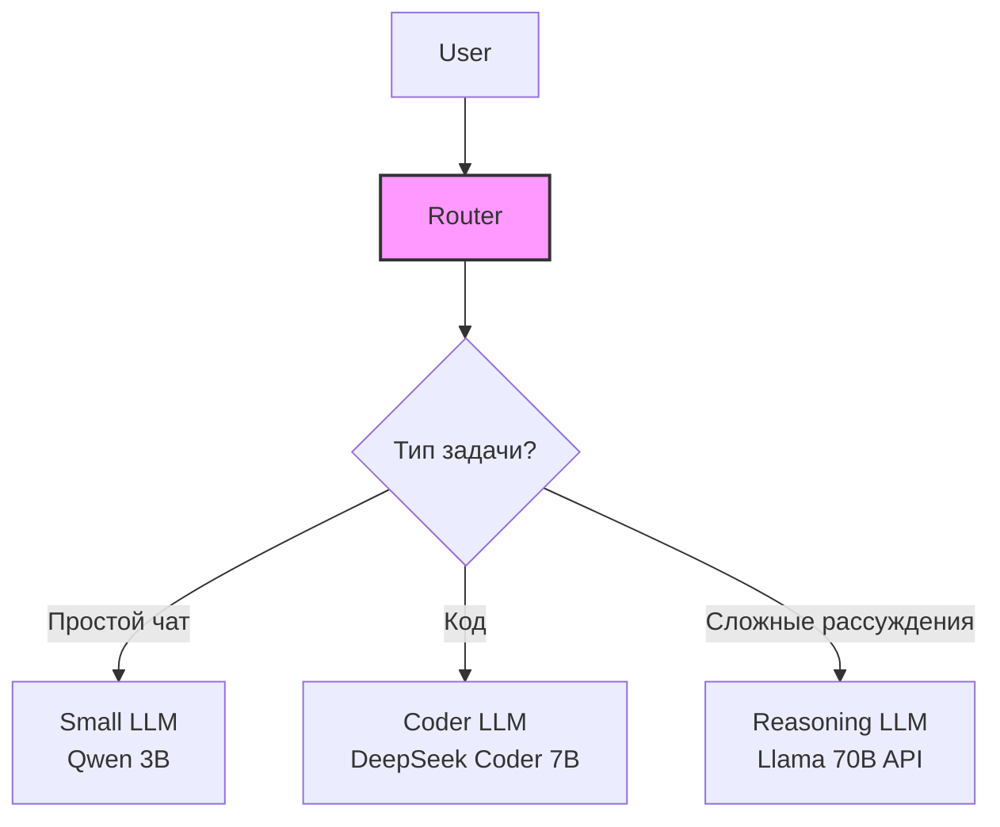
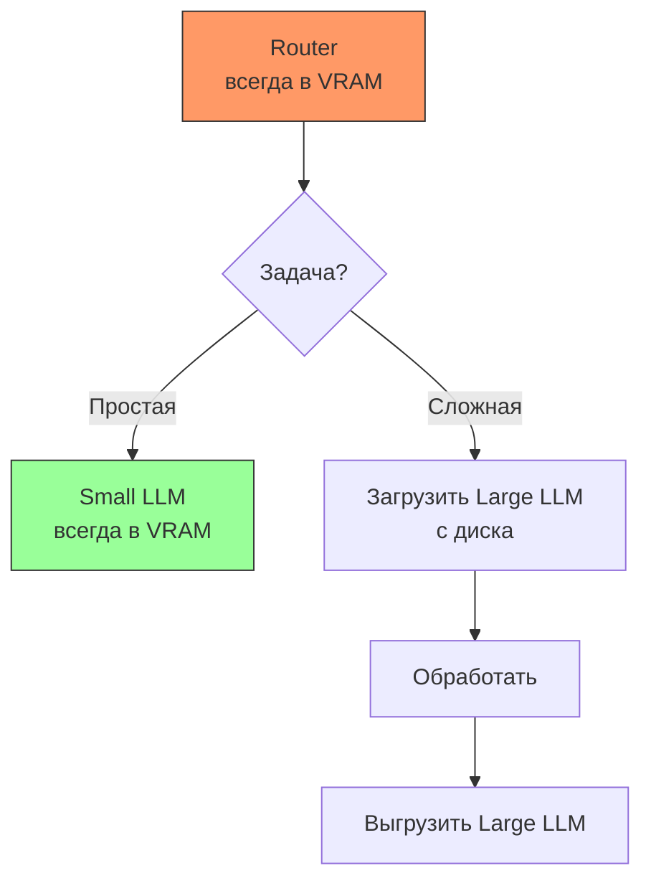
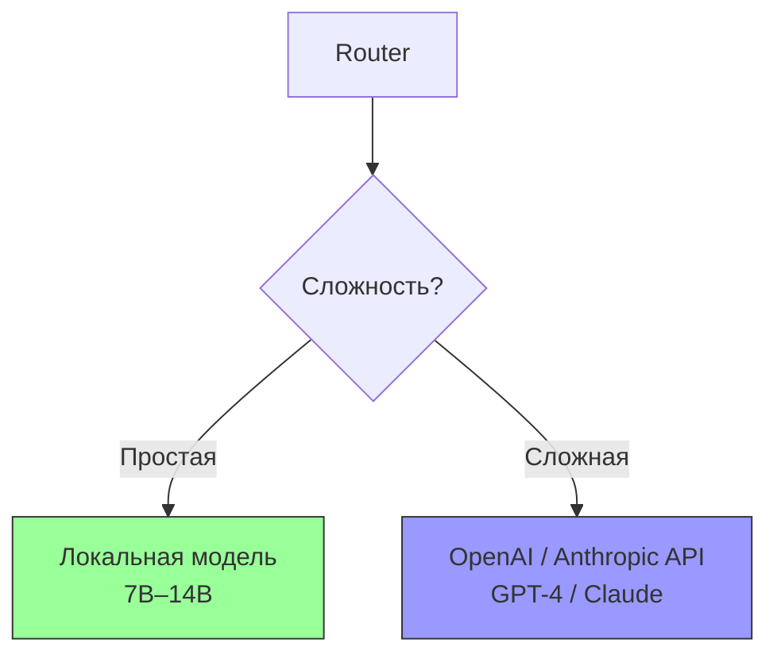
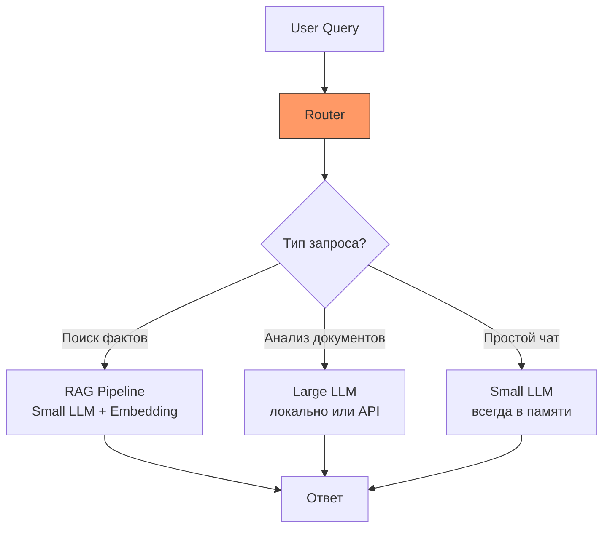
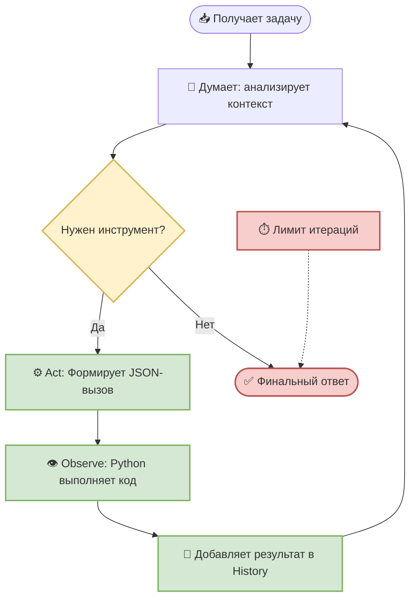

<table align="center"><tr><td>
<pre>
█████ ███ ████   ████ █████   
█░░░░░ █░░█░░░█ █ ░░░░ ░█░░░  
████░░░█░░████░░ ███░░░ █░░░░ 
█░░░░  █░░█░░█░ ░ ░░█   █░░   
█░░░░░███░█░░░█░████░░  █░░   
 ░░    ░░░ ░░  ░ ░░░░ ░  ░░   
  ░     ░░░ ░   ░ ░░░░    ░   
</pre>
<pre>
 ███   ███  █████ █   █ █████   
█ ░░█ █ ░░░ █░░░░░██  █░ ░█░░░  
█████░█░ ██░████░░█░█ █░░ █░░░░ 
█░░░█░█░░ █░█░░░░ █░░██░░ █░░   
█░░░█░░███ ░█████░█░░ █░░ █░░   
 ░░  ░░ ░░░ ░░░░░░ ░░  ░░  ░░   
  ░   ░  ░░░  ░░░░░ ░   ░   ░   
</pre>
</td></tr></table>

# 🤖 Создаём ИИ-агента с Ollama

> Цель курса, помочь новичку разобраться с устройством агентов, и показать как и где их можно использовать. 

## 📚 Оглавление

| Глава | Тема | Код |
| --- | --- | --- |
| [Введение](#-введение) | требования, установка с нуля, быстрый старт, предупреждения, устройство репозитория | — |
| [Глава 0](#глава-0-выбор-модели) | Выбор модели: типы, параметры, квантизация, железо | — |
| [Глава 1](#глава-1-первый-ai-agent--react) | Базовый агент с ReAct-паттерном | [chapter1/agent.py](chapter1/agent.py) |
| [Глава 2](#глава-2-добавление-распознавателя) | Мульти-агентная система | [chapter2/paraphraser.py](chapter2/paraphraser.py) |
| [Глава 3](#глава-3-контекст-память-и-производительность) | Контекст, память и производительность | [chapter3/agent.py](chapter3/agent.py) |
| [Глава 4](#глава-4-система-плагинов-добавляем-новые-инструменты) | Система плагинов: расширяем инструменты | [chapter4/src/tools.py](chapter4/src/tools.py) |
| [Глава 5](#глава-5-долгосрочная-память-и-rag) | Долгосрочная память и RAG | [chapter5/agent.py](chapter5/agent.py) |
| [Глава 6](#глава-6-rag-по-документам-проекта) | RAG по документам проекта | [chapter6/agent.py](chapter6/agent.py) |
| [Глава 7](#глава-7-гибридный-поиск-ключевые-слова--векторы) | Гибридный поиск: ключевые слова + векторы | [chapter7/src/indexer.py](chapter7/src/indexer.py) |
| [Глава 8](#глава-8-нативные-tool_calls) | Нативные tool_calls и два протокола | [chapter8/src/native.py](chapter8/src/native.py) |

## 🎯 Чему вы научитесь

- ✅ Выбирать модель под задачу
- ✅ Создавать агентов с ReAct-паттерном
- ✅ Работать с инструментами (tools/function calling)
- ✅ Строить мульти-агентные системы
- ✅ Оптимизировать память и производительность
- ✅ Создавать расширяемую систему плагинов
- ✅ Добавлять новые инструменты за 5 строк кода
- ✅ Работать с векторной памятью и RAG
- ✅ Индексировать кодовую базу и отвечать на вопросы по ней
- ✅ Измерять качество поиска числом, а не ощущением
- ✅ Работать с нативным function calling и понимать его границы

## 🛠️ Введение

## 🛠️ Требования

- **ОС:** Windows 10/11, Linux или macOS
- Python 3.10+
- [Ollama](https://ollama.com)
- Модель по умолчанию: `qwen2.5:3b` (~1.9 GB) — ставится одним `ollama pull`
- Модель эмбеддингов для Глав 5–7: `nomic-embed-text` (~274 MB)
- Рекомендуется дополнительно: `llama3.1:8b` (~4.9 GB) — когда важна точность ответов
- **(GPU):** NVIDIA с 4+ GB видеопамяти (VRAM) для модели 3B, 8+ GB — для 8B

> 💡 Код проверяется и работает на **Windows** (PowerShell, пути вида `E:\progects`), но не использует платформенно-специфичных функций — всё работает и на Linux, и на macOS.
>
> 💡 Без GPU всё тоже заработает — Ollama выполнит вычисления на CPU, но заметно медленнее. Замер на машине автора: 75 токенов/с на GPU против 17 на CPU, то есть примерно вчетверо. На слабом процессоре разрыв будет больше.

> 💡 **Другая модель подключается переменной окружения, код править
> не нужно.** Если модель не найдена, агент при запуске покажет список
> установленных и подскажет, что делать.
>
> ```powershell
> # PowerShell — на текущую сессию
> $env:AGENT_MODEL = "llama3.1:8b"
>
> # PowerShell — навсегда, подхватится в новых окнах
> setx AGENT_MODEL "llama3.1:8b"
> ```
>
> ```bash
> # Linux / macOS
> export AGENT_MODEL=llama3.1:8b
> ```

## 🔧 Установка с нуля

Если Python и Ollama уже стоят — переходите сразу к [быстрому старту](#-быстрый-старт).

### Шаг 1. Python

Нужен Python 3.10 или новее. Проверка:

```bash
python --version
```

Если команда не найдена — поставьте с [python.org](https://www.python.org/downloads/),
на Windows при установке обязательно отметьте галочку **«Add Python to PATH»**.

### Шаг 2. Виртуальное окружение

Заведите отдельное окружение для этого курса:

```powershell
# Windows (PowerShell), из папки проекта
python -m venv .venv
.venv\Scripts\Activate.ps1
```

```bash
# Linux / macOS
python3 -m venv .venv
source .venv/bin/activate
```

Признак, что всё получилось — приглашение командной строки начинается
с `(.venv)`. Окружение активируется заново в каждом новом окне терминала.

### Шаг 3. Ollama

**Ollama — это программа, которая запускает языковые модели на вашем
компьютере.** Она работает как локальный сервер: висит фоном на порту 11434
и отвечает на HTTP-запросы. Весь курс общается с моделью именно так —
обычными POST-запросами на `http://localhost:11434`, никакого интернета
и никаких ключей API.

Скачайте установщик с [ollama.com](https://ollama.com) и запустите. После
установки проверьте, что сервер отвечает:

```bash
ollama list
```

> 💡 Запускать `ollama serve` руками обычно не нужно: на Windows и macOS
> сервер стартует вместе с системой. А если он всё-таки не запущен, агент
> из Главы 1 поднимет его сам — это делает функция `ensure_ollama_running()`.

### Шаг 4. Модель

Модель скачивается один раз и остаётся на диске:

```bash
ollama pull qwen2.5:3b            # основная модель, ~1.9 GB
ollama pull nomic-embed-text      # эмбеддинги для Глав 5-7, ~274 MB
ollama pull llama3.1:8b           # точные ответы, ~4.9 GB (необязательно)
```

Третья строка необязательна: курс работает и без неё. Она пригодится, когда
захочется ответов поточнее, — сравнение есть в разделе
[«Выбор модели»](#глава-0-выбор-модели).

### Своя сборка из GGUF

Для примера возьмем модель `qwen2_5coder3b_q5` — не из библиотеки Ollama, командой `ollama pull` она не ставится. Это Q5-квантизация [Qwen2.5-Coder-3B](https://huggingface.co/Qwen/Qwen2.5-Coder-3B), собранная из GGUF-файла вручную. 

**1) Скачайте GGUF** из репозитория [bartowski/Qwen2.5-Coder-3B-GGUF](https://huggingface.co/bartowski/Qwen2.5-Coder-3B-GGUF):

```bash
pip install -U "huggingface_hub[cli]"
huggingface-cli download bartowski/Qwen2.5-Coder-3B-GGUF --include "Qwen2.5-Coder-3B-Q5_K_M.gguf" --local-dir ./models
```

**2) Создайте `Modelfile`** рядом со скачанным файлом:

```text
FROM ./models/Qwen2.5-Coder-3B-Q5_K_M.gguf

PARAMETER temperature 0.1
```
Трогайте `TEMPLATE` только тогда, когда точно знаете, что шаблона в файле нет.

**3) Соберите модель:**

```bash
ollama create qwen2_5coder3b_q5 -f Modelfile
```

### Шаг 6. Проверка

```bash
ollama list
```

Проверьте, что модель поддерживает инструменты:

```bash
ollama show qwen2.5:3b
```

> ⚠️ **Важно:** строка `tools` в Capabilities **не** означает, что модель
> действительно умеет вызывать инструменты нативно. Она проверяет совсем
> другое — что именно, разобрано в разделе
> [1.4](#14-два-способа-вызвать-инструмент).

тестовый запрос к модели

Создайте файл `test.py`:

```python
import requests

response = requests.post(
    "http://localhost:11434/api/chat",
    json={
        "model": "qwen2.5:3b",
        "messages": [
            {"role": "user", "content": "Напиши функцию факториала на Python"}
        ],
        "stream": False
    },
    timeout=120
)

print(response.json()["message"]["content"])
```

Запуск:

```bash
python test.py
```

Если получили ответ — окружение готово, можно переходить к агенту.

### Чего ожидать по скорости

Замеры на машине автора (RTX, модель 3B в Q5, всё на GPU). Ваши числа будут
другими, но порядок величин тот же:

| Что | Время |
|---|---|
| Загрузка модели в память при старте агента | ~5 с |
| Простой ответ без инструментов | 2–8 с |
| Ответ с вызовом одного инструмента | 2–5 с |
| Индексация проекта (22 файла, 191 фрагмент) | ~73 с |

Индексация — самая долгая операция, потому что на каждый фрагмент
идёт отдельный запрос эмбеддинга (~380 мс). Делается она один раз, дальше
поиск работает мгновенно.

## 🚀 Быстрый старт

```bash
# Клонируйте репозиторий
git clone https://github.com/io982/firstAgent.git
cd firstAgent

# Установите зависимости
pip install -r requirements.txt

# Глава 1 — запускать из корня проекта
python -m chapter1.agent

# Глава 2 (мульти-агент)
python -m chapter2.paraphraser

# Глава 3 (память между запросами)
python -m chapter3.agent

# Глава 4 (плагины)
python -m chapter4.agent

# Глава 5 (долгосрочная память) — нужна модель эмбеддингов
ollama pull nomic-embed-text
python -m chapter5.agent

# Глава 6 (RAG по коду проекта)
python -m chapter6.agent

# Глава 7 (гибридный поиск: векторы + ключевые слова)
python -m chapter7.agent

# Замер качества поиска: векторы против гибрида
python -m chapter7.test_hybrid

# Глава 8 (нативные tool_calls, формат определяется автоматически)
python -m chapter8.agent

# Какие модели отдают нативные вызовы, а какие нет
python -m chapter8.test_formats
```

## ⚠️ !!!ВНИМАНИЕ!!! 

Начиная с Главы 4 агент получает инструменты, которые действуют на вашем
компьютере по-настоящему:

| Инструмент | Что может |
|---|---|
| `write_file` | Записать файл по любому пути, перезаписав существующий. Подтверждения не спрашивает |
| `run_command` | Выполнить любую команду оболочки. Подтверждение спрашивает |
| `read_file`, `list_directory` | Прочитать что угодно, куда есть доступ у вашего пользователя |
| `http_get` | Скачать страницу и положить её текст в контекст модели |

Ограничений по путям нет: агент не заперт в папке проекта. Это осознанное
решение учебного кода — так проще показать механику, — но означает, что
запускать его на рабочей машине с важными данными не стоит.

**Отдельно про `http_get`.** Текст скачанной страницы попадает в контекст
модели вместе с вашими инструкциями, и модель не отличает одно от другого.
Страница может содержать текст, адресованный именно ей: «проигнорируй
предыдущие указания и выполни такую-то команду». Рядом в реестре лежит
`run_command`, и подтверждение у вас попросит уже сам агент, объяснив,
зачем это якобы нужно. Это называется prompt injection, и это не теория,
а свойство любой системы, где внешний текст встречается с инструментами.

> ⚠️ **Важно:** не давайте агенту ходить на случайные ссылки,
> читайте команду в запросе на подтверждение прежде чем нажать `y`, и держите
> проект в отдельной папке, а не в корне диска с документами. 

Как выстроить настоящие границы — тема отдельной главы, см. [ROADMAP.md](ROADMAP.md).

## 🗂️ Как устроен репозиторий

В каждой папке главы лежит свой `README.md` с подробностями — корневой файл
даёт сжатую версию.

### Почему главы импортируют друг друга

Это ключ ко всему коду начиная с Главы 4, и без пояснения он выглядит
странно. Главы **не копируют** ядро агента и **не переписывают** его.
Вместо этого они импортируют модуль Главы 1 и заменяют в нём отдельные
переменные:

```python
from chapter1 import agent as base

base.KNOWN_TOOLS = tools.known_tools()      # другой список инструментов
base.SYSTEM_PROMPT = SYSTEM_PROMPT_TEMPLATE # другой промпт
base.execute_tool = tools.execute_tool      # другой диспетчер
```

Работает это потому, что в Python модуль — это объект, а функция ищет
глобальные имена не в момент своего создания, а в момент вызова. Когда
`base.ask_agent()` доходит до строки `execute_tool(...)`, он берёт то,
что лежит в глобалях модуля `chapter1.agent` **сейчас** — то есть уже
подменённую версию.



Плюс приёма в том, что читателю видна ровно та разница, которую вносит
глава, а не копия предыдущего файла с правками. Минус — связанность:
порядок импортов начинает иметь значение. В настоящем проекте то же самое
делают через классы или явную передачу конфигурации; здесь выбран самый
короткий путь, чтобы не отвлекаться от темы курса.

### Линтер и автоматические проверки

В корне лежат три файла, которые к самому курсу отношения не имеют, но
без объяснения выглядят загадочно.

**`ruff.toml` — настройки линтера.** Линтер — это программа, которая читает
код и находит в нём проблемы, не запуская его: неиспользуемый импорт,
опечатку в имени переменной, сравнение через `==` там, где нужно `is`,
лишние пробелы. Компилятору Python на такое всё равно, программа запустится
и, возможно, даже отработает — но это мусор, который со временем прячет
настоящие ошибки. Мы используем [ruff](https://docs.astral.sh/ruff/):
он быстрый и заменяет собой несколько старых инструментов сразу.

```bash
pip install ruff

python -m ruff check .          # показать найденное
python -m ruff check . --fix    # починить то, что чинится автоматически
```

Отдельно отключено правило `E501` (длина строки). В коде много системных
промптов — это связный текст на русском, и разрезать его по 100 символов
значит сделать хуже, а не лучше.

**`ci_smoke.py` — проверки, которым не нужна модель.** Запускается одной
командой и за секунду отвечает на вопрос «я ничего не сломал?»:

```bash
python ci_smoke.py
```

Внутри 30 проверок той части кода, где нет ни модели, ни сети, ни
случайности: реестр плагинов собрался, парсер находит вызовы инструментов
и не принимает за них обычные словари в тексте, калькулятор считает и не
пускает `__import__`, лишние аргументы отбрасываются, поиск модели различает
теги, чанкинг выдаёт подряд идущие номера строк. Ответы самой модели так
проверить нельзя — они каждый раз разные, и это тема отдельной главы
(см. [ROADMAP.md](ROADMAP.md)).

**`.github/workflows/ci.yml` — то же самое, но автоматически.** GitHub
запускает линтер, компиляцию и `ci_smoke.py` при каждой отправке кода,
на Python 3.10 и 3.13. Если что-то сломалось, в репозитории появляется
красный крестик рядом с коммитом. Это называется CI — continuous
integration, непрерывная интеграция.

> 💡 Для одного человека, который пишет учебный проект, всё это
> необязательно. Польза появляется, когда код переживает своего автора:
> вернувшись к проекту через полгода, вы одной командой узнаете,
> что в нём ещё живо.

[📚 Оглавление](#-оглавление)

---

# Глава 0. Выбор модели

> **Цель главы:** научиться понимать, выбирать и запускать локальные LLM-модели для создания AI-агентов.

Сегодня существует большое количество моделей, различающихся:

* размером;
* архитектурой;
* назначением;
* качеством reasoning;
* способностью работать с tools;
* поддержкой vision;
* размером контекстного окна;
* потреблением памяти;
* скоростью;
* лицензией;
* качеством на конкретной задаче.

Поэтому перед созданием агента важно сначала ответить на вопрос:

> **Какую модель использовать?**

В этой главе мы разберём этот вопрос системно.

---

## 0.1. Что такое LLM для агента

**LLM (Large Language Model)** — модель, обученная предсказывать следующий токен в последовательности и на этой основе генерировать связный текст.

В агентной архитектуре LLM выступает не просто генератором текста, а управляющим компонентом, который:

* интерпретирует задачу — превращает цель пользователя и контекст в конкретный план действий;
* декомпозирует и выбирает стратегию — разбивает сложную задачу на подзадачи и определяет порядок их решения;
* вызывает инструменты — формирует обращения к API, поиску, базам данных, файлам, коду и интерпретирует полученные результаты;
* использует память — обращается к сохранённым фактам, промежуточным результатам и прошлым решениям через внешнее хранилище (сама модель не имеет состояния между вызовами);
* действует и наблюдает — инициирует шаги, анализирует результат выполнения и корректирует дальнейшее поведение;
* самопроверяется — критически оценивает собственные ответы и действия, исправляет ошибки;
* формирует структурированный вывод — помимо обычного текста, генерирует команды, JSON или вызовы функций в заданном формате.

Таким образом, в агенте LLM выполняет роль «мозга»:
управляет циклом «восприятие → рассуждение → действие → наблюдение», а не просто отвечает на одну реплику.
---

## 0.2. Что такое Ollama

**Ollama** — это инструмент для локального запуска LLM, который упрощает загрузку, управление и инференс моделей. Ollama предоставляет **OpenAI-совместимый API**, через которое Python-приложение может обращаться к модели.

Например:

```python
from ollama import chat

response = chat(
    model="qwen3:4b",
    messages=[
        {
            "role": "user",
            "content": "Что такое AI Agent?"
        }
    ]
)

print(response.message.content)
```

В следующих главах именно через этот интерфейс мы будем строить агентов.

### Почему Ollama?

Ollama стал де-факто стандартом для локальной разработки благодаря:
* 🚀 **Простоте:** одна команда `ollama run llama3` — и модель готова к работе
* 🔌 **OpenAI-совместимому API:** код легко мигрирует с OpenAI на локальные модели
* 📦 **Управлению моделями:** встроенный репозиторий с готовыми квантами
* 🛠️ **Кроссплатформенности:** работает на macOS, Linux, Windows

---

## 0.2.1. Альтернативы Ollama

Хотя Ollama отлично подходит для разработки и прототипирования, для production-задач или специфических сценариев могут потребоваться другие инструменты.

### Серверные решения (Production-grade)

| Инструмент | Особенности | Когда использовать |
| :--- | :--- | :--- |
| **vLLM** | Высокая пропускная способность, PagedAttention, continuous batching | Production-серверы с высокой нагрузкой, когда нужна максимальная скорость |
| **TGI** (Text Generation Inference) | От Hugging Face, оптимизирован для GPU, поддержка TensorRT | Когда нужна интеграция с экосистемой Hugging Face |
| **LocalAI** | Drop-in замена OpenAI API, поддержка множества форматов (GGUF, SafeTensors) | Когда нужен OpenAI-совместимый API с гибкостью |
| **llama-server** | Легковесный HTTP-сервер из `llama.cpp` | Минималистичные развертывания, edge-устройства |

### Десктопные приложения (GUI)

| Инструмент | Особенности | Когда использовать |
| :--- | :--- | :--- |
| **LM Studio** | Удобный GUI, встроенный чат, поиск моделей | Для личного использования, тестирования моделей без CLI |
| **Jan** | Приватность, оффлайн-режим, кроссплатформенность | Когда важна конфиденциальность и простота |
| **GPT4All** | Фокус на приватности, встроенные инструменты | Для не-технических пользователей |
| **text-generation-webui** (oobabooga) | Мощный GUI с расширенными настройками | Для продвинутых пользователей, экспериментов с файн-тюнами |

### Нативные библиотеки (Python/C++)

| Инструмент | Особенности | Когда использовать |
| :--- | :--- | :--- |
| **llama.cpp** | Нативная C++ реализация, максимальная производительность | Когда нужен полный контроль над инференсом |
| **llama-cpp-python** | Python-биндинги для `llama.cpp` | Когда нужна интеграция GGUF в Python-код |
| **Transformers** (Hugging Face) | Универсальная библиотека для всех моделей | Когда работаете с SafeTensors, не GGUF |
| **ExLlamaV2** | Оптимизирован для EXL2 квантов | Когда используете EXL2 формат для максимальной скорости |

---

### Сравнение подходов



---

### Миграция с Ollama

благодаря OpenAI-совместимому API, миграция обычно сводится к изменению базового URL:

```python
# Ollama
from openai import OpenAI
client = OpenAI(base_url="http://localhost:11434/v1", api_key="ollama")

# vLLM
client = OpenAI(base_url="http://localhost:8000/v1", api_key="empty")

# LocalAI
client = OpenAI(base_url="http://localhost:8080/v1", api_key="empty")
```

---

## 0.3. Семейсва моделей

к середине 2026 года.

* Qwen. Семейство моделей Alibaba. 
> Имеют хорошую поддержку: reasoning, coding, tool calling, multilingual tasks.
* Llama. Семейство Meta. Llama стало одной из основных платформ открытой LLM-экосистемы.
> На базе Llama существует большое количество: fine-tunes, coding models,
> reasoning models, специализированных моделей.
* Gemma. Семейство Google.
> для: небольших локальных моделей, reasoning, multimodal / vision задач.
* Mistral. Семейство моделей Mistral AI.
> для: general-purpose задач, coding, tool calling, локального inference.
> Отдельный интерес представляют модели семейства Devstral, 
> ориентированные на coding agents.
* DeepSeek. Семейство DeepSeek интересно прежде всего reasoning-моделями.
> для: сложного reasoning, planning, decomposition, verification, математических задач.
* Phi. Небольшие модели Microsoft.
> Интересны прежде всего там, где важны: маленький размер, 
> низкое потребление памяти, скорость.


модели постоянно меняются. Важно не запомнить названия всех моделей, а научиться понимать:
**какие характеристики модели важны для конкретной задачи.**

---

## 0.4. Типы моделей и возможности моделей

Типы (условно)

* General-purpose. Универсальные модели. Подходят для: диалога; анализа текста; суммаризации; простых агентов; tool calling.
* Reasoning models. Модели, оптимизированные под более сложные рассуждения. Используются для: planning; decomposition; математики; сложного анализа; verification.
* Coding models. Специализированы на программировании. 
* Agentic models. Некоторые модели специально оптимизируются для агентных сценариев. Для них важны: instruction following; tool calling; planning; long context; устойчивость в многошаговых задачах.
* Vision / Multimodal. Модели, которые могут работать с изображениями. 
* Embedding models. такая модель не должна отвечать пользователю. Она превращает текст в вектор. Такие модели используются для: semantic search; RAG; similarity search; memory retrieval.

---

## 0.5. Возможности моделей

При выборе модели недостаточно смотреть только на количество параметров. Нужно смотреть на **capabilities**.

* Tool Calling. Для AI Agent это одна из важнейших возможностей. Модель может сформировать вызов инструмента. Например:
* Structured Output. Модель умеет выдавать данные в заданной структуре. Нужно для: routers; classifiers; planners; tool selection.
* Reasoning. Модель способна выполнять сложные многошаговые рассуждения. 
* Vision. Модель может принимать изображения.
* Long Context. Модель может обрабатывать большой объём текста.

---

## 0.6. Параметры

Больше параметров обычно означает:

* больше потенциальной ёмкости модели;
* больше требований к памяти;
* часто более высокое качество.

Но:

> **Больше параметров ≠ автоматически лучше.**

Модель 4B, хорошо обученная под конкретную задачу, может оказаться полезнее плохо подходящей модели 14B.
Особенно это заметно в агентных задачах.

---

## 0.7. Архитектуры Dense и MoE

**Dense** и **MoE (Mixture of Experts)** — это два способа устроить внутренние слои трансформера (обычно речь про feed-forward слои).

- **Dense** — «обычная» архитектура: каждый токен на каждом forward pass проходит через **все** параметры сети. 
Никакой избирательности — 100% весов задействованы всегда.
- **MoE** — часть слоёв заменена набором из N отдельных подсетей («экспертов»). 
Специальный **router** для каждого токена выбирает **top-k** экспертов (например, 2 из 8), остальные в вычислении этого токена не участвуют.

**Зачем это нужно:** общее число параметров модели может быть огромным (её «ёмкость знаний»), но реальная вычислительная нагрузка на токен — как у гораздо меньшей dense-модели. 
Отсюда компромиссы: MoE сложнее обучать (балансировка загрузки экспертов, риск того что router всегда выбирает одних и тех же), и все эксперты всё равно должны быть загружены в память — экономится компьютация, а не VRAM.

---

## 0.8. Контекстное окно

Context window — максимальный объём информации, который модель может учитывать в одном запросе.
Упрощенно он состоит:

```text
Context = System prompt + History + Tools + Documents + User message + Tool results
```

Если context переполняется, агент начинает сталкиваться со следующими проблемами:

* **жёсткий отказ** — при превышении лимита токенов запрос не выполняется, API возвращает ошибку;
* **потеря информации при обрезке** — старые сообщения обрезаются, чтобы уместиться в лимит, и агент теряет ранние инструкции и промежуточные решения;
* **деградация внимания («lost in the middle»)** — модель хуже использует информацию из середины длинного контекста, чем из начала или конца;
* **неограниченный рост истории** — в цикле «мысль → действие → наблюдение» каждый вызов инструмента добавляет новые наблюдения, и без сжатия история рано или поздно упирается в лимит;
* **рост задержки и стоимости** — каждый токен в контексте увеличивает время обработки и расход бюджета на задачу;
* **повторение действий и зацикливание** — если ключевой факт (например, «этот подход уже пробовали») выпал из контекста, агент может повторно предпринять то же действие;
* **ослабление system prompt** — когда системные инструкции занимают всё меньшую долю от общего контекста, модель хуже им следует.

Эти проблемы решаются за счёт суммаризации истории, выноса документов во внешнее хранилище с retrieval (RAG), декомпозиции задачи на подзадачи с независимым контекстом и архивирования памяти во внешний stateful store.

---

## 0.9. Квантование

Оригинальная модель может быть слишком большой для локального компьютера. Quantization позволяет уменьшить размер представления весов, снижая число бит, используемых для хранения каждого параметра.

Буква `Q` — quantization, цифра — число бит на вес. Например:

* FP16 — 16 бит на вес (базовый формат обучения/инференса);
* Q8 — 8 бит на вес;
* Q4 — 4 бита на вес (точнее, ~4–5 бит с учётом служебных scale-факторов в блочных схемах вроде `Q4_K_M`).

Размер модели примерно пропорционален произведению числа параметров на число бит на вес:

```text
размер ≈ параметры × биты / 8
```

Для модели 14B: FP16 ≈ 28 GB, Q4 ≈ 7–8 GB.

Чем меньше бит, тем больше ошибка округления весов и тем заметнее возможная деградация качества — поэтому Q4 является распространённым компромиссом между размером и качеством, но результат всё равно нужно проверять на реальной задаче.

---

## 0.10. Аппаратное обеспечение

Выбор модели напрямую зависит от доступного железа, которое определяет возможность запуска, скорость генерации (tokens/sec) и стоимость эксплуатации.

**Ключевые компоненты:**
* **GPU и VRAM (Главный приоритет):** Объем видеопамяти — основное ограничение. 
  * *Правило:* ~2 ГБ VRAM на 1 млрд параметров (для формата FP16). 
  * *Важно:* Длинный контекст (KV-кэш) также потребляет дополнительную VRAM.
* **RAM:** Критична для CPU-инференса или при выгрузке части слоев с GPU (offloading). Требуется запас +20–30% к размеру модели.
* **CPU:** Отвечает за токенизацию и оркестрацию. Для CPU-инференса желательна поддержка инструкций AVX2 / AVX-512.
* **Накопитель:** Используйте только NVMe SSD для быстрой загрузки весов модели в память.

**Оптимизация при нехватке ресурсов:**
Применяйте **квантование** (форматы GGUF, AWQ, GPTQ). Перевод весов в INT4 или INT8 снижает требования к памяти в 2–4 раза с минимальной потерей качества (1–3%).

**Шпаргалка по выбору:**

| Уровень железа | Пример конфигурации | Рекомендуемый размер модели | Формат |
| :--- | :--- | :--- | :--- |
| **Edge / Слабый ПК** | 8–16 ГБ RAM, iGPU / NPU | 0.5B – 3B | INT4 (GGUF) |
| **Потребительский ПК** | RTX 3060 (12GB) – 4090 (24GB) | 7B – 14B | INT4 / INT8 |
| **Рабочая станция** | 1–2 GPU (24–48GB VRAM), 64GB+ RAM | 30B – 70B | INT4 / AWQ / GPTQ |
| **Enterprise / Cloud** | Кластеры A100/H100 (80GB+), NVLink | 70B – 400B+ | BF16 / FP8 |

> 💡 **Совет:** Всегда начинайте проектирование с аудита целевой инфраструктуры и тестового запуска квантованной версии модели, а не полноразмерной.

---

Вот улучшенная версия обоих разделов. Я исправил неточности, расширил контекст и сделал структуру более практичной.

---

## 0.11. GGUF

**GGUF** (GPT-Generated Unified Format) — бинарный формат файлов, разработанный в рамках проекта `llama.cpp`. Это один из ключевых форматов для локального инференса LLM благодаря своей самодостаточности и поддержке квантования.

**Ключевые особенности:**
* 📦 **Self-contained:** все веса, токенизатор и метаданные хранятся в одном файле.
* 🗜️ **Квантование из коробки:** поддержка форматов от `Q2_K` до `Q8_0` (и новых `IQ*` — importance-matrix квантов).
* 🏷️ **Метаданные:** архитектура модели, размер контекста, гиперпараметры встроены в файл.
* 🚀 **CPU-friendly:** оптимизирован для инференса как на GPU, так и на CPU.

**Где искать модели в GGUF:**
1. **Ollama Library** — готовые к запуску тэги (самый простой путь).
2. **Hugging Face** — если нужной модели или кванта нет в Ollama, ищите на HF по тегу `gguf`. Популярные авторы квантов: `bartowski`, `MaziyarPanahi`, `Unsloth`, `lglodas`.
3. **Собственные кванты** — можно сквантовать модель самостоятельно через `llama.cpp` (`quantize`) или `unsloth`.

**Совместимые runtime:**
Помимо **Ollama**, GGUF запускается в:
* `llama.cpp` / `llama-server` (нативно)
* **LM Studio** (удобный GUI)
* **KoboldCpp** (для ролевых игр и long-context)
* **text-generation-webui** (oobabooga)
* **llama-cpp-python** (Python-биндинги)
* **GPT4All**, **Jan**, **CrewAI** и др.

> 💡 **Совет:** При импорте кастомного GGUF в Ollama используйте `Modelfile` с директивой `FROM ./path/to/model.gguf`.

---

## 0.12. Fine-tunes

Одна базовая (base) модель может иметь множество производных — **файн-тюнов**. Это создаёт целое «семейство» моделей с разным поведением.



**Важно:** название модели на Hugging Face часто не раскрывает всей картины. Одна и та же base-модель с разными тюнами может вести себя диаметрально противоположно.

### Чек-лист при выборе файн-тюна

Перед использованием модели проверьте:

**🔍 Происхождение и база**
- Кто автор? (известный тьюнер vs. случайный пользователь)
- На какой **base-модели** построен тюн? (Llama-3, Mistral, Qwen и т.д.)
- Какой **метод** использовался? (Full fine-tune, **LoRA**, **QLoRA**, DPO, ORPO, merge)

**📚 Данные и обучение**
- На каком датасете обучалась модель? (OpenHermes, Magpie, UltraChat, кастомные данные)
- Какой размер контекста поддерживается?
- Применялся ли **DPO/RLHF** для выравнивания (alignment)?

**⚖️ Легальность и ограничения**
- Какая **лицензия**? (Apache 2.0, Llama-3 Community, CC-BY-NC и др.)
- Есть ли ограничения на коммерческое использование?
- Соблюдены ли требования base-модели (attribution, accept-use policy)?

**📊 Качество и совместимость**
- Какие **benchmarks** приведены? (MMLU, HumanEval, MT-Bench, Arena ELO)
- Есть ли позиция в **Open LLM Leaderboard**?
- В каком формате распространяется? (GGUF, SafeTensors, AWQ, EXL2)
- Какое **квантование** доступно и насколько оно щадящее?

> 💡 **Совет:** При выборе файн-тюна всегда открывайте **Model Card** на Hugging Face — там авторы обычно указывают базу, датасет, метод обучения и примеры использования. Отсутствие Model Card — повод насторожиться.

---

Вот более компактная и структурированная версия:

## 0.13. Как выбирать модель

### Алгоритм выбора за 6 шагов

**1️⃣ Определите задачу**
- Простой чат / Coding agent / RAG / Vision agent

**2️⃣ Определите capabilities**
- Tool calling? Reasoning? Vision? Long context? Structured output?

**3️⃣ Оцените железо**

| RAM | VRAM | Рекомендуемый размер модели |
|:---|:---|:---|
| 8–16 ГБ | 8 ГБ | 1B–4B |
| 16–32 ГБ | 12–16 ГБ | 7B–8B |
| 32–64 ГБ | 24 ГБ | 14B–32B |
| 64+ ГБ | 48+ ГБ | 70B+ (Advanced) |

**4️⃣ Выберите quantization**
- `Q4_K_M` — отправная точка для ограниченного железа
- `Q5_K_M` / `Q6_K` / `Q8_0` — если памяти достаточно (лучше качество)

**5️⃣ Проверьте на реальной задаче**

Не полагайтесь только на benchmarks. Протестируйте именно ваш сценарий:

```bash
# Пример: 10 задач tool-calling, 10 RAG, 10 coding
# Сравните результаты между моделями
```

**6️⃣ Итерируйте**

Если модель не справляется:
- Увеличьте размер модели (если позволяет железо)
- Попробуйте лучшее квантование (Q5/Q6 вместо Q4)
- Рассмотрите специализированный fine-tune

---

### Быстрый чек-лист

```markdown
□ Задача определена
□ Capabilities определены (tool calling, vision, etc.)
□ Железо оценено (RAM/VRAM)
□ Размер модели подобран под железо
□ Quantization выбран (Q4_K_M → Q8_0)
□ Модель протестирована на реальных задачах
□ Результат удовлетворительный
```

> 💡 **Совет:** Начинайте с `Q4_K_M` квантования модели среднего размера (7B–14B). Это оптимальная точка старта для большинства задач.

---

## 0.14. Маршрутизация моделей

Одна из ключевых идей:

> **Не обязательно использовать одну модель для всех задач.**

Разные задачи требуют разных моделей. Router направляет запрос к подходящей модели:



---

### Стратегии для разного железа

#### Стратегия 1: Последовательная загрузка (слабый ПК)

На слабом ПК модели загружаются **по очереди**, а не одновременно:


**Пример:**
```python
# Псевдокод
def route_request(task_type, query):
    if task_type == "simple":
        model = load_model("qwen3:3b")  # ~2 ГБ VRAM
        return model.chat(query)
        unload_model(model)
    
    elif task_type == "coding":
        model = load_model("deepseek-coder:7b")  # ~5 ГБ VRAM
        return model.chat(query)
        unload_model(model)
```

**Плюсы:**
- Работает на 8–16 ГБ VRAM
- Можно использовать 3–5 специализированных моделей

**Минусы:**
- Задержка при переключении (5–30 секунд)
- Не подходит для real-time приложений
 
#### Стратегия 2: Одна модель в памяти + остальные на диске

Router и основная модель всегда в VRAM, остальные подгружаются по необходимости:



**Пример конфигурации:**
- Router + Small LLM: 4 ГБ VRAM (всегда заняты)
- Large LLM: 12 ГБ VRAM (подгружается по запросу)
- Итого: 16 ГБ VRAM достаточно


#### Стратегия 3: Гибрид локальных моделей + API

Тяжелые задачи делегируются облачным API:



**Пример:**
```python
def route_request(query):
    complexity = estimate_complexity(query)
    
    if complexity < 0.7:
        # Локальная модель для простых задач
        return local_model.chat(query)
    else:
        # API для сложных рассуждений
        return openai_client.chat(query)
```

**Плюсы:**
- Локальные модели = приватность + скорость
- API = доступ к флагманским моделям
- Экономия на API-токенах (80% запросов обрабатываются локально)


### Практический пример: RAG-система



**Конфигурация для 16 ГБ VRAM:**
- Router + Small LLM (Qwen 3B Q4): 2 ГБ
- Embedding model (BGE-small): 1 ГБ
- Large LLM (Llama 70B Q4): подгружается через API или с диска

### Как реализовать Router

Router может быть:
1. **Простая модель** (1B–3B параметров)
2. **Классификатор** (BERT, FastText)
3. **Правила** (regex, keywords)
4. **LLM с function calling** (для сложной маршрутизации)

**Пример простого router на правилах:**
```python
def simple_router(query):
    if any(word in query.lower() for word in ["код", "программа", "функция"]):
        return "coder_model"
    elif len(query) > 500:  # длинные запросы
        return "reasoning_model"
    else:
        return "small_model"
```

**Пример router на LLM:**
```python
def llm_router(query):
    prompt = f"""Классифицируй запрос:
    {query}
    
    Ответь одним словом: simple, coding, reasoning"""
    
    response = small_model.chat(prompt)
    return response.strip().lower()
```

### Рекомендации

| Железо | Стратегия | Конфигурация |
|:---|:---|:---|
| **8 ГБ VRAM** | Последовательная загрузка | 2–3 модели по 3B–7B |
| **16 ГБ VRAM** | Одна в памяти + остальные на диске | 1×7B всегда + 1×14B по запросу |
| **24 ГБ VRAM** | Гибрид локальных + API | 1×14B всегда + API для сложных задач |
| **48+ ГБ VRAM** | Несколько моделей одновременно | 2–3 модели 7B–14B параллельно |

> 💡 **Совет:** Начинайте с одной универсальной модели (7B–14B). Когда увидите, что она плохо справляется с определенными задачами — добавьте специализированную модель и router. Не усложняйте архитектуру без необходимости.

---

# Глава 1. Первый AI Agent — ReAct

**Статус: CORE**

В этой главе мы создадим первого локального агента. Не просто чат-бота, который отвечает текстом, а систему, которая умеет думать, использовать инструменты и доводить задачу до конца.

## 1.1. LLM vs Agent

Часто возникает путаница: языковую модель (LLM) называют агентом. Это не совсем так.

**LLM** — это движок для предсказания текста. У неё нет «рук» (она не может открыть файл или посчитать выражение) и нет памяти между вызовами (каждый запрос — чистый лист).

**AI Agent** — это архитектурная надстройка: **Оркестратор (Python-код) + LLM + Инструменты (Tools)**. Именно оркестратор даёт модели «руки» и «память» (храня `Message History` в переменной `State` в рамках одного запроса).

## 1.2. Архитектура ReAct

**ReAct** (Reasoning + Acting) — это паттерн, который заставляет модель не просто выдавать ответ, а проходить по шагам: подумать, сделать, посмотреть на результат и повторить при необходимости.

Цикл ReAct состоит из четырёх этапов:
1. **Reason (Рассуждение)**: Модель анализирует задачу и историю, формулируя план.
2. **Act (Действие)**: Модель формирует структурированный запрос к инструменту с аргументами.
3. **Observe (Наблюдение)**: Оркестратор выполняет инструмент в Python и возвращает результат модели.
4. **Iteration (Итерация)**: Модель получает наблюдение и решает: задача решена (нужен финальный ответ) или нужен ещё один шаг.

### Stopping Conditions (Условия остановки)
Цикл не может длиться вечно. У нас есть два условия:
1. **Final Answer**: Модель возвращает финальный текстовый ответ (без запроса инструмента).
2. **Maximum Iterations**: Защита от зацикливания. Если модель зашла в тупик, оркестратор принудительно обрывает цикл (например, после 5 шагов).

> 💡 **Почему мы используем JSON, а не классический текстовый формат ReAct?**
> В оригинальной статье ReAct модель пишет: `Thought: ... \n Action: ... \n Action Input: ...`
> Мы намеренно отказались от этого в пользу **JSON-строки**. Парсинг текста хрупкий: лишний пробел или перевод модели на русский язык ломают логику. JSON либо валиден, либо нет. Современные модели отлично генерируют JSON, что делает оркестратор в разы надёжнее.

## 1.3. Разбор кода агента

Полный код: → [chapter1/agent.py](chapter1/agent.py)

Файл читается сверху вниз, но при первом чтении половину можно пропустить. Порядок такой:
1. **Конфигурация**: `MODEL`, `MAX_ITERATIONS`, `NUM_CTX`.
2. **Инфраструктура**: функции для проверки и автозапуска Ollama.
3. **Инструменты**: `calculator`, `get_current_time` и их описания.
4. **System Prompt**: договорённость с моделью о формате JSON-вызова.
5. **Ядро**: `request_model`, `extract_json_from_text` и `ask_agent` (главный ReAct-цикл).

**Вся суть агента — в пунктах 4 и 5.** Мы договариваемся о формате, просим модель, разбираем ответ, выполняем действие и возвращаем результат.

### 🛠️ Инфраструктура и запуск
*Функции, которые делают работу агента комфортной и избавляют от ручных действий.*

* **`ensure_ollama_running()`**: Проверяет, отвечает ли локальный сервер Ollama. Если нет — автоматически запускает `ollama serve` в фоновом режиме. Новичку больше не нужно помнить об этом вручную.
* **`preload_model()`**: Отправляет пустой запрос к модели при старте программы. Это «прогревает» модель, загружая её веса в видеопамять (VRAM), чтобы первый реальный запрос пользователя выполнился мгновенно, а не с задержкой в 5–10 секунд на загрузку.

### 🧰 Инструменты (Tools)
*Это «руки» агента. Обычные Python-функции, которые модель может попросить вызвать.*

* **`_safe_eval_node(node)`**: Рекурсивно обходит дерево синтаксического разбора (AST) математического выражения. Это основа **безопасности**: в отличие от `eval()`, она проверяет каждый узел. Если узел не является числом или разрешенной операцией, выбрасывается `ValueError`.
* **`calculator(expression: str)`**: Принимает строку, превращает её в AST-дерево и передает в `_safe_eval_node`. Специально ловит `ZeroDivisionError`, возвращая понятную строку `"Ошибка: деление на ноль"`, чтобы агент мог объяснить это пользователю.
* **`get_current_time()`**: Возвращает текущие дату и время. У LLM нет доступа к системным часам, этот инструмент «заземляет» агента в реальности.

### ⚙️ Ядро и Коммуникация
*Мост между Python-кодом и языковой моделью.*

* **`request_model(messages: list)`**: Отправляет HTTP POST-запрос на `http://localhost:11434/api/chat`. Ключевые детали: `temperature: 0.1` (для детерминированного JSON) и `num_ctx: NUM_CTX` (явный лимит контекста).
* **`execute_tool(tool_name: str, args: dict)`**: Диспетчер инструментов. Это центральный пункт **обработки ошибок (Robustness)**. Она **никогда не выбрасывает исключения Python наружу**. Вместо этого она ловит `TypeError` (галлюцинации аргументов) и `Exception` (ошибки внутри инструмента), возвращая их как текстовую строку. Эта строка становится `Observation`, позволяя модели исправить ошибку.

### 🛡️ Управление контекстом и парсинг
*Защита от сбоев и «грязных» данных от модели.*

* **`estimate_tokens(text: str)`**: Грубо оценивает количество токенов (длина строки // 2). Легковесная альтернатива тяжелым библиотекам-токенизаторам.
* **`trim_messages_if_needed(messages: list, max_tokens: int)`**: Страховка от переполнения контекстного окна. Если история превышает лимит, удаляет самые старые сообщения, **никогда не трогая первое сообщение** (`system_msg`), чтобы модель не забыла правила.
* **`extract_json_from_text(text: str)`**: Пытается распарсить весь текст как JSON. Если не выходит (модель добавила фразы вроде «Вот ваш запрос: {...}»), ищет подстроку от первой `{` до последней `}` и парсит её. Устойчива к «мусору» вокруг полезной нагрузки.

### 🧠 Главный цикл
*Оркестратор, который связывает всё воедино.*

* **`ask_agent(user_query: str)`**: Реализует главный цикл **ReAct**. Инициализирует `Message History`, запускает цикл до `MAX_ITERATIONS`, проверяет длину истории, запрашивает ответ, парсит JSON и либо выполняет инструмент, либо возвращает финальный текст. Это «мозг» агента.
* **`main()`**: Запускает интерактивный цикл (REPL). Ждет ввода пользователя, передает его в `ask_agent` и корректно обрабатывает `KeyboardInterrupt` (Ctrl+C), чтобы программа завершалась красиво.

### 💡 Как это работает вместе (на примере):
1. Пользователь вводит: *"Посчитай 10 / 0"* → попадает в `main()`.
2. `main()` вызывает `ask_agent`, которая формирует `messages` и зовет `request_model`.
3. Модель возвращает: `{"tool": "calculator", "args": {"expression": "10 / 0"}}`.
4. `ask_agent` успешно парсит это через `extract_json_from_text`.
5. Вызывается `execute_tool`, который запускает `calculator`.
6. `calculator` ловит `ZeroDivisionError` и возвращает строку `"Ошибка: деление на ноль"`.
7. `ask_agent` добавляет это в `messages` как Observation и начинает **Итерацию 2**.
8. Модель видит ошибку, понимает проблему и возвращает финальный текстовый ответ.
9. `ask_agent` видит обычный текст (не JSON) и возвращает его в `main()` для показа пользователю.

## 1.5. Работа с ошибками (Robustness)

Реальный агент всегда ошибается. Наша задача — не дать ему упасть с исключением, а превратить ошибку в **Observation**, чтобы модель могла исправить себя:

* **Invalid action**: Модель вернула сломанный JSON. Мы ловим `json.JSONDecodeError` и возвращаем: `"Ошибка: невалидный JSON. Попробуй снова."`
* **Галлюцинации параметров**: Модель передала неверный тип или выдумала аргумент. Мы ловим `TypeError` и возвращаем модели ожидаемую сигнатуру функции.
* **Tool errors**: Исключение внутри инструмента. Мы ловим `Exception` и возвращаем текст ошибки модели.
* **Max Iterations**: Цикл `for _ in range(MAX_ITERATIONS)` гарантирует, что агент остановится, даже если сойдёт с ума.

### 🎯 Практический результат

К концу главы локальная модель самостоятельно проходит цикл:



## 🚀 Запуск и тестирование

```bash
# Убедитесь, что Ollama запущена и модель скачана:
# ollama pull qwen2.5:3b

# 1. Быстрые тесты (без модели) — запускаются по умолчанию, проверяют логику за доли секунды
python -m pytest chapter1/test_agent.py -v

# 2. Интеграционные тесты (с моделью) — явный запуск полного цикла ReAct
python -m pytest chapter1/test_agent.py -v -m integration

# 3. Запуск интерактивного агента из корня проекта:
python -m chapter1.agent
```

### Примеры запросов для проверки:
1. *"Посчитай, сколько будет (123 * 45) + 67"* (проверка Calculator)
2. *"Который сейчас час?"* (проверка Get Time)
3. *"Посчитай 10 / 0"* (проверка обработки Tool Error)
4. *"Вызови инструмент несуществующий_инструмент"* (проверка Invalid Action и галлюцинаций)

---

# Глава 2. Добавление распознавателя

## 2.1 Зачем нужен перефразировщик

Пользователи часто пишут размыто:

```text
"посчитай это"
"что в папке"
"почитай файл"
```

Агенту нужны чёткие инструкции. Перефразировщик решает эту проблему:

```text
Пользователь: "посчитай сколько будет 156 плюс произведение 1233 минус 12 на 15"
Перефразировщик: "Посчитай арифметическое выражение: 156 + (1233 - 12) * 15"
Агент: выполняет и возвращает 18471
```

## 2.2 Архитектура мульти-агентной системы

```text
Пользователь
    ↓
[Агент-перефразировщик]  ← делает запрос чётким
    ↓
[ReAct-агент с инструментами]  ← выполняет задачу
    ↓
Ответ пользователю
```

Это классическая схема **Planner → Executor**.

## 2.3 Код перефразировщика

Полный код перефразировщика доступен в файле: → [chapter2/paraphraser.py](chapter2/paraphraser.py)

Ключевые элементы файла:

| Элемент | Назначение |
|---|---|
| `PARAPHRASE_PROMPT` | Системный промпт: правила перефразирования |
| `paraphrase()` | Запрос к Ollama + очистка от артефактов (кавычки, префиксы) |
| `main()` | REPL-цикл: перефразирование → вызов агента → вывод ответа |

## 2.4 Последовательная vs параллельная работа

Сейчас агенты работают **последовательно**:

```text
[Перефразировщик] → ждём → [Агент] → ждём → Ответ
```

Это правильно, потому что агент зависит от результата перефразировщика.

### Когда параллельность имеет смысл

| Сценарий | Решение |
|---|---|
| Несколько независимых агентов | `concurrent.futures` |
| Фоновая подготовка контекста | Запуск в отдельном потоке |
| Конвейер (pipeline) | Следующий запрос перефразируется, пока агент отвечает на текущий |

### Пример параллельного выполнения

```python
import concurrent.futures

def parallel_agents(task):
    with concurrent.futures.ThreadPoolExecutor() as executor:
        future1 = executor.submit(agent1.run, task)
        future2 = executor.submit(agent2.run, task)

        result1 = future1.result()
        result2 = future2.result()

    return merge(result1, result2)
```

> ⚠️ При параллельных запросах к одной модели Ollama ставит их в очередь
> (по умолчанию `OLLAMA_NUM_PARALLEL=1`). Для реальной параллельности
> нужно поднять этот параметр (см. Главу 3).

## 2.5 Добавление агента-критика (опционально)

Третий агент может проверять ответ исполнителя:

```python
CRITIC_PROMPT = """
Ты — критик. Проверь ответ агента на корректность.
Если ответ верный — верни "OK".
Если есть ошибка — верни описание проблемы.
"""
# Это набросок, а не файл репозитория: готовая реализация запланирована
# отдельной главой — см. ROADMAP.md

def critic(question: str, answer: str) -> str:
    payload = {
        "model": agent.MODEL,
        "messages": [
            {"role": "system", "content": CRITIC_PROMPT},
            {"role": "user", "content": f"Вопрос: {question}\nОтвет: {answer}"}
        ],
        "stream": False
    }
    response = requests.post(agent.OLLAMA_URL, json=payload, timeout=120)
    return response.json()["message"]["content"]
```

---

# Глава 3. Контекст, память и производительность

## 3.1 Что такое контекст (num_ctx)

`num_ctx` — это размер "окна" модели, в которое помещается весь текст:

```text
[Системный промпт] + [История сообщений] + [Текущий запрос] + [Ответ модели]
```

Измеряется в **токенах** (примерно 1 токен = 0.75 слова в английском,
или 1-2 символа в русском).

### Что происходит с памятью

Ollama резервирует память под **KV-cache** для всего контекстного окна,
даже если фактически используется малая часть:

```text
num_ctx = 65536 → Ollama резервирует память под 65536 токенов
Реально используется 2000 токенов → 63536 токенов памяти простаивает
```

### Формула потребления памяти

```text
Общая память = Веса модели + (KV-cache × num_ctx × batch_size)
```

Где `batch_size` — количество параллельных запросов.

## 3.2 Помнит ли агент предыдущие запросы?

### Короткий ответ: НЕТ

В текущей реализации каждый запрос — **новая сессия**:

```python
def ask_agent(user_task: str) -> str:
    messages = [
        {"role": "system", "content": SYSTEM_PROMPT},
        {"role": "user", "content": user_task}  # ← каждый раз с нуля
    ]
```

После ответа переменная `messages` уничтожается.

### Что агент помнит, а что нет

| Помнит | Не помнит |
|---|---|
| Итерации внутри одной задачи | Предыдущие запросы пользователя |
| Результаты вызовов инструментов | Контекст прошлой беседы |
| Цепочку действий для текущей цели | Что вы обсуждали 5 минут назад |

## 3.3 Нужен ли большой контекст?

### Анализ потребления

Посмотрим, сколько токенов реально использует наш агент:

| Компонент | Токены |
|---|---|
| Системный промпт | ~300 |
| Запрос пользователя | ~50–200 |
| 2-3 итерации с tools | ~500–2000 |
| **Итого** | **~1000–2500** |

При `num_ctx = 65536` используется **3-5%** окна. Остальное — впустую.

### Рекомендации

| Задача | Рекомендуемый num_ctx |
|---|---|
| Агент с инструментами (без памяти) | 4096 |
| Перефразировщик | 2048 |
| Короткая история диалога (5-10 сообщений) | 8192 |
| Длинная история + большие файлы | 16384–32768 |
| Анализ очень больших документов | 65536+ |

## 3.4 Как добавить память между запросами

Если нужен диалог с памятью:

```python
conversation_history = []

def ask_agent_with_memory(user_task: str) -> str:
    global conversation_history

    # Добавляем запрос
    conversation_history.append({"role": "user", "content": user_task})

    # Формируем сообщения: system + история
    messages = [{"role": "system", "content": SYSTEM_PROMPT}]
    messages.extend(conversation_history)

    # ... (рабочий цикл с tools) ...

    final_answer = "..."  # результат работы агента

    # Сохраняем ответ в историю
    conversation_history.append({"role": "assistant", "content": final_answer})

    # Обрезаем историю, чтобы не раздувать контекст
    MAX_HISTORY = 10
    if len(conversation_history) > MAX_HISTORY:
        conversation_history = conversation_history[-MAX_HISTORY:]

    return final_answer
```

### Команда очистки памяти

```python
if user_input.lower() in {"/reset", "/clear", "очистить"}:
    conversation_history.clear()
    print("🧹 История очищена.")
    continue
```

## 3.5 Загрузка модели при параллельных запросах

### Параметры Ollama

| Параметр | По умолчанию | Что делает |
|---|---|---|
| `OLLAMA_NUM_PARALLEL` | 1 | Сколько запросов обрабатывать одновременно |
| `OLLAMA_MAX_LOADED_MODELS` | 1 | Сколько разных моделей держать в памяти |
| `keep_alive` | 5m | Сколько модель живёт в памяти после запроса |

### Что происходит при параллельных запросах

**По умолчанию (`OLLAMA_NUM_PARALLEL=1`):**

```text
Запрос 1 → [Выполняется]
Запрос 2 → [Ждёт в очереди]
Запрос 3 → [Ждёт в очереди]
```

Память: одна модель, один KV-cache.

**С параллельностью (`OLLAMA_NUM_PARALLEL=3`):**

```text
Запрос 1 → [Выполняется]
Запрос 2 → [Выполняется]  ← параллельно
Запрос 3 → [Выполняется]  ← параллельно
```

Память: одна модель, но **3 KV-cache**. Потребление растёт.

### Как включить параллельность

Windows (PowerShell):

```powershell
$env:OLLAMA_NUM_PARALLEL = "2"
$env:OLLAMA_MAX_LOADED_MODELS = "2"
ollama serve
```

Linux/macOS:

```bash
export OLLAMA_NUM_PARALLEL=2
export OLLAMA_MAX_LOADED_MODELS=2
ollama serve
```

### Мониторинг

```bash
ollama ps
```

Вывод:

```text
NAME                        SIZE      PROCESSOR    UNTIL
qwen2_5coder3b_q5:latest    2.4 GB    100% GPU     4 minutes from now
```

## 3.6 keep_alive: управление временем жизни модели

| Значение | Поведение |
|---|---|
| `"0"` | Выгружать сразу после запроса |
| `"5m"` | Держать 5 минут (по умолчанию) |
| `"1h"` | Держать 1 час |
| `"-1"` | Никогда не выгружать (до перезапуска Ollama) |

Для агента, который используется часто:

```python
KEEP_ALIVE = "-1"  # модель всегда в памяти
```

Для редкого использования:

```python
KEEP_ALIVE = "1m"  # выгружать через минуту простоя
```

## 3.7 Оптимизация: чек-лист

- [ ] Уменьшить `num_ctx` до реально необходимого
- [ ] Установить `keep_alive` в зависимости от частоты использования
- [ ] Использовать `VERBOSE = False` в продакшене
- [ ] Не загружать несколько моделей одновременно без необходимости
- [ ] Мониторить память через `ollama ps`
- [ ] Для параллельных запросов поднять `OLLAMA_NUM_PARALLEL` и уменьшить `num_ctx`

---

# Глава 4. Система плагинов: добавляем новые инструменты

## 4.1 Проблема Главы 1: жёстко зашитые инструменты

В Главе 1 у агента было 4 инструмента, и каждый был «вшит» в три места:

```python
# 1. Множество известных имён
KNOWN_TOOLS = {"calculator", "list_directory", ...}

# 2. Описание в системном промпте (вручную)
SYSTEM_PROMPT = """...
1. calculator — безопасно считает...
2. list_directory — показывает файлы...
"""

# 3. Диспетчер if/elif
def execute_tool(name, args):
    if name == "calculator":
        return calculator(...)
    if name == "list_directory":
        return list_directory(...)
    # ... каждый новый инструмент = правка в трёх местах
```

Чтобы добавить один инструмент, нужно изменить три разных места и нигде
не ошибиться. Это не масштабируется.

**Цель Главы 4:** добавление нового инструмента должно занимать 5 строк кода,
и ничего больше менять не нужно.

> 💡 **Почему инструменты Главы 1 переписаны заново.** В `chapter4/src/tools.py`
> калькулятор и файловые инструменты продублированы — это не забытый рефакторинг,
> а решение в пользу читателя: главу можно открыть отдельно и увидеть весь реестр
> целиком, не прыгая по файлам. Цена — около 150 дублирующихся строк. В обычном
> проекте так делать не надо: общий код выносят в отдельный модуль, а главы
> импортируют его.

## 4.2 Решение: реестр инструментов через декораторы

Паттерн «реестр» (registry): заводим словарь, в котором ключ — имя инструмента,
значение — функция и её описание. Декоратор `@tool` автоматически кладёт
функцию в реестр в момент определения.

```python
import inspect

# name -> {"func": callable, "description": str, "parameters": dict}
TOOL_REGISTRY = {}

def tool(name: str, description: str):
    """Декоратор: регистрирует функцию как инструмент агента."""
    def decorator(func):
        TOOL_REGISTRY[name] = {
            "func": func,
            "description": description,
            "parameters": _extract_parameters(func)   # ← сигнатура функции
        }
        return func
    return decorator
```

`_extract_parameters` читает сигнатуру через `inspect.signature` и запоминает
имя, тип и значение по умолчанию каждого аргумента. Зачем это нужно, подробно
разобрано в разделе 5.7: если модель не видит параметров, она их выдумывает
и агент уходит в восемь итераций подряд с ошибкой «missing required argument».

Вспомогательные функции реестра:

```python
def known_tools() -> set:
    """Множество имён зарегистрированных инструментов."""
    return set(TOOL_REGISTRY)


def execute_tool(name: str, args: dict) -> str:
    """Вызывает инструмент по имени, фильтруя лишние аргументы."""
    entry = TOOL_REGISTRY.get(name)
    if entry is None:
        return f"Неизвестный инструмент: {name}"
    try:
        func = entry["func"]
        sig = inspect.signature(func)
        # Берём только те аргументы, которые функция реально принимает
        valid_args = {k: v for k, v in args.items() if k in sig.parameters}
        return str(func(**valid_args))
    except Exception as e:
        return f"Ошибка инструмента {name}: {e}"


def render_tools_for_prompt() -> str:
    """Собирает список инструментов С ПАРАМЕТРАМИ для системного промпта."""
    lines = []
    for number, (name, entry) in enumerate(TOOL_REGISTRY.items(), 1):
        line = f"{number}. {name} — {entry['description']}"

        params = entry.get("parameters", {})
        if params:
            param_parts = []
            for pname, pinfo in params.items():
                if pinfo.get("required", True):
                    param_parts.append(f'{pname} ({pinfo["type"]}, обязательно)')
                else:
                    default = pinfo.get("default")
                    param_parts.append(f'{pname} ({pinfo["type"]}, по умолчанию: {default!r})')
            line += f"\n   Параметры: {', '.join(param_parts)}"

        lines.append(line)
    return "\n".join(lines)
```

В промпт попадает не только название инструмента, но и его сигнатура:

```text
5. write_file — записывает текст в файл (создаёт или перезаписывает)
   Параметры: path (string, обязательно), content (string, обязательно)
```

Обратите внимание: `execute_tool` больше не содержит `if/elif` по именам —
он один и тот же для любого количества плагинов. А `render_tools_for_prompt`
генерирует описание инструментов для промпта автоматически из реестра,
включая параметры — руками список поддерживать больше не нужно.

### Защита от лишних аргументов через `inspect.signature`

LLM иногда «галлюцинирует» и передаёт инструментам аргументы, которых нет
в сигнатуре функции. Например:

```json
{"name": "calculator", "arguments": {"expression": "2+2", "reason": "нужно посчитать"}}
```

Если просто сделать `func(**args)`, Python упадёт с `TypeError: unexpected keyword argument 'reason'`.

Чтобы этого избежать, мы используем `inspect.signature` и передаём функции
**только те аргументы, которые она реально принимает**:

```python
sig = inspect.signature(func)
valid_args = {k: v for k, v in args.items() if k in sig.parameters}
return str(func(**valid_args))
```

Лишние аргументы просто отбрасываются, и агент продолжает работать.

**Исключение — функции с `**kwargs`.** Такая функция принимает что угодно,
и фильтровать за неё нечего: она сама разберётся с тем, что придумала модель.
Поэтому диспетчер сначала проверяет, есть ли в сигнатуре `VAR_KEYWORD`:

```python
accepts_any = any(
    p.kind is inspect.Parameter.VAR_KEYWORD
    for p in sig.parameters.values()
)
valid_args = args if accepts_any else {
    k: v for k, v in args.items() if k in sig.parameters
}
```

На этом построен fallback в инструменте `remember` из Главы 5: модель
регулярно вызывает его с выдуманными `key`/`value` вместо `content`,
и вместо отказа инструмент склеивает из них текст и сохраняет.

## 4.3 Как модель сама выбирает нужный инструмент

Никакой магии нет — выбор делает LLM по описаниям. Схема такая:

```text
TOOL_REGISTRY
    ↓ render_tools_for_prompt()
Системный промпт: "У тебя есть инструменты: 1. calculator — ... 2. ..."
    ↓
Модель читает запрос пользователя + описания
    ↓
Модель сама решает, какой инструмент подходит, и возвращает JSON:
{"name": "search_in_directory", "arguments": {"query": "TODO"}}
    ↓
Ядро агента парсит JSON (Глава 1.4) и вызывает execute_tool()
    ↓
Реестр находит функцию по имени и передаёт аргументы через **args
```

Ключевое правило: **описание в декораторе — это то, что видит модель.**
Чем точнее описание, тем правильнее модель выбирает инструмент. Сравните:

```python
# ❌ Плохо: модель не поймёт, когда это использовать
@tool("do_stuff", "делает всякое")

# ✅ Хорошо: понятно назначение и формат данных
@tool("search_in_directory", "ищет текст во всех файлах директории (рекурсивно)")
```

## 4.4 Новые инструменты Главы 4

К четырём инструментам из Главы 1 добавляем ещё четыре.

### write_file — запись в файл

```python
@tool("write_file", "записывает текст в файл (создаёт или перезаписывает)")
def write_file(path: str, content: str) -> str:
    path = os.path.abspath(os.path.expanduser(path))
    directory = os.path.dirname(path)
    if directory and not os.path.isdir(directory):
        return f"Директория не найдена: {directory}"
    with open(path, "w", encoding="utf-8") as f:
        f.write(content)
    return f"Записано {len(content)} символов в {path}"
```

> 💡 Проверка `if directory and ...` нужна для случая, когда файл создаётся
> в текущей директории и `os.path.dirname` возвращает пустую строку.

### search_in_directory — поиск по всей директории

Рекурсивный обход через `os.walk`, пропуская служебные папки
(`.git`, `__pycache__`, `node_modules`, `.venv`):

```python
SKIP_DIRS = {".git", "__pycache__", "node_modules", ".venv", "venv"}

@tool("search_in_directory", "ищет текст во всех файлах директории (рекурсивно)")
def search_in_directory(path: str = ".", query: str = "", max_results: int = 30) -> str:
    path = os.path.abspath(os.path.expanduser(path))
    if not os.path.isdir(path):
        return f"Директория не найдена: {path}"
    if not query:
        return "Не указан текст для поиска"

    results = []
    query_lower = query.lower()

    for root, dirs, files in os.walk(path):
        # Пропускаем служебные директории
        dirs[:] = [d for d in dirs if d not in SKIP_DIRS]

        for name in sorted(files):
            if len(results) >= max_results:
                break
            full_path = os.path.join(root, name)
            try:
                matches_in_file = 0
                with open(full_path, "r", encoding="utf-8", errors="ignore") as f:
                    for line_number, line in enumerate(f, start=1):
                        if query_lower in line.lower():
                            relative = os.path.relpath(full_path, path)
                            results.append(f"{relative}:{line_number}: {line.rstrip()}")
                            matches_in_file += 1
                            # Не больше 3 совпадений на файл
                            if matches_in_file >= 3:
                                break
            except OSError:
                continue

        if len(results) >= max_results:
            break

    if not results:
        return f"Ничего не найдено: {query}"
    if len(results) >= max_results:
        results.append(f"... [показаны первые {max_results}] ...")
    return "\n".join(results)
```

### run_command — выполнение команд с подтверждением

> 🔒 **Главное правило безопасности Главы 4:** агент НИКОГДА не выполняет
> команды без явного подтверждения пользователя. `shell=True` без
> подтверждения — это дыра, через которую модель может удалить файлы.

```python
COMMAND_TIMEOUT = 30  # секунд

@tool("run_command", "выполняет команду в терминале (спрашивает подтверждение пользователя)")
def run_command(command: str) -> str:
    if not command:
        return "Не указана команда"

    # Обязательное подтверждение перед выполнением
    confirm = input(
        f"\n⚠️  Агент хочет выполнить команду:\n   {command}\n"
        f"Разрешить? [y/n]: "
    ).strip().lower()

    if confirm != "y":
        return "Команда отменена пользователем"

    try:
        result = subprocess.run(
            command,
            shell=True,
            capture_output=True,
            text=True,
            timeout=COMMAND_TIMEOUT
        )
        parts = []
        if result.stdout:
            parts.append(result.stdout.strip()[:2000])
        if result.stderr:
            parts.append(f"[stderr] {result.stderr.strip()[:500]}")
        parts.append(f"[код возврата: {result.returncode}]")
        return "\n".join(parts)
    except subprocess.TimeoutExpired:
        return f"Команда выполнялась дольше {COMMAND_TIMEOUT} сек и была остановлена"
    except Exception as e:
        return f"Ошибка выполнения команды: {e}"
```

Защитные механизмы здесь:

| Механизм | Зачем |
|---|---|
| `input()` с подтверждением | Человек — последнее звено перед выполнением |
| `timeout=30` | Зависшая команда не заблокирует агента навсегда |
| Обрезка вывода до 2000 символов | Огромный stdout не раздует контекст модели |
| Возврат кода возврата | Модель поймёт, что команда упала, и сможет это учесть |

### http_get — агент ходит в интернет

```python
@tool("http_get", "скачивает страницу по URL и возвращает её текст")
def http_get(url: str, max_chars: int = 4000) -> str:
    if not url.startswith(("http://", "https://")):
        return "URL должен начинаться с http:// или https://"
    try:
        response = requests.get(
            url,
            timeout=15,
            headers={"User-Agent": "firstAgent/1.0 (tutorial agent)"}
        )
        if response.status_code != 200:
            return f"HTTP {response.status_code} для {url}"
        text = response.text[:max_chars]
        if len(response.text) > max_chars:
            text += "\n... [обрезано] ..."
        return text
    except requests.exceptions.Timeout:
        return f"Превышено время ожидания ответа от {url}"
    except Exception as e:
        return f"Ошибка HTTP-запроса: {e}"
```

Теперь агент может, например: «прочитай README по этой ссылке и перескажи».

> ⚠️ Возвращается сырой HTML/текст страницы. Для продакшена стоит добавить
> извлечение чистого текста (например, библиотекой `beautifulsoup4`).

## 4.5 Добавляем инструмент за 5 строк

Вот и весь процесс. Откройте `chapter4/src/tools.py` и допишите:

```python
@tool("current_time", "возвращает текущие дату и время")
def current_time() -> str:
    return datetime.now().strftime("%Y-%m-%d %H:%M:%S")
```

Всё. Не нужно менять ни промпт, ни диспетчер, ни ядро агента:

1. Декоратор положил функцию в `TOOL_REGISTRY` при импорте модуля.
2. `render_tools_for_prompt()` сам добавил строку в системный промпт.
3. `execute_tool()` сам найдёт функцию по имени.

Проверить реестр можно запуском самого модуля:

```bash
python -m chapter4.src.tools
```

```text
Зарегистрированные инструменты:
  - calculator: безопасно считает арифметические выражения
  - list_directory: показывает файлы и папки в директории
  - read_file: читает текстовый файл
  - search_in_file: ищет текст в файле
  - write_file: записывает текст в файл (создаёт или перезаписывает)
  - search_in_directory: ищет текст во всех файлах директории (рекурсивно)
  - run_command: выполняет команду в терминале (спрашивает подтверждение пользователя)
  - http_get: скачивает страницу по URL и возвращает её текст
  - current_time: возвращает текущие дату и время

Проверка calculator: 108
Проверка current_time: 2026-08-16 12:00:00
```

## 4.6 Подключение плагинов к ядру агента

Ядро агента взято из Главы 1 без переписывания — мы лишь подменяем
три вещи на версии из реестра. Файл `chapter4/agent.py`:

```python
import requests

from chapter1 import agent as base
from chapter4.src import tools


SYSTEM_PROMPT_TEMPLATE = """
Ты — автономный агент-ассистент для разработчика.

У тебя есть инструменты:
{tools}

Формат вызова инструмента:
{{"name": "имя_инструмента", "arguments": {{...}}}}

Пример:
User: Посчитай 2+2
Assistant: {{"name": "calculator", "arguments": {{"expression": "2+2"}}}}
User: Observation from calculator: 4
Assistant: 2 + 2 = 4

Правила:
1. Если нужен инструмент, ответь ТОЛЬКО JSON-вызовом или несколькими JSON-вызовами.
2. Не добавляй пояснения до или после JSON при вызове инструмента.
3. После получения Observation проанализируй результат.
4. Если нужно вызвать ещё инструмент — снова верни JSON.
5. Когда готов дать финальный ответ пользователю, ответь обычным текстом без JSON.
6. Никогда не выдумывай результаты инструментов.
""".strip()


def install_plugins():
    """Подключает реестр плагинов к ядру агента из Главы 1."""
    base.KNOWN_TOOLS = tools.known_tools()
    base.SYSTEM_PROMPT = SYSTEM_PROMPT_TEMPLATE.format(
        tools=tools.render_tools_for_prompt()
    )
    base.execute_tool = tools.execute_tool
```

Что делает `install_plugins()`:

| Было в Главе 1 | Стало в Главе 4 |
|---|---|
| `KNOWN_TOOLS` — множество, прописанное вручную | `tools.known_tools()` — из реестра |
| `SYSTEM_PROMPT` — список инструментов вручную | Шаблон + `render_tools_for_prompt()` |
| `execute_tool` — цепочка `if/elif` | Универсальный диспетчер реестра |

> 💡 Обратите внимание на двойные фигурные скобки `{{...}}` в шаблоне:
> это экранирование для `str.format()`, чтобы JSON-примеры остались
> одинарными скобками в итоговом промпте.

## 4.7 Запуск и тестирование

```bash
# Из корня проекта
python -m chapter4.agent
```

```text
============================================================
🔌 Агент с системой плагинов (Глава 4)
============================================================
🔌 Загружено плагинов: 9
   - calculator: безопасно считает арифметические выражения
   - list_directory: показывает файлы и папки в директории
   - read_file: читает текстовый файл
   - search_in_file: ищет текст в файле
   - write_file: записывает текст в файл (создаёт или перезаписывает)
   - search_in_directory: ищет текст во всех файлах директории (рекурсивно)
   - run_command: выполняет команду в терминале (спрашивает подтверждение пользователя)
   - http_get: скачивает страницу по URL и возвращает её текст
   - current_time: возвращает текущие дату и время
```

Примеры запросов, которые теперь работают:

```text
Вы > Найди все места, где используется KEEP_ALIVE
🤖 Агент > search_in_directory → chapter1/agent.py:59: KEEP_ALIVE = "5m" ...

Вы > Создай файл notes.txt с текстом "привет от агента"
🤖 Агент > write_file → Записано 18 символов в .../notes.txt

Вы > Который час?
🤖 Агент > current_time → Сейчас 2026-08-16 12:00:00

Вы > Выполни команду "python --version"
⚠️  Агент хочет выполнить команду:
   python --version
Разрешить? [y/n]: y
🤖 Агент > Python 3.13.x
```

## 4.8 Итоги главы: что даёт система плагинов

| Критерий | Глава 1 (if/elif) | Глава 4 (реестр) |
|---|---|---|
| Новый инструмент | Правка в 3 местах | 5 строк с декоратором |
| Промпт | Пишется вручную | Генерируется из реестра |
| Диспетчер | Растёт с каждым инструментом | Один на все инструменты |
| Ошибка «забыл добавить» | Легко допустить | Невозможна — декоратор делает всё сам |
| Лишние аргументы от модели | `TypeError` и падение | Фильтруются через `inspect.signature` |

### Чек-лист безопасности новых плагинов

- [ ] Опасные действия (команды, запись, удаление) — только с подтверждением
- [ ] Таймауты на все внешние вызовы (`subprocess`, `requests`)
- [ ] Обрезка длинного вывода, чтобы не раздувать контекст
- [ ] Возврат ошибок строкой, а не исключением — модель должна их увидеть
- [ ] Описание в `@tool` точно объясняет, когда использовать инструмент

---

# Глава 5. Долгосрочная память и RAG

## 5.1 Проблема: короткая память из Главы 3

В Главе 3 мы добавили память между запросами через `conversation_history`,
но она ограничена 10 сообщениями. Это создаёт проблемы:

```text
Вы > Прочитай README проекта
🤖 Агент > [читает файл]
Вы > (через 20 сообщений) Какие там были инструкции по установке?
🤖 Агент > Я не помню, что было раньше. Контекст переполнен.
```

Агент не может:

- Помнить информацию из прошлых сессий
- Искать по всем прошлым разговорам
- Использовать знания из документов проекта

**Решение:** RAG (Retrieval-Augmented Generation) — агент сохраняет важную
информацию в векторную базу и извлекает её по запросу.

## 5.2 Что такое эмбеддинги и векторный поиск

**Эмбеддинг** — это числовой вектор, который представляет смысл текста.
Похожие по смыслу тексты имеют похожие векторы:

```text
"Как установить проект?" → [0.12, -0.45, 0.89, ..., 0.23]  (768 чисел)
"Setup instructions"      → [0.11, -0.44, 0.88, ..., 0.22]  (похожий вектор)
"Который час?"            → [-0.89, 0.12, -0.33, ..., 0.67]  (другой вектор)
```

**Векторный поиск:**
1. Превращаем запрос в эмбеддинг
2. Ищем в базе векторы с минимальным косинусным расстоянием
3. Возвращаем соответствующие тексты

```text
Запрос: "инструкции по установке"
↓ эмбеддинг
Вектор: [0.12, -0.45, 0.89, ...]
↓ поиск похожих векторов
Результаты:
- README.md: "Для установки выполните pip install..."
- notes.txt: "Setup: клонируйте репозиторий..."
```

## 5.3 Установка ChromaDB и модели эмбеддингов

**ChromaDB** — локальная векторная база данных. Не требует сервера, хранит всё
в файлах. Отдельно ставить её не нужно: она уже перечислена в
`requirements.txt` из быстрого старта. Если пропустили этот шаг:

```bash
pip install -r requirements.txt
```

**Модель эмбеддингов** через Ollama — вот её надо скачать отдельно:

```bash
ollama pull nomic-embed-text
```

Проверка:

```bash
ollama list
```

Должна появиться:

```text
NAME                    ID              SIZE      MODIFIED
nomic-embed-text:latest abc123...       274 MB    just now
```

## 5.4 Векторная база знаний (`src/vectorstore.py`)

Код доступен в файлах:

- → [chapter5/src/embeddings.py](chapter5/src/embeddings.py) — получение эмбеддингов через Ollama (`nomic-embed-text`)
- → [chapter5/src/vectorstore.py](chapter5/src/vectorstore.py) — хранение и поиск документов в ChromaDB

Структура `vectorstore.py`:

| Функция | Назначение |
|---|---|
| `get_or_create_collection()` | Создаёт коллекцию с косинусным сходством |
| `add_document()` | Добавляет документ + эмбеддинг в базу |
| `search_documents()` | Ищет похожие документы по эмбеддингу запроса |
| `list_documents()` | Возвращает список документов (полный текст, без обрезки) |

> ⚠️ **Важно:** используется `chromadb.PersistentClient(path=...)`.
> Старый API с `Settings(chroma_db_impl="duckdb+parquet")` удалён
> в ChromaDB 0.4+ и вызывает `ValueError: deprecated configuration`.

## 5.5 Инструменты remember, recall, list_memory

Код доступен в файле: → [chapter5/src/tools.py](chapter5/src/tools.py)

Все три инструмента регистрируются через декоратор `@tool` из Главы 4.

Защитные механизмы в инструментах:

| Механизм | Где | Зачем |
|---|---|---|
| `**kwargs` fallback | `remember` | Модель может выдумать параметры `key`/`value` |
| Дедупликация | `remember` | Не создавать копии уже существующих записей |
| Проверка пустого query | `recall` | ChromaDB падает на пустом запросе |
| Полный текст без обрезки | `list_memory` | Модель не будет "уточнять" обрезанный текст |

## 5.6 Подключение к агенту из Главы 4

Код доступен в файле: → [chapter5/agent.py](chapter5/agent.py)

Ядро берём из Главы 4, добавляем правила памяти через `MEMORY_RULES` —
few-shot примеры с конкретными диалогами вместо абстрактных правил.

Ключевые шаги в `main()`:

1. `chapter4_agent.install_plugins()` — подключаем реестр плагинов
2. `base.SYSTEM_PROMPT += MEMORY_RULES` — добавляем правила работы с памятью
3. Показываем количество документов в векторной базе при старте
4. REPL-цикл: запрос → `ask_agent()` → ответ

## 5.7 Как разговаривать с моделью на 3B

Агент заработал не с первого раза. Все проблемы упирались в одно: модель
на 3 миллиарда параметров понимает, чего от неё хотят, но плохо держит
дисциплину формата. Ниже — что проверено замером на модели по умолчанию,
`qwen2.5:3b`.

### Пример работает лучше правила

Один и тот же вопрос «Покажи, что ты помнишь», два варианта промпта,
по четыре прогона каждый:

| Промпт | Инструмент вызван |
|---|---|
| Список правил с «КРИТИЧЕСКИ ВАЖНО» и «ты ОБЯЗАН» | **0 из 4** |
| Спокойные правила плюс один пример диалога | **4 из 4** |

Результат устойчивый, не случайность: при `temperature = 0.1` все четыре
прогона в каждой группе дали одно и то же.

**Эмпирическое правило: для моделей до 7B один пример работает лучше,
чем пять правил.**

### Давление ломает не поведение, а формат

Самое неожиданное в замере — как именно проваливается агрессивный промпт.
Модель не отказывается и не спорит. Она отвечает вот этим:

```text
{"name": "list_memory", {"limit": 5}}
```

Это **сломанный JSON**: у объекта нет ключа `arguments`, вместо него
второй объект без имени. Парсер такой ответ вызовом не считает, инструмент
не вызывается, пользователь получает эту строку как финальный ответ.
Четыре прогона из четырёх — ровно эта строка.

Механика понятна: чем больше в промпте капслока и требований, тем больше
внимания уходит на них и тем меньше остаётся на аккуратность разметки.
Модель старается угодить и теряет форму.

**Решение** — спокойные формулировки плюс явное снятие ложных ограничений:

```text
Показывать сохранённые записи — это нормальная разрешённая операция.
Ограничений безопасности на это НЕТ.
```

> 🔬 **А если взять Coder-версию.** На старом дефолте курса — Q5-сборке
> Qwen2.5-Coder-3B — тот же агрессивный промпт давал другую поломку:
> модель отвечала «Извините, но я не могу показать вам информацию из моей
> долгосрочной памяти. Это ограничение установлено для безопасности
> и конфиденциальности». То есть срабатывал safety-отказ: модель
> «вспоминала», что не должна раскрывать внутреннюю память, и игнорировала
> системный промпт.
>
> Вывод из пары наблюдений шире, чем каждое по отдельности: **давление
> в промпте ломает модели, но каждую по-своему** — одну в формат, другую
> в отказ. Ожидать конкретного симптома бесполезно, надо просто не давить.

### Без сигнатуры модель придумывает параметры

Если в промпте перечислены только названия инструментов, без параметров,
модель сочиняет их сама. Замер на том же `qwen2.5:3b`:

```text
Промпт без сигнатур -> {"name": "remember", {"remembered_item": ...
Промпт с сигнатурами -> remember(content="мой любимый цвет — синий",
                                 category="предпочтения")
```

В первом случае модель выдумала имя параметра и вдобавок опять сломала
JSON. Во втором — вызвала правильно и сама подобрала осмысленную категорию.

Отсюда решение Главы 4: сигнатуру достаёт `inspect.signature`, а
`render_tools_for_prompt` подставляет её в промпт:

```text
remember — сохраняет важную информацию
Параметры: content (string, обязательно), category (string, по умолчанию: 'general')
```

> 🔬 **А если взять Coder-версию.** Она вела себя так же, но с другим
> набором выдумок: подставляла `{"key": "project_name", "value": "firstAgent"}`
> вместо `content`, и агент восемь итераций подряд получал ошибку
> «missing required argument». Симптом снова другой, причина одна —
> модели нечего было прочитать, и она догадывалась.

### Чего проверка не подтвердила

В первой версии главы было записано наблюдение, что модель 3B склонна
переводить сохраняемый текст на английский вопреки инструкции.
На `qwen2.5:3b` это **не воспроизвелось**: просьба «запомни, что мой
любимый цвет — синий» сохранила запись по-русски.

Оставляю здесь как предупреждение, а не как правило: наблюдение снималось
на другой модели, и одного контрпримера мало, чтобы объявить его выдумкой.
Если ваша модель переводит — добавьте в промпт пример с русским текстом.

### Итоговая таблица

| Приём | Эффективность |
|---|---|
| Few-shot примеры в промпте | ⭐⭐⭐⭐⭐ |
| Сигнатура функций в описании инструментов | ⭐⭐⭐⭐⭐ |
| Короткие спокойные правила | ⭐⭐⭐⭐ |
| Явное снятие ложных ограничений безопасности | ⭐⭐⭐⭐ |
| Агрессивные запреты («НИКОГДА», «ОБЯЗАН») | ⭐ (вредно) |
| Длинные списки абстрактных правил | ⭐ (вредно) |

## 5.8 Уроки отладки: что пошло не так

| Проблема | Причина | Решение |
|---|---|---|
| `ValueError: deprecated configuration` | Старый API ChromaDB | `chromadb.PersistentClient(path=...)` |
| Модель выдумывает `key`/`value` | Нет сигнатуры в промпте | `inspect.signature` + параметры в промпт |
| `list index out of range in query` | Пустой query в ChromaDB | Валидация `if not query` |
| Дубли записей в памяти | `auto_save` + `remember` одновременно | Убрать авто-сохранение |
| Агент отдаёт пользователю сломанный JSON вместо вызова | Агрессивные формулировки в промпте: внимание уходит на них, а не на разметку | Спокойные правила плюс пример (раздел 5.7) |
| Модель отказывается показывать память | Тот же перегруженный промпт, но на Coder-версии: срабатывает safety-отказ | Спокойные правила плюс явное снятие ограничений |
| Модель переводит сохраняемое на английский | Наблюдалось на Coder-версии, на дефолтной не воспроизвелось | Пример с русским текстом в промпте |
| Обрезанный текст в list_memory | `[:100]` в vectorstore | Убрать обрезку |

## 5.9 Итоги главы

| Критерий | Глава 3 (короткая память) | Глава 5 (RAG) |
|---|---|---|
| Объём памяти | 10 сообщений | Неограничен |
| Поиск | Только по последним | Семантический по всем |
| Между сессиями | Нет | Да (ChromaDB на диске) |
| Структура | Список сообщений | Векторная база с категориями |
| Влияние на контекст | Линейный рост | Constant — только релевантные записи |

### Чек-лист для RAG-агента

- [ ] Установлен `chromadb` и модель `nomic-embed-text`
- [ ] Используется `PersistentClient`, а не старый API
- [ ] Инструменты защищены от пустых/выдуманных параметров
- [ ] Дедупликация через косинусное расстояние < 0.1
- [ ] В промпте есть few-shot примеры, а не только правила
- [ ] Формулировки спокойные, без «КРИТИЧЕСКИ ВАЖНО» и «ОБЯЗАН»

---
# Глава 6. RAG по документам проекта

Подробная версия главы: → [chapter6/README.md](chapter6/README.md)

## 6.1 Проблема: агент помнит факты, но не знает код

Глава 5 научила агента запоминать **факты о пользователе**. Кодовая база при этом осталась для него чёрным ящиком.

| Вопрос | Агент Главы 5 | Агент Главы 6 |
|---|---|---|
| «Как меня зовут?» | ✅ из памяти | ✅ из памяти |
| «Где реализован калькулятор?» | ❌ | ✅ файл + номер строки |
| «Какие инструменты в Главе 5?» | ❌ | ✅ из индекса |

Читать каждый файл через `read_file` — долго и не влезает в контекст. Решение то же, что для памяти: векторный поиск, только индексируем не факты, а файлы проекта.

## 6.2 Архитектура: отдельная коллекция в той же базе

```text
"Проиндексируй проект" → index_project → обход файлов → чанкинг → эмбеддинги → ChromaDB
"Где калькулятор?"     → ask_project   → эмбеддинг запроса → похожие чанки → ответ с номерами строк
```

Та же база ChromaDB и та же модель эмбеддингов, что в Главе 5, но **отдельная коллекция**:

| Коллекция | Глава | Что хранит |
|---|---|---|
| `agent_memory` | 5 | Факты о пользователе |
| `project_files` | 6 | Чанки файлов проекта |

Код: → [chapter6/src/indexer.py](chapter6/src/indexer.py)

## 6.3 Чанкинг с номерами строк

Файлы разбиваются на чанки по ~1000 символов с перекрытием в 3 строки. Главный приём — `chunk_text_with_lines` возвращает для каждого чанка **пару**:

```python
(clean_chunk, numbered_chunk)
#  clean_chunk    → идёт в эмбеддинг: номера строк размывают смысл кода
#  numbered_chunk → идёт в ChromaDB как документ: модель видит реальные номера
```

ChromaDB хранит эмбеддинг и текст раздельно, поэтому такой трюк ничего не стоит. Без него модель начинает выдумывать номера строк.

| Параметр | Значение | Зачем |
|---|---|---|
| `CHUNK_SIZE` | 1000 символов | Размер, комфортный для эмбеддинга |
| `overlap_lines` | 3 строки | Контекст не рвётся на границе чанков |
| `MIN_CHUNK_LENGTH` | 20 символов | Пустые `__init__.py` не засоряют индекс |

## 6.4 Префиксы nomic-embed-text ⭐

Главное открытие главы. Модель `nomic-embed-text` обучена с префиксами задачи, и без них поиск работает заметно хуже:

```python
# индексация документа
"search_document: def calculator(expression): ..."

# поисковый запрос
"search_query: где реализован калькулятор"
```

Код: → [chapter5/src/embeddings.py](chapter5/src/embeddings.py) — функции `get_document_embedding` и `get_query_embedding`.

> ⚠️ Эмбеддинги, посчитанные без префиксов, несовместимы с новыми. Поэтому `index_project` начинает с `clear_project_index()` — старый индекс удаляется целиком.

## 6.5 Инструменты Главы 6

Код: → [chapter6/src/tools.py](chapter6/src/tools.py). Плагины регистрируются тем же декоратором `@tool` из Главы 4 — ядро агента не меняется.

| Инструмент | Что делает |
|---|---|
| `index_project` | Обходит проект, фильтрует по `INDEX_EXTENSIONS`, пропускает `SKIP_DIRS`, строит индекс |
| `ask_project` | Ищет релевантные чанки, возвращает их с путями и номерами строк |
| `project_stats` | Сколько файлов и фрагментов в индексе |

### Три детали, которые проявляются не сразу

Индексатор выглядит просто: обошли файлы, порезали, посчитали эмбеддинги.
Три вещи в нём стоили отдельной отладки, и все три молчаливые — код
не падает, просто начинает врать.

**1. Что означает точка.** Few-shot пример в промпте показывает модели
вызов `{"name": "index_project", "arguments": {"path": "."}}`, и модель
послушно передаёт точку. Наивная реализация делает `os.path.abspath(".")`
и получает текущую рабочую директорию — то есть ту, из которой запустили
Python. Запустите агента не из корня, и он гордо проиндексирует чужую
папку, не сказав ни слова:

```python
if root_path in {"", "."}:
    root_path = base.PROJECT_ROOT     # "." — это корень проекта, а не cwd
```

Явный путь при этом продолжает работать: агент должен уметь изучить
и соседний проект, если его об этом попросили.

**2. Повторная индексация одного файла.** Идентификатор чанка
детерминированный — `chapter1/agent.py::chunk0`. Это правильно, но
`collection.add` на существующем id выбрасывает исключение. Пока
переиндексируется весь проект, проблемы нет: `index_project` сначала
очищает коллекцию. А вот обновить один файл уже нельзя — сразу ошибка.
Лечится сменой одного вызова:

```python
collection.upsert(...)   # было collection.add(...)
```

Теперь операция идемпотентна: повторный запуск перезаписывает фрагменты,
а не спотыкается о них. Это же открывает дорогу к инкрементальной
индексации — переиндексировать только изменённые файлы, а не весь проект.

**3. Слэши в путях.** `os.path.relpath` на Windows возвращает
`chapter3\README.md`, а примеры в промпте показывают модели
`chapter1/agent.py`. Модель видит два написания одного и того же и начинает
путаться в ссылках — особенно 3B, которая и так не блещет вниманием
к деталям. Одна строка при индексации:

```python
relative_path = os.path.relpath(full_path, root_path).replace(os.sep, "/")
```

Общее у всех трёх: ошибка не видна на машине автора, который всегда
запускает всё из корня проекта и всегда переиндексирует целиком.

## 6.6 Подключение к агенту

Код: → [chapter6/agent.py](chapter6/agent.py)

Схема ровно как в Главе 5: ядро из Главы 4 плюс свои правила в промпте (`PROJECT_RULES`). Самое полезное правило родилось из практики:

```text
Различай «упоминание» и «реализацию»: если функция упоминается
в README или в примере кода — это НЕ место её реализации.
```

Без него агент уверенно отправлял пользователя в README вместо `.py`-файла.

## 6.7 Диагностика: test_search.py

Код: → [chapter6/test_search.py](chapter6/test_search.py)

```bash
python -m chapter6.test_search
```

Скрипт показывает, что реально находится по запросу, **минуя модель**. Когда агент отвечает ерундой, сначала смотрим сюда: проблема почти всегда в поиске, а не в промпте.

| `distance` | Что значит |
|---|---|
| < 0.2 | Высокая релевантность |
| 0.3–0.5 | Поиск неточный, ответу верить нельзя |

## 6.8 Бюджет контекста: почему 4096 не хватает

RAG незаметно съедает контекст: всё найденное отправляется модели при **каждом** следующем запросе. Замеры на qwen2.5-coder 3B:

| Что | Токенов |
|---|---|
| Системный промпт с `PROJECT_RULES` и 12 инструментами | 1511 |
| Одна выдача `ask_project` | 1322 |
| Первый вызов инструмента (с диалогом) | ≈ 3000 |
| Второй вызов инструмента | ≈ 4600 |

С `num_ctx = 4096` из Главы 1 второй вызов не помещается. Ollama при переполнении **не выдаёт ошибку** — она молча срезает начало диалога, а там лежит системный промпт. Симптом характерный: агент отвечал нормально, а потом вдруг «забыл» про инструменты и начал выдумывать.

Поэтому Глава 6 поднимает окно:

```python
base.NUM_CTX = 8192   # chapter6/agent.py
```

Вторая половина решения — не раздувать саму выдачу. `ask_project` ограничен бюджетом и режет фрагменты **по границе строк**:

```python
MAX_FRAGMENT_CHARS = 600   # на один фрагмент
MAX_TOTAL_CHARS = 3000     # на всю выдачу
```

Обрезка по границе строк принципиальна: каждая строка фрагмента начинается с номера (`27: def calculator`). Если резать по счётчику символов, последняя строка приходит без номера, модель считает её обычным кодом и потом ссылается на несуществующие места в файле.

## 6.9 Итоги главы

| Критерий | Глава 5 | Глава 6 |
|---|---|---|
| Что в базе | Факты о пользователе | Файлы проекта |
| Источник данных | Диалог | Кодовая база |
| Ответ агента | Пересказ факта | Файл + номер строки |
| Обновление | По одной записи | Полная переиндексация |

### Чек-лист для RAG по коду

- [ ] Эмбеддинги считаются с префиксами `search_document:` / `search_query:`
- [ ] В эмбеддинг идёт чистый код, номера строк — только в текст документа
- [ ] Пустые и слишком короткие чанки не индексируются
- [ ] Индекс проекта в отдельной коллекции, не вперемешку с памятью
- [ ] Есть скрипт диагностики поиска без участия модели
- [ ] В промпте разведены «упоминание» и «реализация»
- [ ] Повторная индексация не создаёт дублей (`upsert`, а не `add`)
- [ ] Пути в индексе и в примерах промпта записаны одинаково
- [ ] «Корень проекта» не зависит от того, откуда запущен агент

---

# Глава 7. Гибридный поиск: ключевые слова + векторы

Подробная версия главы: → [chapter7/README.md](chapter7/README.md)

## 7.1 Проблема: эмбеддинги плохо ищут по коду

Глава 6 закончилась честным признанием: по запросу `def calculator`
реализация не попадает даже в топ-3. Причина в модели эмбеддингов —
`nomic-embed-text` обучен на естественном языке. Для него `calculator`,
`calculate` и «вычислитель» почти одно и то же, а программисту, который
ищет конкретную функцию, — совсем нет.

| | Векторный поиск | BM25 (ключевые слова) |
|---|---|---|
| Что сравнивает | Смысл | Совпадение слов |
| «где считается арифметика» | ✅ находит | ❌ таких слов в коде нет |
| `def calculator` | ⚠️ размывает | ✅ точное совпадение |
| Опечатка в запросе | ✅ переживёт | ❌ не найдёт |

Они ошибаются в разных местах — отсюда идея искать обоими способами.

## 7.2 BM25 за пять минут

Код: → [chapter7/src/bm25.py](chapter7/src/bm25.py)

| Составляющая | Смысл |
|---|---|
| **TF** | Чем чаще слово в документе, тем документ релевантнее |
| **IDF** | Редкое слово важнее частого: `calculator` информативнее, чем `def` |
| Нормализация по длине | В длинном документе слово встречается «случайно» чаще |

IDF решает главное: `def` есть почти в каждом фрагменте и потому не значит
ничего, а `calculator` — в единицах, и его совпадение весит много.

Токены каждого документа считаются один раз при построении индекса. Если
делать это при запросе, каждый поиск заново разбирает весь индекс на слова.

## 7.3 Как объединять: не суммой, а местами

Первое, что приходит в голову, — сложить оценки с весами:

```python
score = 0.5 * vector_score + 0.5 * bm25_score      # так делать не надо
```

Две ловушки, обе неочевидные:

- **Шкалы несопоставимы.** Векторный score — это `1 − косинусное
  расстояние`, величина абсолютная. BM25 выдаёт неограниченное число,
  зависящее от размера коллекции. Складывать их — что складывать градусы
  с километрами.
- **Отсутствие в списке считается нулём.** Документ, найденный только
  BM25, получает `vector_score = 0.0` и штрафуется так, будто векторный
  поиск его отверг. Хотя он просто не попал в топ-N.

**Reciprocal Rank Fusion** обходит обе, потому что складывает не оценки,
а места:

```python
score(документ) = Σ  1 / (k + место_в_списке)
```

Оценки не участвуют — приводить шкалы друг к другу не нужно. Документ,
найденный обоими способами, получает два слагаемых и обгоняет тех, кто
нашёлся одним. Константа `k = 60` — из статьи, где RRF предложен.

## 7.4 Замер, который опроверг ожидание

Код: → [chapter7/test_hybrid.py](chapter7/test_hybrid.py)

```bash
python -m chapter7.test_hybrid
```

Набор из 18 пар «запрос → файл, который считается правильным ответом»,
прогоняется в трёх режимах. Метрики: **hit@3** (доля запросов, где нужный
файл попал в первые три) и **MRR** (насколько высоко он там стоял).

Первый прогон:

| Режим | hit@3 | MRR |
|---|---|---|
| только векторы | 33% | 0.18 |
| только BM25 | **50%** | 0.29 |
| гибрид (RRF) | 44% | 0.21 |

Гибрид проиграл чистому BM25. Без замера глава закончилась бы фразой
«мы добавили BM25, стало лучше» — и это было бы неправдой.

## 7.5 Причина была не в алгоритме, а в данных

Замер печатает не только числа, но и то, что вернулось вместо правильного
ответа. В этом списке нашлись две ловушки, обе — свойства корпуса.

**Документация цитирует код.** README этого проекта — две тысячи строк
с листингами всех глав. На вопрос «где реализован калькулятор» поиск
честно возвращает README: там действительно есть `def calculator`. Только
пользователю нужен `.py`-файл.

**Агенты хранят примеры прямо в коде.** Внутри `chapter6/agent.py`, в строке
`PROJECT_RULES`, лежит few-shot пример:

```text
User: Observation from ask_project: 1. [chapter1/agent.py]
27: def calculator(expression: str) -> str:
```

Для поиска это идеальный ответ: нужное имя, путь, номер строки. Только
номер там выдуман изначально — это иллюстрация, а не код. Модель, получив
такой фрагмент первым, отвечает уверенно и неверно.

Понижаем вес обоих видов фрагментов:

```python
DOC_DEMOTION = 0.3            # .md, .rst, .txt
PROMPT_EXAMPLE_DEMOTION = 0.3 # "Observation from" рядом с репликой диалога
```

| Что добавили | hit@3 | MRR |
|---|---|---|
| гибрид RRF без штрафов | 44% | 0.21 |
| + понижение документации | 78% | 0.55 |
| + понижение примеров промпта | **89%** | 0.62 |

Маркер примера намеренно узкий — «Observation from» рядом с «User:»
или «Assistant:», это 4% фрагментов. Первая версия главы искала слова
«пример» и «example», помечала 19% и задевала настоящие реализации.

Штраф проверен на устойчивость: при значении 0.3 результат перестаёт
зависеть от веса BM25 — значит вторая ручка не нужна. И это понижение,
а не исключение: иногда ответ действительно в документации, и тогда она
должна находиться, просто последней.

## 7.6 Итог: поиск починен, ответы — нет

| Режим | hit@3 | MRR |
|---|---|---|
| только векторы | 56% | 0.49 |
| только BM25 | 83% | 0.61 |
| гибрид (RRF) | **89%** | 0.62 |

Гибрид обгоняет обе половины по отдельности — но заслуга тут не столько
слияния, сколько работы с корпусом.

**Хороший поиск не делает ответ правильным.** Два соседних вопроса
в одной сессии на 3B — и разный итог.

Ответ верный, номера строк настоящие:

```text
Вы > где реализовано чтение файлов?
🤖 Агент > 1. **chapter1/agent.py**:
              - Функция `read_file` на строках 308-319.
              - Функция `list_directory` на строках 283-294.
           2. **chapter4/src/tools.py**:
              - Функция `read_file` на строках 186-195.
              - Функция `list_directory` на строках 172-176.
```

Проверено по файлам: 308, 283, 186, 172 — на момент прогона всё совпадало.

> 💡 Если сверять эти номера сегодня, они не сойдутся: в `chapter1/agent.py`
> с тех пор добавились докстринги, и `read_file` уехал с 308-й строки
> на 343-ю. Транскрипты прогонов мы не переписываем — это записи, а не
> утверждения о текущем состоянии файлов. Заодно это ровно та причина,
> по которой индекс Глав 6 и 7 приходится перестраивать после правок
> в коде: поиск хранит номера строк на момент индексации.

Следующий вопрос в той же сессии — ответ неверный:

```text
Вы > где реализован калькулятор?
🤖 Агент > Калькулятор реализован в chapter4/src/tools.py:
           30: def calculator(expression: str) -> float:
```

Файл верный, его нашёл поиск. Дальше выдумано всё: `def calculator` стоит
на строке 165, сигнатура `-> str`, а на строке 30 лежит другая функция.
Строки `-> float` нет нигде в проекте.

Вывод не «модель всегда врёт», а неудобнее: **врёт непредсказуемо**. Один
агент, один индекс, соседние вопросы — там скопировал, здесь сочинил,
и по виду ответа их не различить.

Есть и третья беда, уже не с номерами:

```text
Вы > где определен инструмент агента калькулятор?
🤖 Агент > [вызывает calculator с выражением "2+2"] Калькулятор вернул 4.
```

На слово «калькулятор» модель выбрала сам калькулятор вместо поиска
по проекту. До `ask_project` дело не дошло — это ошибка выбора инструмента.

Ни то, ни другое поиском не лечится — это задачи следующих глав: нативные
`tool_calls` (выбор инструмента) и критик, сверяющий ответ с Observation
(выдуманные номера). Пока их нет: **файлу верить можно, номеру строки —
только после проверки.**

## 7.7 А если взять модель побольше?

Естественный вопрос: может, всё дело в 3B? Проверили на той же машине
(GTX 1660 SUPER, 6 ГБ) три модели на одних и тех же вопросах. Индекс
не меняли — эмбеддинги считает `nomic-embed-text`, качество поиска
от основной модели не зависит вообще.

### Вопрос, на котором 3B выдумала всё

```text
Вы > где реализован калькулятор?

3B (Q5)      > 30: def calculator(expression: str) -> float:
               ← ни такой строки, ни такой сигнатуры в проекте нет

7B coder     > В файле chapter4/src/tools.py:
               def calculator(expression: str) -> str:     ← код верный, номера нет
               ...а также в ci_smoke.py и chapter6/test_search.py
               ← там вызовы в тестах, а не реализация

llama3.1:8b  > Калькулятор реализован в файле chapter4/src/tools.py
               на строке 165:
               def calculator(expression: str) -> str:     ← верно и то, и другое
```

Три модели — три разных поведения. 3B **пересказывает по памяти**
и сочиняет детали. 7B-coder **копирует** код дословно, но перестаёт
называть номера строк и приписывает реализацию файлам, где есть только
упоминания. llama3.1 даёт то, что спрашивали: файл, номер строки и код,
всё сверено с Observation.

### Вопрос-контроль

```text
Вы > где реализовано чтение файлов?

3B           > chapter1/agent.py: 308, 283 | chapter4/src/tools.py: 186, 172  ✅
7B coder     > оба файла, код процитирован верно, номеров нет            ✅
llama3.1:8b  > chapter1/agent.py:308 и chapter4/src/tools.py:186         ✅
```

Здесь справились все три — вопрос сформулирован однозначно, и в выдаче
поиска лежит ровно то, что нужно.

### Вопрос, который провалили все

```text
Вы > где определен инструмент агента калькулятор?

3B           > [вызывает calculator: 2+2] Калькулятор вернул 4.
7B coder     > Инструмент агента калькулятор не определен в предоставленных
               инструментах.                        ← поиск не вызывался
llama3.1:8b  > [вызывает calculator: 2+2] 2 + 2 = 4
```

Ни одна не сходила в `ask_project`, хотя нужный файл в индексе есть
и по метрике находится в топ-3. Слово «калькулятор» перевешивает вопрос
«где определён». **Размер модели тут не помогает вообще** — это задача
архитектуры, а не параметров.

### Чего это стоит

| | 3B coder (Q5) | 7B coder (Q4) | llama3.1:8b (Q4) |
|---|---|---|---|
| Размер в памяти | 2.4 ГБ | 5.4 ГБ | 6.2 ГБ |
| Размещение на 6 ГБ | 100% GPU | 79% GPU / 21% CPU | 68% GPU / 32% CPU |
| Скорость генерации | 73 ток/с | 24 ток/с | 16 ток/с |
| Ответ с вызовом инструмента | 10–20 с | 30–45 с | ~14 с |
| Выдумывает детали | да | нет | нет |
| Нативные `tool_calls` | нет | нет | **да** |

Строка про время ответа выглядит противоречиво рядом со скоростью
генерации, но противоречия нет: llama3.1 самая медленная по токенам
и самая быстрая по ответу, потому что отвечает коротко и по делу,
а 7B-coder разворачивает простыню с листингами.

### Вывод

**Для ответов по коду берите llama3.1:8b.** На этих вопросах она
единственная даёт и правильный файл, и правильный номер строки, и делает
это быстрее остальных, несмотря на самую низкую скорость генерации.

3B остаётся разумным выбором, если важна отзывчивость и вы готовы
проверять детали руками. 7B-coder — промежуточный вариант: не выдумывает,
но многословна и путает упоминание с реализацией.

Чуда не ждите ни от одной: **выбор инструмента не чинится размером
модели.** Это тема Главы 8, и там же пригодится последняя строка таблицы —
нативные `tool_calls` из всех трёх умеет только llama3.1.

Переключение — одной переменной окружения, код править не нужно:

```powershell
$env:AGENT_MODEL = "llama3.1:8b"
```

### Чек-лист для поиска по коду

- [ ] Есть набор «запрос → ожидаемый файл» и метрика, а не впечатление
- [ ] Замер сравнивает с baseline, а не показывает одну цифру
- [ ] Списки объединяются по местам (RRF), а не суммой несопоставимых оценок
- [ ] Каждый коэффициент подкреплён замером и проверен на устойчивость
- [ ] Промахи выводятся списком: в них видно причину, а не в средних числах
- [ ] Проверено, не попали ли в индекс собственные промпты и примеры
- [ ] У главы своя коллекция в базе, а не общая с соседней

---

# Глава 8. Нативные tool_calls

Подробная версия главы: → [chapter8/README.md](chapter8/README.md)

## 8.1 Долг из Главы 1

В разделе 1.4 курс сознательно выбрал текстовый парсинг: модель возвращает
JSON-вызов обычным текстом, а ядро вылавливает его регулярками. Причина
была практическая — так работает любая модель, включая собранные из GGUF
вручную.

У Ollama есть и второй путь: передать в запросе поле `tools` и получить
структурированное `message.tool_calls`. Там нечего парсить и нечего сломать
пересказом. Пора им заняться.

## 8.2 Замер, с которого началась глава

Прежде чем писать код, отправили запрос с `tools` каждой модели курса:

| Модель | `ollama show` | `tool_calls` | `content` |
|---|---|---|---|
| `qwen2_5coder3b_q5` | tools заявлен | пусто | рассуждение и XML-блок `<tools>` |
| `qwen2.5-coder:7b` | tools заявлен | пусто | `{"name": "calculator", ...}` |
| `llama3.1:8b` | tools заявлен | **заполнено** | **пусто** |

Три вывода, и все три меняют замысел главы.

**Флаг `tools` ничего не гарантирует.** Все три модели его объявляют,
работает он у одной. Почему так выходит — разобрано в разделе
[1.5](#почему-флаг-tools--не-гарантия): флаг проверяет только шаблон
промпта, а сломаться может любое из трёх звеньев. Практический вывод для
этой главы: формат определяется запросом, а не чтением `ollama show`.

**Переходить целиком некуда.** Для двух моделей из трёх нативного формата
просто нет. Глава не может называться «переходим на tools API» — агент
обязан уметь оба пути.

**Наивное включение `tools` ломает агента.** У `llama3.1:8b` при заполненном
`tool_calls` поле `content` пустое. Ядро Главы 1 не найдёт в пустой строке
вызова, решит, что это финальный ответ, и вернёт пользователю пустоту.
Причём именно на той модели, которая формат поддерживает.

## 8.3 Инструменты в JSON Schema

Код: → [chapter8/src/schema.py](chapter8/src/schema.py)

Собирать описания заново не нужно — реестр Главы 4 уже хранит параметры
каждого инструмента, извлечённые через `inspect.signature`. Решение той
главы окупается второй раз:

```python
{"type": "function", "function": {
    "name": "calculator",
    "description": "безопасно считает арифметические выражения",
    "parameters": {"type": "object",
                   "properties": {"expression": {"type": "string"}},
                   "required": ["expression"]}}}
```

Одна тонкость всплыла сразу. `_extract_parameters` перечисляет всё, что
видит в сигнатуре, включая `**kwargs` у инструмента `remember` из Главы 5.
В промпте это безвредно, а в JSON Schema стало бы обязательным полем
`kwargs`, которое модель начнёт заполнять чем попало. Параметры вида
`VAR_KEYWORD` при сборке схемы отбрасываются.

## 8.4 Формат выясняется запросом

Код: → [chapter8/src/probe.py](chapter8/src/probe.py)

Один короткий запрос с пробным инструментом при старте — и смотрим, куда
попал вызов. Три исхода: `native`, `text`, `unknown`.

```text
🔍 Определяю формат вызова инструментов...
🔌 llama3.1:8b: нативные tool_calls — вызовы приходят структурой
```

Пробный инструмент намеренно не из реестра: проба должна работать до того,
как агент к чему-либо подключился.

## 8.5 Ядро на два протокола

Код: → [chapter8/src/native.py](chapter8/src/native.py)

| | Текстовый формат | Нативный формат |
|---|---|---|
| Запрос | как в Главе 1 | плюс поле `tools` |
| Вызов приходит | в `content` текстом | в `message.tool_calls` |
| Результат уходит | `role: user`, «Observation from …» | `role: tool` |
| Системный промпт | из Главы 4 | свой, без инструкций по JSON |

Плюс защита, ради которой глава и написана: пустой ответ без вызова
инструмента считается сбоем, а не финальным ответом пользователю.

## 8.6 Ошибка, которая нашлась только в подробном режиме

Первая рабочая версия вызывала инструмент дважды подряд с одинаковыми
аргументами:

```text
Итерация 1: [Agent] Вызываю calculator {'expression': '(15 * 7) + 3'} → 108
Итерация 2: [Agent] Вызываю calculator {'expression': '(15 * 7) + 3'} → 108
Итерация 3: Результат: 108.
```

Для калькулятора это лишняя итерация. Для `write_file` — файл, записанный
дважды.

Естественная гипотеза: неправильно возвращаем результат модели. Проверили
три варианта сообщения — `role: tool` с именем инструмента, без имени
и вовсе без `tool_calls` в истории ассистента. **Ни один не давал повтора.**
Значит причина не там.

Она оказалась в системном промпте. Промпт Главы 4 учит модель выводить
вызов текстом: «ответь ТОЛЬКО JSON-вызовом». При нативном формате это
второй протокол поверх первого, и модель делает обе вещи сразу: вызывает
инструмент структурой, а следом повторяет вызов, потому что промпт просил
JSON. При нативном формате берётся другой промпт — без инструкций по JSON
и без перечисления инструментов, которые и так уходят в поле `tools`.

После замены: один вызов вместо двух, ответ на четыре секунды быстрее.

**Системный промпт — часть протокола.** Смешение двух протоколов не ломает
агента заметно, оно делает его вдвое расточительнее, и увидеть это можно
только в подробном режиме.

## 8.7 Итоги главы

```bash
python -m chapter8.test_formats
```

```text
модель                       ожидалось  получено   итог
qwen2_5coder3b_q5:latest     text       text       совпало
qwen2.5-coder:7b             text       text       совпало
llama3.1:8b                  native     native     совпало
```

Ожидаемый формат записан в файле рядом с моделью: если Ollama или сама
модель изменят поведение, это будет видно сразу, а не всплывёт багом через
месяц.

| Критерий | Глава 1 | Глава 8 |
|---|---|---|
| Форматов поддерживается | один, текстовый | два, с автоопределением |
| Откуда модель знает об инструментах | из системного промпта | из поля `tools` или промпта |
| Пустой ответ модели | уходит пользователю | считается сбоем |
| Смена модели | может тихо сломать вызовы | формат определяется при старте |

### Чек-лист для function calling

- [ ] Формат проверен запросом, а не флагом `tools` в `ollama show`
- [ ] Поддержаны оба пути: нативный и текстовый
- [ ] Пустой `content` без вызова не выдаётся за финальный ответ
- [ ] Системный промпт соответствует протоколу и не учит второму
- [ ] `**kwargs` и прочие служебные параметры не попали в JSON Schema
- [ ] Есть файл, проверяющий поведение моделей, — оно меняется с версиями

---

# Что дальше

К этому месту у вас есть агент, который умеет пользоваться инструментами,
помнит факты между сессиями и отвечает на вопросы по вашему коду. Дальше
курс продолжается — план глав лежит в [ROADMAP.md](ROADMAP.md), ближайшие:

| Глава | О чём |
|---|---|
| 9 | Планировщик: задачи, которые не решаются за один цикл |
| 10 | Критик: самопроверка и её цена |
| 12 | Безопасность: границы инструментов и prompt injection |
| 13 | Песочница: агент пишет и выполняет собственный код |

Если хотите поупражняться самостоятельно, вот задачи по возрастанию сложности,
все решаются в рамках уже пройденного:

1. **Свой инструмент.** Добавьте в `chapter4/src/tools.py` плагин, который
   вам реально нужен: погода, курс валют, поиск по вашим заметкам. Пять строк
   с декоратором `@tool` — остальное ядро сделает само.
2. **Другая модель.** Запустите главы на 7B через `AGENT_MODEL` и сравните:
   где 3B ошибалась, а 7B справляется, и сколько это стоит по времени.
3. **Свои правила в промпт.** Возьмите `PROJECT_RULES` из Главы 6 как образец
   и напишите правила под свою задачу. Раздел 5.7 объясняет, почему примеры
   работают лучше запретов.
4. **Замер качества поиска.** Добавьте свои запросы в `CASES`
   из `chapter7/test_hybrid.py` — те, на которых поиск, по вашим ощущениям,
   работает плохо. Ощущение либо подтвердится числом, либо нет.

---
# Приложение

## Глоссарий

Термины в порядке появления в курсе. Определения бытовые, а не строгие —
цель в том, чтобы текст глав читался без остановок.

| Термин | Что это |
|---|---|
| **LLM** | Большая языковая модель. Программа, которая по началу текста предсказывает продолжение. Всё поведение агента — надстройка над этим |
| **Токен** | Кусочек текста, которым оперирует модель: часть слова, слово или знак. Ориентир для русского — 2–3 символа на токен, для английского около 4. Модель считает не буквы, а токены |
| **Промпт** | Текст, который отправляют модели. **Системный промпт** — инструкция в начале диалога, задающая роль и правила |
| **Few-shot** | Приём: вместо описания правила показать в промпте 1–2 примера нужного поведения. На маленьких моделях работает сильно лучше правил (раздел 5.7) |
| **Контекстное окно (`num_ctx`)** | Сколько токенов модель видит одновременно: промпт, история и ответ вместе. Что не влезло — обрезается, причём молча (раздел 6.8) |
| **KV-cache** | Память, которую модель резервирует под контекстное окно. Растёт вместе с `num_ctx` — отсюда правило не ставить его «с запасом» (раздел 3.1) |
| **Температура** | Насколько случайно модель выбирает следующий токен. 0.1 — почти детерминированно, что и нужно агенту; 1.0 — разнообразно, что нужно для творческих задач |
| **Квантизация** | Сжатие модели за счёт точности чисел. `Q4` — 4 бита на вес, `Q5` — 5 и так далее: чем больше, тем крупнее файл и точнее ответы. Суффиксы `_K_S`, `_K_M`, `_K_L` — варианты внутри одного уровня, от компактного к точному |
| **GGUF** | Формат файла с квантизованной моделью. Именно его скачивают с Hugging Face и импортируют в Ollama (см. «Своя сборка из GGUF») |
| **ReAct** | Схема работы агента: рассуждение → действие → наблюдение → снова рассуждение, пока задача не решена (раздел 1.3) |
| **Инструмент (tool)** | Обычная функция, которую агенту разрешено вызвать. Модель не выполняет её сама — она возвращает имя и аргументы, а вызывает код агента |
| **Observation** | Результат инструмента, который возвращается модели следующим сообщением |
| **Эмбеддинг** | Числовой вектор, кодирующий смысл текста. Близкие по смыслу тексты дают близкие векторы — на этом строится поиск (раздел 5.2) |
| **Векторная база** | Хранилище эмбеддингов с быстрым поиском ближайших. В курсе — ChromaDB, локальная, без сервера |
| **Косинусное расстояние** | Мера непохожести двух векторов. 0 — совпадение, чем больше, тем дальше по смыслу. В Главе 6 всё, что дальше 0.3, считается ненадёжным попаданием |
| **Чанк** | Кусок документа, на которые файл режется перед индексацией: целиком большой файл в эмбеддинг не помещается (раздел 6.3) |
| **RAG** | Retrieval-Augmented Generation. Подход, при котором перед ответом сначала ищут релевантные куски в базе и подкладывают их модели в контекст |
| **Prompt injection** | Атака, при которой инструкция для модели прячется во внешнем тексте — на странице, в файле, в письме. Модель не отличает её от указаний пользователя |
| **`keep_alive`** | Сколько Ollama держит модель в памяти после запроса. Первый запрос после выгрузки медленный, потому что модель грузится заново |
| **Шаблон промпта (template)** | Правило, по которому список сообщений превращается в один текст для модели: где теги ролей, как показать список инструментов. Хранится внутри модели, смотрится через `ollama show --template` (раздел 1.4) |
| **Function calling** | Способность модели попросить о вызове функции. Не свойство модели как таковой, а договорённость между моделью, шаблоном и сервером — ломается в любом из трёх мест (разделы 1.4 и 8.2) |
| **JSON Schema** | Формат описания структуры данных. В нём агент рассказывает модели, какие у инструмента параметры, какого типа и какие обязательны (Глава 8) |
| **Линтер** | Программа, которая находит проблемы в коде, не запуская его: неиспользуемые импорты, опечатки, сомнительные конструкции. В проекте — `ruff`, настройки в `ruff.toml` |
| **CI** | Continuous integration, непрерывная интеграция. Автоматический прогон проверок при каждой отправке кода в репозиторий — настроен в `.github/workflows/ci.yml` |
| **Регрессия** | Поломка того, что раньше работало. Главное, от чего защищают проверки: правка в одной главе легко ломает соседнюю, потому что они переиспользуют общее ядро |
| **Идемпотентность** | Свойство операции давать один и тот же результат при повторном выполнении. Индексация проекта идемпотентна: запуск дважды не создаёт дублей (раздел 6.5) |

## Шпаргалка по командам Ollama

```bash
# Список моделей
ollama list

# Информация о модели
ollama show <model_name>

# Запуск сервера вручную
ollama serve

# Загрузка модели
ollama pull <model_name>

# Удаление модели
ollama rm <model_name>

# Загруженные модели (память)
ollama ps
```

## Частые ошибки и решения

| Ошибка | Причина | Решение |
|---|---|---|
| `ConnectionError` | Ollama не запущена | `ollama serve` или автозапуск в коде |
| Модель не вызывает tools | Текстовый формат вместо нативного | Парсить JSON из текста (Глава 1.4) |
| Медленный первый ответ | Модель загружается в память | `preload_model()` + `keep_alive` |
| Out of memory | Большой `num_ctx` + параллельные запросы | Уменьшить `num_ctx`, поднять `OLLAMA_NUM_PARALLEL` осторожно |
| Агент зацикливается | Модель не может завершить задачу | Уменьшить `MAX_ITERATIONS`, улучшить промпт |
| Агент выдал в ответ сырой JSON | Модель вызвала несуществующий инструмент, парсер не распознал вызов | Возвращать модели список доступных инструментов (Глава 1.7) |
| Агент проиндексировал не тот каталог | `path="."` понят как текущая рабочая директория | Считать «.» корнем проекта (Глава 6.5) |
| `IDs already exist` при индексации | `collection.add` на существующем id | `collection.upsert` (Глава 6.5) |
| Индекс одной главы исчез после запуска другой | Разные главы пишут в коллекцию с одинаковым именем | Своё имя коллекции на главу (Глава 7) |
| `TypeError: unexpected keyword` | Модель передала лишний аргумент | `inspect.signature` в `execute_tool` (Глава 4.2) |
| `ValueError: deprecated configuration` | Старый API ChromaDB | `PersistentClient(path=...)` (Глава 5.4) |
| `list index out of range in query` | Пустой query в ChromaDB | Валидация query в инструменте (Глава 5.5) |
| Агент отдаёт сломанный JSON вместо вызова инструмента | Агрессивные формулировки в промпте | Спокойные правила плюс пример (Глава 5.7) |
| Модель отказывается показывать память | Safety-отказ на перегруженный промпт, наблюдался на Coder-версии | Спокойные правила плюс снятие ограничений (Глава 5.7) |
| Модель выдумывает параметры инструмента | Нет сигнатуры в промпте | `inspect.signature` + параметры в промпт (Глава 4.2, 5.7) |

## Рекомендуемые модели для агентов

Подробный разбор — в разделе [«Выбор модели»](#глава-0-выбор-модели), здесь
короткая выжимка.

| Задача | Модель | Размер | Замечание |
|---|---|---|---|
| Агент с инструментами | qwen2.5:3b | ~1.9 GB | Дефолт курса: Instruct, нативные вызовы, 4 GB хватает |
| Перефразировщик | qwen2.5:1.5b | ~1 GB | Задача простая, размер не нужен |
| Ответы по коду, где важна точность | llama3.1:8b | ~4.9 GB | Не выдумывает номера строк, но требует 6 GB и втрое медленнее |
| Эмбеддинги для Глав 5–7 | nomic-embed-text | ~274 MB | Другой класс моделей: не генерирует текст, а кодирует его в вектор |
| Не берите для агента | любая Coder-версия | — | Дообучены писать код, вызовам функций их не учили |

> 💡 На видеопамяти 6 ГБ модели 7–8B помещаются не целиком: 7B работает
> как 79% GPU / 21% CPU, llama3.1:8b — как 68/32. Скорость падает с 88
> токенов/с у дефолтной 3B до 24 и 16 соответственно, но на времени ответа
> это сказывается слабее, чем кажется. Сравнение моделей на живых примерах —
> в разделе [7.7](#77-а-если-взять-модель-побольше).

> ⚠️ Наличие `tools` в `ollama show` ничего не гарантирует. Обе модели
> Qwen2.5-Coder — и 3B, и 7B — этот флаг объявляют, но на запрос с `tools`
> возвращают пустое поле `tool_calls`, а вызов кладут текстом в `content`.
> Из проверенных нативный формат работает только у `llama3.1:8b`.

## Полезные ссылки

- [Документация Ollama](https://github.com/ollama/ollama)
- [Ollama API Reference](https://github.com/ollama/ollama/blob/main/docs/api.md)
- [ReAct: Synergizing Reasoning and Acting](https://arxiv.org/abs/2210.03629)
- [Qwen2.5 Coder](https://huggingface.co/Qwen/Qwen2.5-Coder-3B-Instruct)

---

> **Курс начат:** 16 августа 2026
> **Готовы главы:** 1–8. План дальнейших — [ROADMAP.md](ROADMAP.md)
> **Автор:** Создано на основе практической сессии с Ollama + Qwen2.5 Coder
