<table align="center"><tr><td>
<pre>
█████ ███ ████   ████ █████   
█░░░░░ █░░█░░░█ █ ░░░░ ░█░░░  
████░░░█░░████░░ ███░░░ █░░░░ 
█░░░░  █░░█░░█░ ░ ░░█   █░░   
█░░░░░███░█░░░█░████░░  █░░   
 ░░    ░░░ ░░  ░ ░░░░ ░  ░░   
  ░     ░░░ ░   ░ ░░░░    ░   
</pre>
<pre>
 ███   ███  █████ █   █ █████   
█ ░░█ █ ░░░ █░░░░░██  █░ ░█░░░  
█████░█░ ██░████░░█░█ █░░ █░░░░ 
█░░░█░█░░ █░█░░░░ █░░██░░ █░░   
█░░░█░░███ ░█████░█░░ █░░ █░░   
 ░░  ░░ ░░░ ░░░░░░ ░░  ░░  ░░   
  ░   ░  ░░░  ░░░░░ ░   ░   ░   
</pre>
</td></tr></table>

# 🤖 Создаём ИИ-агента с Ollama

> Цель курса, помочь новичку разобраться с устройством агентов, и показать как и где их можно использовать. 

## 📚 Оглавление

| Глава | Тема | Код |
| --- | --- | --- |
| [Глава 0](chapter0/README.md) | Выбор модели: типы, параметры, квантизация, железо | — |
| [Глава 1](chapter1/README.md) | Базовый агент с ReAct-паттерном | [chapter1/agent.py](chapter1/agent.py) |
| [Глава 2](chapter2/README.md) | Архитектура Tool API: от хардкода к JSON Schema, свои инструменты и чужие по MCP | [chapter2/agent.py](chapter2/agent.py) |
| [Глава 3](chapter3/README.md) | Context и Memory: обрезка, суммаризация, память на диске и между сессиями | [chapter3/agent.py](chapter3/agent.py) |
| [Глава 4](chapter4/README.md) | RAG: эмбеддинги, векторный поиск, база знаний из ваших документов | [chapter4/agent.py](chapter4/agent.py) |
| [Глава 5](chapter5/README.md) | Code RAG: нарезка кода по определениям, карта проекта, поиск с адресом `файл:строки` | [chapter5/agent.py](chapter5/agent.py) |
| [Глава 6](chapter6/README.md) | Улучшаем поиск: ответ «в проекте этого нет», реранкер и модель эмбеддингов, которая решала больше всего | [chapter6/agent.py](chapter6/agent.py) |
| [Глава 7](chapter7/README.md) | Команда специалистов: пять ролей из одного реестра, граф с откатом, чекпоинт | [chapter7/agent.py](chapter7/agent.py) |
| [Глава 8](chapter8/README.md) | Кодинг-агент: код по подтверждённому плану, правка по карте функций, ревью человеком и откат неудачи | [chapter8/agent.py](chapter8/agent.py) |


## 🎯 Чему вы научитесь

Курс пишется по главам, и список ниже — про то, что уже опубликовано
и работает, а не про намерения.

**Главы 0–8, доступны сейчас:**

- ✅ Выбирать модель под задачу: типы, квантизация, требования к железу
- ✅ Собирать агента с ReAct-паттерном: рассуждение → действие → наблюдение
- ✅ Давать модели инструменты: реестр, JSON Schema из сигнатуры функции,
  единый диспетчер и добавление нового инструмента одним декоратором
- ✅ Гарантировать форму ответа грамматикой сэмплера, а не просьбой в промпте
- ✅ Подключать чужие инструменты по MCP: клиент на стандартной библиотеке,
  сервер отдаёт схемы по `tools/list`, дальше они живут в общем реестре
- ✅ Считать бюджет контекста и укладывать в него диалог: обрезка по весу
  в токенах, сжатие старого в резюме, факты на диске
- ✅ Держать три уровня памяти: историю диалога, факты на диске и сжатый
  пересказ прошлой сессии, который переживает перезапуск
- ✅ Видеть, где промпт-защиты от инъекций работают, а где дают лишь иллюзию —
  с числами, а не с обещаниями
- ✅ Собирать базу знаний из своих документов: эмбеддинги, векторное
  хранилище, нарезка с перекрытием, индексация, которую не страшно
  запустить дважды, и выдача, укладывающаяся в бюджет контекста
- ✅ Искать по собственному коду: нарезка по функциям и классам вместо
  абзацев, карта проекта с таблицей символов и графом импортов, ответ
  с адресом `файл:строки`, который можно открыть и проверить
- ✅ Отличать вопросы, у которых есть точный ответ по разбору, от тех,
  где остаётся поиск по смыслу, — и понимать, чем один хуже другого
- ✅ Говорить «в проекте этого нет» по проверяемому признаку, а не
  выдумывать ответ, и выбирать модель эмбеддингов замером, а не по описанию
- ✅ Разбирать одного агента на специалистов и записывать поток управления
  графом с условным ребром, у которого есть ход назад
- ✅ Собирать кодинг-агента, который пишет файлы по подтверждённому плану,
  правит код по карте функций, проверяет себя запуском и откатывает
  всё сделанное, если проверка не прошла

**Дальше по плану:** планирование и reasoning, мультимодальность,
продвинутые мульти-агентные схемы, безопасность, оценка качества,
production-архитектура. Состав и статус каждой главы — в [ROADMAP.md](ROADMAP.md).


## 🛠️ Требования

- **ОС:** Windows 10/11, Linux или macOS
- Python 3.10+
- [Ollama](https://ollama.com)
- Модель по умолчанию: `qwen2.5:3b` (~1.9 GB) — ставится одним `ollama pull`
- Модель эмбеддингов `nomic-embed-text` (~274 MB) — нужна с Главы 4, где появляется поиск по документам; для глав 0–3 не нужна
- Вторая модель эмбеддингов `bge-m3` (~1.2 GB) — нужна с Главы 6, которая замерила, что на русских вопросах она находит вдесятеро больше. Главы 4 и 5 остаются на `nomic-embed-text`
- Рекомендуется дополнительно: `llama3.1:8b` (~4.9 GB) — когда важна точность ответов
- **(GPU):** NVIDIA с 4+ GB видеопамяти (VRAM) для модели 3B, 8+ GB — для 8B

> 💡 Код проверяется и работает на **Windows** (PowerShell, пути вида `E:\progects`), но не использует платформенно-специфичных функций — всё работает и на Linux, и на macOS.
>
> 💡 Без GPU всё тоже заработает — Ollama выполнит вычисления на CPU, но заметно медленнее. Замер на машине автора: 75 токенов/с на GPU против 17 на CPU, то есть примерно вчетверо. На слабом процессоре разрыв будет больше.

> 💡 **Другая модель подключается переменной окружения, код править
> не нужно.** Если модель не найдена, агент при запуске покажет список
> установленных и подскажет, что делать.
>
> ```powershell
> # PowerShell — на текущую сессию
> $env:AGENT_MODEL = "llama3.1:8b"
>
> # PowerShell — навсегда, подхватится в новых окнах
> setx AGENT_MODEL "llama3.1:8b"
> ```
>
> ```bash
> # Linux / macOS
> export AGENT_MODEL=llama3.1:8b
> ```

> 💡 **Размер контекстного окна тоже настраивается.** По умолчанию 4096
> токенов — это выбор курса, а не предел модели: `qwen2.5:3b` умеет 32768.
> Больше окно — больше видеопамяти под KV-кэш (замер: 2.2 GB при 4096
> против 3.4 GB при 32768), а вот скорость от самого расширения не меняется.
> Подробный разбор — в [Главе 3](chapter3/README.md#а-почему-4096-окно-можно-расширить).
>
> ```powershell
> $env:AGENT_NUM_CTX = "8192"   # PowerShell
> ```
>
> ```bash
> export AGENT_NUM_CTX=8192     # Linux / macOS
> ```

## 🔧 Установка с нуля

Если Python и Ollama уже стоят — переходите сразу к [быстрому старту](#-быстрый-старт).

### Шаг 1. Python

Нужен Python 3.10 или новее. Проверка:

```bash
python --version
```

Если команда не найдена — поставьте с [python.org](https://www.python.org/downloads/),
на Windows при установке обязательно отметьте галочку **«Add Python to PATH»**.

### Шаг 2. Виртуальное окружение

Заведите отдельное окружение для этого курса:

```powershell
# Windows (PowerShell), из папки проекта
python -m venv .venv
.venv\Scripts\Activate.ps1
```

```bash
# Linux / macOS
python3 -m venv .venv
source .venv/bin/activate
```

Признак, что всё получилось — приглашение командной строки начинается
с `(.venv)`. Окружение активируется заново в каждом новом окне терминала.

### Шаг 3. Ollama

**Ollama — это программа, которая запускает языковые модели на вашем
компьютере.** Она работает как локальный сервер: висит фоном на порту 11434
и отвечает на HTTP-запросы. Весь курс общается с моделью именно так —
обычными POST-запросами на `http://localhost:11434`, никакого интернета
и никаких ключей API.

Скачайте установщик с [ollama.com](https://ollama.com) и запустите. После
установки проверьте, что сервер отвечает:

```bash
ollama list
```

> 💡 Запускать `ollama serve` руками обычно не нужно: на Windows и macOS
> сервер стартует вместе с системой. А если он всё-таки не запущен, агент
> из Главы 1 поднимет его сам — это делает функция `ensure_ollama_running()`.

### Шаг 4. Модель

Модель скачивается один раз и остаётся на диске:

```bash
ollama pull qwen2.5:3b            # основная модель, ~1.9 GB
ollama pull nomic-embed-text      # эмбеддинги, нужны с Главы 4, ~274 MB
ollama pull bge-m3                # эмбеддинги получше, нужны с Главы 6, ~1.2 GB
ollama pull llama3.1:8b           # точные ответы, ~4.9 GB (необязательно)
```

Обязательна только первая строка: опубликованные главы работают на одной
`qwen2.5:3b`. Вторая понадобится позже, когда дойдёт до RAG. Третья — когда
захочется ответов поточнее, сравнение есть в разделе
[«Выбор модели»](chapter0/README.md).

### Своя сборка из GGUF

Для примера возьмем модель `qwen2_5coder3b_q5` — не из библиотеки Ollama, командой `ollama pull` она не ставится. Это Q5-квантизация [Qwen2.5-Coder-3B](https://huggingface.co/Qwen/Qwen2.5-Coder-3B), собранная из GGUF-файла вручную. 

**1) Скачайте GGUF** из репозитория [bartowski/Qwen2.5-Coder-3B-GGUF](https://huggingface.co/bartowski/Qwen2.5-Coder-3B-GGUF):

```bash
pip install -U "huggingface_hub[cli]"
huggingface-cli download bartowski/Qwen2.5-Coder-3B-GGUF --include "Qwen2.5-Coder-3B-Q5_K_M.gguf" --local-dir ./models
```

**2) Создайте `Modelfile`** рядом со скачанным файлом:

```text
FROM ./models/Qwen2.5-Coder-3B-Q5_K_M.gguf

PARAMETER temperature 0.1
```
Трогайте `TEMPLATE` только тогда, когда точно знаете, что шаблона в файле нет.

**3) Соберите модель:**

```bash
ollama create qwen2_5coder3b_q5 -f Modelfile
```

### Шаг 5. Проверка

```bash
ollama list
```

Проверьте, что модель поддерживает инструменты:

```bash
ollama show qwen2.5:3b
```

> ⚠️ **Важно:** строка `tools` в Capabilities **не** означает, что модель
> действительно умеет вызывать инструменты нативно. Она проверяет совсем
> другое — что именно, разобрано в разделе
> [1.4](chapter1/README.md#14-анатомия-system-prompt).

тестовый запрос к модели

Создайте файл `test.py`:

```python
import requests

response = requests.post(
    "http://localhost:11434/api/chat",
    json={
        "model": "qwen2.5:3b",
        "messages": [
            {"role": "user", "content": "Напиши функцию факториала на Python"}
        ],
        "stream": False
    },
    timeout=120
)

print(response.json()["message"]["content"])
```

Запуск:

```bash
python test.py
```

Если получили ответ — окружение готово, можно переходить к агенту.

### Чего ожидать по скорости

Замеры на машине автора (RTX, модель 3B в Q5, всё на GPU). Ваши числа будут
другими, но порядок величин тот же:

| Что | Время |
|---|---|
| Загрузка модели в память при старте агента | ~5 с |
| Простой ответ без инструментов | 2–8 с |
| Ответ с вызовом одного инструмента | 2–5 с |

Отдельно стоит помнить про сжатие истории из Главы 3: это ещё один полный
запрос к модели поверх вашего, и на его время ответ задерживается целиком.
Поэтому сжатие делается редко, а результат кэшируется.

## 🚀 Быстрый старт

```bash
# Клонируйте репозиторий
git clone https://github.com/io982/firstAgent.git
cd firstAgent

# Установите зависимости
pip install -r requirements.txt

# Глава 1 — запускать из корня проекта
python -m chapter1.agent

# Глава 2 — запускать из корня проекта
python -m chapter2.agent

# Глава 3 — запускать из корня проекта
python -m chapter3.agent

# Главы 4-5 — нужна ollama pull nomic-embed-text
# Глава 6 — плюс ollama pull bge-m3
python -m chapter4.agent
python -m chapter5.agent
python -m chapter6.agent

# Глава 7 — те же модели и те же индексы, что у Главы 6
python -m chapter7.agent

# Глава 8 — то же самое; агент пишет файлы, запускайте на копии проекта
python -m chapter8.agent

```

---

> [!WARNING]
>
> не давайте агенту ходить на случайные ссылки и читайте команду в запросе на подтверждение
> прежде чем нажать `y`. Подтверждение, которое жмут не глядя, защитой быть перестаёт.
>
>Ограничений по путям нет: агент не заперт в папке проекта, и попросить его
>прочитать что-нибудь из соседней папки с документами вполне получится.
>Это осознанное решение учебного кода — так проще показать механику, — но
>означает, что запускать его на рабочей машине с важными данными не стоит.
>Держите проект в отдельной папке, а не в корне диска с документами.
>
>По плану курса у агента появляются инструменты,
>которые действуют по-настоящему: запись файлов по произвольному пути,
>выполнение команд оболочки, загрузка веб-страниц. Последнее стоит понять
>заранее, потому что это не про баг в коде, а про устройство самой конструкции.
>
>Текст скачанной страницы попадает в контекст модели вместе с вашими
>инструкциями, и модель не отличает одно от другого. Страница может содержать
>текст, адресованный именно ей: «проигнорируй предыдущие указания и выполни
>такую-то команду». Если рядом в реестре лежит инструмент выполнения команд,
>подтверждение у вас попросит уже сам агент — и объяснит, зачем это якобы
>нужно. Это называется prompt injection, и это свойство любой системы, где
>внешний текст встречается с инструментами.

| Инструмент | Глава | Что может |
|---|---|---|
| `read_file` | 2 | Прочитать **любой** файл, доступный вашему пользователю. Вывод обрезан 2000 символами, но не сам доступ |
| `remember`, `forget`, `clear_all` | 3 | Создать и переписать `chapter3/memory.json` — без подтверждения |
| Память о сессиях (автоматически, без инструмента) | 3 | При выходе агент кладёт хвост разговора в `chapter3/previous_session.json` как есть, а при следующем запуске заменяет его пересказом. Журнал — в `previous_session.log`. Считайте, что содержимое ваших разговоров лежит на диске |
| `search_docs`, индексация | 4 | Прочитать все `.md`, `.txt`, `.rst` в `chapter4/docs` (или в папке из `AGENT_DOCS_DIR`) и **отправить их текст в Ollama** для подсчёта векторов. Векторы вместе с текстом фрагментов ложатся в базу `chroma_db/` |
| `search_code`, индексация кода | 5 | Прочитать **весь** репозиторий (или папку из `AGENT_CODE_ROOT`) мимо `.gitignore` и служебных папок и **отправить его текст в Ollama** для подсчёта векторов. Текст фрагментов вместе с векторами ложится в базу `chroma_db/` — то есть у ваших исходников появляется вторая копия на диске |
| `find_symbol`, `list_symbols`, `project_map`, `dependencies` | 5 | Только чтение и разбор файлов проекта, без обращения к моделям |
| Инструменты MCP-сервера | 2 | Что умеет сервер, то и агент. Демо-сервер главы читает файлы внутри своего корня, чужой сервер — что заявит в `tools/list`. Подключаются только по `AGENT_MCP` |

Как выстроить настоящие границы — тема отдельной главы: права инструментов и
песочница (12.2, 12.4) и подтверждение человеком перед деструктивным действием
(12.6), см. [ROADMAP.md](ROADMAP.md).

## 🗂️ Как устроен репозиторий

В каждой папке главы лежит свой `README.md` с подробностями — корневой файл
даёт сжатую версию.

### Почему главы импортируют друг друга

Это ключ ко всему коду начиная с Главы 2, и без пояснения он выглядит
странно. Главы **не копируют** ядро агента и **не переписывают** его.
Вместо этого каждая глава импортирует из предыдущей то, что осталось
без изменений, и переопределяет только своё:

```python
# chapter3/agent.py — берём из Главы 2 всё, кроме цикла
from chapter2.agent import (
    EMPTY_ANSWER_HINT,       # текст ошибки на пустой ответ модели
    STRUCTURED_OUTPUT,       # флаг constrained decoding — без изменений
    build_system_prompt,     # сборщик промпта: позовём его заново
    is_safe_query,           # проверка запроса (родом из Главы 1)
    request_model,           # ядро связи с Ollama (через Главу 1)
)
from chapter2.src.tools import (
    build_response_schema,   # схема ответа: пересоберём под 8 инструментов
    execute_tool,            # диспетчер — один на все главы
    parse_agent_response,    # разбор ответа — без изменений
)
```

Дальше Глава 3 дописывает к промпту свои правила и **пересобирает** то, что
зависит от списка инструментов: промпт и схему ответа. Диспетчер при этом
остаётся один — реестр общий, второго нет, инструменты памяти регистрируются
в нём тем же декоратором `@tool`. Получается не копия и не форк, а слой поверх.

```mermaid
graph TD
    Base["chapter1.agent<br/>ядро: request_model, is_safe_query,<br/>_safe_eval_node, запуск Ollama"]
    Base --> Ch2["chapter2<br/>реестр @tool, свой execute_tool,<br/>схема ответа + constrained decoding, свой SYSTEM_PROMPT,<br/>клиент MCP — чужие инструменты в том же реестре"]
    Ch2 --> Ch3["chapter3<br/>+ бюджет и обрезка контекста, сжатие истории,<br/>факты на диске и пересказ прошлой сессии,<br/>санитизация вывода инструментов"]
    Ch3 --> Ch4["chapter4<br/>+ эмбеддинги и векторное хранилище, нарезка документов,<br/>поиск по смыслу в том же реестре @tool,<br/>отбор истории по релевантности"]
    Ch4 --> Ch5["chapter5<br/>+ нарезка кода по определениям и карточка фрагмента,<br/>индекс кода и карта проекта, переписывание запроса,<br/>маршрутизация между разбором, кодом и документами"]
    Ch5 --> Ch6["chapter6<br/>+ ответ «в проекте этого нет» по проверяемому признаку,<br/>реранкер на LLM и точные вхождения grep,<br/>эмбеддер bge-m3 вместо nomic-embed-text"]
    Ch6 --> Ch7["chapter7<br/>+ выборка из реестра инструментов и пять специалистов,<br/>граф с условным ребром вместо цепочки if,<br/>чекпоинт прогона"]
    Ch7 --> Ch8["chapter8<br/>+ запись в файлы, запуск команд и границы вокруг них,<br/>конвейер из девяти узлов с планом и подтверждением,<br/>правка по карте функций, проверка запуском и откат"]
```



Плюс приёма в том, что читателю видна ровно та разница, которую вносит
глава, а не копия предыдущего файла с правками. Минус — связанность:
порядок импортов начинает иметь значение. В настоящем проекте то же самое
делают через классы или явную передачу конфигурации; здесь выбран самый
короткий путь, чтобы не отвлекаться от темы курса.

### Линтер и автоматические проверки

В корне лежат три файла, которые к самому курсу отношения не имеют, но
без объяснения выглядят загадочно.

**`ruff.toml` — настройки линтера.** Линтер — это программа, которая читает
код и находит в нём проблемы, не запуская его: неиспользуемый импорт,
опечатку в имени переменной, сравнение через `==` там, где нужно `is`,
лишние пробелы. Компилятору Python на такое всё равно, программа запустится
и, возможно, даже отработает — но это мусор, который со временем прячет
настоящие ошибки. Мы используем [ruff](https://docs.astral.sh/ruff/):
он быстрый и заменяет собой несколько старых инструментов сразу.

```bash
pip install ruff

python -m ruff check .          # показать найденное
python -m ruff check . --fix    # починить то, что чинится автоматически
```

Отдельно отключено правило `E501` (длина строки). В коде много системных
промптов — это связный текст на русском, и разрезать его по 100 символов
значит сделать хуже, а не лучше.

**`ci_smoke.py` — проверки, которым не нужна модель.** Запускается одной
командой и за секунду отвечает на вопрос «я ничего не сломал?»:

```bash
python ci_smoke.py
```

Внутри — быстрые тесты всех глав: та часть кода, где нет ни модели, ни сети,
ни случайности. Реестр инструментов собрался, парсер находит вызовы и не
принимает за них обычные словари в тексте, калькулятор считает и не пускает
`__import__`, лишние аргументы отбрасываются, проверка запроса на инъекцию
существует в одном экземпляре на все главы, обрезка истории не теряет
системный промпт и не отрывает результат инструмента от вызова, вывод
инструментов не растёт без предела, память переживает перезапуск, а её
содержимое приходит модели завёрнутым в защитные теги. Ответы самой модели так проверить нельзя — они
каждый раз разные, и это тема отдельной главы (см. [ROADMAP.md](ROADMAP.md)).

**`.github/workflows/ci.yml` — то же самое, но автоматически.** GitHub
запускает линтер, компиляцию и `ci_smoke.py` при каждой отправке кода,
на Python 3.10 и 3.13. Если что-то сломалось, в репозитории появляется
красный крестик рядом с коммитом. Это называется CI — continuous
integration, непрерывная интеграция.

> 💡 Для одного человека, который пишет учебный проект, всё это
> необязательно. Польза появляется, когда код переживает своего автора:
> вернувшись к проекту через полгода, вы одной командой узнаете,
> что в нём ещё живо.

[📚 Оглавление](#-оглавление)