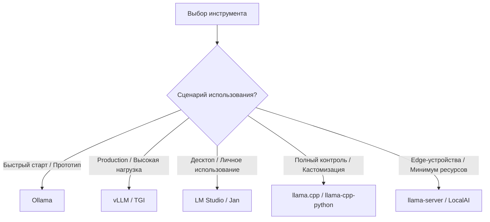
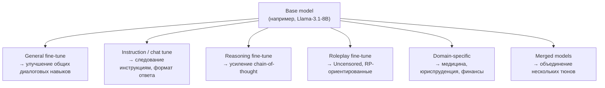
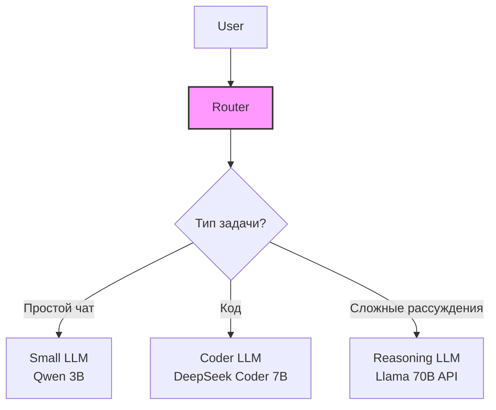
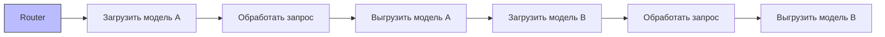
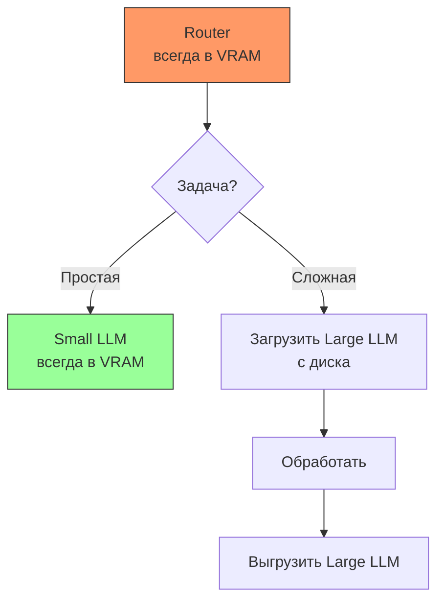
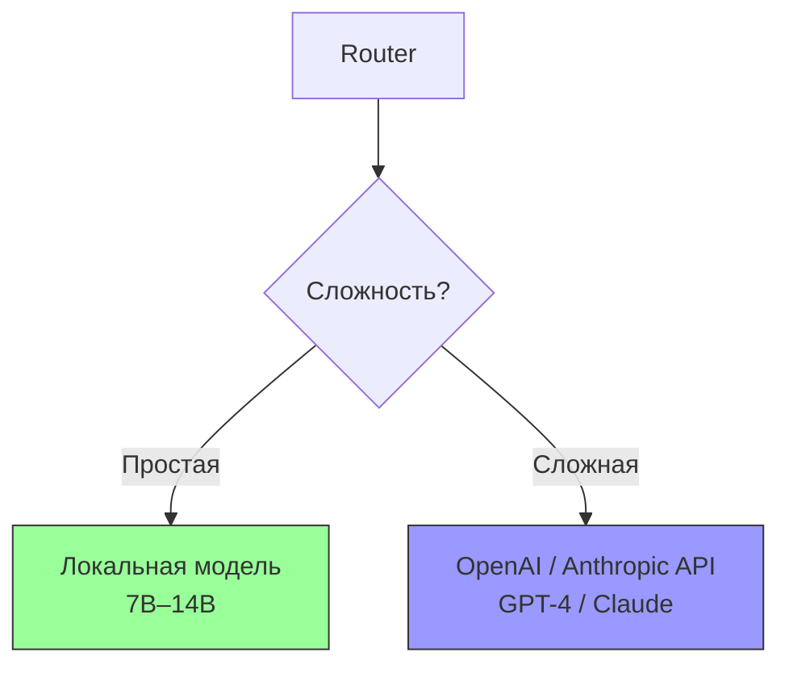
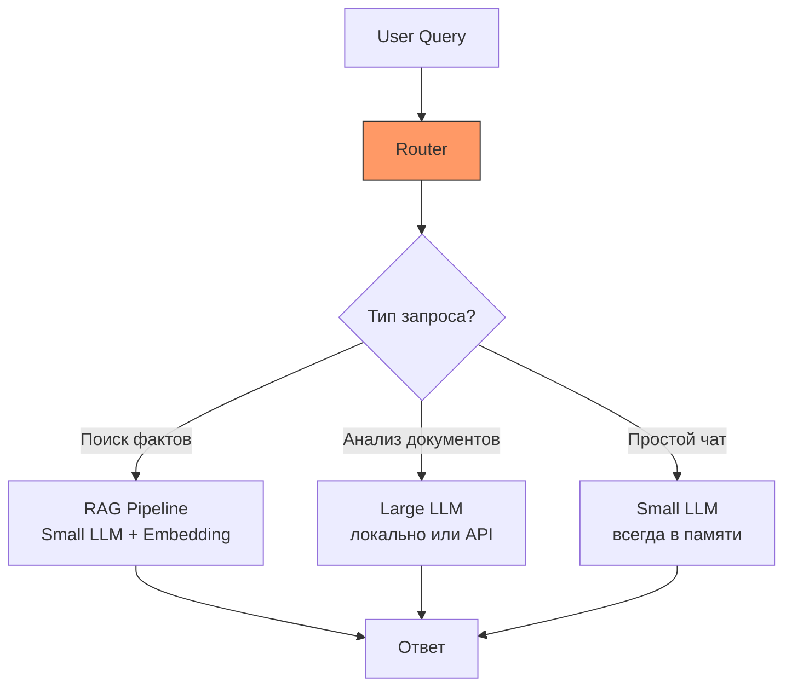

# Глава 0. Выбор модели

**Статус: CORE**

> **Цель главы:** научиться понимать, выбирать и запускать локальные LLM-модели для создания AI-агентов.

Сегодня существует большое количество моделей, различающихся:

* размером;
* архитектурой;
* назначением;
* качеством reasoning;
* способностью работать с tools;
* поддержкой vision;
* размером контекстного окна;
* потреблением памяти;
* скоростью;
* лицензией;
* качеством на конкретной задаче.

Поэтому перед созданием агента важно сначала ответить на вопрос:

> **Какую модель использовать?**

В этой главе мы разберём этот вопрос системно.

---

## 0.1. Что такое LLM для агента

**LLM (Large Language Model)** — модель, обученная предсказывать следующий токен в последовательности и на этой основе генерировать связный текст.

В агентной архитектуре LLM выступает не просто генератором текста, а управляющим компонентом, который:

* интерпретирует задачу — превращает цель пользователя и контекст в конкретный план действий;
* декомпозирует и выбирает стратегию — разбивает сложную задачу на подзадачи и определяет порядок их решения;
* вызывает инструменты — формирует обращения к API, поиску, базам данных, файлам, коду и интерпретирует полученные результаты;
* использует память — обращается к сохранённым фактам, промежуточным результатам и прошлым решениям через внешнее хранилище (сама модель не имеет состояния между вызовами);
* действует и наблюдает — инициирует шаги, анализирует результат выполнения и корректирует дальнейшее поведение;
* самопроверяется — критически оценивает собственные ответы и действия, исправляет ошибки;
* формирует структурированный вывод — помимо обычного текста, генерирует команды, JSON или вызовы функций в заданном формате.

Таким образом, в агенте LLM выполняет роль «мозга»:
управляет циклом «восприятие → рассуждение → действие → наблюдение», а не просто отвечает на одну реплику.

---

## 0.2. Что такое Ollama

**Ollama** — это инструмент для локального запуска LLM, который упрощает загрузку, управление и инференс моделей. Работает он как локальный сервер: висит фоном на порту 11434 и отвечает на обычные HTTP-запросы.

Интерфейсов у него два, и их полезно не путать:

* **свой HTTP API** — `/api/chat`, `/api/generate`, `/api/tags`. Это родной интерфейс Ollama, и именно им пользуется весь код курса;
* **OpenAI-совместимый слой** — те же модели, но по адресу `/v1` и в формате запросов OpenAI. Нужен, чтобы код, написанный под OpenAI, заработал локально без переписывания (см. раздел про миграцию ниже).

Обращение к модели выглядит так — никаких SDK, только `requests`:

```python
import requests

response = requests.post(
    "http://localhost:11434/api/chat",
    json={
        "model": "qwen2.5:3b",
        "messages": [{"role": "user", "content": "Что такое AI Agent?"}],
        "stream": False,
    },
    timeout=120,
)

print(response.json()["message"]["content"])
```

Дальше в курсе агент общается с моделью ровно этим способом. Отдельной зависимости для этого не нужно: `requests` — единственный пакет, который требуется для запуска агента.

### Почему Ollama?

Ollama стал де-факто стандартом для локальной разработки благодаря:
* 🚀 **Простоте:** одна команда `ollama run qwen2.5:3b` — и модель готова к работе
* 🔌 **OpenAI-совместимому API:** код легко мигрирует с OpenAI на локальные модели
* 📦 **Управлению моделями:** встроенный репозиторий с готовыми квантами
* 🛠️ **Кроссплатформенности:** работает на macOS, Linux, Windows

---

### Альтернативы Ollama

Хотя Ollama отлично подходит для разработки и прототипирования, для production-задач или специфических сценариев могут потребоваться другие инструменты.

#### Серверные решения (Production-grade)

| Инструмент | Особенности | Когда использовать |
| :--- | :--- | :--- |
| **vLLM** | Высокая пропускная способность, PagedAttention, continuous batching | Production-серверы с высокой нагрузкой, когда нужна максимальная скорость |
| **TGI** (Text Generation Inference) | От Hugging Face, оптимизирован для GPU, поддержка TensorRT | Когда нужна интеграция с экосистемой Hugging Face |
| **LocalAI** | Drop-in замена OpenAI API, поддержка множества форматов (GGUF, SafeTensors) | Когда нужен OpenAI-совместимый API с гибкостью |
| **llama-server** | Легковесный HTTP-сервер из `llama.cpp` | Минималистичные развертывания, edge-устройства |

#### Десктопные приложения (GUI)

| Инструмент | Особенности | Когда использовать |
| :--- | :--- | :--- |
| **LM Studio** | Удобный GUI, встроенный чат, поиск моделей | Для личного использования, тестирования моделей без CLI |
| **Jan** | Приватность, оффлайн-режим, кроссплатформенность | Когда важна конфиденциальность и простота |
| **GPT4All** | Фокус на приватности, встроенные инструменты | Для не-технических пользователей |
| **text-generation-webui** (oobabooga) | Мощный GUI с расширенными настройками | Для продвинутых пользователей, экспериментов с файн-тюнами |

#### Нативные библиотеки (Python/C++)

| Инструмент | Особенности | Когда использовать |
| :--- | :--- | :--- |
| **llama.cpp** | Нативная C++ реализация, максимальная производительность | Когда нужен полный контроль над инференсом |
| **llama-cpp-python** | Python-биндинги для `llama.cpp` | Когда нужна интеграция GGUF в Python-код |
| **Transformers** (Hugging Face) | Универсальная библиотека для всех моделей | Когда работаете с SafeTensors, не GGUF |
| **ExLlamaV2** | Оптимизирован для EXL2 квантов | Когда используете EXL2 формат для максимальной скорости |

---

#### Сравнение подходов



---

#### Миграция с Ollama

Благодаря OpenAI-совместимому API миграция обычно сводится к изменению базового URL:

```python
# Ollama
from openai import OpenAI
client = OpenAI(base_url="http://localhost:11434/v1", api_key="ollama")

# vLLM
client = OpenAI(base_url="http://localhost:8000/v1", api_key="empty")

# LocalAI
client = OpenAI(base_url="http://localhost:8080/v1", api_key="empty")
```

---

## 0.3. Семейства моделей

Семейств много, и список меняется быстрее, чем пишутся главы. Ниже — те,
что определяют картину открытых моделей к середине 2026 года.

* Qwen. Семейство моделей Alibaba. 
> Имеют хорошую поддержку: reasoning, coding, tool calling, multilingual tasks.
* Llama. Семейство Meta. Llama стало одной из основных платформ открытой LLM-экосистемы.
> На базе Llama существует большое количество: fine-tunes, coding models,
> reasoning models, специализированных моделей.
* Gemma. Семейство Google.
> для: небольших локальных моделей, reasoning, multimodal / vision задач.
* Mistral. Семейство моделей Mistral AI.
> для: general-purpose задач, coding, tool calling, локального inference.
> Отдельный интерес представляют модели семейства Devstral, 
> ориентированные на coding agents.
* DeepSeek. Семейство DeepSeek интересно прежде всего reasoning-моделями.
> для: сложного reasoning, planning, decomposition, verification, математических задач.
* Phi. Небольшие модели Microsoft.
> Интересны прежде всего там, где важны: маленький размер, 
> низкое потребление памяти, скорость.


Модели постоянно меняются. Важно не запомнить названия всех моделей, а научиться понимать:
**какие характеристики модели важны для конкретной задачи.**

---

## 0.4. Типы моделей

Деление условное: одна и та же модель может попадать сразу в несколько групп.

* General-purpose. Универсальные модели. Подходят для: диалога; анализа текста; суммаризации; простых агентов; tool calling.
* Reasoning models. Модели, оптимизированные под более сложные рассуждения. Используются для: planning; decomposition; математики; сложного анализа; verification.
* Coding models. Специализированы на программировании. 
* Agentic models. Некоторые модели специально оптимизируются для агентных сценариев. Для них важны: instruction following; tool calling; planning; long context; устойчивость в многошаговых задачах.
* Vision / Multimodal. Модели, которые могут работать с изображениями. 
* Embedding models. такая модель не должна отвечать пользователю. Она превращает текст в вектор. Такие модели используются для: semantic search; RAG; similarity search; memory retrieval.

---

## 0.5. Возможности моделей

При выборе модели недостаточно смотреть только на количество параметров. Нужно смотреть на **capabilities**.

* Tool Calling. Для AI Agent это одна из важнейших возможностей. Модель умеет вернуть не текст для человека, а структурированный вызов: имя инструмента и аргументы к нему — например, `{"tool": "calculator", "args": {"expression": "2+2"}}`. Оркестратор такой вызов выполняет и возвращает модели результат.
* Structured Output. Модель умеет выдавать данные в заданной структуре. Нужно для: routers; classifiers; planners; tool selection.
* Reasoning. Модель способна выполнять сложные многошаговые рассуждения. 
* Vision. Модель может принимать изображения.
* Long Context. Модель может обрабатывать большой объём текста.

---

## 0.6. Параметры

Больше параметров обычно означает:

* больше потенциальной ёмкости модели;
* больше требований к памяти;
* часто более высокое качество.

Но:

> **Больше параметров ≠ автоматически лучше.**

Модель 4B, хорошо обученная под конкретную задачу, может оказаться полезнее плохо подходящей модели 14B.
Особенно это заметно в агентных задачах.

---

## 0.7. Архитектуры Dense и MoE

**Dense** и **MoE (Mixture of Experts)** — это два способа устроить внутренние слои трансформера (обычно речь про feed-forward слои).

- **Dense** — «обычная» архитектура: каждый токен на каждом forward pass проходит через **все** параметры сети. 
Никакой избирательности — 100% весов задействованы всегда.
- **MoE** — часть слоёв заменена набором из N отдельных подсетей («экспертов»). 
Специальный **router** для каждого токена выбирает **top-k** экспертов (например, 2 из 8), остальные в вычислении этого токена не участвуют.

**Зачем это нужно:** общее число параметров модели может быть огромным (её «ёмкость знаний»), но реальная вычислительная нагрузка на токен — как у гораздо меньшей dense-модели. 
Отсюда компромиссы: MoE сложнее обучать (балансировка загрузки экспертов, риск того что router всегда выбирает одних и тех же), и все эксперты всё равно должны быть загружены в память — экономится компьютация, а не VRAM.

---

## 0.8. Контекстное окно

Context window — максимальный объём информации, который модель может учитывать в одном запросе.
Упрощенно он состоит:

```text
Context = System prompt + History + Tools + Documents + User message + Tool results
```

Если context переполняется, агент начинает сталкиваться со следующими проблемами:

* **жёсткий отказ или тихая обрезка** — и это зависит от того, чем вы пользуетесь. Облачный API на превышение лимита отвечает ошибкой, и вы про неё сразу узнаёте. Локальная Ollama ошибки не вернёт: она молча отбросит то, что не поместилось в `num_ctx`, — а отбрасывается начало, то есть системный промпт. Программа продолжает работать, агент «просто глупеет»;
* **потеря информации при обрезке** — старые сообщения обрезаются, чтобы уместиться в лимит, и агент теряет ранние инструкции и промежуточные решения;
* **деградация внимания («lost in the middle»)** — модель хуже использует информацию из середины длинного контекста, чем из начала или конца;
* **неограниченный рост истории** — в цикле «мысль → действие → наблюдение» каждый вызов инструмента добавляет новые наблюдения, и без сжатия история рано или поздно упирается в лимит;
* **рост задержки и стоимости** — каждый токен в контексте увеличивает время обработки и расход бюджета на задачу;
* **повторение действий и зацикливание** — если ключевой факт (например, «этот подход уже пробовали») выпал из контекста, агент может повторно предпринять то же действие;
* **ослабление system prompt** — когда системные инструкции занимают всё меньшую долю от общего контекста, модель хуже им следует.

Эти проблемы решаются за счёт суммаризации истории, выноса документов во внешнее хранилище с retrieval (RAG), декомпозиции задачи на подзадачи с независимым контекстом и архивирования памяти во внешний stateful store.

---

## 0.9. Квантование

Оригинальная модель может быть слишком большой для локального компьютера. Quantization позволяет уменьшить размер представления весов, снижая число бит, используемых для хранения каждого параметра.

Буква `Q` — quantization, цифра — число бит на вес. Например:

* FP16 — 16 бит на вес (базовый формат обучения/инференса);
* Q8 — 8 бит на вес;
* Q4 — 4 бита на вес (точнее, ~4–5 бит с учётом служебных scale-факторов в блочных схемах вроде `Q4_K_M`).

Размер модели примерно пропорционален произведению числа параметров на число бит на вес:

```text
размер ≈ параметры × биты / 8
```

Для модели 14B: FP16 ≈ 28 GB, Q4 ≈ 7–8 GB.

Чем меньше бит, тем больше ошибка округления весов и тем заметнее возможная деградация качества — поэтому Q4 является распространённым компромиссом между размером и качеством, но результат всё равно нужно проверять на реальной задаче.

---

## 0.10. Аппаратное обеспечение

Выбор модели напрямую зависит от доступного железа, которое определяет возможность запуска, скорость генерации (tokens/sec) и стоимость эксплуатации.

**Ключевые компоненты:**
* **GPU и VRAM (Главный приоритет):** Объем видеопамяти — основное ограничение. 
  * *Правило:* ~2 ГБ VRAM на 1 млрд параметров (для формата FP16). 
  * *Важно:* Длинный контекст (KV-кэш) также потребляет дополнительную VRAM.
* **RAM:** Критична для CPU-инференса или при выгрузке части слоев с GPU (offloading). Требуется запас +20–30% к размеру модели.
* **CPU:** Отвечает за токенизацию и оркестрацию. Для CPU-инференса желательна поддержка инструкций AVX2 / AVX-512.
* **Накопитель:** Используйте только NVMe SSD для быстрой загрузки весов модели в память.

**Оптимизация при нехватке ресурсов:**
Применяйте **квантование** (форматы GGUF, AWQ, GPTQ). Перевод весов из FP16 в INT8 снижает требования к памяти вдвое, в INT4 — вчетверо.

Про потерю качества часто пишут «всего пара процентов», но процентов чего — обычно не уточняют. Деградация зависит от модели, схемы квантования и самой задачи, а на агентных сценариях она видна раньше, чем на бенчмарках: модель начинает чаще ошибаться в формате вызова инструмента, хотя связный текст пишет по-прежнему. Единственный честный способ — прогнать свою задачу на двух квантах и сравнить.

**Шпаргалка по выбору:**

| Уровень железа | Пример конфигурации | Рекомендуемый размер модели | Формат |
| :--- | :--- | :--- | :--- |
| **Edge / Слабый ПК** | 8–16 ГБ RAM, iGPU / NPU | 0.5B – 3B | INT4 (GGUF) |
| **Начальный GPU** | GTX 1650, RTX 3050/4060 (4–8 ГБ VRAM) | 3B – 8B | INT4 (GGUF) |
| **Потребительский ПК** | RTX 3060 (12GB) – 4090 (24GB) | 7B – 14B | INT4 / INT8 |
| **Рабочая станция** | 1–2 GPU (24–48GB VRAM), 64GB+ RAM | 30B – 70B | INT4 / AWQ / GPTQ |
| **Enterprise / Cloud** | Кластеры A100/H100 (80GB+), NVLink | 70B – 400B+ | BF16 / FP8 |

> 💡 **Совет:** Всегда начинайте проектирование с аудита целевой инфраструктуры и тестового запуска квантованной версии модели, а не полноразмерной.

---

## 0.11. GGUF

**GGUF** (GPT-Generated Unified Format) — бинарный формат файлов, разработанный в рамках проекта `llama.cpp`. Это один из ключевых форматов для локального инференса LLM благодаря своей самодостаточности и поддержке квантования.

**Ключевые особенности:**
* 📦 **Self-contained:** все веса, токенизатор и метаданные хранятся в одном файле.
* 🗜️ **Квантование из коробки:** поддержка форматов от `Q2_K` до `Q8_0` (и новых `IQ*` — importance-matrix квантов).
* 🏷️ **Метаданные:** архитектура модели, размер контекста, гиперпараметры встроены в файл.
* 🚀 **CPU-friendly:** оптимизирован для инференса как на GPU, так и на CPU.

**Где искать модели в GGUF:**
1. **Ollama Library** — готовые к запуску тэги (самый простой путь).
2. **Hugging Face** — если нужной модели или кванта нет в Ollama, ищите на HF по тегу `gguf`. Популярные авторы квантов: `bartowski`, `mradermacher`, `unsloth`, `lmstudio-community`.
3. **Собственные кванты** — можно сквантовать модель самостоятельно через `llama.cpp` (`quantize`) или `unsloth`.

**Совместимые runtime:**
Помимо **Ollama**, GGUF запускается в:
* `llama.cpp` / `llama-server` (нативно)
* **LM Studio** (удобный GUI)
* **KoboldCpp** (для ролевых игр и long-context)
* **text-generation-webui** (oobabooga)
* **llama-cpp-python** (Python-биндинги)
* **GPT4All**, **Jan** и другие десктопные оболочки

> 💡 **Совет:** При импорте кастомного GGUF в Ollama используйте `Modelfile` с директивой `FROM ./path/to/model.gguf`.

---

## 0.12. Fine-tunes

Одна базовая (base) модель может иметь множество производных — **файн-тюнов**. Это создаёт целое «семейство» моделей с разным поведением.



**Важно:** название модели на Hugging Face часто не раскрывает всей картины. Одна и та же base-модель с разными тюнами может вести себя диаметрально противоположно.

> ⚠️ Не всякая специализированная модель — файн-тюн. Сильные coding-модели (`Qwen2.5-Coder`, `DeepSeek-Coder`) обучены собственными линейками с самого начала, а не дотюнены из общей модели, и к Llama отношения не имеют. Разница практическая: у файн-тюна вы наследуете лицензию, токенизатор и размер контекста базы, у отдельной линейки — нет.

### Чек-лист при выборе файн-тюна

Перед использованием модели проверьте:

**🔍 Происхождение и база**
- Кто автор? (известный тьюнер vs. случайный пользователь)
- На какой **base-модели** построен тюн? (Llama-3, Mistral, Qwen и т.д.)
- Какой **метод** использовался? (Full fine-tune, **LoRA**, **QLoRA**, DPO, ORPO, merge)

**📚 Данные и обучение**
- На каком датасете обучалась модель? (OpenHermes, Magpie, UltraChat, кастомные данные)
- Какой размер контекста поддерживается?
- Применялся ли **DPO/RLHF** для выравнивания (alignment)?

**⚖️ Легальность и ограничения**
- Какая **лицензия**? (Apache 2.0, Llama-3 Community, CC-BY-NC и др.)
- Есть ли ограничения на коммерческое использование?
- Соблюдены ли требования base-модели (attribution, accept-use policy)?

**📊 Качество и совместимость**
- Какие **benchmarks** приведены? (MMLU, HumanEval, MT-Bench, Arena ELO)
- Есть ли позиция в **Open LLM Leaderboard**?
- В каком формате распространяется? (GGUF, SafeTensors, AWQ, EXL2)
- Какое **квантование** доступно и насколько оно щадящее?

> 💡 **Совет:** При выборе файн-тюна всегда открывайте **Model Card** на Hugging Face — там авторы обычно указывают базу, датасет, метод обучения и примеры использования. Отсутствие Model Card — повод насторожиться.

---

## 0.13. Как выбирать модель

### Алгоритм выбора за 6 шагов

**1️⃣ Определите задачу**
- Простой чат / Coding agent / RAG / Vision agent

**2️⃣ Определите capabilities**
- Tool calling? Reasoning? Vision? Long context? Structured output?

**3️⃣ Оцените железо**

| RAM | VRAM | Рекомендуемый размер модели |
|:---|:---|:---|
| 8–16 ГБ | 4–6 ГБ | 3B–4B |
| 8–16 ГБ | 8 ГБ | 4B–8B |
| 16–32 ГБ | 12–16 ГБ | 7B–8B |
| 32–64 ГБ | 24 ГБ | 14B–32B |
| 64+ ГБ | 48+ ГБ | 70B+ (Advanced) |

**4️⃣ Выберите quantization**
- `Q4_K_M` — отправная точка для ограниченного железа
- `Q5_K_M` / `Q6_K` / `Q8_0` — если памяти достаточно (лучше качество)

**5️⃣ Проверьте на реальной задаче**

Не полагайтесь только на benchmarks. Протестируйте именно ваш сценарий:

```bash
# Пример: 10 задач tool-calling, 10 RAG, 10 coding
# Сравните результаты между моделями
```

**6️⃣ Итерируйте**

Если модель не справляется:
- Увеличьте размер модели (если позволяет железо)
- Попробуйте лучшее квантование (Q5/Q6 вместо Q4)
- Рассмотрите специализированный fine-tune

---

### Быстрый чек-лист

```markdown
□ Задача определена
□ Capabilities определены (tool calling, vision, etc.)
□ Железо оценено (RAM/VRAM)
□ Размер модели подобран под железо
□ Quantization выбран (Q4_K_M → Q8_0)
□ Модель протестирована на реальных задачах
□ Результат удовлетворительный
```

> 💡 **Совет:** если железо позволяет, начинайте с `Q4_K_M` модели среднего размера (7B–14B) — это удобная точка старта для большинства задач. Если не позволяет, это не приговор: на чём и почему работает этот курс, разобрано в разделе 0.15.

---

## 0.14. Маршрутизация моделей

Одна из ключевых идей:

> **Не обязательно использовать одну модель для всех задач.**

Разные задачи требуют разных моделей. Router направляет запрос к подходящей модели:



---

### Стратегии для разного железа

#### Стратегия 1: Последовательная загрузка (слабый ПК)

На слабом ПК модели загружаются **по очереди**, а не одновременно:



**Пример:**
```python
# Псевдокод
MODELS = {
    "simple":  "qwen2.5:3b",         # ~2 ГБ VRAM
    "coding":  "deepseek-coder:6.7b",  # ~5 ГБ VRAM
}

def route_request(task_type, query):
    model = load_model(MODELS[task_type])
    try:
        return model.chat(query)
    finally:
        unload_model(model)   # только в finally: после return код не выполнится
```

Обратите внимание на `finally`. Наивная запись «вызвали, вернули результат, выгрузили» не работает: строка после `return` не выполняется никогда, и модель останется в памяти — то есть стратегия не сделает ровно того, ради чего затевалась.

**Плюсы:**
- Работает на 8–16 ГБ VRAM
- Можно использовать 3–5 специализированных моделей

**Минусы:**
- Задержка при переключении (5–30 секунд)
- Не подходит для real-time приложений
 
#### Стратегия 2: Одна модель в памяти + остальные на диске

Router и основная модель всегда в VRAM, остальные подгружаются по необходимости:



**Пример конфигурации:**
- Router + Small LLM: 4 ГБ VRAM (всегда заняты)
- Large LLM: 12 ГБ VRAM (подгружается по запросу)
- Итого: 16 ГБ VRAM достаточно


#### Стратегия 3: Гибрид локальных моделей + API

Тяжелые задачи делегируются облачным API:



**Пример:**
```python
def route_request(query):
    complexity = estimate_complexity(query)
    
    if complexity < 0.7:
        # Локальная модель для простых задач
        return local_model.chat(query)
    else:
        # API для сложных рассуждений
        return openai_client.chat(query)
```

**Плюсы:**
- Локальные модели = приватность + скорость
- API = доступ к флагманским моделям
- Экономия на API-токенах: сколько именно, зависит от порога в `estimate_complexity` — его и стоит подбирать по трейсам, а не на глаз


### Практический пример: RAG-система



**Конфигурация для 16 ГБ VRAM:**
- Router + Small LLM (Qwen 3B Q4): ~2 ГБ, всегда в памяти
- Embedding model (BGE-small): ~1 ГБ, всегда в памяти
- Large LLM для разбора документов: 14B в Q4 (~9 ГБ) — помещается рядом с остальными

Модель на 70B в этот бюджет не поместится ни при каком квантовании: 70B в Q4 — это порядка 40 ГБ весов, и «подгрузить её с диска» в 16 ГБ VRAM невозможно. Если нужна именно она — это уже гибрид с API, стратегия 3.

### Как реализовать Router

Router может быть:
1. **Простая модель** (1B–3B параметров)
2. **Классификатор** (BERT, FastText)
3. **Правила** (regex, keywords)
4. **LLM с function calling** (для сложной маршрутизации)

**Пример простого router на правилах:**
```python
def simple_router(query):
    if any(word in query.lower() for word in ["код", "программа", "функция"]):
        return "coder_model"
    elif len(query) > 500:  # длинные запросы
        return "reasoning_model"
    else:
        return "small_model"
```

**Пример router на LLM:**
```python
def llm_router(query):
    prompt = f"""Классифицируй запрос:
    {query}
    
    Ответь одним словом: simple, coding, reasoning"""
    
    response = small_model.chat(prompt)
    return response.strip().lower()
```

### Рекомендации

| Железо | Стратегия | Конфигурация |
|:---|:---|:---|
| **8 ГБ VRAM** | Последовательная загрузка | 2–3 модели по 3B–7B |
| **16 ГБ VRAM** | Одна в памяти + остальные на диске | 1×7B всегда + 1×14B по запросу |
| **24 ГБ VRAM** | Гибрид локальных + API | 1×14B всегда + API для сложных задач |
| **48+ ГБ VRAM** | Несколько моделей одновременно | 2–3 модели 7B–14B параллельно |

> 💡 **Совет:** Начинайте с одной универсальной модели (7B–14B). Когда увидите, что она плохо справляется с определенными задачами — добавьте специализированную модель и router. Не усложняйте архитектуру без необходимости.

---

## 0.15. Что выбрано в этом курсе и почему

Глава про выбор модели обязана этот выбор сделать. Всё, что выше, — про то, как выбирать вообще; ниже — конкретное решение, с которым дальше работает весь код.

| Что | Выбор | Почему |
| :--- | :--- | :--- |
| Модель | `qwen2.5:3b` | Умеет tool calling, сносно отвечает по-русски, весит ~1.9 GB в квантованном виде |
| Формат | GGUF, квант из библиотеки Ollama | Ставится одной командой, отдельная сборка не нужна |
| Контекстное окно | 4096 токенов | Наш выбор, а не предел модели: она умеет 32768 |
| Минимум железа | 4 ГБ VRAM | Нижняя строка таблицы из 0.10, а не «потребительский ПК» |
| Запасной вариант | `llama3.1:8b` | Когда важнее точность, чем скорость и память |

Два решения тут стоит объяснить отдельно, потому что оба выглядят как занижение.

**Почему 3B, а не рекомендованные выше 7B–14B.** Курс должен запускаться у читателя, а не только у автора. Видеокарта на 4 ГБ — распространённая ситуация, и 3B в неё помещается с запасом на KV-кэш. Но есть и вторая причина, важнее первой: слабая модель делает проблемы **видимыми**. Она путает имена аргументов, выдумывает результаты инструментов и теряет формат — то есть ровно то, от чего дальше в курсе строится защита. На модели покрупнее половина этих проблем не воспроизводится, и приёмы выглядят борьбой с ветряными мельницами.

**Почему окно 4096, если модель умеет 32768.** По той же логике. При 32768 разговор упрётся в предел через сотни реплик, и механизмы управления контекстом просто не успеют сработать на глазах у читателя. Кроме того, окно стоит видеопамяти: KV-кэш при 32768 добавляет к модели больше гигабайта, и запас под остальное исчезает.

Ни модель, ни размер окна не зашиты в код: и то, и другое задаётся переменными окружения `AGENT_MODEL` и `AGENT_NUM_CTX`, так что подставить свою модель можно в любой момент, ничего не правя.

И главное, ради чего написана вся глава: **выбор модели не решает задачу, а задаёт границы, внутри которых её решает архитектура.** Хорошо устроенный агент на 3B обыгрывает плохо устроенного на 14B — и наоборот, замена модели на более крупную не чинит агента, у которого нет ни бюджета контекста, ни валидации вызовов, ни памяти.

---

## 🎯 Итог главы

Читатель научился:

* ✅ читать характеристику модели: размер, тип, capabilities, длина контекста, лицензия — и понимать, что из этого важно для агента, а что нет;
* ✅ отличать **типы** моделей (general, reasoning, coding, agentic, vision, embedding) от **возможностей** — tool calling и structured output важнее числа параметров;
* ✅ считать, влезет ли модель в железо: ~2 ГБ VRAM на миллиард параметров в FP16, вчетверо меньше в INT4, плюс запас под KV-кэш;
* ✅ выбирать квантование осознанно и проверять его на своей задаче, а не на чужом бенчмарке;
* ✅ видеть, что запускать модель можно не только через Ollama, и знать, чем платят за переход на vLLM, llama.cpp или API;
* ✅ понимать, что одна модель на все задачи — не обязательное условие: есть маршрутизация, и у неё разные стратегии под разное железо.

Чего в этой главе **не** было: ни строчки агента. Модель, которую мы выбрали, пока умеет только отвечать текстом — у неё нет ни памяти, ни инструментов, ни способа что-то сделать с вашим компьютером.

Превращение модели в агента и начинается со следующей главы.

| [📚 Оглавление](../README.md) | [Далее](../chapter1/README.md) |