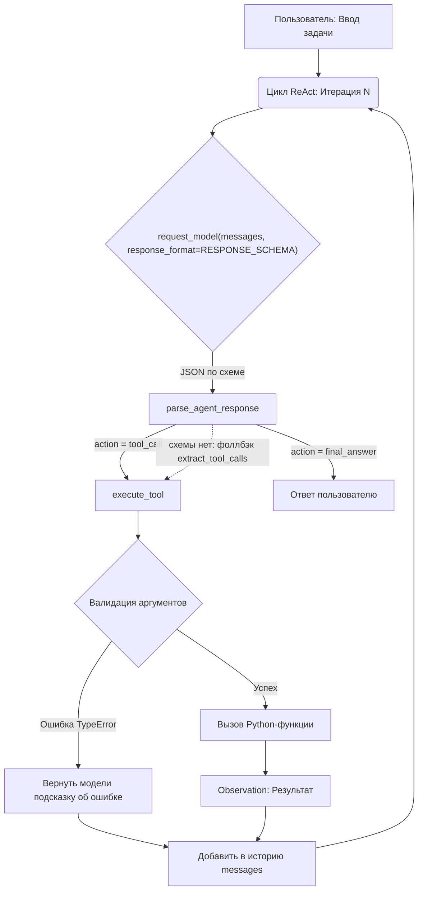
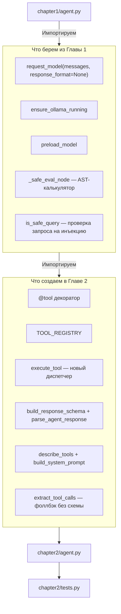

# 📖 Глава 2. Архитектура Tool API: от хардкода к JSON Schema

> **Цель главы:** Заменить хрупкий хардкод первой главы на масштабируемый, декларативный реестр инструментов. Научиться автоматически генерировать JSON Schema из кода Python, валидировать аргументы и использовать единый диспетчер вызовов, подготовив фундамент для нативного Function Calling.

В [Главе 1](../chapter1/README.md) мы доказали, что ReAct-паттерн работает. Но инструмент там живёт в двух местах сразу: сама функция лежит в словаре `TOOLS`, а форма её вызова показана модели few-shot-примером в тексте `SYSTEM_PROMPT`. Пока инструментов два, это незаметно. Чем их больше, тем вернее код и промпт разъедутся — и разъедутся молча.

В этой главе мы убираем второе место. Описание инструмента выводится из самой функции, а форма ответа модели — из реестра, и оба собираются в момент запроса, а не пишутся руками.

---

## 🔄 Фундаментальные отличия от Главы 1

| Критерий | Глава 1 (Прототип) | Глава 2 (Tool API) |
| :--- | :--- | :--- |
| **Регистрация** | Словарь `TOOLS`, заполняется вручную | Декоратор `@tool`: функция сама попадает в `TOOL_REGISTRY` |
| **Добавить инструмент** | Дописать функцию в `TOOLS` и **отдельно** — few-shot-пример в текст промпта | Написать функцию с `@tool`, промпт трогать не нужно |
| **Описание для модели** | Собирается из `__doc__`, но **без имён параметров** — их модель угадывает из примеров | Из `__doc__` **и** сигнатуры: `calculator(expression)` |
| **Схема инструмента** | Нет, есть только строка описания | JSON Schema, собранная `inspect` из сигнатуры |
| **Вызов (Dispatch)** | `TOOLS[name](**args)` — диспетчер главы, дальше не переиспользуется | Единый `execute_tool` поверх общего реестра — один на все следующие главы |
| **Валидация аргументов** | `TypeError` перехвачен, модели уходит текст `inspect.signature` | `TypeError` перехвачен, модели уходят ожидаемые имена **из схемы** |
| **Выбор инструмента** | Модель может назвать несуществующий — ловим постфактум и просим переделать | `enum` в схеме: несуществующее имя грамматика не даст сгенерировать |
| **Парсинг ответа** | Угадывание JSON в свободном тексте (`extract_json_from_text`) | Constrained decoding: схема уходит в `format`, невалидный JSON невозможен |

Разница не в том, что Глава 1 написана плохо: диспетчер там уже словарь, ошибки уже
перехвачены, описания уже берутся из `__doc__`. Разница в том, **сколько мест надо
не забыть поправить**, добавляя девятый инструмент, — и кто гарантирует форму ответа:
просьба в промпте или грамматика сэмплера.

---

## 💻 Исходный код

* 📄 **[chapter2/agent.py](agent.py)** — Цикл ReAct, использующий новый Tool API.
* 📄 **[chapter2/src/tools.py](src/tools.py)** — Декораторы, реестр, диспетчер, схема ответа и разбор вызовов.
* 📄 **[chapter2/tests.py](tests.py)** — Полное покрытие тестами (юнит-тесты + интеграция с Ollama).

---

## 🧠 Разбор архитектуры: почему так устроено?

### 1. Единый источник истины (Single Source of Truth)
Вместо того чтобы описывать инструмент в коде, а потом вручную дублировать это описание в промпте, мы используем декоратор `@tool`. Он делает две вещи:
1. Регистрирует функцию в глобальном `TOOL_REGISTRY`.
2. С помощью модуля `inspect` извлекает имена параметров и их обязательность, а из первой строки `__doc__` берет описание.

Промпт собирается из реестра функцией `build_system_prompt()`, а не константой:

```python
def build_system_prompt() -> str:
    return f"""...{describe_tools()}..."""

SYSTEM_PROMPT = build_system_prompt()
```

Разница между функцией и константой станет принципиальной в следующей главе: она регистрирует свои инструменты **после** импорта Главы 2, и константа их бы уже не увидела. Функцию же можно позвать заново в нужный момент — и получить актуальный список, не копируя текст промпта.

`describe_tools()` печатает и **имена параметров**:

```text
- calculator(expression): Безопасно вычисляет результат простого выражения.
- read_file(path): Читает содержимое текстового файла по указанному пути.
```

Без сигнатуры модель узнаёт параметры только из few-shot примеров и начинает выдумывать свои — с тремя инструментами это ещё сходит с рук, с восемью уже нет.

### 2. Как добавить новый инструмент (за 30 секунд)
Вам больше не нужно трогать `agent.py` или `SYSTEM_PROMPT`. Просто напишите функцию:

```python
@tool
def get_time(timezone: str = "UTC") -> str:
    """Возвращает текущее время в указанном часовом поясе."""
    import datetime
    return str(datetime.datetime.now())
```
**Всё.** При следующем запуске агент автоматически узнает об этом инструменте, его параметрах и добавит его в свой системный промпт.

### 3. Безопасность и устойчивость (Resilience)
* **Защита от галлюцинаций модели:** Если модель передаст неверное имя аргумента (например, `filename` вместо `path`), `execute_tool` перехватит `TypeError`, посмотрит правильные имена **в схеме** и вернёт модели конкретную подсказку:

  ```text
  Ошибка валидации аргументов для 'read_file': ...
  Ты передал: ['filename']. Ожидались строго: ['path'].
  ```

  Модель получит шанс исправиться на следующей итерации, вместо того чтобы агент упал с ошибкой. Заметьте: список ожидаемых параметров не написан руками, а взят из той же JSON Schema — единый источник истины работает и на сообщения об ошибках.
* **Калькулятор без `eval`:** `calculator` разбирает выражение в AST и обходит дерево по белому списку операций — та же функция `_safe_eval_node`, что и в Главе 1.

  > ⚠️ Соблазн написать `eval(expression, {"__builtins__": {}})` велик, и в интернете этот приём часто выдают за песочницу. Это не песочница. Доступа к `import` действительно нет, но до него можно дойти через сами объекты:
  >
  > ```python
  > (1).__class__.__base__.__subclasses__()   # отсюда добираются до BuiltinImporter
  > ```
  >
  > Белый список узлов AST такой обход закрывает: любой `ast.Call` или `ast.Attribute` просто не входит в разрешённые типы, и вычисление падает с `ValueError`.
* **Защита контекста:** `read_file` ограничивает вывод первыми 2000 символами, чтобы случайно не "выжечь" контекстное окно маленькой модели. Две детали, которые легко упустить:

  ```python
  content = f.read(READ_FILE_LIMIT + 1)          # а не f.read()[:2000]
  ...
  return content[:READ_FILE_LIMIT] + f"\n\n[...файл обрезан: показаны первые {READ_FILE_LIMIT} символов]"
  ```

  Первая: читаем с диска ровно столько, сколько нужно. `f.read()[:2000]` сначала поднимает в память весь файл — на гигабайтном логе это заметно.

  Вторая важнее: **обрезка проговаривается вслух**. Молча укороченный файл модель принимает за файл целиком и уверенно отвечает по первой трети. Лишний символ в `read()` нужен как раз затем, чтобы отличить «файл ровно 2000 символов» от «файл длиннее».

### 4. Constrained decoding: JSON, который нельзя сломать

Всё, что описано выше, всё ещё стоит на одном допущении: модель **захочет** вернуть валидный JSON. В Главе 1 мы видели, чем это заканчивается — обёрнутый в markdown вызов, пояснение до и после, оборванная кавычка. Отсюда и родился `extract_tool_calls`: сканер фигурных скобок, который угадывает, где в свободном тексте спрятан вызов.

Угадывание убирается целиком, если отдать модели схему не текстом промпта, а параметром API:

```python
response = request_model(messages, response_format=RESPONSE_SCHEMA)
```

Ollama передаёт JSON Schema в грамматику сэмплера, и дальше модель выбирает не «наиболее вероятный токен», а **наиболее вероятный из разрешённых грамматикой**. Невалидный JSON перестаёт быть маловероятным — он становится невозможным.

Схема собирается из того же реестра, что и промпт:

```python
def build_response_schema() -> dict[str, Any]:
    return {
        "type": "object",
        "properties": {
            "action": {"type": "string", "enum": ["tool_call", "final_answer"]},
            "name": {"type": "string", "enum": list(TOOL_REGISTRY.keys())},
            "arguments": {"type": "object"},
            "answer": {"type": "string"},
        },
        "required": ["action"],
    }
```

Два следствия, ради которых всё и затевалось:

* **`enum` в поле `name`.** Список имён — не пожелание в промпте, а ограничение грамматики. Модель не может позвать `read_files`, `readFile` или выдуманный `search_web`: этих последовательностей токенов в разрешённом множестве просто нет.
* **`action` вместо угадывания намерения.** Раньше «вызов инструмента» от «финального ответа» отличались тем, нашёлся ли в тексте JSON. Теперь это явное поле, и агент больше не принимает оборванный вызов за готовый ответ.

Функция, а не константа — по той же причине, что и `build_system_prompt()`: следующая глава регистрирует свои инструменты позже, и снимок, снятый при импорте, их бы не увидел. Глава 2 снимает свой снимок сразу (`RESPONSE_SCHEMA`), чтобы `python -m chapter2.agent` остался Главой 2 с тремя инструментами.

#### Чего constrained decoding НЕ делает

Это ограничение формы, а не смысла. Модель по-прежнему может:

* выбрать неподходящий инструмент из разрешённого списка;
* придумать значение аргумента (`{"path": "файл_которого_нет.txt"}`);
* позвать `calculator` там, где нужен был `read_file`;
* вернуть валидный по схеме, но **пустой** объект.

Последнее стоит разобрать, потому что оно следует прямо из текста схемы:
в `required` перечислено только поле `action`. Значит, `{"action": "final_answer"}`
без `answer` грамматику проходит — и `parse_agent_response` честно вернёт
пустую строку как финальный ответ. Пользователь увидит `✅ Ответ:` и ничего
после. Поэтому пустой ответ в цикле обрабатывается как ошибка инструмента:

```python
if not final_answer:
    messages.append({"role": "assistant", "content": content})
    messages.append({"role": "user", "content": EMPTY_ANSWER_HINT})
    continue     # ещё одна итерация, а не пустота пользователю
```

Можно было бы дописать `answer` в `required` — но тогда схема потребует его
и от вызова инструмента. Разделить это правильно умеет `oneOf` на два варианта
объекта; учебная схема оставлена плоской, а недостающую проверку делает код.

Поэтому валидация аргументов и понятный текст ошибки обратно в контекст (пункт 3) никуда не деваются. Три уровня работают вместе:

```
Constrained decoding       ──► гарантирует синтаксис
Валидация в execute_tool   ──► ловит семантику
Ошибка обратно в контекст  ──► даёт модели шанс исправиться
```

#### Фоллбэк остался

`extract_tool_calls` не удалён, а понижен в статусе: он вызывается из `parse_agent_response`, когда ответ не разобрался по схеме. Это нужно для серверов без поддержки `format` (Ollama до 0.5) и для ручного сравнения двух режимов:

```bash
AGENT_STRUCTURED=0 python -m chapter2.agent
```

Запустите один и тот же запрос в обоих режимах на модели 3B — разница в доле сломанных вызовов и есть весь смысл этого раздела.

---

## 🗺️ Диаграмма работы агента (Глава 2)



---

## 🧪 Тестирование и запуск

```bash
#Быстрые тесты (без модели)
python -m pytest chapter2/tests.py -v -m "not integration"

#Интеграционные тесты (с живой моделью)
python -m pytest chapter2/tests.py -v -m integration

#запуск
python -m chapter2.agent
```

Сравнить два режима разбора ответа (см. раздел про constrained decoding):

```bash
python -m chapter2.agent
```

```bash
AGENT_STRUCTURED=0 python -m chapter2.agent
```

В PowerShell переменная задаётся отдельной строкой: `$env:AGENT_STRUCTURED = "0"`.

Попробуйте запросы:
* *"Прочитай файл README.md из корня проекта и скажи, какая модель используется по умолчанию."*
* *"Посчитай (125 * 4) + 17"*
* *"Какая погода?"*
* *"Посчитай 10 / 0"* (проверьте, как агент элегантно обработает ошибку инструмента).

## 📊 Итоговая архитектура импортов



> `is_safe_query` в этой главе не переписан, а импортирован. Раньше список паттернов был скопирован в обе главы — и копии разъехались: `игнорируй system prompt` блокировался в Главе 1 и проходил в Главе 2. Проверка запроса — часть ядра, а у ядра одно место жительства; тест `test_safe_query_check_is_not_a_copy` ломается на самой попытке завести вторую реализацию.
>
> Параметр `response_format` добавлен в `request_model` Главы 1 задним числом — по умолчанию `None`, и на саму Главу 1 он не влияет. Это единственная точка, где мы возвращаемся в написанный код: HTTP-вызов у нас один на весь курс, и заводить второй ради одного поля payload было бы хуже.

---

## 🔜 Что дальше: чужие инструменты

Наш реестр закрывает свои инструменты — те, что мы написали сами. Отдельная задача — подключить **чужие**: файловую систему, git, поиск, внутренние API компании. Писать под каждый свой `@tool` не нужно: для этого есть **MCP (Model Context Protocol)** — общий протокол, где сервер отдаёт список инструментов в том же JSON Schema, что мы строим декоратором.

```
TOOL_REGISTRY (свои)  ─┐
                       ├──► единый список схем ──► LLM
MCP servers (чужие)  ──┘
```

Архитектура Главы 2 к этому готова: точка входа одна (`execute_tool`), формат описания один (JSON Schema), место сборки промпта одно. MCP добавляет источник, а не второй механизм — подробнее в [ROADMAP](../ROADMAP.md).

---

## 🎯 Итог главы

Агент научился:

* ✅ узнавать о новом инструменте сам: декоратор `@tool` кладёт функцию в реестр, а описание и схема собираются из её сигнатуры и `__doc__`;
* ✅ показывать модели имена параметров, а не заставлять угадывать их из примеров;
* ✅ обходиться одним диспетчером `execute_tool` — точка входа одна на все главы вперёд;
* ✅ отвечать на неверный вызов подсказкой из той же схемы: «ты передал `filename`, ожидались `path`»;
* ✅ получать гарантию формы ответа от грамматики сэмплера, а не от вежливой просьбы: невалидный JSON стал невозможен, а выдуманное имя инструмента не проходит через `enum`;
* ✅ отличать вызов инструмента от финального ответа явным полем `action`, а не по факту «нашёлся ли в тексте JSON»;
* ✅ работать и без constrained decoding — фоллбэк на разбор свободного текста остался для серверов без `format`.

Чего он **не** умеет:

* **не помнит разговор.** История живёт внутри одного вызова `ask_agent`. Спросить «как меня зовут?» следующей репликой по-прежнему нельзя;
* **не считает контекст.** Описания инструментов, результат `read_file` и каждая итерация ReAct просто ложатся в запрос. Сколько там осталось места — никто не знает;
* **гарантирует форму, но не смысл.** Модель по-прежнему может выбрать не тот инструмент из разрешённых, придумать значение аргумента или вернуть валидный по схеме, но пустой объект;
* **принимает внешний текст за чистую монету.** Результат `read_file` попадает в контекст как есть — а в файле может лежать текст, адресованный самой модели.

Первые два пункта — точка входа в следующую главу, последний закрывается там же.

|[Назад](../chapter1/README.md) | [📚 Оглавление](../README.md) | [Далее](../chapter3/README.md)|
