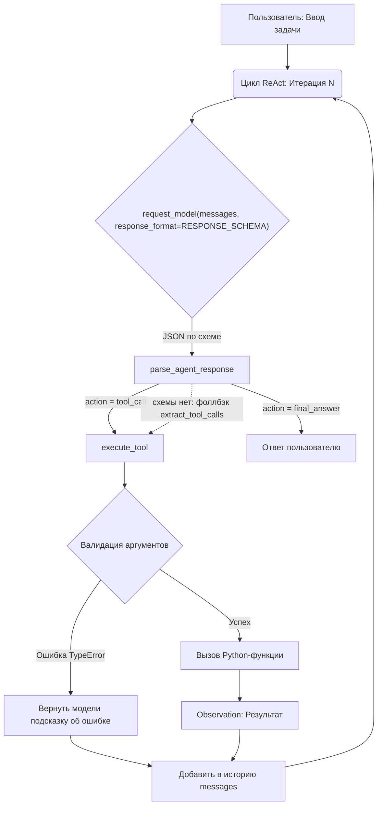
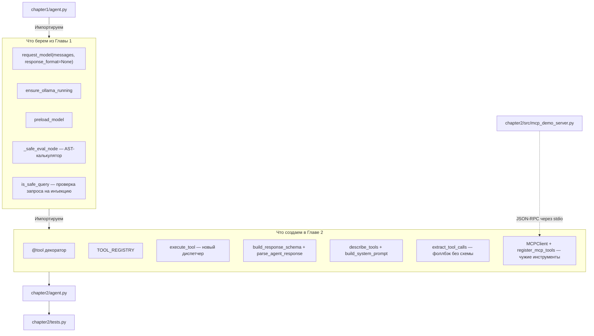

# 📖 Глава 2. Архитектура Tool API: от хардкода к JSON Schema

> **Цель главы:** Заменить хрупкий хардкод первой главы на масштабируемый, декларативный реестр инструментов. Научиться автоматически генерировать JSON Schema из кода Python, валидировать аргументы и использовать единый диспетчер вызовов, подготовив фундамент для нативного Function Calling.

В [Главе 1](../chapter1/README.md) мы доказали, что ReAct-паттерн работает. Но инструмент там живёт в двух местах сразу: сама функция лежит в словаре `TOOLS`, а форма её вызова показана модели few-shot-примером в тексте `SYSTEM_PROMPT`. Пока инструментов два, это незаметно. Чем их больше, тем вернее код и промпт разъедутся — и разъедутся молча.

В этой главе мы убираем второе место. Описание инструмента выводится из самой функции, а форма ответа модели — из реестра, и оба собираются в момент запроса, а не пишутся руками.

А когда описание инструмента перестаёт писаться руками, становится неважно, чья это функция: во второй половине главы к тому же реестру подключается **чужой** инструмент — с MCP-сервера, из другого процесса.

---

## 🔄 Фундаментальные отличия от Главы 1

| Критерий | Глава 1 (Прототип) | Глава 2 (Tool API) |
| :--- | :--- | :--- |
| **Регистрация** | Словарь `TOOLS`, заполняется вручную | Декоратор `@tool`: функция сама попадает в `TOOL_REGISTRY` |
| **Добавить инструмент** | Дописать функцию в `TOOLS` и **отдельно** — few-shot-пример в текст промпта | Написать функцию с `@tool`, промпт трогать не нужно |
| **Описание для модели** | Собирается из `__doc__`, но **без имён параметров** — их модель угадывает из примеров | Из `__doc__` **и** сигнатуры: `calculator(expression)` |
| **Схема инструмента** | Нет, есть только строка описания | JSON Schema, собранная `inspect` из сигнатуры |
| **Вызов (Dispatch)** | `TOOLS[name](**args)` — диспетчер главы, дальше не переиспользуется | Единый `execute_tool` поверх общего реестра — один на все следующие главы |
| **Валидация аргументов** | `TypeError` перехвачен, модели уходит текст `inspect.signature` | `TypeError` перехвачен, модели уходят ожидаемые имена **из схемы** |
| **Выбор инструмента** | Модель может назвать несуществующий — ловим постфактум и просим переделать | `enum` в схеме: несуществующее имя грамматика не даст сгенерировать |
| **Парсинг ответа** | Угадывание JSON в свободном тексте (`extract_json_from_text`) | Constrained decoding: схема уходит в `format`, невалидный JSON невозможен |

Разница не в том, что Глава 1 написана плохо: диспетчер там уже словарь, ошибки уже
перехвачены, описания уже берутся из `__doc__`. Разница в том, **сколько мест надо
не забыть поправить**, добавляя девятый инструмент, — и кто гарантирует форму ответа:
просьба в промпте или грамматика сэмплера.

---

## 💻 Исходный код

* 📄 **[chapter2/agent.py](agent.py)** — Цикл ReAct, использующий новый Tool API.
* 📄 **[chapter2/src/tools.py](src/tools.py)** — Декораторы, реестр, диспетчер, схема ответа и разбор вызовов.
* 📄 **[chapter2/src/mcp_client.py](src/mcp_client.py)** — Клиент MCP: чужие инструменты в том же реестре.
* 📄 **[chapter2/src/mcp_demo_server.py](src/mcp_demo_server.py)** — MCP-сервер на стандартной библиотеке, чтобы главу можно было пройти без Node.js.
* 📄 **[chapter2/tests.py](tests.py)** — Полное покрытие тестами (юнит-тесты + интеграция с Ollama).

---

## 🧠 Разбор архитектуры: почему так устроено?

### 1. Единый источник истины (Single Source of Truth)
Вместо того чтобы описывать инструмент в коде, а потом вручную дублировать это описание в промпте, мы используем декоратор `@tool`. Он делает две вещи:
1. Регистрирует функцию в глобальном `TOOL_REGISTRY`.
2. С помощью модуля `inspect` извлекает имена параметров и их обязательность, а из первой строки `__doc__` берет описание.

Промпт собирается из реестра функцией `build_system_prompt()`, а не константой:

```python
def build_system_prompt() -> str:
    return f"""...{describe_tools()}..."""

SYSTEM_PROMPT = build_system_prompt()
```

Разница между функцией и константой станет принципиальной в следующей главе: она регистрирует свои инструменты **после** импорта Главы 2, и константа их бы уже не увидела. Функцию же можно позвать заново в нужный момент — и получить актуальный список, не копируя текст промпта.

`describe_tools()` печатает и **имена параметров**:

```text
- calculator(expression): Безопасно вычисляет результат простого выражения.
- read_file(path): Читает содержимое текстового файла по указанному пути.
```

Без сигнатуры модель узнаёт параметры только из few-shot примеров и начинает выдумывать свои — с тремя инструментами это ещё сходит с рук, с восемью уже нет.

### 2. Как добавить новый инструмент (за 30 секунд)
Вам больше не нужно трогать `agent.py` или `SYSTEM_PROMPT`. Просто напишите функцию:

```python
@tool
def get_time(timezone: str = "UTC") -> str:
    """Возвращает текущее время в указанном часовом поясе."""
    import datetime
    return str(datetime.datetime.now())
```
**Всё.** При следующем запуске агент автоматически узнает об этом инструменте, его параметрах и добавит его в свой системный промпт.

### 3. Безопасность и устойчивость (Resilience)
* **Защита от галлюцинаций модели:** Если модель передаст неверное имя аргумента (например, `filename` вместо `path`), `execute_tool` перехватит `TypeError`, посмотрит правильные имена **в схеме** и вернёт модели конкретную подсказку:

  ```text
  Ошибка валидации аргументов для 'read_file': ...
  Ты передал: ['filename']. Ожидались строго: ['path'].
  ```

  Модель получит шанс исправиться на следующей итерации, вместо того чтобы агент упал с ошибкой. Заметьте: список ожидаемых параметров не написан руками, а взят из той же JSON Schema — единый источник истины работает и на сообщения об ошибках.
* **Калькулятор без `eval`:** `calculator` разбирает выражение в AST и обходит дерево по белому списку операций — та же функция `_safe_eval_node`, что и в Главе 1.

  > ⚠️ Соблазн написать `eval(expression, {"__builtins__": {}})` велик, и в интернете этот приём часто выдают за песочницу. Это не песочница. Доступа к `import` действительно нет, но до него можно дойти через сами объекты:
  >
  > ```python
  > (1).__class__.__base__.__subclasses__()   # отсюда добираются до BuiltinImporter
  > ```
  >
  > Белый список узлов AST такой обход закрывает: любой `ast.Call` или `ast.Attribute` просто не входит в разрешённые типы, и вычисление падает с `ValueError`.
* **Защита контекста:** `read_file` ограничивает вывод первыми 2000 символами, чтобы случайно не "выжечь" контекстное окно маленькой модели. Две детали, которые легко упустить:

  ```python
  content = f.read(READ_FILE_LIMIT + 1)          # а не f.read()[:2000]
  ...
  return content[:READ_FILE_LIMIT] + f"\n\n[...файл обрезан: показаны первые {READ_FILE_LIMIT} символов]"
  ```

  Первая: читаем с диска ровно столько, сколько нужно. `f.read()[:2000]` сначала поднимает в память весь файл — на гигабайтном логе это заметно.

  Вторая важнее: **обрезка проговаривается вслух**. Молча укороченный файл модель принимает за файл целиком и уверенно отвечает по первой трети. Лишний символ в `read()` нужен как раз затем, чтобы отличить «файл ровно 2000 символов» от «файл длиннее».

### 4. Constrained decoding: JSON, который нельзя сломать

Всё, что описано выше, всё ещё стоит на одном допущении: модель **захочет** вернуть валидный JSON. В Главе 1 мы видели, чем это заканчивается — обёрнутый в markdown вызов, пояснение до и после, оборванная кавычка. Отсюда и родился `extract_tool_calls`: сканер фигурных скобок, который угадывает, где в свободном тексте спрятан вызов.

Угадывание убирается целиком, если отдать модели схему не текстом промпта, а параметром API:

```python
response = request_model(messages, response_format=RESPONSE_SCHEMA)
```

Ollama передаёт JSON Schema в грамматику сэмплера, и дальше модель выбирает не «наиболее вероятный токен», а **наиболее вероятный из разрешённых грамматикой**. Невалидный JSON перестаёт быть маловероятным — он становится невозможным.

Схема собирается из того же реестра, что и промпт:

```python
def build_response_schema() -> dict[str, Any]:
    return {
        "type": "object",
        "properties": {
            "action": {"type": "string", "enum": ["tool_call", "final_answer"]},
            "name": {"type": "string", "enum": list(TOOL_REGISTRY.keys())},
            "arguments": {"type": "object"},
            "answer": {"type": "string"},
        },
        "required": ["action"],
    }
```

Два следствия, ради которых всё и затевалось:

* **`enum` в поле `name`.** Список имён — не пожелание в промпте, а ограничение грамматики. Модель не может позвать `read_files`, `readFile` или выдуманный `search_web`: этих последовательностей токенов в разрешённом множестве просто нет.
* **`action` вместо угадывания намерения.** Раньше «вызов инструмента» от «финального ответа» отличались тем, нашёлся ли в тексте JSON. Теперь это явное поле, и агент больше не принимает оборванный вызов за готовый ответ.

Функция, а не константа — по той же причине, что и `build_system_prompt()`: следующая глава регистрирует свои инструменты позже, и снимок, снятый при импорте, их бы не увидел. Глава 2 снимает свой снимок сразу (`RESPONSE_SCHEMA`), чтобы `python -m chapter2.agent` остался Главой 2 с тремя инструментами.

#### Чего constrained decoding НЕ делает

Это ограничение формы, а не смысла. Модель по-прежнему может:

* выбрать неподходящий инструмент из разрешённого списка;
* придумать значение аргумента (`{"path": "файл_которого_нет.txt"}`);
* позвать `calculator` там, где нужен был `read_file`;
* вернуть валидный по схеме, но **пустой** объект.

Последнее стоит разобрать, потому что оно следует прямо из текста схемы:
в `required` перечислено только поле `action`. Значит, `{"action": "final_answer"}`
без `answer` грамматику проходит — и `parse_agent_response` честно вернёт
пустую строку как финальный ответ. Пользователь увидит `✅ Ответ:` и ничего
после. Поэтому пустой ответ в цикле обрабатывается как ошибка инструмента:

```python
if not final_answer:
    messages.append({"role": "assistant", "content": content})
    messages.append({"role": "user", "content": EMPTY_ANSWER_HINT})
    continue     # ещё одна итерация, а не пустота пользователю
```

Можно было бы дописать `answer` в `required` — но тогда схема потребует его
и от вызова инструмента. Разделить это правильно умеет `oneOf` на два варианта
объекта; учебная схема оставлена плоской, а недостающую проверку делает код.

Поэтому валидация аргументов и понятный текст ошибки обратно в контекст (пункт 3) никуда не деваются. Три уровня работают вместе:

```
Constrained decoding       ──► гарантирует синтаксис
Валидация в execute_tool   ──► ловит семантику
Ошибка обратно в контекст  ──► даёт модели шанс исправиться
```

#### Фоллбэк остался

`extract_tool_calls` не удалён, а понижен в статусе: он вызывается из `parse_agent_response`, когда ответ не разобрался по схеме. Это нужно для серверов без поддержки `format` (Ollama до 0.5) и для ручного сравнения двух режимов:

```bash
AGENT_STRUCTURED=0 python -m chapter2.agent
```

Запустите один и тот же запрос в обоих режимах на модели 3B — разница в доле сломанных вызовов и есть весь смысл этого раздела.

---

## 🗺️ Диаграмма работы агента (Глава 2)



---

## 🔌 MCP: чужие инструменты в том же реестре

Реестр из этой главы закрывает **свои** инструменты — те, что мы написали сами и обернули декоратором. Отдельная задача — подключить **чужие**: файловую систему, git, поиск, внутренние API компании. Писать под каждый свой `@tool` не нужно: для этого есть **MCP (Model Context Protocol)** — общий протокол, где сервер отдаёт список инструментов в том же JSON Schema, который мы собираем из сигнатуры функции.

Главная мысль всего раздела помещается в одну картинку:

```
TOOL_REGISTRY (свои)  ─┐
                       ├──► единый список схем ──► LLM
MCP servers (чужие)  ──┘
```

MCP добавляет **источник** инструментов, а не второй механизм. Промпт по-прежнему собирает `describe_tools()`, форму ответа по-прежнему гарантирует `build_response_schema()`, вызывает по-прежнему `execute_tool()`. Ниже мы это не декларируем, а проверяем выводом.

### Что такое MCP, если убрать маркетинг

JSON-RPC 2.0 поверх stdin/stdout дочернего процесса: одна строка — одно сообщение. Есть ещё транспорт по HTTP, но локальный агент почти всегда работает со stdio, потому что сервер — это просто программа, которую вы запустили.

Из всего протокола агенту нужны три метода:

| Метод | Что спрашиваем | Что приходит в ответ |
| :--- | :--- | :--- |
| `initialize` | «кто ты и на какой версии говоришь» | `serverInfo`, `capabilities`, версия протокола |
| `tools/list` | «что ты умеешь» | список: `name`, `description`, `inputSchema` |
| `tools/call` | «сделай вот это» | `content` (список блоков) и флаг `isError` |

Остальное в спецификации — ресурсы, промпты, подписки на изменения — существует, но реестру инструментов не нужно. Мы реализуем ровно эти три метода и получаем работающего клиента без единой зависимости: [`chapter2/src/mcp_client.py`](src/mcp_client.py).

Чтобы главу можно было пройти без Node.js и интернета, рядом лежит сервер на стандартной библиотеке — [`chapter2/src/mcp_demo_server.py`](src/mcp_demo_server.py): два инструмента (`list_dir`, `read_text_file`) над одной папкой. Это тот же `@modelcontextprotocol/server-filesystem`, только урезанный до того, что помогает понять протокол.

### Как это выглядит в проводах

Ниже — настоящий обмен с демо-сервером: `→` мы пишем в его stdin, `←` он отвечает в stdout.

```json
→ {"jsonrpc": "2.0", "id": 1, "method": "initialize", "params": {"protocolVersion": "2025-06-18", "capabilities": {}, "clientInfo": {"name": "chapter2-agent", "version": "0.1"}}}
← {"jsonrpc": "2.0", "id": 1, "result": {"protocolVersion": "2025-06-18", "capabilities": {"tools": {}}, "serverInfo": {"name": "chapter2-demo", "version": "0.1"}}}

→ {"jsonrpc": "2.0", "method": "notifications/initialized", "params": {}}

→ {"jsonrpc": "2.0", "id": 2, "method": "tools/list", "params": {}}
← {"jsonrpc": "2.0", "id": 2, "result": {"tools": [{"name": "list_dir", "description": "Показывает список файлов и папок внутри корня сервера.", "inputSchema": {"type": "object", "properties": {"path": {"type": "string", "description": "Путь относительно корня сервера. Пустая строка — сам корень."}}, "required": []}}, {"name": "read_text_file", ...}]}}

→ {"jsonrpc": "2.0", "id": 3, "method": "tools/call", "params": {"name": "read_text_file", "arguments": {"path": "requirements.txt"}}}
← {"jsonrpc": "2.0", "id": 3, "result": {"content": [{"type": "text", "text": "requests>=2.31.0\npytest>=7.4.0\n..."}], "isError": false}}
```

Три вещи, которые видно только на сыром обмене:

1. **У второго сообщения нет `id`.** Это уведомление: ответа на него не будет, и ждать его — значит повиснуть. `notifications/initialized` — обязательная часть рукопожатия, а не вежливость.
2. **`inputSchema` — это тот же JSON Schema**, который у нас строит `inspect` из сигнатуры. Разница лишь в том, что здесь его написал автор сервера. Поэтому склейка с реестром получается такой дешёвой.
3. **`tools/call` возвращает список блоков, а не строку.** Блок бывает не только текстовый — картинка, ссылка на ресурс. Текстовой модели их не показать, поэтому клиент честно подставляет заглушку вместо того, чтобы делать вид, что ответ пустой.

### Ошибка инструмента — не ошибка протокола

Это разделение стоит того, чтобы его заметить:

```json
→ {"jsonrpc": "2.0", "id": 4, "method": "tools/call", "params": {"name": "read_text_file", "arguments": {"path": "../../../etc/passwd"}}}
← {"jsonrpc": "2.0", "id": 4, "result": {"content": [{"type": "text", "text": "Путь вне корня сервера: ../../../etc/passwd"}], "isError": true}}

→ {"jsonrpc": "2.0", "id": 5, "method": "нет/такого", "params": {}}
← {"jsonrpc": "2.0", "id": 5, "error": {"code": -32601, "message": "Метод не найден: нет/такого"}}
```

Запрещённый путь — обычный `result` с флагом `isError`. Несуществующий метод — `error` JSON-RPC. Логика та же, что у нашего `execute_tool`: ошибку **инструмента** модель должна прочитать и переделать вызов, а ошибка **протокола** до модели вообще не доходит — это разговор двух программ.

### Клиент: четыре решения, которые видно только в коде

Весь клиент — это `subprocess.Popen` плюс разбор строк. Но четыре места в нём написаны не так, как пишется с первого раза.

**stdout — это протокол, stderr — журнал.** Один случайный `print("сервер готов")` в stdout ломает разбор: клиент получает строку, которая не парсится как JSON. Поэтому у сервера в stdout нет ничего, кроме сообщений, а `stderr` клиент уводит в `DEVNULL`.

**`newline="\n"` вручную.** Popen в текстовом режиме на Windows превратил бы наш `\n` в `\r\n`, и собеседник получил бы лишний символ в конце каждой строки протокола. Поэтому каналы оборачиваются явно:

```python
self._stdin = io.TextIOWrapper(self._proc.stdin, encoding="utf-8", newline="\n",
                               write_through=True)
```

**Чтение — в отдельном потоке.** `readline()` блокирует, а `select()` на пайпах Windows не работает. Поток-читатель складывает всё пришедшее в `queue.Queue`, и это единственный способ получить таймаут, который ведёт себя одинаково на всех системах.

**Таймаут обязателен.** Чужой процесс может не ответить никогда. Без таймаута агент просто зависает — худший вид отказа, потому что в логах не остаётся ничего:

```python
raise MCPError(f"MCP-сервер '{self.label}' не ответил на '{method}' за {self.timeout:g} с")
```

Пустая очередь — заодно повод проверить, жив ли собеседник: если процесс уже умер, ждать таймаут целиком незачем, и в ошибку уходит код возврата.

### Склейка с реестром: два вызова

```python
client = MCPClient(demo_server_command("."), label="demo").start()
register_mcp_tools(client)
```

Что было в реестре до и что стало после — вывод `describe_tools()`, той же функции, которая собирает системный промпт:

```
--- до ---
- calculator(expression): Безопасно вычисляет результат простого математического выражения.
- read_file(path): Читает содержимое текстового файла по указанному пути.
- get_weather(city): Возвращает текущую погоду в указанном городе (имитация API).

длина системного промпта: 910 символов
enum в схеме: ['calculator', 'read_file', 'get_weather']

--- после ---
- calculator(expression): Безопасно вычисляет результат простого математического выражения.
- read_file(path): Читает содержимое текстового файла по указанному пути.
- get_weather(city): Возвращает текущую погоду в указанном городе (имитация API).
- demo_list_dir(path): Показывает список файлов и папок внутри корня сервера.
- demo_read_text_file(path): Читает текстовый файл внутри корня сервера.

длина системного промпта: 1061 символов
enum в схеме: ['calculator', 'read_file', 'get_weather', 'demo_list_dir', 'demo_read_text_file']
```

Ни промпт, ни схему мы руками не трогали: обе собираются из реестра в момент вызова — ровно то свойство, ради которого в начале главы `describe_tools()` сделана функцией, а не константой.

Но снимки, снятые при импорте, о новых инструментах не знают, поэтому после подключения сервера их надо пересобрать:

```python
ch2.refresh_tool_snapshots()   # SYSTEM_PROMPT и RESPONSE_SCHEMA — заново
```

Забыть этот вызов — самая частая ошибка при подключении MCP: инструмент в реестре есть, диспетчер его найдёт, а модель о нём не знает и назвать не может — `enum` в старой схеме его не содержит.

**Префикс сервера — не украшение.** `read_file` есть и у нас, и у половины MCP-серверов. Без префикса чужой инструмент молча затёр бы свой, и `read_file` начал бы означать не то, что написано в этой главе. Поэтому в реестр инструмент ложится под именем `demo_read_text_file`, а на сервер уходит его настоящее имя `read_text_file`.

### У чужого инструмента нет сигнатуры

Своим инструментам имена аргументов проверяет Python: лишний ключ — `TypeError`, и `execute_tool` превращает его в подсказку модели. У инструмента с другого конца трубы никакой сигнатуры нет, поэтому ту же проверку клиент делает сам — по `inputSchema`:

```
execute_tool('demo_read_text_file', {'filename': 'requirements.txt'}) ->
Ошибка валидации аргументов для 'read_text_file'. Ты передал: ['filename']. Ожидались строго: ['path'].
```

Формулировка намеренно совпадает с той, что агент выдаёт для своих инструментов. Модели незачем знать, какой из них удалённый: ошибка одинаковая — значит, и чинится одинаково.

### Песочницу держит сервер

```
execute_tool('demo_read_text_file', {'path': '../secrets.txt'}) ->
Ошибка инструмента MCP: Путь вне корня сервера: ../secrets.txt
```

Проверку пути делает **сервер**, а не агент и не модель. Это правильное место: сервер владеет данными, он и решает, что отдавать. Агент вправе попросить что угодно — и должен получать отказ, а не полагаться на то, что модель не додумается спросить лишнего.

На нашей стороне остаётся то, за что отвечаем мы, — размер ответа:

```python
MCP_OUTPUT_LIMIT = READ_FILE_LIMIT   # тот же потолок, что у своего read_file
```

Потолок один, потому что контекст один: результат чужого инструмента уезжает в тот же запрос к модели, что и результат своего. Обрезка, как и в `read_file`, проговаривается вслух — молча укороченный ответ модель считает полным.

### Живой прогон

`AGENT_MCP=demo python -m chapter2.agent`, модель qwen2.5:3b, корень сервера — корень репозитория:

```
🔌 MCP 'demo' (chapter2-demo): инструментов — 2: demo_list_dir, demo_read_text_file

Вы: Какие файлы лежат в папке chapter2?

--- Итерация 1 ---
🤖 Модель:
{"action": "tool_call", "name": "demo_list_dir", "arguments": {"path": "chapter2"}}
🛠️ Вызов: demo_list_dir | Аргументы: {'path': 'chapter2'}
👁️ Результат: README.md
__init__.py
__pycache__/
agent.py
src/
tests.py

--- Итерация 2 ---
🤖 Модель:
{"action": "final_answer", "answer": "В папке chapter2 находятся следующие файлы: README.md, __init__.py, src/ и tests.py."}
```

Три наблюдения, и два из них — не в пользу модели.

**Инструмент выбран без единой строчки в промпте про MCP.** Модель не знает, что `demo_list_dir` живёт в другом процессе. Для неё это строка в списке инструментов — ровно то, ради чего затевался общий реестр.

**Из шести имён в ответе осталось четыре: пропали `agent.py` и `__pycache__/`.** Инструмент отработал точно, потерялось при пересказе — на 3B это норма, и MCP тут ни при чём. Протокол доставляет данные; за то, что модель их не переврёт, он не отвечает.

**На вопрос про `requirements.txt` модель выбрала `demo_read_text_file`, хотя свой `read_file` умеет то же самое.** Два инструмента с почти одинаковым описанием размывают выбор — и чем длиннее список, тем чаще модель берёт не тот. Это прямой аргумент против «подключим сервер целиком, пусть будет».

### Время и место в промпте

| Что | Сколько (демо-сервер, локально) |
| :--- | :--- |
| Старт сервера + `tools/list` | ~0,06 с |
| Один `tools/call` | ~0,8 мс |
| Два инструмента в промпте | +151 символ на **каждый** запрос |

Время здесь не проблема — проблема в последней строке. Полтораста символов за два инструмента означают примерно 75 символов за штуку, а готовый filesystem- или git-сервер отдаёт их десятками. Тридцать инструментов — это около двух килобайт промпта в каждом запросе плюс тридцать позиций в `enum`, среди которых модель выбирает.

Поэтому у регистрации есть фильтр:

```python
register_mcp_tools(client, only=["read_text_file"])
```

Брать с сервера всё — привычка, оставшаяся от больших моделей с большим контекстом. Здесь контекст дефицитный, и подключать стоит не сервер, а инструменты.

### Готовые серверы

Демо-сервер написан ради понятности, а в работе подключают чужие. Команда запуска — единственное, что меняется:

```python
client = MCPClient(
    ["npx", "-y", "@modelcontextprotocol/server-filesystem", "."],
    label="fs",
).start()
```

То же самое через переменную окружения, без правки кода:

```bash
AGENT_MCP="fs=npx -y @modelcontextprotocol/server-filesystem ." python -m chapter2.agent
```

Две практические детали. На Windows `npx` — это `npx.cmd`, и `Popen` без `shell=True` на голом `npx` падает с `FileNotFoundError`; клиент подставляет правильное имя через `shutil.which` сам. И `npx -y` тянет пакет из сети при первом запуске — стартует такой сервер заметно дольше нашего, так что таймаут по умолчанию в 15 секунд взят не с потолка.

Числа и вывод в этом разделе сняты с демо-сервера этой главы, а не с npx-серверов: их поведение зависит от версии пакета, и подставлять сюда цифры «по памяти» было бы ровно тем, против чего написана глава.

### Когда MCP лишний

Если инструмент ваш, живёт в вашем процессе и нужен одному агенту — MCP добавит подпроцесс, транспорт, таймауты и ещё одну точку отказа, не дав ничего взамен. Три инструмента из этой главы через MCP выглядели бы солиднее и работали бы хуже.

MCP окупается, когда верно хотя бы одно:

* инструмент **чужой** — его написали не вы и обновляют без вас;
* инструмент нужен **нескольким клиентам** — агенту, IDE, чату;
* инструмент должен работать **в своей песочнице** — с правами и лимитами, которых нет у вашего процесса.

Граница метода — та же по форме, что у constrained decoding:

```
MCP            ──► даёт общий способ ПОДКЛЮЧИТЬ чужой инструмент
JSON Schema    ──► гарантирует форму вызова
Модель         ──► по-прежнему сама решает, какой инструмент выбрать
```

Протокол не делает модель умнее. Он делает так, что список инструментов перестаёт быть вашей личной проблемой.

---

## 🧪 Тестирование и запуск

```bash
#Быстрые тесты (без модели)
python -m pytest chapter2/tests.py -v -m "not integration"

#Интеграционные тесты (с живой моделью)
python -m pytest chapter2/tests.py -v -m integration

#запуск
python -m chapter2.agent
```

Сравнить два режима разбора ответа (см. раздел про constrained decoding):

```bash
python -m chapter2.agent
```

```bash
AGENT_STRUCTURED=0 python -m chapter2.agent
```

В PowerShell переменная задаётся отдельной строкой: `$env:AGENT_STRUCTURED = "0"`.

Запустить агента вместе с MCP-сервером этой главы (корень сервера — текущая папка):

```bash
AGENT_MCP=demo python -m chapter2.agent
```

В PowerShell — `$env:AGENT_MCP = "demo"` отдельной строкой. Без этой переменной Глава 2 остаётся Главой 2 с тремя своими инструментами: чужие подключаются по требованию.

Попробуйте запросы:
* *"Прочитай файл README.md из корня проекта и скажи, какая модель используется по умолчанию."*
* *"Посчитай (125 * 4) + 17"*
* *"Какая погода?"*
* *"Посчитай 10 / 0"* (проверьте, как агент элегантно обработает ошибку инструмента).

С поднятым `AGENT_MCP=demo` добавьте к ним:
* *"Какие файлы лежат в папке chapter2?"* — модель выберет `demo_list_dir`, не зная, что он живёт в другом процессе;
* *"Прочитай файл ../secrets.txt"* — отказ придёт от сервера, а не от агента.

## 📊 Итоговая архитектура импортов



> `is_safe_query` в этой главе не переписан, а импортирован. Раньше список паттернов был скопирован в обе главы — и копии разъехались: `игнорируй system prompt` блокировался в Главе 1 и проходил в Главе 2. Проверка запроса — часть ядра, а у ядра одно место жительства; тест `test_safe_query_check_is_not_a_copy` ломается на самой попытке завести вторую реализацию.
>
> Параметр `response_format` добавлен в `request_model` Главы 1 задним числом — по умолчанию `None`, и на саму Главу 1 он не влияет. Это единственная точка, где мы возвращаемся в написанный код: HTTP-вызов у нас один на весь курс, и заводить второй ради одного поля payload было бы хуже.

---

## 🎯 Итог главы

Агент научился:

* ✅ узнавать о новом инструменте сам: декоратор `@tool` кладёт функцию в реестр, а описание и схема собираются из её сигнатуры и `__doc__`;
* ✅ показывать модели имена параметров, а не заставлять угадывать их из примеров;
* ✅ обходиться одним диспетчером `execute_tool` — точка входа одна на все главы вперёд;
* ✅ отвечать на неверный вызов подсказкой из той же схемы: «ты передал `filename`, ожидались `path`»;
* ✅ получать гарантию формы ответа от грамматики сэмплера, а не от вежливой просьбы: невалидный JSON стал невозможен, а выдуманное имя инструмента не проходит через `enum`;
* ✅ отличать вызов инструмента от финального ответа явным полем `action`, а не по факту «нашёлся ли в тексте JSON»;
* ✅ работать и без constrained decoding — фоллбэк на разбор свободного текста остался для серверов без `format`;
* ✅ брать инструменты не только из своего кода: MCP-сервер отдаёт их по `tools/list`, и дальше они неотличимы от своих — тот же промпт, тот же `enum`, тот же `execute_tool`.

Чего он **не** умеет:

* **не помнит разговор.** История живёт внутри одного вызова `ask_agent`. Спросить «как меня зовут?» следующей репликой по-прежнему нельзя;
* **не считает контекст.** Описания инструментов, результат `read_file` и каждая итерация ReAct просто ложатся в запрос. Сколько там осталось места — никто не знает;
* **гарантирует форму, но не смысл.** Модель по-прежнему может выбрать не тот инструмент из разрешённых, придумать значение аргумента или вернуть валидный по схеме, но пустой объект;
* **принимает внешний текст за чистую монету.** Результат `read_file` попадает в контекст как есть — а в файле может лежать текст, адресованный самой модели. С MCP это ровно та же дыра, только текст теперь приходит из чужого процесса;
* **не выбирает между похожими инструментами.** Свой `read_file` и чужой `demo_read_text_file` описаны почти одинаково — и модель берёт то один, то другой. Протокол даёт список; чем он длиннее, тем чаще выбор случайный.

Первые два пункта — точка входа в следующую главу, последний закрывается там же.

|[Назад](../chapter1/README.md) | [📚 Оглавление](../README.md) | [Далее](../chapter3/README.md)|
