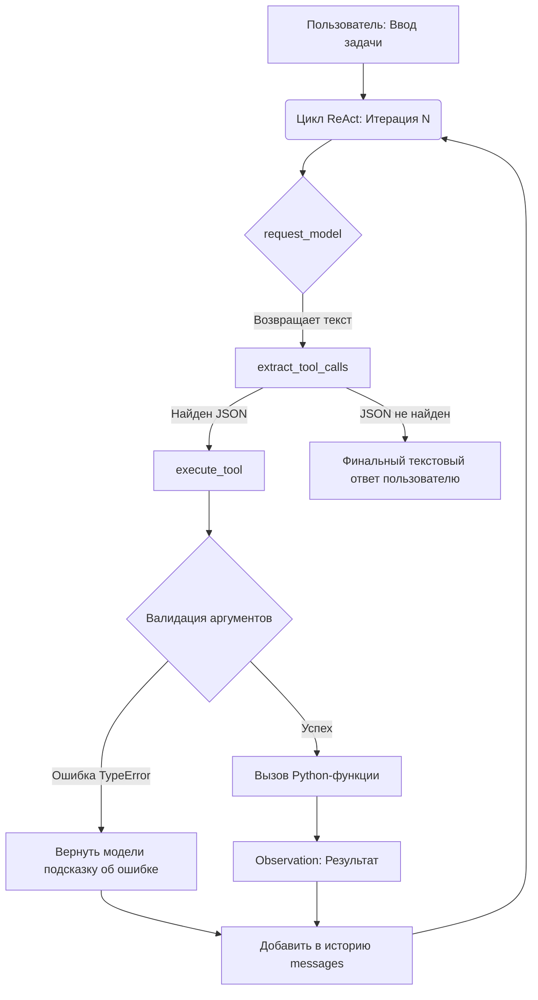

# 📖 Глава 2. Архитектура Tool API: от хардкода к JSON Schema

> **Цель главы:** Заменить хрупкий хардкод первой главы на масштабируемый, декларативный реестр инструментов. Научиться автоматически генерировать JSON Schema из кода Python, валидировать аргументы и использовать единый диспетчер вызовов, подготовив фундамент для нативного Function Calling.

В [Главе 1](../chapter1/README.md) мы доказали, что ReAct-паттерн работает. Однако, если заглянуть в код, можно заметить предупреждение: *"Цепочка if — самое простое, что работает, и самое неудобное, что можно придумать"*. 

В этой главе мы решаем эту проблему, превращая прототип в инженерно грамотную систему.

---

## 🔄 Фундаментальные отличия от Главы 1

| Критерий | Глава 1 (Прототип) | Глава 2 (Tool API) |
| :--- | :--- | :--- |
| **Регистрация** | Ручной список `KNOWN_TOOLS` | Декоратор `@tool`, автоматическая регистрация |
| **Описание для модели** | Ручное написание гигантского `SYSTEM_PROMPT` | Автогенерация из `__doc__` и сигнатур функций (`inspect`) |
| **Вызов (Dispatch)** | Длинная цепочка `if name == "..."` | Единый диспетчер `execute_tool` с распаковкой `**kwargs` |
| **Валидация** | Отсутствует (ошибки падают крашем) | Перехват `TypeError`, возврат понятной ошибки модели для самоисправления |
| **Парсинг ответа** | Хрупкие регулярные выражения и "магия" со слешами | Структурированный поиск JSON-блоков с фоллбэками |

---

## 💻 Исходный код

* 📄 **[chapter2/agent.py](agent.py)** — Цикл ReAct, использующий новый Tool API.
* 📄 **[chapter2/src/tools.py](src/tools.py)** — Декораторы, реестр, диспетчер и парсер вызовов.
* 📄 **[chapter2/tests.py](tests.py)** — Полное покрытие тестами (юнит-тесты + интеграция с Ollama).

---

## 🧠 Разбор архитектуры: почему так устроено?

### 1. Единый источник истины (Single Source of Truth)
Вместо того чтобы описывать инструмент в коде, а потом вручную дублировать это описание в промпте, мы используем декоратор `@tool`. Он делает две вещи:
1. Регистрирует функцию в глобальном `TOOL_REGISTRY`.
2. С помощью модуля `inspect` извлекает имена параметров и их обязательность, а из первой строки `__doc__` берет описание.

### 2. Как добавить новый инструмент (за 30 секунд)
Вам больше не нужно трогать `agent.py` или `SYSTEM_PROMPT`. Просто напишите функцию:

```python
@tool
def get_time(timezone: str = "UTC") -> str:
    """Возвращает текущее время в указанном часовом поясе."""
    import datetime
    return str(datetime.datetime.now())
```
**Всё.** При следующем запуске агент автоматически узнает об этом инструменте, его параметрах и добавит его в свой системный промпт.

### 3. Безопасность и устойчивость (Resilience)
* **Защита от галлюцинаций модели:** Если модель передаст неверное имя аргумента (например, `filename` вместо `path`), `execute_tool` перехватит `TypeError` и вернет модели строку: *"Ошибка валидации аргументов: ... Проверь имена"*. Модель получит шанс исправиться на следующей итерации, вместо того чтобы агент упал с ошибкой.
* **Безопасный `eval`:** В `calculator` используется `{"__builtins__": {}}`, что предотвращает выполнение вредоносного кода вроде `import os`.
* **Защита контекста:** `read_file` жестко ограничивает вывод первыми 2000 символами, чтобы случайно не "выжечь" контекстное окно маленькой модели.

---

## 🗺️ Диаграмма работы агента (Глава 2)



---

## 🧪 Тестирование и запуск

```bash
#Быстрые тесты (без модели)
python -m pytest chapter2/test_tools.py -v -m "not integration"

#Интеграционные тесты (с живой моделью)
python -m pytest chapter2/test_tools.py -v -m integration

#запуск
python -m chapter2.agent
```

Попробуйте запросы:
* *"Прочитай файл README.md из корня проекта и скажи, какая модель используется по умолчанию."*
* *"Посчитай (125 * 4) + 17"*
* *"Какая погода?"*
* *"Посчитай 10 / 0"* (проверьте, как агент элегантно обработает ошибку инструмента).

Отличные замечания! Вы абсолютно правы по обоим пунктам. Давайте исправим эти проблемы.

---

## 🔧 Исправление 1: Пример в README

Вы правы — у нас нет инструмента `write_file`, поэтому пример "Создай файл..." не сработает. Давайте заменим его на реалистичные запросы, которые наш агент действительно может выполнить:

**Было (в README):**
```markdown
* *"Создай файл test.txt с текстом 'Привет', а затем прочитай его и скажи, что внутри."*
```

**Стало:**
```markdown
* *"Прочитай файл README.md из корня проекта и скажи, какая модель используется по умолчанию."*
* *"Посчитай (125 * 4) + 17"*
* *"Какая погода в Москве?"*
* *"Посчитай 10 / 0"* (проверьте, как агент элегантно обработает ошибку инструмента).
```

## 📊 Итоговая архитектура импортов

```mermaid
graph TD
    A[chapter1/agent.py] -->|Импортируем| B[chapter2/agent.py]
    A -->|Импортируем| C[chapter2/test_tools.py]
    
    subgraph "Что берем из Главы 1"
        A1[request_model]
        A2[ensure_ollama_running]
        A3[preload_model]
    end
    
    subgraph "Что создаем в Главе 2"
        B1[@tool декоратор]
        B2[TOOL_REGISTRY]
        B3[execute_tool - новый диспетчер]
        B4[extract_tool_calls - новый парсер]
        B5[Новый SYSTEM_PROMPT]
    end
    
    A1 --> B
    A2 --> B
    A3 --> B
    B1 --> B
    B2 --> B
    B3 --> B
    B4 --> B
    B5 --> B
```

|[Назад](../chapter1/README.md) | [📚 Оглавление](../README.md) | [Далее](../chapter3/README.md)|