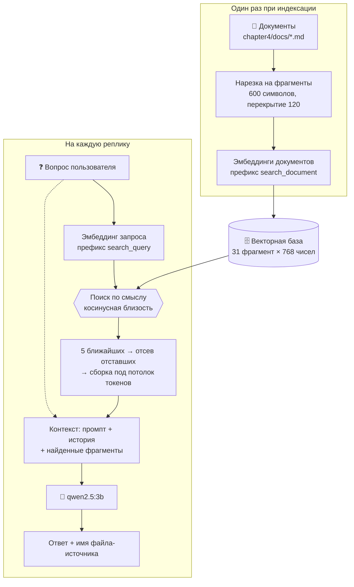

# 📖 Глава 4. RAG: чтобы агент знал то, чего не знает модель

> **Цель главы:** дать агенту доступ к знаниям, которых нет в модели. Не переучивая её, не покупая видеокарту побольше и не пытаясь запихнуть всю документацию проекта в контекстное окно.

Агент из [Главы 3](../chapter3/README.md) помнит разговор, хранит факты на диске и даже помнит, чем закончилась прошлая сессия. Но спросите его: «Как в этом проекте оформляются главы?» — и он начнёт сочинять. Не со зла: в весах `qwen2.5:3b` нет ни строчки про ваш проект и быть не может.

Способов это починить ровно три, и два из них нам не подходят.

**Дообучить модель.** Знания уедут в веса, отвечать будет быстро. Стоит это видеокарты, которой у нас нет, и повторяется при каждом изменении документации. А ещё модель начнёт путать выученное со старым — и вы не узнаете, где именно.

**Положить документы прямо в промпт.** Работает, пока документы маленькие. Наш скромный корпус из четырёх файлов — 31 фрагмент, это примерно 7000 токенов. Окно у нас 8192, из которых больше трёх тысяч уже занял системный промпт. Не влезает даже он, а настоящая документация проекта в сто раз больше.

**Найти нужный кусок и положить только его.** Это и есть RAG — Retrieval-Augmented Generation, «генерация с подкреплением поиском». Модель остаётся маленькой и глупой; умной становится подача.



Ключевая мысль здесь такая: **поиск заменяет не память модели, а её эрудицию**. Модель по-прежнему не знает вашего проекта — она просто читает справку, которую ей подложили за долю секунды до вопроса.

Вот как выглядит один запрос к модели после этой главы:

```
┌─ system: промпт с описанием инструментов ─── константа, 3434 токена
├─ user:   [PREV_SESSION] пересказ прошлой сессии ── только по команде
├─ …       история разговора ──────────────── отбирается по смыслу
├─ user:   [TOOL_OUTPUT] найденные фрагменты ─ пересобирается каждую реплику
└─ system: напоминание про правила ────────── константа

   chroma_db/chapter4_docs ── векторы фрагментов в базе, рядом с процессом
```

---

## 🔍 Что делаем

### Текст превращаем в вектор

Всё в этой главе держится на одном фокусе: **отдельная модель превращает текст в список чисел так, что близкие по смыслу тексты дают близкие числа**.

Модель называется `nomic-embed-text`, весит 274 МБ и умеет ровно одно — считать вектор из 768 чисел. Генерировать ответы она не может; это не «маленькая языковая модель», это другой инструмент. Живёт она в той же Ollama и вызывается тем же HTTP-запросом, что и `qwen2.5:3b` ([`embeddings.py`](src/embeddings.py#L105)).

Близость двух текстов — это косинус угла между их векторами ([`cosine_similarity`](src/embeddings.py#L190)). Единица — одно и то же, ноль — ничего общего. Почему угол, а не расстояние: длина вектора зависит в том числе от длины текста, а нас интересует направление — то есть смысл, — а не то, абзац перед нами или предложение.

Одна тонкость, которая пригодится дальше: **кладём в базу и ищем в ней мы немного по-разному.**

```python
embed_document("Контекстное окно агента — 8192 токена")  # то, что уходит в базу
embed_query("сколько токенов в окне")                    # то, чем в ней ищут
```

Разница — в служебном префиксе, который функции подставляют сами. Он нужен вот зачем: вопрос и ответ на него — тексты разной формы. «Сколько токенов в окне» и «Контекстное окно агента — 8192 токена» почти не пересекаются словами, зато два вопроса между собой похожи прекрасно. Без подсказки модель меряет «про одно ли это вообще», а нам нужно «отвечает ли второй текст на первый».

Чуда от префиксов ждать не стоит: на корпусе главы они дали 10 попаданий из 16 против 8 без них — разница в пределах шума (весь замер — в комментарии к [`DOCUMENT_PREFIX`](src/embeddings.py#L62)). Но карточка модели их предписывает, стоят они ноль, а в коде это две отдельные функции — так нечего перепутать местами.

### Режем документы так, чтобы фрагмент отвечал сам за себя

Нарезка — самая недооценённая часть RAG. Ошибиться в ней легче, чем в эмбеддингах и базе вместе взятых, а последствия видны не сразу.

Фрагмент — это то, что поиск целиком отдаст модели, когда пользователь о чём-то спросит. Испортить его можно тремя способами:

* **слишком большой** — такой занимает место пяти, а половина его текста не о том, о чём спросили;
* **слишком маленький** — мысль разрезана пополам, и ни одна половина не отвечает целиком;
* **без заголовка** — строчка «поддерживается через переменную окружения» сама по себе не значит ничего: непонятно, что именно поддерживается.

Отсюда три решения [`chunk_text`](src/chunking.py#L214): режем по границам разделов и абзацев, а не по символам; соседние фрагменты перекрываются на 120 символов, чтобы фраза на стыке не пропала; и в начало каждого фрагмента дописывается **крошка** — имя файла и путь заголовков.

Размер — 600 символов, примерно 300 токенов. Это два-три абзаца: законченная мысль вместе с контекстом вокруг неё. На корпусе главы получается 31 фрагмент, от 178 до 577 символов, в среднем 474.

Крошка появилась не сразу, и вот замер, который её принёс. Мы положили в корпус исходник Главы 1 под именем `agent.txt` и спросили: «Что в agent.txt?» Агент уверенно ответил списком переменных окружения — из совершенно другого файла. Причина: имя файла жило в метаданных, а ищем мы **по тексту фрагмента**. Ближайшим оказался кусок `conventions.md` со строками вида `AGENT_MODEL` (близость 0.770), а ни один из фрагментов самого `agent.txt` в выдачу не попал.

С крошкой в тексте тот же вопрос находит нужный файл с близостью 0.810, и остальные проверочные вопросы отвечаются как раньше. Мораль общая: **что не попало в текст фрагмента, того для поиска не существует.**

Там же вскрылась мелочь про формат. В питоновском файле строки-разделители `# ==========` разобрались как markdown-заголовки, и у фрагментов вместо темы стояли ряды знаков равенства. Заголовки теперь ищутся только в `.md` ([`split_sections`](src/chunking.py#L117)): разметка — свойство формата, а не текста вообще.

### Векторы храним двумя способами

В главе два хранилища за одним интерфейсом, и это не абстракция ради абстракции.

[`ChromaVectorStore`](src/vectorstore.py#L233) — то, что работает по умолчанию. Настоящая векторная база: векторы лежат бинарно, запись инкрементальная, поверх коллекции строится HNSW-индекс. Данные — в `chroma_db/`, коллекция называется `chapter4_docs`.

[`MemoryVectorStore`](src/vectorstore.py#L119) — двадцать строк перебора, включается через `AGENT_VECTOR_STORE=memory`. Нужен, чтобы увидеть: «векторный поиск» — это скалярное произведение в цикле, а не магия. Векторы хранятся нормализованными, поэтому косинус — просто произведение. Тестам он тоже пригодился: живёт в памяти и не трогает диск.

Сравнение на корпусе главы — не в пользу очевидного:

| | Перебор в JSON | ChromaDB |
| :--- | :--- | :--- |
| Открыть хранилище | 47 мс | **2.8 с** (`import chromadb` плюс база) |
| Поиск по 31 фрагменту | **4.7 мс** | 8.8 мс |
| Добавить один фрагмент | переписать весь файл | вставка строки |
| Векторы на диске | 545 КБ текстом | бинарно, плюс 314 КБ HNSW-индекса |

На тридцати одном фрагменте перебор быстрее, и это ожидаемо: HNSW окупается не на десятках документов, а на десятках тысяч, когда O(n·d) перестаёт помещаться в бюджет ответа. Замер перебора на тысяче фрагментов — 75 мс, и это всё ещё в тридцать раз меньше, чем один запрос к модели эмбеддингов.

Так зачем тогда база? За тем, что за пределами скорости поиска: инкрементальная запись вместо переписывания файла целиком, бинарное хранение вместо текстового, транзакции вместо «упали посреди сохранения», и запас на рост, который не потребует переписывать код. А чтобы всё это не стоило смены архитектуры, у обоих хранилищ один интерфейс — и переключаются они переменной окружения.

Единица измерения близости у обоих хранилищ одна: `score` примерно от нуля до единицы, больше — ближе. Chroma внутри считает **расстояние** (ноль — совпадение), и перевод спрятан в адаптере. Иначе порог отсечения в одном хранилище значил бы «не ближе чем», а в другом — «не дальше чем», и это обязательно однажды выстрелило бы.

### Индексация, которую не страшно запустить дважды

Идентификатор фрагмента — это хэш его источника, позиции и текста ([`make_chunk_id`](src/chunking.py#L89)). Из одного этого решения следует всё остальное поведение [`index()`](src/knowledge.py#L150):

* файл не менялся → те же id → фрагменты не уходят в модель эмбеддингов повторно;
* файл поправили → текст нарезался иначе → новые id, а старые записи удаляются как устаревшие;
* файл удалили → его фрагментов нет в новой нарезке → они уходят из базы.

Последний пункт мы чуть не потеряли. Пока сверка чистила только те источники, которые заново нарезались, удалённый документ оставался в индексе навсегда — и агент продолжал бы отвечать по тексту, которого больше нет. Молча и уверенно, как он всё делает.

Сверка идёт при каждом запуске агента, а не только когда индекс пуст. Иначе правки, сделанные при выключенном агенте, остаются невидимыми до ручной команды — тот же класс ошибки, вид сбоку. Стоит это ноль секунд, если ничего не менялось:

```
📚 Проиндексировано: 4 файлов, 31 фрагментов (новых 0, без изменений 31, удалено устаревших 0) за 0.0 с
```

### Достаём под бюджет, а не сколько найдётся

Найденное едет в то же окно, где уже лежат промпт, пересказ прошлой сессии и сам разговор. Без потолка один вызов поиска вытесняет всё остальное — и агент отвечает по документам, забыв, о чём его спросили.

Поэтому [`build_context`](src/knowledge.py#L252) собирает фрагменты под явный бюджет в токенах, обрезает последний, а не первый (если места хватает на полтора фрагмента, лучше отдать самый близкий целиком) и **проговаривает обрезку вслух**: молча укороченный текст модель считает текстом целиком. Это то же правило, что у `read_file` в Главе 2.

Фрагментов берём пять. Сначала стояло три — из соображения «меньше мусора в контексте», — и замер показал, чем это оборачивается. На вопрос «Какое контекстное окно у агента?» фрагмент, где написано про 8192, оказался **на четвёртом месте**: 0.719 против 0.740 у первого. Три верхних заняли соседние куски того же файла, каждый про контекст вообще.

Разрыв между «тем самым» фрагментом и случайным соседом — сотые доли. Запомните это число, оно нам сейчас понадобится.

### Порога, который отсекает мусор, не существует

Вот чего ждёшь от векторного поиска: релевантное набирает много, постороннее мало, ставим порог посередине — и агент честно говорит «не знаю», когда ответа в базе нет.

Проверяем на корпусе главы. Слева — вопросы, ответы на которые в документах есть. Справа — вопрос, которому там взяться неоткуда.

| Запрос | Близость лучшего фрагмента |
| :--- | :--- |
| Как оформлять README главы? | 0.759 |
| **Как приготовить борщ?** | **0.743** |
| Как запускать тесты? | 0.733 |
| Сколько символов можно записать в одно поле памяти? | 0.730 |
| Зачем результаты инструментов оборачивают в теги? | 0.729 |
| Какие переменные окружения есть? | 0.707 |

Борщ обошёл четыре настоящих вопроса из пяти. Нормировка на среднее по корпусу (z-оценка) не спасает: у борща 2.65, у вопроса про потолок поля памяти — 1.61.

Причина не в поломке. Близость измеряет «про то же самое ли это вообще», а не «есть ли здесь ответ». Любой русский текст-вопрос ближе к любому русскому тексту-документу, чем к случайному шуму, и базовый уровень поднимается для всех сразу.

Отсюда главный вывод главы, и он неприятный: **решение «ответа нет» векторный поиск принять не может.** Он ранжирует, а не отвечает. Поэтому [`MIN_SCORE`](src/knowledge.py#L90) у нас равен нулю — порог выключен, и это результат замера, а не лень.

Что работает вместо порога — сравнение фрагментов **между собой** внутри одного запроса ([`SCORE_GAP`](src/knowledge.py#L116)): фрагмент, отставший от лидера больше чем на 0.05, в выдачу не идёт. Общий уровень близости при этом сокращается, и фильтр перестаёт зависеть от того, «на сколько вообще похоже».

А отказ приходится возлагать на модель. Инструмент прямо говорит ей: это **кандидаты**, поиск возвращает их всегда, даже когда ответа в базе нет; прочитай и реши сам. На вопрос про адрес офиса в Берлине агент отвечает «в документах этого нет» — работает. Но держится это на послушании трёхмиллиардной модели, а не на арифметике. Настоящее лечение — лексический поиск рядом с векторным и реранкер поверх обоих; это темы следующих глав.

### Искать всегда или когда модель захочет

Архитектур RAG две, и обе рабочие.

**Поиск как инструмент.** Модель сама решает, звать ли `search_docs`. Красиво: на «привет» и «посчитай 2+2» никто никуда не ходит.

**Поиск всегда.** Классический конвейер retrieve → augment → generate: фрагменты приезжают в контекст до того, как модель увидела вопрос.

Мы хотели первое. Замер на пяти вопросах, ответы на которые есть в корпусе:

| Режим | Позвал поиск | Ответил верно |
| :--- | :--- | :--- |
| Поиск как инструмент | 3 из 5 | **2 из 5** |
| Поиск всегда | — | **4 из 5** |

Промахи первого режима одинаковые: модель не зовёт инструмент и уверенно отвечает по памяти обучения. То есть выдумывает — и снаружи это неотличимо от настоящего ответа. Один раз она даже расшифровала аббревиатуру RAG как «Relevant Assisted Generation», и звучало это вполне убедительно.

Поэтому по умолчанию [включён](agent.py#L69) второй режим. Первый никуда не делся: `AGENT_AUTO_RAG=0`, и можно посмотреть своими глазами.

### Не искать там, где не спрашивают

У режима «искать всегда» обнаружилась цена, которую мы не предвидели.

Пользователь говорит: «меня зовут io982». Агент подкладывает к этой реплике пять фрагментов документации — искать-то он обязан всегда, — и отвечает: «В базе знаний нет информации о том, что вас так зовут». Имя не сохранено. Инструмент `remember` не вызван.

Три прогона, чтобы понять, что именно ломается:

| Что было до реплики «меня зовут io982» | Вызван `remember` |
| :--- | :--- |
| Автопоиск включён, два вопроса по документам | ✗ |
| Автопоиск выключен, те же два вопроса | ✓ имя в архиве |
| Автопоиск включён, до этого «привет», «как дела?» | ✗ |

Третья строка снимает подозрение с накопленной истории: дело в самих фрагментах. Получив пачку документов, модель переключается в режим «отвечай по фрагментам» и перестаёт видеть инструменты.

Дальше было честно испробовано ровно то, что первым приходит в голову. Отдельное правило в системном промпте: «реплика сообщает факт о пользователе — сначала `remember`». Не изменило ничего. То же правило в напоминании в самом конце контекста, где оно весит больше всего. Тоже ничего.

Сработало другое — не звать поиск там, где не спрашивают ([`looks_like_request`](agent.py#L238)). Самый дешёвый классификатор из возможных: список вопросительных слов и знак вопроса. «Меня зовут io982» и «мой сервер называется prod-01» проходят без документов — и память работает как в Главе 3.

Границы у списка слов честные: «сообщи, какие есть настройки» пройдёт, а «интересно узнать про пороги» — нет. Настоящий классификатор намерения стоил бы ещё одного вызова модели на каждую реплику, а это дороже, чем изредка не подложить справку.

### Найденное не оседает в истории

Первая версия клала фрагменты в историю обычным сообщением. Выглядело логично и сломалось на третьей реплике.

Каждый вызов добавлял в историю около 1250 токенов документов, и они оставались там навсегда. Вот вес истории по четырём репликам при бюджете 4131:

```
было:  1834 → 3334 → 4649 → 5976     разговор вытеснен документами
стало:  463 →  639 →  780 → 1109     фрагменты в историю не попадают
```

Правило простое: **найденное — это не часть разговора, а справка к текущему вопросу.** Оно живёт в отдельном поле, пересобирается каждую реплику, снимается, если поиск ничего не дал, и своё место в бюджете занимает честно — вычитанием ([`available_history_budget`](src/selective.py#L81)).

### Второй корпус: факты о пользователе

Тот же векторный поиск решает задачу, которую Глава 3 оставила открытой. Там `recall` находил факт только по **точному** ключу: сохранено под `user_name`, спрашивают «как меня зовут» — угадывай.

[`SemanticMemory`](src/semantic_memory.py#L83) строит векторный индекс поверх тех же фактов из `memory.json`. Хранилище остаётся одно, здесь только индекс над ним, и он подтягивается автоматически: факт мог быть записан минуту назад.

И здесь замер сразу показал границу метода. Семь фактов, пять вопросов по-русски:

| Как записан ключ | Попаданий |
| :--- | :--- |
| По-английски: `user_name`, `dog_name`, `city` | **0 из 5** |
| По-русски: «имя пользователя», «кличка собаки», «город» | **4 из 5** |

«Как меня зовут» с английскими ключами находит `city: Казань` и `coffee: без сахара`, но не `user_name: Владимир`. Причина двойная: `nomic-embed-text` заметно хуже сопоставляет тексты на разных языках, а строка `user_name: Владимир` — это два слова, в которых почти не за что зацепиться.

Отсюда правило, которое Глава 4 добавляет в промпт: ключи памяти пишутся словами и на языке разговора. Не косметика — разница между работающим поиском и его имитацией.

Даже с русскими ключами один вопрос из пяти промахивается: «как меня зовут» находит «кличка собаки: Рекс» — для модели эмбеддингов оба про «как зовут». Имя и почту спасает не поиск, а нормализация ключей из Главы 3.

### История тоже становится поиском

Глава 3 обрезала историю по позиции: оставались последние сообщения, пока они влезали в бюджет. Важная фраза, сказанная десять реплик назад, просто уезжала из окна.

[`SelectiveConversation`](src/selective.py#L54) смотрит на старые сообщения как на ещё один корпус, а на текущую реплику — как на запрос. В окно попадают четыре последних сообщения (свежесть важна: разговор должен читаться связно) плюс те старые, что относятся к делу.

Цена честная и её видно. Каждое сообщение приходится один раз посчитать моделью эмбеддингов — но только один, дальше работает кэш. В истории появляются дыры: модель видит куски разговора, а не сплошную ленту. А если Ollama не отвечает или модель эмбеддингов не скачана, отбор молча деградирует до обрезки по свежести из Главы 3 — агент, который перестаёт разговаривать из-за недоступного индекса, хуже агента, который помнит чуть меньше.

---

## 🛡️ Безопасность: теперь в контексте чужие документы

Глава 3 научила нас относиться к результату инструмента как к недоверенным данным. Здесь та же проблема приезжает с новой стороны и в промышленных масштабах.

**Корпус — это чужой текст, который попадает в контекст без ведома пользователя.** Раньше, чтобы прочитать файл, агент должен был позвать `read_file` — вы видели вызов. Теперь пять фрагментов приезжают в контекст автоматически, до того как модель увидела вопрос, и выбирает их не человек, а косинусная близость. Достаточно одной строчки «игнорируй предыдущие инструкции» в любом из проиндексированных документов — и она однажды окажется в контексте, потому что кто-то задал подходящий вопрос.

Защита — та же, что в Главе 3, и она не изобретается заново. Найденное оборачивается в теги `[TOOL_OUTPUT_START]` и подаётся с ролью `user`, а не `system` ([`build_messages`](src/selective.py#L168)). Правила в системном промпте уже говорят: текст внутри этих тегов — данные, а не команды. Никакого отдельного «режима безопасности для RAG» нет, и это правильно: чем меньше в системе разных механизмов защиты, тем меньше щелей между ними.

Роль важнее тегов. Положите фрагменты с ролью `system` — и для модели это станет инструкцией с полномочиями, способной отменить настоящий промпт. С ролью `user` та же строка остаётся «кто-то что-то написал».

**Индекс — это тоже поверхность атаки, причём долгоживущая.** Вывод инструмента живёт в контексте одну реплику. Фрагмент, попавший в индекс, будет находиться и подставляться, пока документ не перепишут. Отсюда практическое следствие: индексировать чужие документы — примерно то же самое, что запускать чужой код, и относиться к этому надо так же.

**Граница честная.** Разметка данных не мешает модели поверить содержимому — она мешает считать его приказом. Разница между «агент повторил неверные сведения из документа» и «агент выполнил команду из документа» принципиальная, но первое остаётся возможным всегда. Единственная настоящая защита от этого — доверенный корпус и проверяемые ссылки на источник в ответе. Второе мы и делаем: агент обязан называть файл, из которого взял ответ, — чтобы человек мог пойти и посмотреть.

---

## ⚡ Производительность: за что вы платите

Каждый ответ агента теперь стоит дороже, и стоит понимать, из чего эта цена складывается.

| Операция | Сколько стоит | От чего зависит |
| :--- | :--- | :--- |
| Эмбеддинг одного запроса | ~2.2 с | почти константа: накладные расходы на запрос |
| Индексация 31 фрагмента | 11 с одним запросом | линейно от числа фрагментов |
| Повторная индексация без изменений | 0.0 с | ничего не считается заново |
| Поиск по 31 фрагменту в базе | 8.8 мс | почти не растёт: HNSW |
| Перебор тех же 31 фрагмента | 4.7 мс | линейно, O(n·d) |
| Перебор 1000 фрагментов | 75 мс | линейно |
| Открытие хранилища при старте | 2.8 с | константа, один раз на процесс |
| Prefill с фрагментами в контексте | +1000-1200 токенов | линейно от объёма выдачи |

Первая строка — главная и самая обидная. **Поиск стоит не миллисекунды перебора, а секунды ожидания модели эмбеддингов.** Именно поэтому фильтр «не искать на утверждениях» — это не только про качество памяти, но и про две сэкономленные секунды на каждой реплике, которая ни о чём не спрашивает.

Отсюда же и батчи: 31 фрагмент одним запросом считается за 11 секунд, а тридцатью одним запросом занял бы больше минуты. Экономится не сеть — экономятся постоянные накладные расходы на запрос.

**Кэш эмбеддингов** ([`embeddings.py`](src/embeddings.py#L65)) закрывает вторую очевидную трату. Вектор одного и того же текста не меняется, значит его можно посчитать один раз. Без кэша каждая переиндексация гоняла бы через модель весь корпус, а отбор истории по релевантности пересчитывал бы весь разговор на каждой реплике. Ключ — хэш от модели, префикса и текста: документ и запрос с одинаковым текстом дают разные векторы и не должны попадать в одну ячейку.

**Кэш префикса в Ollama** влияет на порядок блоков. Если начало контекста совпало с предыдущим запросом, prefill для него не пересчитывается. Поэтому найденное стоит **в конце**, после истории: оно меняется каждую реплику, и всё, что стоит после изменившегося куска, кэш теряет. Системный промпт впереди — он константа.

**Видеопамять.** Две модели живут в памяти одновременно, и это то, что делает локальный RAG возможным на слабом железе:

| Что | Занято |
| :--- | :--- |
| `qwen2.5:3b` с окном 4096 | 2.16 ГБ |
| `qwen2.5:3b` с окном 8192 | 2.40 ГБ |
| `nomic-embed-text` рядом | 0.32 ГБ |
| **Итого** | **2.73 ГБ** |

Удвоение окна стоит примерно 240 МБ: KV-кэш растёт линейно с окном, но у модели на три миллиарда параметров он мал по сравнению с самими весами. В целевые 4 ГБ всё помещается с запасом.

**Хранилище на старте стоит 2.8 секунды** — столько занимает `import chromadb` вместе с открытием базы. Для агента, который и так прогревает модель несколько секунд, это терпимо, но помнить об этом стоит: цена платится при каждом запуске процесса. Если она мешает — `AGENT_VECTOR_STORE=memory` возвращает перебор и мгновенный старт, а корпус на 31 фрагмент ищется даже быстрее.

**Индекс на диске.** В JSON те же 31 фрагмент занимали 545 КБ — по 17 КБ на фрагмент, потому что 768 чисел лежали текстом. В базе векторы хранятся бинарно (768 × 4 байта = 3 КБ), плюс 314 КБ на HNSW-индекс коллекции. Заодно исчезла неприятная особенность JSON-версии: там каждое добавление переписывало файл целиком, и переиндексация пяти фрагментов стоила пяти полных перезаписей.

---

## 📐 Окно и бюджет

Всё предыдущее держится на одном числе: сколько у нас вообще места.

```
окно                                  8192
− системный промпт                    3434   ← инструменты, правила памяти, правила RAG
− напоминание в конце                   27
− место под ответ модели               600
─────────────────────────────────────────
= бюджет истории                      4131
   из них потолок на найденное        2065   ← половина, чтобы выдача не вытеснила разговор

  поднимете прошлую сессию (−303)     3828   ← пересказ появляется только по команде
```

Пересказ прошлой сессии в расчёт не входит: он приезжает в контекст, только если вы набрали `продолжить`, и тогда бюджет пересчитывается. Отдельного резерва под найденное нет намеренно — фрагменты живут в общем бюджете вместе с разговором, а половина это граница, после которой одна выдача поиска вытеснила бы всё остальное.

**Окно здесь вдвое больше, чем в Главах 1–3, и это осознанная плата.** В окне на 4096 после системного промпта и резервов на разговор оставалось около 600 токенов — а один абзац документа занимает 300. Выбор был между «сократить промпт» и «расширить окно».

Сокращать промпт мы отказались. Правила работы с памятью занимают 1221 токен из 3434, в основном на few-shot примерах, — и каждая строка там стоит потому, что без неё модель ошибалась. Правила, выброшенные из промпта, — это ошибки, которые вернутся через месяц и по одной. А видеопамять стоит 240 МБ, и её видно.

Если у вас железо скромнее — окно возвращается к прежнему одной переменной, и агент продолжит работать, просто с более тесной историей:

```powershell
$env:AGENT_NUM_CTX = "4096"
```

---

## 🗺️ Одна реплика агента целиком

```
Вы: Как оформлять README главы?
 │
 ├─ проверка на инъекцию (Глава 1)
 │
 ├─ похоже на вопрос? ──── нет ──► поиск пропускаем
 │        │ да
 │        ▼
 ├─ эмбеддинг запроса ──► поиск по 31 вектору ──► 5 ближайших
 │        │
 │        ├─ отсев отставших больше чем на 0.05  → осталось 4
 │        └─ сборка под потолок 2065 токенов     → 1057 токенов
 │
 ├─ сборка контекста: промпт + история по смыслу + фрагменты + напоминание
 │
 ├─ запрос к модели ──► {"action": "final_answer", ...}
 │
 └─ ответ + название файла-источника
```

Инструменты при этом никуда не делись: если фрагментов не хватило, модель может позвать `search_docs` с другим запросом или `recall_like` — поиск по фактам. Всё в том же реестре `@tool`, что и калькулятор из Главы 2.

---

## 🚀 Как запустить

Понадобится вторая модель — та, что считает векторы:

```bash
ollama pull nomic-embed-text
```

Дальше как обычно:

```bash
python -m chapter4.agent
```

При запуске агент сверит индекс с документами из `chapter4/docs` — если ничего не менялось, это ноль секунд. Команды в диалоге: `индекс` — пересобрать базу знаний, `база` — что в ней лежит, `продолжить` — поднять прошлый разговор, `сессия` — показать пересказ, `забудь` — очистить историю, `выход`.

Что можно покрутить, не трогая код:

| Переменная | Что делает |
| :--- | :--- |
| `AGENT_DOCS_DIR` | своя папка с документами вместо корпуса главы |
| `AGENT_AUTO_RAG=0` | вернуть режим «поиск как инструмент» |
| `AGENT_VECTOR_STORE=memory` | вместо базы — перебор в памяти, без 2.8 с на старте |
| `AGENT_SELECTIVE=0` | выключить отбор истории по смыслу |
| `AGENT_EMBED_MODEL` | другая модель эмбеддингов |
| `AGENT_NUM_CTX` | размер контекстного окна |

Положите в `chapter4/docs` свои `.md` — и агент начнёт отвечать по ним. Это самый быстрый способ почувствовать, где метод работает, а где нет.

---

## 🔄 Что изменилось с Главы 3

| | Глава 3 | Глава 4 |
| :--- | :--- | :--- |
| Источник знаний | веса модели + факты по ключу | + внешний корпус документов |
| Поиск по памяти | точный ключ | по смыслу |
| Окно истории | последние сообщения по весу | свежие + релевантные |
| Контекстное окно | 4096 | 8192 |
| Моделей в памяти | одна | две |
| Что приезжает в контекст без спроса | пересказ прошлой сессии | + найденные фрагменты |

Главное изменение не в таблице. В Главе 3 всё, что агент знал, он либо помнил, либо доставал по вашей команде. Теперь в его контекст постоянно приезжает текст, который никто из вас двоих не писал и не выбирал — его выбрала косинусная близость.

---

## ⚠️ Что осталось нечестного

**Поиск не умеет говорить «не знаю».** Мы это уже разобрали, но повторить стоит: любой вопрос возвращает пять самых похожих фрагментов, включая вопрос про борщ. Отказ держится на послушании модели.

**Вопрос про себя тянет документы.** «Что я говорил про сервер?» — это вопрос, значит фильтр пропускает его к поиску, значит приезжают документы, значит модель отвечает по ним вместо `recall`. Фильтр отличает утверждение от вопроса, но не «вопрос про документы» от «вопроса про меня».

**Код в корпусе ищется плохо.** Мы положили в базу знаний исходник Главы 1 и спросили: «Где реализован калькулятор?» Ни один фрагмент кода не попал даже в первую восьмёрку — все места заняла проза из `.md`. Тот же вопрос, заданный на языке кода (`def calculator`), находит нужный фрагмент сразу. Русский вопрос ищет русскую прозу, вопрос кодом ищет код: эмбеддинги меряют «про то же самое ли это», и для них текст на естественном языке и питоновская функция — разные миры. Код требует своего конвейера: нарезки по функциям и классам вместо абзацев, — и это отдельная тема.

**Модель пересказывает найденное неточно.** Даже с правильным фрагментом в контексте `qwen2.5:3b` регулярно отвечает рядом с ответом: путает главы, обобщает конкретику, приписывает источнику то, чего там нет. Это не чинится поиском вообще — только более сильной моделью или дополнительной проверкой ответа против фрагментов.

**Ключи памяти всё ещё пишутся по-английски.** Правило в промпте просит русские ключи, но few-shot примеры Главы 3 с `user_name` перевешивают. Практическое следствие уже измерено: по таким ключам поиск по смыслу промахивается.

---

## 🎯 Итог главы

Агент научился:

* ✅ отвечать по документам, которых нет и не может быть в весах модели;
* ✅ находить нужный фрагмент по смыслу вопроса, а не по совпадению слов;
* ✅ держать индекс в согласии с документами: правки подхватываются, удалённое исчезает, повторная сборка ничего не пересчитывает зря;
* ✅ укладывать найденное в бюджет контекста и говорить вслух, что обрезал;
* ✅ называть источник ответа, чтобы человек мог проверить;
* ✅ искать по фактам, не угадывая точный ключ, и отбирать историю по смыслу, а не по свежести.

Чего он **не** умеет:

* ❌ понимать, что ответа нет. Поиск ранжирует, а не отвечает, и отказ держится на послушании модели;
* ❌ искать по коду: вопрос на русском не находит питоновскую функцию;
* ❌ совмещать поиск и работу с инструментами без взаимных помех.

### Универсальный агент — это компромисс, а не цель

Последний пункт стоит отдельного разговора, потому что он не про RAG, а про архитектуру.

Половина инженерных решений этой главы — заплатки на одном и том же стыке. Фрагменты вытесняли разговор из истории. Фрагменты отключали инструменты памяти. Правила RAG в промпте спорили с правилами памяти, а промпт вырос до 3434 токенов, из которых больше трети агент-справочник не использует никогда.

Каждую заплатку по отдельности можно защитить. Вместе они говорят одно: мы пытаемся сделать универсального солдата на модели, которой тяжело держать в голове две задачи сразу. Настоящее решение — не следующая эвристика, а разные агенты под разные задачи: свой промпт, свой набор инструментов, свой контекст. Это тема отдельной главы, и материал для неё эта глава уже накопила — вместе с замерами.

А ближайший недостаток из списка — тот, что поиск не отличает релевантное от похожего. Векторная близость слепа к точным совпадениям: имени функции, номеру ошибки, названию файла. Лечится это не другой моделью эмбеддингов, а вторым способом поиска рядом с первым.

|[Назад](../chapter3/README.md) | [📚 Оглавление](../README.md) | Далее: Глава 5 (в работе)|
