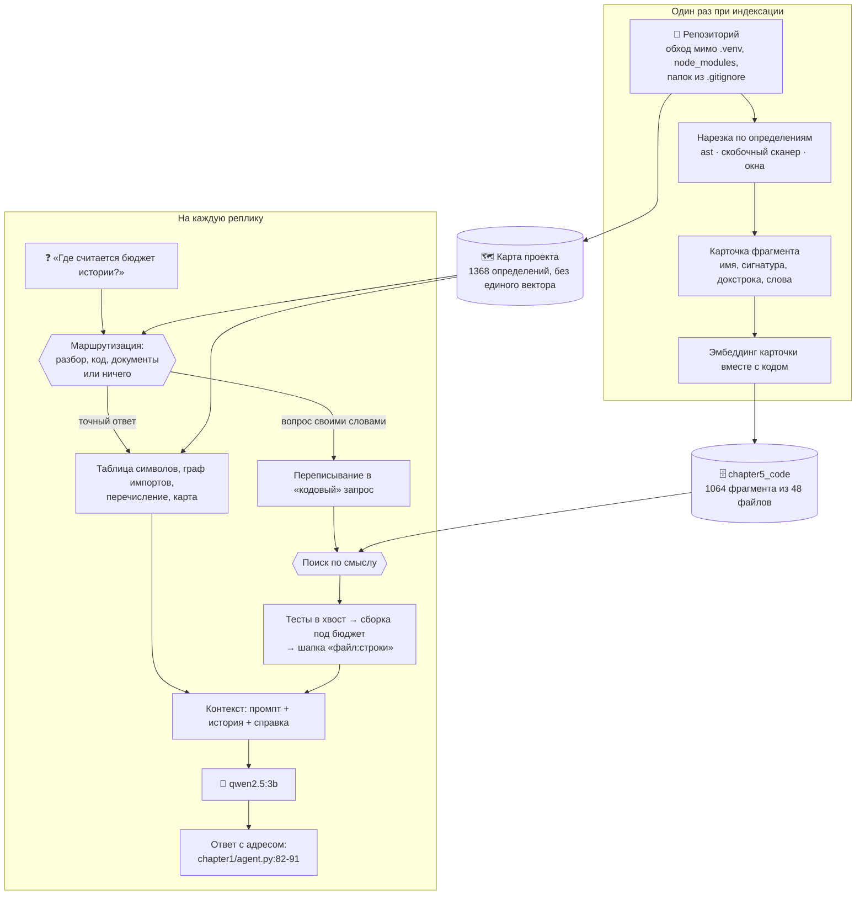
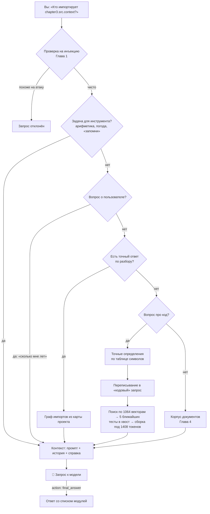

# 📖 Глава 5. Code RAG: агент, который читает код проекта

> **Цель главы:** научить агента отвечать на вопросы о коде этого репозитория — так, чтобы у каждого ответа был адрес: файл и номера строк, которые можно открыть и проверить.

[Глава 4](../chapter4/README.md) закончилась долгом. Мы положили в базу знаний исходник Главы 1 и спросили: «Где реализован калькулятор?» Ни один фрагмент кода не попал даже в первую восьмёрку — все места заняла проза из `.md`. Тот же вопрос, заданный на языке кода (`def calculator`), находил нужное место сразу.

Объяснение тогда было такое: коду нужен свой конвейер — нарезка по функциям и классам вместо абзацев, — и способ связать вопрос на русском с кодом, который на русском не написан. Первая половина оказалась верной, вторая — нет.

Коротко, чем всё кончилось:

* нарезка по определениям чинит фрагменты — это работает;
* **карточка фрагмента не связывает вопрос с кодом.** Русский вопрос без единого слова из кода находит нужное определение одинаково редко — и с карточкой, и без неё;
* связывает другое: переписывание вопроса моделью перед поиском. Это единственный приём главы, заметно поднявший попадание;
* а половина вопросов о коде вообще не про поиск. «Где определён `estimate_tokens`», «кто импортирует Главу 3», «что лежит в этом файле» — у них есть точный ответ по разбору, и он всегда верен;
* решает не качество поиска, а **маршрутизация**: кому отдать реплику. Она даёт заметно больше верных ответов, чем выбор инструмента моделью.

Числа за каждым из этих утверждений — в разделе «Замеры и производительность» в конце главы.



Главная мысль: **поиск по смыслу — не единственный способ отвечать на вопросы, и для кода он далеко не лучший**. Код в отличие от прозы разбирается машиной, а у разобранного кода есть точные ответы, которые не надо приближать векторами.

Один запрос к модели после этой главы:

```
┌─ system: промпт с описанием 15 инструментов ─ константа, 4749 токенов
├─ user:   [PREV_SESSION] пересказ прошлой сессии ── только по команде
├─ …       история разговора ──────────────── отбирается по смыслу
├─ user:   [TOOL_OUTPUT] справка или найденный код ─ один корпус, не два
└─ system: напоминание про правила ────────── константа

   chroma_db/chapter5_code ── векторы фрагментов кода, рядом с корпусом Главы 4
```

---

## 🔍 Что делаем

### Режем по определениям, а не по абзацам

Нарезка Главы 4 ищет границы мысли: раздел, абзац, пустую строку. У кода такой границы нет. Пустая строка внутри функции — это форматирование, а не смена темы, и фрагмент, отрезанный по ней, начинается с середины тела: ни имени, ни сигнатуры, ни докстроки. Пришёл такой кусок в ответ — и не понять, из какой он функции.

Границу у кода задаёт определение, и машине она видна. [`chunk_python`](src/codechunks.py#L273) разбирает модуль через `ast` — тот же разбор, которым Python читает ваш файл перед запуском, — и выдаёт:

* **шапку модуля** — докстроку, импорты и константы до первого определения. Это фрагмент, отвечающий на «что этот модуль делает» и «от чего зависит»;
* **функцию** целиком, вместе с декораторами и комментарием над ней;
* **класс** целиком, если помещается; иначе шапку класса отдельно, а каждый метод — отдельным фрагментом с именем `Класс.метод`;
* **всё, что между определениями**: константы посреди файла и блок `if __name__ == "__main__"`, в котором в этом курсе живёт весь REPL.

Комментарий над определением [захватывается в фрагмент](src/codechunks.py#L145) специально. По разбору он к функции не относится — `ast` его вообще не видит, — но в этом курсе объяснение «почему» живёт именно в них. Выбросить их — значит выбросить самый человеческий текст, какой у фрагмента есть.

Три числа задают размер фрагмента, и все три посчитаны от бюджета выдачи, а не выбраны на глаз:

| Константа | Значение | Почему столько |
| :--- | :--- | :--- |
| `MAX_CHUNK_LINES` | 60 строк | это примерно 2000 символов, около 1000 токенов; три таких фрагмента уже не влезают в потолок выдачи |
| `MAX_CHUNK_CHARS` | 2000 символов | второй счётчик нужен потому, что 60 строк словаря — втрое больше символов, чем 60 строк обычного кода |
| `MIN_CHUNK_CHARS` | 40 символов | строка `import os` одинаково похожа на любой вопрос про импорты в любом файле |

Функция длиннее потолка режется на части с перекрытием в 4 строки ([`_split_long`](src/codechunks.py#L162)), но части остаются частями одного определения: имя, сигнатура и докстрока копируются в каждую, и в выдаче каждая подписана «2 из 3». Без этого вторая половина длинной функции приезжает к модели безымянной — та же беда, из-за которой абзацная нарезка на коде не работает.

Одно исключение из нижнего потолка: **определение остаётся в индексе любой длины** ([`_keep`](src/codechunks.py#L211)). У `def clear(self): self._records.clear()` две строки, но есть имя, адрес и карточка, а вопрос «где очищается хранилище» без него не отвечается.

**Для JavaScript и TypeScript разбора нет.** Единственный настоящий парсер JavaScript живёт внутри движка JavaScript, а тащить в главу `tree-sitter` с бинарными колёсами — значит отменить обещание курса «на стандартной библиотеке». Вместо разбора — [скобочный сканер](src/codechunks.py#L556): заголовок определения ищется в начале строки на нулевой глубине вложенности, конец — там, где фигурные скобки снова сошлись в ноль. Двадцать строк состояния в [`_scan_line`](src/codechunks.py#L456) умеют пропускать скобку внутри строки, внутри комментария и внутри многострочного шаблона в обратных кавычках — три случая, на которых ломается наивный подсчёт.

Где сканер ошибается:

* **регулярное выражение со скобкой** (`/\{/`) сдвигает глубину, и следующее определение приклеивается к предыдущему;
* **JSX** — то же самое: `<div>{value}</div>` считается блоком;
* **методы внутри класса** не выделяются в отдельные фрагменты, в отличие от Python. Длинный класс режется на части по строкам, а не по методам.

Последствия ошибки при этом ограничены: фрагмент получается больше нужного или с чужим хвостом, но индексация не падает и файл не теряется. Проверять есть на чём: в [`samples/`](samples) лежат `todo.js` и `store.ts`, где нарочно собраны все три ловушки.

**Всё остальное режется построчными окнами** по 40 строк ([`chunk_lines`](src/codechunks.py#L693)) — конфиги, незнакомые языки и файлы с синтаксической ошибкой. Последнее важно: файл в репозитории регулярно сломан ровно в тот момент, когда его индексируют. Индексация, падающая на неудачной правке, бесполезна, поэтому `SyntaxError` здесь не исключение, а обычная развилка — модуль просто уезжает в окна.

На корпусе курса нарезка по определениям даёт вдвое меньше фрагментов, чем абзацная, — и у каждого из них есть имя.

### Что попадает в индекс

Корпус Главы 4 — папка с документами, которую собрал человек. Здесь корпус другой: рабочий репозиторий, где рядом с исходниками лежит всё, что насыпали инструменты. Поэтому обход начинается не с вопроса «какие расширения берём», а с вопроса «куда не заходим» ([`SKIP_DIRS`](src/languages.py#L74)), и причин пропустить папку три:

* **это не наш код** — `node_modules`, `.venv`. Чужие исходники в индексе не просто занимают место, они выигрывают у своих по количеству;
* **это производное** — `__pycache__`, `dist`, `chroma_db`. То, что собирается из кода, отвечать на вопросы о коде не должно;
* **этого нет в репозитории** — всё, что перечислено в `.gitignore`. Индекс, который знает больше, чем git, показывает файлы, которых для проекта не существует.

Последний пункт [разбирает сам `.gitignore`](src/languages.py#L119) — но не весь его формат, а только строки вида `drafts/` или `chroma_db/`: имя папки без шаблонов. Полная поддержка формата — это отдельная библиотека с приоритетами, отрицаниями и вложенными файлами правил. Без неё индекс кода собирал бы старые черновики глав наравне с живым кодом, и агент отвечал бы по коду, которого в проекте нет.

Обход идёт через `os.walk`, а не через `rglob`, ровно по одной причине: `os.walk` позволяет **отрезать** папку целиком, а `rglob` сначала зайдёт в `node_modules` и перечислит все сорок тысяч файлов, чтобы мы их потом отфильтровали ([`iter_sources`](src/languages.py#L171)). На фронтенд-проекте разница между ними — секунды против минут.

Дальше — мелочи, каждая из которых появилась после одного неверного ответа в живом прогоне:

* **файлы без расширения** индексируются по имени: `Dockerfile`, `Makefile`, `.gitignore`, `LICENSE`. Без лицензии в индексе агент на вопрос «какая тут лицензия» отвечал «в документах этого нет», а на уточняющий — выдумывал файл, в котором лицензия якобы описана;
* **потолок в 200 КБ**: это примерно 5000 строк Python. Файл такого размера уже редкость, а всё, что заметно больше, писал не человек;
* **собранные бандлы и файлы блокировок** выбрасываются по имени и суффиксу. Один `package-lock.json` даёт больше «фрагментов кода», чем весь проект;
* **тесты остаются в индексе**, но на вопрос «где реализовано» отвечает реализация. Об этом ниже.

**Документация в индекс кода не попадает** — и это результат замера, а не желание сделать индекс поменьше ([`INDEX_DOCS`](src/codebase.py#L73)). Первый индекс репозитория собирался вместе со всеми `.md`, и вопрос «где вычисляется арифметическое выражение» дал на нём первую шестёрку из одних README — ни одного фрагмента кода.

Причина такая: русский вопрос ближе к русской прозе, чем к английскому коду. **Проза о коде выигрывает у самого кода на его же вопросах.** Тексты глав остаются корпусом Главы 4, а выбирает между корпусами маршрутизация.

### Карточка фрагмента: приписываем к коду его описание

Самая поучительная часть главы.

Вопрос «где реализован калькулятор» и текст `def calculator(expression: str)` написаны на разных языках, общих слов у них нет, и близость между ними низкая поэтому. Но материал для связки лежит в коде: имя, сигнатура, докстрока — уже человеческим языком, — путь к файлу. Собираем это в связный текст и приклеиваем к коду **перед** эмбеддингом ([`build_card`](src/cards.py#L118)). Карточка функции `estimate_tokens` из Главы 3:

```
функция estimate_tokens в файле chapter3/src/context.py
def estimate_tokens(text: str) -> int
Грубо оценивает число токенов в тексте.
ключевые слова: estimate, tokens, text, context
```

Порядок строк не случаен: сначала адрес и вид, потом сигнатура, потом объяснение автора, и только в конце — россыпь ключевых слов. Первые строки читаются как связный текст, а модель эмбеддингов к связному тексту чувствительнее, чем к списку слов.

Отдельно — [разбор идентификатора на слова](src/cards.py#L77): `chunkTextWithLines` для модели эмбеддингов одно незнакомое слово, `chunk text with lines` — четыре знакомых. Разбираются и `snake_case`, и `camelCase`, и аббревиатуры:

```python
split_identifier("chunk_text_with_lines")  # → chunk, text, with, lines
split_identifier("KnowledgeBase.search")   # → knowledge, base, search
split_identifier("HTTPResponseCode")       # → http, response, code
```

Ключевой приём: **эмбеддится один текст, а возвращается другой** ([`embedding_text`](src/cards.py#L157)). В модель уходит карточка вместе с кодом, в базе лежит код, пользователю показывается код. Векторная база это позволяет — вектор и документ у неё разные поля, — и весь остальной конвейер работает с настоящим текстом файла, без наших приписок.

На корпусе курса это не сработало. Русский вопрос без слов из кода находит нужное определение одинаково редко во всех трёх режимах: и на голом коде, и на карточке вместе с кодом, и на одной карточке. Нужное определение лежит при этом не у верха выдачи, а примерно посередине корпуса.

Причину видно на прямом измерении близости: посторонняя русская фраза оказывается к вопросу ближе, чем карточка с правильной докстрокой внутри. **`nomic-embed-text` на русском меряет «это вообще русская проза?», а не тему.** Английский код от русского вопроса далеко, и приписать к нему немного русского текста — значит сдвинуть вектор в сторону всей русской прозы разом, а не в сторону этого вопроса. Тот же вопрос, заданный на языке кода (`def estimate_tokens`), находит своё определение всегда.

«Карточки не помогают» — неверное обобщение: проверены одна модель эмбеддингов, один корпус и один язык вопросов. Режим «одна карточка без кода» остался переключателем `AGENT_CODE_EMBED` — на другой модели или на корпусе с англоязычными докстроками расклад может быть иным.

### Переписываем вопрос на язык кода

Раз документ не удаётся подтянуть к вопросу, остаётся подтянуть вопрос к документу. Перед поиском просим **ту же самую модель** превратить вопрос в набор вероятных имён из кода ([`rewrite_query`](src/rewrite.py#L100)). Примеры формата:

```
вопрос: где вычисляется арифметическое выражение
запрос: calculate_expression arithmetic_operation

вопрос: как оценивается количество токенов в тексте
запрос: estimate_tokens text budget
```

Полученные слова **дописываются** к вопросу, а не заменяют его ([`expand_query`](src/rewrite.py#L142)). Замена опаснее: угадала модель имя — работает имя, промахнулась — работает исходный вопрос, и хуже, чем было, не становится.

На том же наборе вопросов переписывание поднимает попадание в разы — это самая большая разница, какую в главе дал один приём, и получена она одним запросом к модели, а не новой моделью эмбеддингов. Половина вопросов при этом не находится по-прежнему; какие именно и почему — в разделе «что осталось нерешённым».

Переписывание делает **модель**, поэтому результат плавает от прогона к прогону. Плюс кэш: тот же вопрос переписывается в тот же запрос, и повторять запрос к модели в одном разговоре незачем.

Ещё одна деталь из живого прогона: переписывание нужно **и внутри инструмента** ([`search_code`](src/tools.py#L66)), а не только в автопоиске. Модель, вызвавшая `search_code` с русским запросом «где реализован калькулятор», не находила ничего и отвечала «калькулятор в проекте не реализован». С переписыванием тот же вызов находит `chapter1/agent.py:82`.

### Не всё есть поиск: карта проекта

То, что стоило сказать в главе про поиск по коду первым делом: **часть вопросов о коде не нуждается в эмбеддингах вовсе.**

«Где определён `estimate_tokens`» — вопрос с ровно одним правильным ответом. Векторная близость здесь не помогает, а мешает: она вернёт пять фрагментов, где это имя встречается, и лучший из них не обязательно тот, где стоит `def`. Точный ответ даёт таблица символов — обычный словарь «имя → место определения».

«Кто импортирует Главу 3» — вопрос про граф. Ребро либо есть, либо нет, приблизить его нельзя, и никакой реранкер тут не нужен.

Всё это собирается одним проходом по файлам, **без единого запроса к модели** ([`scan`](src/repomap.py#L560)): для Python — тем же `ast`, что и нарезка, для остальных языков — теми же фрагментами, у которых уже есть имена. Весь разбор репозитория занимает доли секунды, поэтому карту можно пересобирать при каждом запуске.

В таблицу символов попадают функции, классы, методы — и **константы** ([`_python_symbols`](src/repomap.py#L493)). Не для полноты: половина решений этого курса живёт именно в константах — `CHUNK_SIZE`, `TOP_K`, `NUM_CTX`. Вопрос «где задан размер фрагмента» — это вопрос про константу, а не про функцию.

Из карты растут четыре справки, и все четыре точные:

**Определение по имени** ([`find`](src/repomap.py#L125)). Ищется и по короткому имени (`search`), и по квалифицированному (`KnowledgeBase.search`), и без учёта регистра: человек называет символ так, как помнит, а не так, как он записан. Промах по имени чаще всего означает опечатку, поэтому вместо пустого ответа показываются ближайшие имена из проекта.

**Перечисление определений** ([`in_file`](src/repomap.py#L161)). Прогон, из-за которого это появилось. Вопрос «какие инструменты есть в `chapter4/src/tools.py`»: векторный поиск ставит на первое место шапку этого файла — она действительно ближе всего к запросу, — а в шапке лежат импорты и константы, определений там нет. Агент ответил «инструментов в файле нет», хотя их два. Таблица символов на тех же вопросах не ошибается.

Три вещи, которые перечисление обязано различать:

* **«файла нет» и «файл есть, определений нет»** — это разные ответы. На «не нашёл» модель охотно придумывает содержимое. Так и вышло с `.gitignore`: определений в нём нет и быть не может, и вместо бесполезного «определений нет» агент теперь получает [содержимое файла](agent.py#L646);
* **подстановку похожего пути надо проговаривать.** Спросили про `./test.py`, которого в проекте нет, получили содержимое `chapter2/tests.py` — и агент выдал его за содержимое `./test.py`;
* **одинаковые имена в разных папках.** `__init__.py` есть в каждом пакете, и молча слить их в один список значит показать модели «содержимое файла», собранное из шести разных файлов. Она так и ответит.

**Граф импортов** ([`dependencies`](src/repomap.py#L371)) — в обе стороны: что импортирует модуль и кто импортирует его. Относительные импорты разворачиваются в полные имена, иначе теряется половина рёбер: именно относительными импортами связаны модули внутри пакета. Стандартная библиотека печатается отдельной строкой от внешних пакетов — `os` и `requests` импортируются одинаково, но зависимость проекта только второй.

Наблюдение про 3B, которое важнее самого графа. Справка на вопросы «кто импортирует X» и «что импортирует X» одна и та же, меняется только **порядок строк**: первой идёт прямой ответ на заданный вопрос. Без этого модель, получив справку, пересказывала её первую строку — то есть отвечала про обратное направление. Порядок строк в справке для 3B значит больше, чем их содержание.

**Структура проекта** ([`overview`](src/repomap.py#L427)) — папки, точки входа, внешние зависимости. Это ответ на «из чего состоит проект», который поиском по фрагментам не отвечается вовсе: такого текста нет ни в одном файле.

### Маршрутизация решает больше, чем поиск

Инструменты у модели были всё это время. Все пять зарегистрированы тем же декоратором `@tool`, что и калькулятор из Главы 2, описания у них написаны не «что делает», а «когда звать», и лежат они в системном промпте целиком.

Она их не зовёт.

Восемь вопросов о коде, два режима: подложить справку в контекст **до** первого вызова модели или оставить модели выбор инструмента. Выигрывает первый, и с большим отрывом. Любопытно другое: во втором режиме инструменты вызывались почти всегда — и почти вдвое реже давали верный ответ. Это та же беда, что измерена в Главе 4, только с другой стороны: получив пачку фрагментов, 3B переключается в режим «отвечай по фрагментам» и перестаёт видеть инструменты; а оставшись без фрагментов, она зовёт инструмент, но выбирает не тот.

Живой прогон, «Кто импортирует `chapter3.src.context`?»:

```
только автопоиск по коду → «этот модуль импортируется в chapter3/__init__.py
                            и в классе Conversation» — обоих импортов не существует
разбор в контексте        → chapter3.src.previous_session, chapter4.src.knowledge, …
```

Отсюда [`route`](agent.py#L771) — шесть проверок в жёстком порядке, и первым стоит **разбор**, а не поиск:

1. **задача для инструмента** — арифметика, погода, «запомни». В контекст не кладётся ничего;
2. **вопрос о пользователе** — факты из памяти Главы 3, целиком;
3. **справка по разбору** — карта, перечисление, граф, список инструментов агента;
4. **код** — точные определения плюс поиск по индексу;
5. **документы** — корпус Главы 4;
6. ничего не подошло — ничего и не кладём.

Первый пункт выглядит странно в главе про поиск, но он из замера: с подсказками в контексте модель звала инструмент втрое реже, чем без них. Провалилась даже арифметика. «Сколько будет 4568+5?» подходит под маркер вопроса «сколько», автопоиск Главы 4 подкладывал документы — и модель считала сама, без калькулятора. Ответ при этом был верным, что хуже всего: тихо считать в уме 3B умеет ровно до тех пор, пока числа маленькие.

Как агент понимает, что вопрос про код ([`looks_like_code_question`](agent.py#L255)) — три признака, от самого лёгкого к самому тяжёлому:

1. **слова** — «функция», «класс», «где реализован». Список неполный, как и маркеры Главы 4, и по той же причине: настоящий классификатор намерения обошёлся бы ещё в один вызов модели на каждую реплику;
2. **имя файла** — `agent.py` в вопросе не оставляет сомнений. Список расширений берётся из индексатора, а не пишется рядом заново: разъехавшись, они дают файл, который в индексе есть, а в вопросе не узнаётся;
3. **имя из проекта** — символ, модуль или язык. Этот признак не потребовал ничего: карта уже собрана, а проверка — обращение к словарю.

Третий и делает маршрутизацию рабочей. «Что делает `estimate_tokens`?» не содержит ни одного слова из первого списка. Туда же уезжала короткая реплика-продолжение «а в chapter5?» — пока к признакам не добавились имена модулей: агент отвечал по документам и выдумывал содержимое пакета.

Маркеры сравниваются по **основам слов**, а не по словам целиком, и это тоже из прогона: вопрос «покажи структуру проекта» не совпал с маркером «структура проекта» из-за падежа, уехал в векторный поиск вместо карты и получил в ответ четыре случайных фрагмента.

Когда в вопросе названо имя из проекта, точный ответ известен **до** поиска — и [идёт первым](agent.py#L740), занимая своё место в бюджете. Близость на русских вопросах ошибается, таблица символов — нет. Переписывание запроса в этом случае не запускается: английские слова в вопросе уже есть, и лишний запрос к модели ничего не добавит.

### Выдача: адрес важнее близости

Найденное едет в то же окно, где уже лежат промпт и разговор, поэтому [`build_context`](src/codebase.py#L244) собирает фрагменты под явный потолок в токенах. Устроено как в Главе 4, с тремя отличиями.

**Шапка несёт адрес.** `chapter1/agent.py:82-91 · функция calculator` — этого достаточно, чтобы читатель открыл файл и проверил ответ. Номера в каждой строке (`82: def calculator(...)`) дали бы то же самое, но заняли бы четыре-пять символов на строку — на пяти фрагментах это сотня токенов впустую.

**Близости в шапке нет**, в отличие от Главы 4. Причина — живой прогон: получив «(близость 0.70)», модель переписала её в ответ пользователю. Нам это число нужно для отладки, а человеку в ответе «калькулятор реализован в `chapter1/agent.py` (близость 0.70)» оно не говорит ничего.

**Обрезка идёт по строкам** ([`fit_lines`](src/codebase.py#L425)) и проговаривается вслух — оборванная посреди строки скобка сбивает модель сильнее, чем отсутствие последних трёх строк функции. Если не влезает даже начало, фрагмент выбрасывается целиком: полтора заголовка функции не отвечают ни на что.

Одно правило ранжирования, которого в Главе 4 не было. **Тест — не реализация** ([`demote_tests`](src/codebase.py#L354)). На вопрос «где реализован калькулятор» в выдачу попали `chapter3/tests.py:1721` и `chapter2/tests.py:86` — места, где `calculator` вызывается, — и агент назвал их наравне с настоящей реализацией. Понижение мягкое: тесты не выбрасываются, а уезжают в хвост, и если спросили именно про тесты, порядок не трогается вовсе.

---

## 🛡️ Безопасность

Проверка на инъекцию из Главы 1 по-прежнему стоит первой, до всякого поиска, а вывод инструментов по-прежнему оборачивается служебными метками Главы 3. Но глава добавляет к поверхности три вещи.

**Весь ваш код уезжает в модель эмбеддингов.** Индексация читает репозиторий целиком и отправляет текст фрагментов в Ollama. Ollama локальная, наружу ничего не уходит — но текст фрагментов вместе с векторами ложится на диск в `chroma_db/`, то есть у исходников появляется вторая копия, в открытом виде и без ваших `.gitignore`-привычек.

**Что в индекс не попадает.** Папки из `.gitignore` — а значит `memory.json` с фактами о вас, `previous_session.json` с хвостом прошлого разговора и черновики. Файл `.env` не попадает тоже: его нет ни в списке расширений, ни в списке имён. А вот `.env.example` **попадает намеренно** — это часть описания проекта, и вопрос «какие переменные окружения нужны» законный. Работает это ровно до тех пор, пока в примере лежат примеры, а не настоящие ключи.

**Корень обхода задаётся переменной окружения.** `AGENT_CODE_ROOT` направляет агента на любую папку. Это удобно — так его натравливают на свой проект, — и это же означает, что чужой репозиторий вместе со всем, что в нём лежит, уедет в ту же базу. А комментарий в чужом исходнике — это такой же непроверенный текст, как страница из интернета: он приезжает в контекст модели рядом с вашими инструкциями, и модель не отличает одно от другого. Свой код мы писали сами; про чужой этого сказать нельзя.

Две мелочи, которые сузили поверхность, а не расширили её. Просьба «покажи содержимое файла» обрабатывается [нашим кодом](agent.py#L646), а не решением модели: файл ищется в карте проекта и только потом читается через `read_file` Главы 2 — то есть прочитан будет файл из индекса, а не произвольный путь, который придумала модель. И финальный ответ [очищается](agent.py#L147) от служебных меток `[TOOL_OUTPUT_START]`: в живом прогоне ответ начинался с них, и выглядело это поломкой, даже когда по сути был верным.

---

## 📐 Окно и бюджет

Окно то же, что в Главе 4. Промпт — нет.

```
окно                                  8192
− системный промпт                    4749   ← 15 инструментов + правила памяти, RAG и кода
− напоминание в конце                   27
− место под ответ модели               600
─────────────────────────────────────────
= бюджет истории                      2816
   из них потолок на найденное        1408   ← половина, как в Главе 4

  поднимете прошлую сессию (−303)     2513
```

Сравните с Главой 4: промпт был 3434 токена, на историю оставалось 4131. Стало 4749 и 2816. **Разговор ужался почти вдвое, и ужался он не за счёт видеопамяти, а за счёт памяти агента о том, что вы ему только что сказали.**

Из 4749 токенов промпта на правила работы с кодом уходит 1087 ([`CODE_RULES`](agent.py#L103)) — восемь пунктов и два примера диалога. Каждый пункт там стоит потому, что без него модель ошибалась: не называла адрес, путала упоминание функции в README с местом её определения, отвечала по памяти обучения вместо фрагментов, выдумывала номера строк. Остальное — описания пятнадцати инструментов, которые собираются из сигнатур автоматически и растут с каждым новым инструментом.

Печатает всё это [`budget_report`](agent.py#L195) при запуске, и посмотреть на него стоит своими глазами:

```
📐 Окно 8192 токенов: промпт ~4749, ответ 600, история ~2816, из них на найденное
   не больше 1408. Поднимете прошлую сессию — история ужмётся до ~2513.
```

Корпуса два, но в контекст за одну реплику едет только один: маршрутизация выбирает между ними, а не складывает их. Делить 1408 токенов пополам между кодом и документами значило бы получать два обрезанных ответа вместо одного целого.

Вернуть прежнее окно можно одной переменной:

```powershell
$env:AGENT_NUM_CTX = "4096"
```

Но именно здесь размен, о котором говорилось в Главе 4, доходит до края. При 4096 системный промпт **не помещается в окно целиком**, и бюджет истории падает до нижнего предела:

```
📐 Окно 4096 токенов: промпт ~4749, ответ 600, история ~200,
   из них на найденное не больше 100.
```

Двести токенов истории — это одна короткая реплика. Агент запустится и даже ответит, но разговора у вас с ним не получится: универсальный агент на пятнадцати инструментах в окно 4096 просто не влезает.

---

## 🗺️ Одна реплика агента целиком



Инструменты при этом никуда не делись: если справки не хватило, модель может позвать `find_symbol` с другим именем, `list_symbols` с другим файлом или `search_code` со своей формулировкой. Все пятнадцать лежат в том же реестре `@tool`, что и калькулятор из Главы 2.

---

## 🚀 Как запустить

Модели те же, что в Главе 4 — новых не нужно:

```bash
python -m chapter5.agent
```

Первый запуск покажет пустой индекс. Соберите его командой `индекс кода` — это единственная долгая операция главы, дальше сверка занимает секунды.

Примеры вопросов, на которых видно разницу между способами ответа:

```
Где реализован калькулятор?              → chapter1/agent.py:82-91
                                           и chapter2/src/tools.py:53-62   (поиск)
Где определён estimate_tokens?           → chapter3/src/context.py:45      (символ)
Какие инструменты в chapter4/src/tools.py? → search_docs, recall_like       (перечисление)
Кто импортирует chapter3.src.context?    → chapter3.src.previous_session,
                                           chapter4.src.knowledge, …        (граф)
что в .gitignore                         → содержимое файла
Из чего состоит проект?                  → пакеты, точки входа, зависимости (карта)
```

Команды в диалоге: `индекс кода` — сверить индекс кода, `код` — что в нём лежит, `карта` — пересобрать карту проекта, `индекс` и `база` — корпус документов Главы 4, `продолжить` — поднять прошлый разговор, `забудь` — очистить историю, `выход`.

Что можно покрутить, не трогая код:

| Переменная | Что делает |
| :--- | :--- |
| `AGENT_CODE_ROOT` | натравить агента на другой репозиторий |
| `AGENT_CODE_DOCS=1` | положить `.md` в индекс кода — тот самый замер про прозу |
| `AGENT_CODE_EMBED` | что уходит в модель: `card+code`, `card` или `code` |
| `AGENT_CODE_REWRITE=0` | выключить переписывание запроса |
| `AGENT_CODE_AUTO=0` | выключить маршрутизацию: пусть модель сама выбирает инструмент |
| `AGENT_VECTOR_STORE=memory` | вместо базы — перебор в памяти |
| `AGENT_NUM_CTX` | размер контекстного окна |

Первые пять — переключатели, которыми сделаны замеры главы: любой повторяется одной строкой в PowerShell, уже на вашем репозитории.

---

## 🔄 Что изменилось с Главы 4

| | Глава 4 | Глава 5 |
| :--- | :--- | :--- |
| Корпус | 4 документа, 31 фрагмент | репозиторий: 48 файлов, 1064 фрагмента |
| Нарезка | по разделам и абзацам | по определениям: `ast`, скобки, окна |
| Что уходит в эмбеддинг | текст фрагмента | карточка вместе с кодом |
| Что видит пользователь | текст фрагмента | код с адресом `файл:строки` |
| Запрос | как задан | плюс перевод на язык кода |
| Как отвечаем | всегда поиск | разбор, если ответ точный; поиск, если нет |
| Инструментов | 10 | 15 |
| Системный промпт | 3434 токена | 4749 токенов |
| Бюджет истории | 4131 | 2816 |

Главное изменение снова не в таблице. В Главе 4 у агента был один способ найти ответ, и вопрос «что положить в контекст» решался фильтром «похоже ли это на вопрос». Теперь способов четыре, они дают ответы разного качества, и **выбор между ними оказался важнее качества каждого из них по отдельности**.

---

## ⚡ Замеры и производительность

Все замеры главы собраны здесь. Условия у них одни, и названы они сразу — без условий числа не значат ничего: одна машина, `qwen2.5:3b` и `nomic-embed-text` в Ollama, индекс в ChromaDB, корпус — исходники этого курса.

**Как меряется качество поиска.** Корпус — 15 файлов глав 1–4, 235 фрагментов. Двенадцать вопросов по-русски, в которых **нет ни одного слова из кода**: «как оценивается количество токенов в тексте», «где документ режется на куски с перекрытием». Считается не «попал ли ответ в тот же файл» — на таком корпусе это проходило бы само собой, — а попало ли в первую пятёрку **то самое определение**, в котором лежит ответ.

### Нарезка: абзацы против определений

| Нарезка | Фрагментов | Определение в первой пятёрке |
| :--- | :--- | :--- |
| по абзацам, как в Главе 4 | 504 | 0 / 12 |
| по определениям | 235 | 1 / 12 |

Вдвое меньше фрагментов, и у каждого есть имя, — а на попадание это почти не влияет.

### Что уходит в модель эмбеддингов

Три режима `AGENT_CODE_EMBED` на нарезке по определениям ([`test_embedding_modes`](tests.py#L2240)):

| Что кодируем | Определение в первой пятёрке |
| :--- | :--- |
| голый код | 0 / 12 |
| карточка вместе с кодом | 1 / 12 |
| одна карточка, без кода | 1 / 12 |

Единица из двенадцати — не «стало хуже», а «не изменилось». Медиана места нужного определения во всей выдаче — **88-е из 235**, разброс от 4-го до 158-го.

Прямое измерение близости объясняет, почему. Вопрос «как оценивается количество токенов в тексте» против четырёх текстов:

| Текст | Близость |
| :--- | :--- |
| та самая докстрока по-русски | 0.676 |
| посторонняя русская фраза про ветку main | 0.643 |
| карточка функции: имя, сигнатура, докстрока | 0.609 |
| код `def estimate_tokens(...)` | 0.471 |

Всё объясняет вторая строка: случайная русская фраза, не имеющая к вопросу никакого отношения, ближе к нему, чем карточка с правильной докстрокой внутри.

Тот же вопрос на языке кода (`def estimate_tokens`) находит своё определение в **12 случаях из 12** — и в десяти из них на первом месте.

### Переписывание запроса

Тот же набор вопросов, тот же индекс ([`test_query_rewriting`](tests.py#L2217)):

| | Определение в первой пятёрке |
| :--- | :--- |
| вопрос как есть | 1 / 12 |
| вопрос, переписанный в «кодовый» | **6 / 12** и **7 / 12** в двух прогонах |

Два числа в правой ячейке — не опечатка. Переписывание делает **модель**, а модель недетерминирована: тот же замер на том же корпусе дал 7 в первом прогоне и 6 во втором. Об этом разбросе стоит помнить, читая любое одиночное число в главе.

Уходит на это 12 запросов к модели и около секунды на вопрос — 10.8 и 13.8 секунды на все двенадцать в тех же двух прогонах.

### Маршрутизация и инструменты

Восемь вопросов о коде, два режима:

| | Верных ответов | Вызовов инструментов |
| :--- | :--- | :--- |
| маршрутизация по словам | **7 / 8** | 0 / 8 |
| модель выбирает инструмент сама | 4 / 8 | 7 / 8 |

Шесть задач, у которых есть свой инструмент, — арифметика, погода, запись факта, вопрос к памяти, символ, список:

| Режим | Инструмент вызван |
| :--- | :--- |
| подсказки в контексте включены | 2 / 6 |
| в контекст не кладётся ничего | 6 / 6 |

После правки — 4 из 4 по тем задачам, где инструмент действительно нужен, при 7 из 8 верных ответов на вопросах о коде.

### Разбор против поиска

Вопрос «какие инструменты есть в `chapter4/src/tools.py`». Векторный поиск ставит первым местом шапку этого файла с близостью **0.886** — она действительно ближе всего к запросу, но определений в ней нет, и агент отвечал «инструментов в файле нет». Таблица символов на четырёх таких вопросах отвечает верно 4 раза из 4.

### Документация в индексе кода

Первый индекс репозитория собирался вместе со всеми `.md`: 1462 фрагмента, из них 673 (46 %) — разделы markdown. Вопрос «где вычисляется арифметическое выражение» дал на нём первую шестёрку из одних README: лучший 0.734 — раздел «ВНИМАНИЕ» корневого README, дальше пять разделов текстов глав, и ни одного фрагмента кода. Отсюда `AGENT_CODE_DOCS=0` по умолчанию.

### Время и объём

| Операция | Время | От чего зависит |
| :--- | :--- | :--- |
| Разбор репозитория на фрагменты, без модели | 0.24 с | 48 файлов, 1064 фрагмента |
| Сборка карты проекта | 0.36 с | 63 файла, 1368 определений |
| Первая индексация репозитория | 3–6 минут | 1064 фрагмента; разброс — от того, что уже в кэше эмбеддингов |
| Повторная сверка, когда ничего не менялось | 0.3 с | id считаются, векторы — нет |
| Переписывание запроса | ~1 с | один запрос к модели на вопрос |
| Эмбеддинг одного запроса | ~2.2 с | почти константа (Глава 4) |
| Поиск по индексу | ~9 мс | почти не растёт: HNSW |

Первые две строки — про то, почему разбор и поиск в этой главе разведены. **Всё, что делается без модели, делается за доли секунды.** Карту можно пересобирать при каждом запуске, ответ по таблице символов не требует ни одного вектора, а граф импортов на 117 рёбрах строится быстрее, чем модель эмбеддингов успевает ответить на один запрос. Точный ответ здесь не просто вернее приблизительного — он ещё и в тысячу раз быстрее.

**Первая индексация — единственная долгая операция главы**, и уходит на неё именно ожидание модели эмбеддингов, а не перебор. Считается она один раз: id фрагмента зависит от его текста и адреса, поэтому неизменившиеся функции повторно в модель не уходят, а изменившиеся получают новый id — и старая версия попадает в список устаревших. Без её удаления агент через неделю отвечал бы кодом, которого в файле уже нет; для кода это не теоретическая неприятность, а норма жизни.

Сверка идёт при **каждом** запуске, а не только когда индекс пуст, — по той же причине, что в Главе 4, только острее: код правят каждый день.

**Отказ от документации в индексе кода** сокращает первую сборку почти вдвое: на markdown приходилась почти половина корпуса, и каждый такой фрагмент считался моделью наравне с кодом.

**Кэш переписывания** ([`rewrite_query`](src/rewrite.py#L100)) убирает лишнюю работу: один и тот же вопрос в разговоре переписывается в один и тот же запрос. Кэш эмбеддингов Главы 4 работает под ним, как и раньше.

**Место на диске** — примерно 3 КБ на фрагмент (768 чисел по четыре байта) плюс индекс HNSW. На текущем индексе кода это около трёх мегабайт рядом с корпусом документов Главы 4.

**Видеопамять не изменилась**: те же две модели, те же 2.73 ГБ. Индекс кода живёт на диске, а не в видеопамяти, и его размер на неё не влияет.

### Границы замеров

Все числа выше получены на одной машине, с одной моделью эмбеддингов (`nomic-embed-text`), на одном корпусе, с вопросами на одном языке. Замеры с участием LLM повторены дважды и разъехались на единицу (6 и 7 из 12) — остальные прогонялись по одному разу. Разница между 1 и 6–7 из 12 велика настолько, что вряд ли объясняется шумом; разница между 1 и 1 не говорит ничего ни о карточках вообще, ни о других моделях эмбеддингов.

---

## ⚠️ Что осталось нерешённым

**Долг Главы 4 закрыт наполовину.** Половина вопросов не находится даже с переписыванием. Самый показательный — «где запрос проверяется на попытку подмены инструкций»: вопрос уезжает по маркерам в документы, где про защиту от инъекций написано много и по-русски, и `is_safe_query` не находится вовсе. Проза о коде продолжает выигрывать у кода.

**Порога «в коде этого нет» не существует.** Та же беда, что в Главе 4: поиск ранжирует, а не отвечает, и на любой вопрос вернёт пять самых похожих фрагментов. Отказ держится на послушании модели и на формулировке в выдаче, которая называет фрагменты кандидатами, а не ответом.

**Реплика без явного вопроса тянет пересказ.** «Что думаешь об этом?» после ответа про код: ни маркеров, ни имён, ни цели. Агент пересказывает всё найденное разом.

**Маршрутизация держится на списках слов.** Падеж, синоним, опечатка — и вопрос уезжает не туда. Списки заведомо неполные, как и маркеры Главы 4, и по той же причине: настоящий классификатор намерения обошёлся бы ещё в один вызов модели на каждой реплике. Часть промахов подстрахована именами из карты проекта, но только та часть, где в вопросе вообще есть имя.

**Скобочный сканер остаётся сканером.** JSX и регулярные выражения со скобками ломают ему глубину, методы классов не выделяются в отдельные фрагменты. На проекте с фронтендом это будет заметно.

**Ключи памяти всё ещё пишутся по-английски.** Правило в промпте просит русские ключи, few-shot примеры Главы 3 перевешивают. Здесь это обошли, а не починили: `recall_like("user_age")` находит факт, а `recall_like("сколько мне лет")` отвечает «похожих фактов нет», поэтому факты о пользователе кладутся в контекст целиком, без всякого поиска. Работает это, пока фактов меньше двадцати.

---

## 🎯 Итог главы

Агент научился:

* ✅ резать код по определениям, а не по абзацам: у фрагмента есть имя, сигнатура, докстрока и адрес;
* ✅ обходить настоящий репозиторий, не заходя в чужое, производное и скрытое от git;
* ✅ отвечать точно там, где точный ответ есть: определение по имени, перечисление в файле, граф импортов, структура проекта — всё это без единого вектора и за доли секунды;
* ✅ переводить вопрос на язык кода перед поиском — единственный приём главы, заметно поднявший попадание;
* ✅ называть адрес ответа — `файл:строки`, — который можно открыть и проверить;
* ✅ выбирать, кому отдать реплику: разбору, коду, документам, памяти или никому;
* ✅ держать индекс в согласии с меняющимся кодом: правки подхватываются, устаревшее удаляется, сверка занимает секунды.

Чего он **не** умеет:

* ❌ находить код по русскому вопросу надёжно: половина вопросов не находится и после переписывания;
* ❌ понимать, что ответа в коде нет;
* ❌ маршрутизировать реплику иначе, чем по спискам слов и по именам, которые в этих словах узнались.

### Приблизительный ответ на точный вопрос

Главный вывод главы не про код.

Мы начинали с задачи «улучшить поиск» и половину пути занимались ровно этим: нарезка, карточка, режимы эмбеддинга. Улучшилось немногое. Заметно улучшилось в тот момент, когда часть вопросов **перестали** отдавать поиску: у «где определён `estimate_tokens`» есть точный ответ, и приближать его векторами — значит менять верный ответ на правдоподобный.

Это работает не только с кодом. Везде, где у данных есть структура — база, схема, граф, оглавление, — часть вопросов имеет точные ответы, и векторный поиск на них не первый инструмент, а последний. Спрашивать стоит не «как улучшить поиск», а «нужен ли здесь поиск вообще».

Что до оставшейся половины долга: русский вопрос по-прежнему не находит английский код, и переписывание запроса — заплатка поверх векторной близости, а не её исправление. Сама близость слепа к точным совпадениям: имени функции, номеру ошибки, названию файла. Об этом уже говорилось в конце Главы 4, и после этой главы видно, чем это оборачивается: `is_safe_query` не находится вопросом, в котором нет слова `is_safe_query`, — хотя по индексу оно ищется точным совпадением за миллисекунды. Второй способ поиска рядом с первым — тема следующей главы.

|[Назад](../chapter4/README.md) | [📚 Оглавление](../README.md) | Далее: Глава 6 (в работе)|
