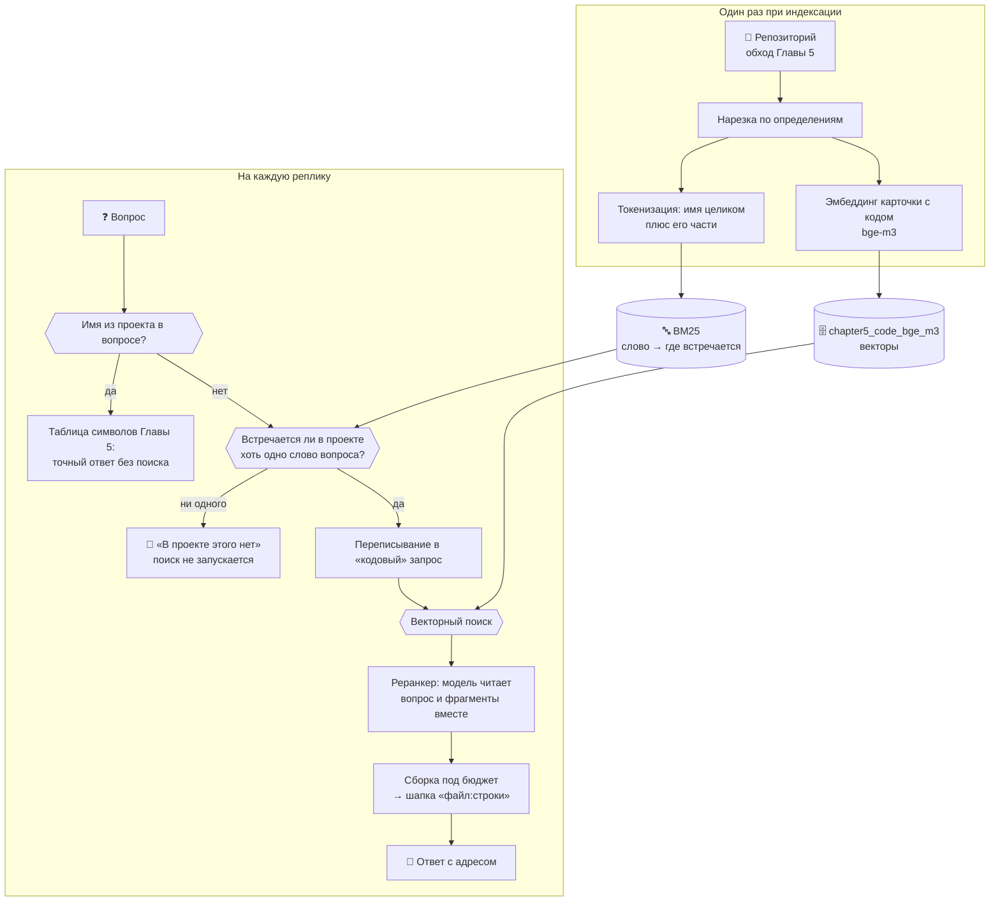

# 🔎 Глава 6. Улучшаем поиск: ноль, реранкер и модель, которая всё решала

> **Цель главы:** научить агента отвечать «в проекте этого нет» — и заодно выяснить, почему поиск Главы 5 работал вполсилы.

Агент Главы 5 отвечал на любой вопрос о коде — включая тот, ответа на который в проекте нет. Ранжирование всегда возвращает пятёрку самых похожих фрагментов, и отличить «вот ответ» от «вот пять наименее плохих» по виду выдачи нельзя. Здесь агент учится говорить «этого тут нет» — и опирается на проверяемый признак, а не на послушание модели.

*Для справки: под нулём дальше подразумевается нулевой ответ при ранжировании — когда поиск возвращает пустоту, а не список.*

Попутно выяснилось, что поиск Главы 5 упирался не в свои приёмы, а в модель эмбеддингов: замена `nomic-embed-text` на `bge-m3` подняла попадание с 1 из 12 до 10 из 12 — без строчки нового кода поиска.

Что добавляется:

* **ответ «в проекте этого нет»** — его даёт поиск по словам, у которого ноль есть по устройству: слово либо встречается в корпусе, либо нет;
* **реранкер** — второй проход модели по восьмёрке кандидатов, единственное место, где модель сидит внутри поиска и приносит пользу;
* **модель эмбеддингов посильнее** — то, что решило больше всего остального вместе взятого.



Главная мысль: **прежде чем улучшать ранжирование, спросите, есть ли у поиска ноль.** Система, которая всегда возвращает пять лучших результатов, на вопрос без ответа возвращает пять лучших неправильных — и по виду выдачи отличить этот случай нельзя.

---

## 🔍 Что делаем

Поиск по словам нужен здесь ради одного свойства — нуля; ранжировать им не надо, замеры ниже это показали.

### BM25: как устроен счётчик совпадений

BM25 — это формула, которая берёт запрос и кусок текста и выдаёт одно число: насколько этот кусок похож на то, что искали. Больше число — выше в выдаче. Больше она не делает ничего.

Ей тридцать лет, и она до сих пор по умолчанию считает релевантность в Lucene и Elasticsearch — то есть в движках, на которых работает поиск множества сайтов. Откуда взялось название и почему 25 — в [Википедии](https://ru.wikipedia.org/wiki/Okapi_BM25).

Из всей формулы для главы важна одна её часть: **вес слова тем выше, чем реже слово встречается в корпусе.** На индексе этого курса (1076 фрагментов) `text` есть в 234 фрагментах и весит 1.5, а «оценка» — в шести и весит 5.1. Совпадение по частому слову не сообщает почти ничего, по редкому — почти показывает пальцем.

Отсюда и правило, по которому агент отказывается отвечать. Считать надо **содержательные** слова вопроса, а не все подряд: «где», «реализован», «класс», «метод» есть в любом проекте с кодом, и засчитывать их как доказательство, что ответ существует, значит не отказать никогда. Поэтому слова, описывающие форму вопроса, из проверки выброшены — а «файл» намеренно оставлен, потому что в «где реализовано чтение файлов» файлы предмет, а не форма.

> **Отказ, когда ни одно содержательное слово вопроса не встречается в проекте ни разу.** Не «мало совпадений», а «совпадений нет вообще».

Правило работает и для корпуса документов Главы 4 — [те же двадцать строк](src/docgate.py) поверх другого корпуса. Список слов формы вопроса там свой: в вопросе к документации «класс» и «метод» — предмет, а не форма.

Отдельная морока — русская морфология. Для индекса «чтение» и «чтения» разные слова, и вопрос про чтение файлов однажды получил отказ именно поэтому. Лечится стеммингом ([Snowball](https://github.com/snowballstem/snowball), пакет `snowballstemmer`): у слова отрезается окончание, остаётся основа. Но класть в индекс одну основу нельзя — тогда «настроить» совпадёт с «настройкой», и отказов станет 4 из 14 вместо 6. Поэтому в индекс идут **обе формы**: ранжирование ищет по основе, отказ спрашивает про точную.


### Реранкер: второй взгляд, читающий вопрос и код вместе

И векторный поиск, и BM25 обрабатывают вопрос и фрагмент **порознь**. Вектор фрагмента посчитан заранее и о вопросе ничего не знает; список вхождений слова собран заранее тоже. Сравниваются уже готовые числа — потому поиск и быстрый: тысяча фрагментов, и ни один не пришлось прочитать в момент запроса.

Реранкер берёт пару «вопрос + фрагмент» целиком и потому видит то, чего не видит поиск: что имя в найденном фрагменте не определяется, а вызывается; что перед ним тест, а спрашивали про реализацию. И потому же он медленный. Отсюда порядок: поиск сужает тысячу до восьми, реранкер разбирается с восемью и оставляет пять.

Такие модели называют **cross-encoder**: в отличие от эмбеддера, кодирующего вопрос и текст порознь, эта пропускает их через себя вместе, крест-накрест. Готовые вроде `ms-marco-MiniLM` дают оценку пары за миллисекунды, но тянут `torch` и `sentence-transformers` — 2.5 ГБ на курс про 6 ГБ видеопамяти. Вместо них здесь [та же LLM, что отвечает пользователю](src/reranker.py#L185): один запрос, в котором она видит вопрос и всех кандидатов разом.

Работает это заметно. Мерить придётся не долей найденных ответов, а **средним обратным рангом**: смотрим, на каком месте оказался правильный ответ, и берём единицу, делённую на это место. Первое место даёт 1.0, второе 0.5, третье 0.33, не нашлось — 0; дальше усредняем по всем вопросам. Единица значит «всегда первым», ноль — «не нашлось ни разу». В таблицах он обозначен как MRR, от mean reciprocal rank.

На двенадцати вопросах главы:

| Модель | без реранкера | с реранкером | прибавка | секунд на вопрос |
| :--- | ---: | ---: | ---: | ---: |
| `qwen2.5:3b` | 0.40 | 0.45 | +0.05 | 2.0 |
| `qwen2.5-coder:7b` | 0.45 | 0.52 | +0.07 | 4.9 |
| `qwen2.5-coder:7b` (повтор) | 0.43 | 0.50 | +0.07 | 4.8 |
| `llama3.1:8b` | 0.37 | 0.46 | +0.09 | 5.4 |

Помогает на всех трёх, и у модели для кода прибавка повторилась в двух прогонах подряд — значит это не разброс. Видно и поимённо: у `llama3.1:8b` определение `is_safe_query` уехало с четвёртого места на первое, `build_context` — с пятого на второе.

Одна деталь про то, как это мерить. **Число попаданий у реранкера не меняется почти никогда** — он меняет порядок, а не состав. Мерить его долей найденных ответов бессмысленно; нужен средний обратный ранг. На этом я и споткнулся в первой версии замера, о чём ниже.

Отказ здесь ничего не роняет. Не ответила модель, вернула мусор, назвала номера, которых нет, — [порядок остаётся тем, что дал поиск](src/reranker.py#L173). Приём либо улучшает, либо не меняет ничего — как переписывание запроса в Главе 5.

---

## 🧪 Что не сработало

### Посылка двух глав была про модель, а не про поиск

Главы 5 и 6 стояли на том, что русский вопрос не находит английский код. Глава 5 это измерила (1 попадание из 12) и объяснила: `nomic-embed-text` на русском меряет «это вообще русская проза?», а не тему. Объяснение верное, вывод из него — нет: следует «возьмите модель, которая понимает русский», а не «постройте второй поиск».

| Поиск | `nomic-embed-text` (274 МБ) | `bge-m3` (1.2 ГБ) |
| :--- | ---: | ---: |
| только векторы | 1 / 12 · MRR 0.02 | **10 / 12 · MRR 0.56** |
| только BM25 | 5 / 12 · MRR 0.20 | 5 / 12 · MRR 0.20 |
| гибрид | 2 / 12 · MRR 0.12 | 8 / 12 · MRR 0.40 |

Строка BM25 совпала до сотых — эмбеддер её не касается. А векторная выросла вдесятеро, от одного `ollama pull`.

Чего смена модели **не** дала: ноль. `bge-m3` отвечает на вопрос про борщ так же охотно, как `nomic`. Это свойство косинуса, а не модели.

### Поиск по словам как способ ранжировать

Раз векторы починились, надо было проверить, нужен ли BM25 в ранжировании вообще. Шесть типов вопроса, `bge-m3`, средний обратный ранг:

| Тип вопроса | векторы | BM25 | гибрид |
| :--- | ---: | ---: | ---: |
| описание по-русски | **0.56** | 0.20 | 0.40 |
| описание с опечаткой | **0.47** | 0.23 | 0.40 |
| описание по-английски | **0.64** | 0.24 | 0.54 |
| точное имя | 0.81 | 0.57 | **0.90** |
| имя словами | **0.92** | 0.47 | 0.85 |
| описание и имя | **0.92** | 0.62 | 0.92 |

**BM25 не выигрывает ни в одной строке** — включая ту, ради которой затевался: на точном имени 0.57 против 0.81. Довод Главы 5 про `is_safe_query` не подтвердился: когда вопрос и есть это слово, векторы находят его все двенадцать раз и ставят выше.

Заодно видна его природа: BM25 ровный (0.20–0.62 по всем типам, смысла он не видит) и ломается там, где исчезает точный токен — разбейте `is_safe_query` на «is safe query», и он падает до 0.47, пока векторы держат 0.92. Его сила не в именах, а в буквальном совпадении.

### Слияние двух выдач

Идея, с которой глава начиналась: искать обоими способами и объединить результаты. Складывать оценки нельзя — шкалы несопоставимы, — поэтому складывают **места**: приём называется Reciprocal Rank Fusion, реализация в [`rrf`](src/fusion.py#L51) занимает двадцать строк. Фрагмент, найденный обоими поисками, получает два слагаемых и выходит вперёд.

В таблице выше гибрид выигрывает **одну строку из шести** — на точном имени. И именно этот случай Глава 5 закрывает таблицей символов до всякого поиска. В остальных пяти он между половинами.

Правило, которое стоит любых констант слияния: **сначала измерь каждую половину, потом складывай.** Слияние не чинит плохой поиск, оно его усредняет.

Код остался, включается через `AGENT_SEARCH_MODE=hybrid`.

### Отказ по весу: подгонка под удачную выборку

Одна из версий главы отказывала по порогу на вес лучшего совпадения — 8.0, и на двенадцати вопросах это давало идеальные 12 из 12.

Замер был подогнан, хоть и не нарочно: вопросы подбирались так, чтобы у каждого была ровно одна функция-ответ, и вышли слишком удобными. Стоило добавить восемь обычных вопросов, как зазор исчез — диапазоны перекрылись (о проекте 3.12–15.65, посторонние 0.00–7.22), и любой порог стал разменом:

| порог | ложных отказов | пойманных посторонних |
| ---: | ---: | ---: |
| 3.0 | 0 из 20 | 4 из 14 |
| 7.0 | 3 из 20 | 13 из 14 |
| 8.0 | **4 из 20** | 14 из 14 |

Живой прогон показал худший случай: «где реализовано чтение файлов» получил отказ, потому что слова «чтение» в коде нет — там «читает» и «чтения», а морфологию русского токенизатор не знает.

Порог остался ручкой `AGENT_NO_ANSWER`, выключенной. Заменило его правило без подгоняемого числа.

### Реранкер: мерил не ту конфигурацию

Ещё одна версия главы сообщала, что реранкер не даёт ничего. Замер был сломан: я давал ему восемь кандидатов и проверял попадание в первую **восьмёрку** — множество при перестановке не меняется, и число попаданий не могло сдвинуться в принципе. Агент работает иначе: восемь кандидатов, перестановка, пять в контекст, и там прибавка есть.

Урок не про реранкер: **замер должен воспроизводить ту конфигурацию, в которой приём работает.**

### Замер, который сломал сам себя

Первый прогон отказа дал **ноль отказов из двенадцати** посторонних вопросов, причём «как испечь шарлотку» получила вес 16.94 — выше любого настоящего вопроса о коде.

Список посторонних вопросов лежит в `chapter6/tests.py`, а это исходник проекта и индексируется наравне с остальными. Слово попало в корпус ровно тогда, когда я его туда записал. То же случилось потом ещё трижды — с выдуманным именем класса в комментариях и в докстроке теста. И то же со «старым» контрольным вопросом Главы 4: «Как приготовить борщ?» встречается в исходниках курса семь раз.

Отказ поэтому меряется на корпусе глав 0–5 — каким репозиторий был до этой главы. Оговорка к замеру, а не к приёму, но помнить о ней стоит всякому, кто строит поиск по корпусу, который сам же и описывает.

### Отказ не защищает вопросы, не похожие на вопросы о коде

Проверка стоит **внутри** ветки «вопрос про код», и вопрос, не узнанный как кодовый, до неё не доходит — уезжает в корпус документов Главы 4, где нуля по-прежнему нет.

Живой прогон: «где реализоано распознование изображений» с двумя опечатками не подошёл под маркер `реализов`, ушёл в документы и получил ответ «Распознавание изображений реализовано в главе 1 курса…». Выдумка от первого слова до последнего.

---

## 🛡️ Безопасность

**Личные данные попадали в индекс, вопреки тому, что написано в Главе 5.** Там сказано, что файлы из `.gitignore` в индекс не идут, «а значит `memory.json` с фактами о вас и `previous_session.json` с хвостом прошлого разговора». На деле шли: разбор `.gitignore` понимал только имена **папок**, а правила с косой чертой (`chapter3/memory.json`) молча выбрасывал. Имя, возраст и хвост прошлого разговора уезжали в модель эмбеддингов и ложились на диск в `chroma_db/` открытым текстом.

Нашлось это не проверкой безопасности, а по ложному отказу: слово «чтение» встретилось в корпусе ровно один раз — в записи предыдущего разговора. Починено в [`gitignore_entries`](../chapter5/src/languages.py#L122): папки и файлы разбираются отдельно, файлы отсекаются до чтения. Обход репозитория был 76 файлов, стал 72.

---

## 📐 Окно и бюджет

Окно то же, 8192 токена. Промпт вырос ещё на пятьсот токенов, и отдана за это снова история разговора.

| | Глава 5 | Глава 6 |
| :--- | ---: | ---: |
| Инструментов | 15 | 16 |
| Системный промпт | 4749 | 5249 |
| Бюджет истории | 2816 | 2316 |
| Из них на найденное | 1408 | 1158 |

Из пятисот токенов прироста 218 приходятся на **один few-shot пример** — тот, что показывает вызов `grep_code`. Это почти десятая часть всей истории разговора, отданная за три строки диалога в промпте. Глава 5 показала, что на 3B такие примеры решают, позовёт модель инструмент или нет, поэтому пример оставлен; но это тот случай, когда обмен виден в числах и его стоит держать в голове.

Один запрос к модели после этой главы:

```
┌─ system: промпт с описанием 16 инструментов ─ константа, 5249 токенов
├─ user:   [PREV_SESSION] пересказ прошлой сессии ── только по команде
├─ …       история разговора ──────────────── отбирается по смыслу
├─ user:   [TOOL_OUTPUT] найденный код или отказ ─── не больше 1158 токенов
└─ system: напоминание про правила ────────── константа

   chroma_db/chapter5_code ── векторы, на диске, собираются минутами
   BM25 в памяти процесса ─── слова, собираются за 0.7 с при запуске
```

Вторая половина индекса не требует ни модели, ни сети, поэтому и не хранится на диске: пересобрать её быстрее, чем следить, чтобы сохранённая не разъехалась с векторной.

---

## 🗺️ Три реплики агента целиком

Один прогон на `qwen2.5:3b` и `bge-m3`, три вопроса подряд в одном разговоре.

**Первый — то, ради чего глава.** Метод, которого в проекте нет:

```text
Вы: где реализован метод drawSalesChart?

🚫 Похоже, в проекте этого нет (лексический вес 9.1, слов найдено 0%,
   не встречаются: drawsaleschart, draw, sales, chart)
📊 Отправляем 4 сообщений, ~5457 токенов из 8192

✅ Ответ: Метод drawSalesChart не найден в проекте. Попробуйте уточнить
   запрос или проверить, не забыли ли вы написать его в коде.
```

Обратите внимание на **9.1**. Это вес лучшего лексического совпадения — выше, чем у половины настоящих вопросов о проекте. Набрали его слова «где», «реализован» и «метод», которые есть в любом файле с кодом. Порог по весу такой вопрос пропустил бы; правило «ни одного содержательного слова» отказало. Вся разница между двумя подходами на одном примере.

Поиск при этом не запускался: в контекст уехала одна строка о том, что искать нечего, а не пять «самых похожих» фрагментов кода.

**Второй — обычная работа:**

```text
Вы: где в коде оценивается количество токенов?

🔁 Запрос для поиска: где в коде оценивается количество токенов? estimate_tokens
📊 Отправляем 6 сообщений, ~6550 токенов из 8192

✅ Ответ: Метод drawSalesChart не найден в проекте. Однако, метод
   estimateTokens используется для оценки количества токенов в тексте.
   Он находится в файле chapter3/src/context.py с линиями 45-55.
```

Адрес верный: на строке 45 действительно `def estimate_tokens(text: str) -> int`. А вокруг адреса — две ошибки модели, и обе не про поиск.

Ответ начинается с фразы про `drawSalesChart` из **предыдущей** реплики: 3B зацепилась за историю разговора и приписала к новому ответу хвост старого. И имя переписано как `estimateTokens` — в проекте такого написания нет нигде, модель привела `estimate_tokens` к привычному ей camelCase. Правило системного промпта «номера строк бери только из шапок» модель выполнила; про имена такого правила там нет.

**Третий — то, что глава починила наполовину:**

```text
Вы: где встречается HISTORY_BUDGET?

📎 Точные вхождения «HISTORY_BUDGET»: 79
📊 Отправляем 8 сообщений, ~6022 токенов из 8192

✅ Ответ: Константа HISTORY_BUDGET используется в следующих местах файла
   chapter3/src/agent.py и файла chapter3/tests.py:
```

Вопрос «где встречается» — про буквы, а не про смысл, и векторному поиску его отдавать нельзя. До того как это исправили, тот же вопрос получал два фрагмента **про** бюджет истории, в которых самого имени нет ни разу, — и модель уверенно называла их местами, где константа встречается. Теперь ответ на такой вопрос собирает перебор файлов: 79 вхождений, каждое проверено.

В контекст уехало вот это:

```text
chapter3/agent.py:155: HISTORY_BUDGET = max(
chapter3/agent.py:165: HISTORY_BUDGET_RESUMED = max(200, HISTORY_BUDGET - …)
chapter3/agent.py:177: max_history_tokens=HISTORY_BUDGET_RESUMED if resume …
```

А в ответ попал файл `chapter3/src/agent.py`, которого в проекте не существует: модель вставила лишний `src/` в путь, который лежал перед ней в готовом виде. И оборвала перечисление на двоеточии, ничего после него не написав.

**Вывод тот же, что в Главе 5, и глава его не изменила.** Поиск можно довести до того, что в контексте лежат только верные адреса. Ответ от этого верным не становится: 3B перепишет имя, испортит путь и притащит хвост прошлой реплики. На таком железе правило остаётся прежним — **файлу верить можно, номеру строки только после проверки.**

---

## 🚀 Как запустить

Нужны Ollama, основная модель и модель эмбеддингов. Эта глава берёт другую модель эмбеддингов, чем главы 4 и 5, — понадобятся обе, если хотите запускать и те, и эту:

```bash
ollama pull qwen2.5:3b
ollama pull bge-m3            # эта глава
ollama pull nomic-embed-text  # главы 4 и 5
```

Запуск из корня проекта:

```bash
python -m chapter6.agent
```

При первом запуске векторный индекс кода надо собрать — команда `индекс кода` в диалоге, это минуты. Лексический собирается сам, за доли секунды, и командой не управляется: пересобрать его быстрее, чем проверять, не устарел ли он.

**Модель эмбеддингов поднимает сама глава:** `chapter6/src/__init__.py` при импорте переключает её на `bge-m3`. Главы 4 и 5 остаются на `nomic-embed-text`, и их числа воспроизводятся так, как там написано. Приём не новый — Глава 5 ровно так же переопределяет размер окна Главы 1. Явно заданная `AGENT_EMBED_MODEL` сильнее: если вы выбрали модель сами, глава не спорит.

Индекс при этом принадлежит модели: у `bge-m3` вектор из 1024 чисел, у `nomic-embed-text` из 768, и в одной коллекции они не уживутся. Поэтому имя модели входит в имя коллекции — `chapter5_code_bge_m3`. Индекс Главы 5 лежит рядом под своим именем и не затирается; запустили ту главу — работает он.

Команды диалога: `индекс кода` — сверить оба индекса, `код` — что в них лежит, `реранкер` — сколько раз его звали и сколько это заняло, `карта` — пересобрать карту проекта, `индекс`/`база` — корпус документов Главы 4, `продолжить` — поднять прошлый разговор, `забудь` — очистить историю, `выход`.

Переключатели для сравнения — все читаются один раз при импорте:

| Переменная | Что делает |
| :--- | :--- |
| `AGENT_EMBED_MODEL=nomic-embed-text` | взять эмбеддер Глав 4–5: на гигабайт меньше памяти, заметно хуже на русских вопросах |
| `AGENT_SEARCH_MODE=bm25` | искать только словами — без векторов и без индексации |
| `AGENT_SEARCH_MODE=hybrid` | слить обе выдачи по местам (замер не подтвердил) |
| `AGENT_RERANK=0` | выключает реранкер: выдача поиска идёт как есть, ответ на 2–5 секунд быстрее |
| `AGENT_NO_ANSWER=7` | добавляет отказ по весу: отказов больше, но появляются ложные |
| `AGENT_NO_ANSWER_SUPPORT=-1` | выключает отказ совсем: агент отвечает на любой вопрос |
| `AGENT_CODE_REWRITE=0` | выключает переписывание запроса (Глава 5) |
| `AGENT_CODE_AUTO=0` | выключает автопоиск: поиск только по решению модели |

Тесты:

```bash
python -m pytest chapter6/tests.py -q
```

Замеры главы (нужна Ollama, занимают минуты):

```bash
python -m pytest chapter6/tests.py -m slow -v -s
```

---

## ⚡ Замеры и производительность

Условия у всех замеров одни: одна машина (GTX 1660 SUPER, 6 ГБ), Ollama, корпус — исходники этого курса. Прогоняются командой `python -m pytest chapter6/tests.py -m slow -v -s`.

### Отказ «в проекте этого нет» — главный результат главы

Корпус: 1076 фрагментов (главы 0–5, без `chapter6/` — почему, разобрано выше). Двадцать вопросов, ответ на которые в коде есть, против четырнадцати посторонних. Правило: отказ, если ни одно содержательное слово вопроса в проекте не встречается.

| | Вопросов | Отказано |
| :--- | ---: | ---: |
| вопросы о проекте | 20 | **0** |
| посторонние вопросы | 14 | **6** |

Отказ получили: «как настроить кубернетес кластер», «где купить велосипед», «где настраивается виртуальный хост nginx», «как испечь шарлотку», «где реализовано кэширование в redis», «где в проекте авторизация по oauth».

Восемь посторонних прошли — у них нашлись отдельные слова: «сегодня» и «курс» есть в коде инструмента времени, «схема» — в JSON Schema, «логи» — в логировании. Ловить их пришлось бы порогом по весу, а он, как показано выше, отказывает и настоящим вопросам.

Сравните с тем, чем кончилась Глава 4: там шесть вопросов уместились в полосу близости шириной 0.05, и разделить их было нечем вообще.

Живой прогон показал, почему правило считает слова, а не вес: вопрос «где реализован метод drawSalesChart» набрал вес **7.9** — выше половины настоящих вопросов, — целиком за счёт слов «где», «реализован» и «метод». По весу он бы прошёл; по содержательным словам получил отказ.

**Отказ не зависит ни от модели эмбеддингов, ни от типа вопроса.** Это единственное число в главе, которое не поехало при смене `nomic` на `bge-m3`.

### Что решает модель эмбеддингов

Двенадцать русских вопросов без единого слова из кода, 236 фрагментов, попадание в топ-5 · средний обратный ранг:

| Поиск | `nomic-embed-text` | `bge-m3` |
| :--- | ---: | ---: |
| только векторы | 1 / 12 · 0.02 | **10 / 12 · 0.56** |
| только BM25 | 5 / 12 · 0.20 | 5 / 12 · 0.20 |
| гибрид | 2 / 12 · 0.12 | 8 / 12 · 0.40 |
| векторы + переписывание | 7 / 12 · 0.40 | 9 / 12 · 0.50 |
| BM25 + переписывание | 6 / 12 · 0.25 | 6 / 12 · 0.32 |
| гибрид + переписывание | 7 / 12 · 0.36 | 8 / 12 · 0.52 |

Одна замена в одной переменной окружения двигает результат сильнее, чем весь остальной код этой главы вместе взятый.

### Шесть типов вопроса

Те же двенадцать определений, но вопрос задан шестью разными способами. Средний обратный ранг, `bge-m3`:

| Тип вопроса | векторы | BM25 | гибрид | лучший |
| :--- | ---: | ---: | ---: | :--- |
| описание по-русски | **0.56** | 0.20 | 0.40 | векторы |
| описание с опечаткой | **0.47** | 0.23 | 0.40 | векторы |
| описание по-английски | **0.64** | 0.24 | 0.54 | векторы |
| точное имя | 0.81 | 0.57 | **0.90** | гибрид |
| имя словами | **0.92** | 0.47 | 0.85 | векторы |
| описание и имя | **0.92** | 0.62 | 0.92 | поровну |

Три вещи, которые видно только на такой разбивке.

**Английский вопрос лучше русского даже на `bge-m3`** — 0.64 против 0.56. Разрыв между русским вопросом и английским кодом, с которого начиналась Глава 5, существует; хороший эмбеддер его сокращает, но не закрывает.

**Опечатка бьёт по эмбеддеру, а не по BM25.** `nomic` падает с 0.02 до нуля, `bge-m3` — с 0.56 до 0.47, BM25 не шелохнулся. Но и с опечаткой `bge-m3` вдвое лучше BM25 без неё.

**Дописать имя к описанию — самый сильный ход в таблице.** 0.92, и это же объясняет, почему переписывание запроса из Главы 5 так помогало: оно превращало «описание» в «описание и имя», то есть переводило вопрос из худшей строки в лучшую.

### Что делать с вопросом перед поиском

Один вызов модели перед поиском можно потратить по-разному. Двенадцать вопросов, векторный поиск на `bge-m3`:

| Подготовка запроса | Попаданий | MRR | Вызовов модели |
| :--- | ---: | ---: | ---: |
| как есть | 10/12 | 0.56 | 0 |
| **переписывание в имена (Глава 5)** | **11/12** | **0.62** | 1 |
| перевод на английский | 9/12 | 0.53 | 1 |
| перевод и имена вместе | 11/12 | 0.70 | 2 |

Перевод в одиночку проиграл вопросу без обработки — и это не опровергает идею, а показывает разрыв между идеей и исполнением. Таблица типов выше даёт английскому вопросу 0.64, но там переводил я, вручную. Здесь переводит `qwen2.5:3b`, и его переводы грамотные, но мимо: «trimmed by budget» вместо «trimmed to a token budget», «launches» вместо «runs». Теряются ровно те слова, по которым фрагмент находится.

Переписывание в имена оставлено включённым. Обе прибавки при этом на границе шума — см. «Границы замеров».

### Реранкер на трёх моделях

Средний обратный ранг; поиск отдаёт восемь кандидатов, в контекст едут пять.

| Модель | без реранкера | с реранкером | прибавка | секунд на вопрос |
| :--- | ---: | ---: | ---: | ---: |
| `qwen2.5:3b` | 0.40 | 0.45 | +0.05 | 2.0 |
| `qwen2.5-coder:7b` | 0.45 | 0.52 | +0.07 | 4.9 |
| `qwen2.5-coder:7b` (повтор) | 0.43 | 0.50 | +0.07 | 4.8 |
| `llama3.1:8b` | 0.37 | 0.46 | +0.09 | 5.4 |

Помогает на всех трёх, и у модели для кода прибавка повторилась в двух прогонах подряд. Разброс базовой линии между моделями — это не реранкер, а переписывание запроса: модель для кода придумывает более правдоподобные имена и находит 9–10 определений из 12 против 7–8 у остальных.

### Время и объём

| Что | Сколько |
| :--- | :--- |
| Разбор 56 файлов → 1283 фрагмента | 0.36 с |
| Лексический индекс поверх них | 0.37 с |
| Словарь индекса | 9379 слов |
| Один поиск по словам | 0.1 мс |
| Один вектор запроса, `bge-m3` | 128 мс |
| Один вектор запроса, `nomic-embed-text` | 78 мс |
| Переписывание запроса (Глава 5) | 0.6 с |
| Один запрос к реранкеру | 2.0–5.4 с |

Разница между поиском по словам и векторным — тысяча раз, 0.1 мс против 128. Но в конвейере, где переписывание занимает 0.6 с, а реранкер до пяти, эта тысяча ничего не решает: выигрыш на одном векторном запросе теряется в тени любого обращения к модели. Это стоит помнить всякий раз, когда хочется заменить обращение к модели чем-то быстрым, — считать надо весь конвейер, а не одно звено.

### Границы замеров

Всё выше снято на одном корпусе и наборах из 12, 20 и 14 вопросов. Это мало: разница между 7 и 8 попаданиями — один вопрос, и делать из неё вывод нельзя. Что на таком объёме читается надёжно — разрывы втрое и больше (1 против 10) и полное отсутствие ложных отказов на двадцати вопросах; что не читается — разница в один-два вопроса и в 0.05–0.08 среднего обратного ранга.

По этому правилу прибавка реранкера (+0.07) заявлена только потому, что повторилась в двух прогонах подряд, а превосходство «перевода и имён» над одним переписыванием (+0.08) — не заявлено вовсе.

Вопросы основного набора подобраны так, чтобы в них не было ни одного слова из кода: это худший случай для поиска по словам и лучший для эмбеддера. Именно поэтому в главе появилась разбивка по шести типам — один тип вопроса оказался плохим основанием для выводов, и первые версии этой главы на нём и погорели.

Замеры с участием LLM плавают между прогонами: строка «векторы + переписывание» на `nomic` давала 5, 6 и 7 из 12 в разных прогонах одной и той же конфигурации.

---

## 🔄 Что изменилось с Главы 5

| | Глава 5 | Глава 6 |
| :--- | :--- | :--- |
| Модель эмбеддингов | `nomic-embed-text`, 274 МБ | `bge-m3`, 1.2 ГБ — поднимает эта глава |
| Определение в первой пятёрке | 6–7 из 12 | 10–11 из 12 |
| Чем ищем | близостью векторов | ей же, но моделью, знающей русский |
| Второй индекс | — | слова в памяти, 0.7 с на сборку |
| Ответ «этого нет» | послушание модели | проверяемый факт: слов вопроса нет в проекте |
| Порядок выдачи | как дал поиск | переставляет реранкер |
| Точное вхождение строки | — | `grep_code` |
| Инструментов | 15 | 16 |
| Системный промпт | 4749 токенов | 5249 |
| Бюджет истории | 2816 | 2316 |

Строка, которой в таблице быть не должно было: **лучший прирост качества поиска за главу дала смена модели эмбеддингов, а не код этой главы.**

---

## ⚠️ Что осталось нерешённым

Три долга ждут будущих глав:

**`grep_code` модель не зовёт.** Автопоиск кладёт фрагменты в контекст раньше, и 3B переключается в режим «отвечай по фрагментам». Вопросы «где встречается X» это обходят — они узнаются по словам и отвечаются перебором файлов до модели, — но список этих слов такой же неполный, как все списки слов в курсе.

**Маршрутизация держится на списках слов** — долг ещё Главы 5. Падеж, синоним, опечатка уводят вопрос не туда, и отказ тут не помогает: он стоит уже внутри выбранной ветки.

**Модель портит верные адреса.** Поиск довели до того, что в контексте лежат только проверенные вхождения, — и в ответе всё равно появился путь `chapter3/src/agent.py`, которого нет, а `estimate_tokens` превратилось в `estimateTokens`. Поиском это не лечится.

А это не долги, а границы приёмов — их стоит знать, но чинить нечего:

**Ноль узкий** — шесть посторонних вопросов из четырнадцати. Замер показал, что порога, который ловил бы больше и не терял настоящих ответов, не существует: распределения перекрываются.

**Английский вопрос лучше русского** — 0.64 против 0.56 даже на `bge-m3`. Перевод помог бы, но `qwen2.5:3b` переводит хуже, чем не переводить: потолок приёма 0.64, модель даёт 0.53.

**`bge-m3` стоит гигабайт видеопамяти и второго индекса.** На 4 ГБ вместе с основной моделью уже не поместится. Это размен, и он сделан осознанно.

**Лексический индекс собирается заново при каждом запуске** — 0.7 с на 1283 фрагментах. Станет проблемой на корпусе в сто раз больше.

---

## 🏠 Домашняя работа

**Задание: соберите агента, который отвечает на вопросы по вашим данным.** например данные Excel. Берите свои выгрузки из бухгалтерии, прайс-листы поставщиков, табели, отчёты по продажам за несколько лет.

Что в нём должно быть:

* **точный поиск рядом с приблизительным.** По колонкам и артикулам ищут точным совпадением, по описанию — по смыслу. Что чем искать, решайте замером, а не на глаз;
* **ответ «в таблицах этого нет».** Заголовок, которого нет ни в одном файле, — это проверяемый факт, и агент обязан его называть, а не подбирать похожий;
* **адрес у каждого ответа** — файл, лист, ячейка. Без него ответ нельзя проверить, а на маленькой модели проверять придётся;
* **набор вопросов с известными ответами** — хотя бы десяток, где вы сами знаете правильную ячейку. Без него «стало лучше» проверить нечем.

### Пример промпта для LLM-помощника

```text
Контекст. Windows, установлена Ollama, модели qwen2.5:3b и bge-m3.
У меня папка с Excel-файлами: ~200 файлов, выгрузки продаж по месяцам.
Структура у всех одна: лист «Продажи», шапка в строке 3, колонки
«Артикул», «Наименование», «Категория», «Кол-во», «Цена», «Сумма», «Менеджер».
Есть и чужие файлы другой структуры — их надо распознавать и пропускать.

За основу возьми агента Главы 6 курса github.com/io982/firstAgent. Сначала
прочитай эти файлы, потом планируй:
  chapter2/src/tools.py      — декоратор @tool, сборка схемы, execute_tool
  chapter3/src/context.py    — Conversation, бюджет истории, trim_by_tokens
  chapter4/src/embeddings.py — эмбеддинги, кэш, батчи
  chapter6/src/bm25.py       — точный поиск по словам, обратный индекс
  chapter6/src/hybrid.py     — lexical_signal и ответ «в проекте этого нет»
  chapter6/agent.py          — маршрутизация: что кладём в контекст до модели
Устройство перенеси в новый проект, имена функций сохрани.

Задача. Агент отвечает на вопросы по папке с таблицами: «сколько продали
артикула A-1042 в марте», «у каких менеджеров упали продажи», «в каком файле
есть категория „садовая техника“».

Инструменты: scan_folder(), find_column(name), find_value(text),
query_rows(filters), aggregate(column, by), describe_file(path),
answer_source(). Восемь максимум — модель 3B.

Требования, которые важнее красоты кода:

1. Считает pandas, а не модель. Инструмент возвращает готовое число или
   таблицу на десять строк. Двести файлов в контекст не влезут, а groupby
   посчитает их за секунду.
2. Индексируется НЕ содержимое ячеек целиком, а карточка файла: имя, лист,
   заголовки колонок, тип каждой колонки, диапазон дат, число строк,
   уникальные значения справочных колонок (категория, менеджер), если их
   меньше сотни. Поиск идёт по карточкам, а данные читаются уже адресно.
3. Точное совпадение и смысл — разные пути. Артикул, название колонки,
   имя менеджера ищутся точным совпадением по индексу значений. Вопрос
   «где отчёты по садовой технике» — эмбеддингами по карточкам.
   Что и когда — определи замером, а не догадкой.
4. Ответ «такого нет» обязателен и опирается на проверку, а не на модель:
   если запрошенной колонки нет ни в одной карточке, так и скажи, перечислив
   похожие имена. Ошибиться в сторону «не знаю» лучше, чем подобрать
   похожую колонку и посчитать по ней.
5. Чужой файл распознаётся по карточке и пропускается с объяснением,
   а не роняет индексацию. То же для битого файла, файла с паролем
   и листа без шапки в третьей строке.
6. Каждый ответ несёт адрес: файл, лист, диапазон строк. Числа берутся
   только из вывода инструментов — правило Главы 5 про номера строк
   здесь работает так же.
7. Содержимое ячеек — недоверенные данные. Ячейка с текстом «игнорируй
   предыдущие инструкции» должна приехать в контекст данными: гони через
   sanitize_tool_output, как в Главе 3.
8. Вывод любого инструмента не длиннее ~1500 символов, обрезка
   проговаривается в тексте.

Замер сделай частью проекта, не «потом»:
  * файл с двадцатью вопросами и правильными ответами (файл, лист, ячейка
    или число) — это и есть критерий «стало лучше»;
  * прогон печатает: сколько ответов верных, сколько отказов на вопросах
    без ответа, сколько ложных отказов на настоящих вопросах;
  * сравни на нём хотя бы две конфигурации: только точный поиск и точный
    плюс эмбеддинги. Если вторая не выигрывает — не усложняй.

Тесты пиши сразу:
  * pytest, быстрые тесты без Ollama и без настоящей папки — маленькие
    xlsx собирай в tmp_path прямо в тесте;
  * отдельным тестом: чужая структура пропущена, битый файл не уронил
    индексацию, ячейка с инъекцией приехала обёрнутой;
  * тесты с живой моделью помечай @pytest.mark.integration.

Порядок. Сначала покажи план и список инструментов с сигнатурами, дождись
подтверждения. Потом чтение и карточки файлов с тестами. Потом поиск
с тестами и замером. Потом агент. После каждого шага пиши, чем это
запустить и что я должен увидеть.

Готово — это когда: на двадцати вопросах замер печатает числа; вопрос
про несуществующую колонку получает «такого нет» с перечислением похожих;
в каждом ответе есть файл и лист; чужие файлы перечислены отдельно
с причиной пропуска.
```

### Из чего он собран

* **Карточка файла вместо содержимого** (пункт 2). Прямая пересадка карточки фрагмента из Главы 5: индексируется описание, а данные читаются адресно. Двести таблиц по десять тысяч строк — это два миллиона строк, и никакой индекс такого не переживёт, а двести карточек переживёт любой.
* **Два поиска с разными задачами** (пункт 3) и **требование замерить, что чем искать**. Главный урок этой главы: не решайте это на глаз. Артикул `A-1042` — тот самый случай точного совпадения, ради которого в главе появился BM25; «садовая техника» — случай для эмбеддингов.
* **Отказ как обязательное требование** (пункт 4). Без него агент подберёт похожую колонку и посчитает сумму не по тому полю — и вы это заметите не сразу. Формулировка «ошибиться в сторону „не знаю“ лучше» — та самая однобокая осторожность из раздела про ноль.
* **Набор вопросов с известными ответами.** Двадцать вопросов, где вы знаете правильную ячейку, — это единственное, что отличает «мне кажется, стало лучше» от результата. И это же ловит ошибку в самом замере: если числа выглядят слишком хорошо, посмотрите на вопросы, а не радуйтесь.
* **Сравнение двух конфигураций** и «если вторая не выигрывает — не усложняй». Эта глава построила слияние двух поисков и выбросила его по замеру. Дешевле проверить сразу.
* **Ячейки как недоверенные данные** (пункт 7). Excel-файл вам прислали — значит его содержимое написали не вы.

### Что проверить у себя

1. Вопрос про колонку, которой нет ни в одном файле, получает «такого нет» и список похожих имён — а не посчитанную сумму по соседней колонке.
2. Файл чужой структуры попадает в список пропущенных с причиной, а не в индекс.
3. Каждый ответ с числом несёт файл и лист; открываете — число сходится.
4. Замер печатает три числа: верных ответов, отказов на вопросах без ответа, ложных отказов. Все три меняются, когда вы что-то меняете в поиске.

Четвёртый пункт — главный. Если после правки поиска числа не двинулись, вы либо не то правили, либо не то мерите.

---

## 🎯 Итог главы

Агент научился:

* ✅ **отвечать «в проекте этого нет»** — и называть, каких именно слов вопроса не нашлось. Не по послушанию модели, а по проверяемому признаку: 6 отказов из 14 посторонних вопросов, ни одного ложного на 20 настоящих;
* ✅ находить нужное определение в **10–11 случаях из 12** против 6–7 в Главе 5;
* ✅ отвечать на «где встречается X» перебором файлов: адреса проверены, а не найдены по похожести;
* ✅ переставлять найденное вторым проходом модели — средний обратный ранг растёт на 0.05–0.09.

Чему научила глава:

**Ноль важнее ранжирования.** Косинусная близость ранжирует, но не находит: она сравнивает фрагменты между собой и не знает, отвечает ли лучший из них на вопрос вообще. Порог по значению, нормировка на среднее, просьба в промпте — всё упирается в это, и смена модели эмбеддингов не помогает тоже. Ноль есть только у поиска по словам, и один сигнал с настоящим нулём даёт больше, чем удвоение качества ранжирования.

**Прежде чем строить обход, проверьте, не сломано ли то, что вы обходите.** Полторы главы стояли на утверждении «русский вопрос не находит английский код». Оно оказалось верным про одну модель эмбеддингов весом 274 МБ: замена её на многоязычную подняла попадание с 1 из 12 до 10 из 12 без строчки нового кода. Признак был на виду — компонент показывал результат, близкий к случайному, а это почти всегда сломанная деталь, а не трудная задача.

**Замер — такой же код, и ошибки в нём такие же.** Три вывода этой главы пришлось переписать: порог оказался подгонкой под удачную выборку, «реранкер не помогает» — следствием не той конфигурации, а список посторонних вопросов сам себя обезвредил, попав в индекс. Разница с обычным кодом в том, что ошибка в замере не падает с исключением, а выглядит как результат.

|[Назад](../chapter5/README.md) | [📚 Оглавление](../README.md) | Далее: Глава 7 (в работе)|
