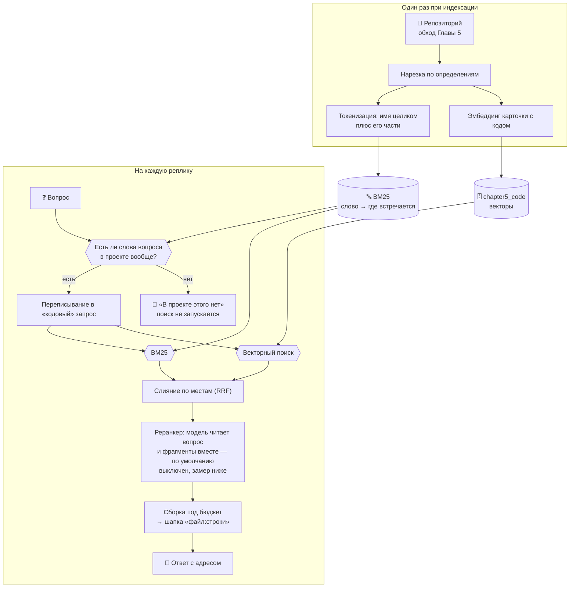

# 🔎 Глава 6. Гибридный поиск: у ответа появляется ноль

> **Цель главы:** научить агента находить код по точному совпадению слов — и, что важнее, научить его отвечать «в проекте этого нет».

[Глава 5](../chapter5/README.md) закончилась двумя незакрытыми долгами, и оба — про одно и то же свойство векторной близости.

Первый: **близость слепа к точному совпадению**. `is_safe_query` не находится вопросом, в котором нет слова `is_safe_query`, — хотя по индексу оно ищется буквальным сравнением за миллисекунды.

Второй, он же долг Главы 4: **порога «ответа нет» не существует**. Вопрос «Как приготовить борщ?» получил на корпусе документов лучший фрагмент с близостью 0.743 — выше, чем четыре релевантных вопроса из пяти. Все шесть вопросов уместились в полосу шириной 0.05. Отказ держался на послушании модели («в найденных фрагментах ответа нет — так и скажи»), и держался не всегда.

Оба долга — одно и то же. Косинусная близость **ранжирует, но не находит**: она говорит, что этот фрагмент похож больше остальных, и не говорит, похож ли он вообще. У неё нет нуля.

Лексический поиск даёт ровно то, чего у близости нет: слово запроса либо встречается в корпусе, либо нет. Если не встречается ни одно — возвращать нечего, и это содержательный ответ, а не сбой.



Главная мысль: **два поиска нужны не потому, что вместе они точнее, а потому, что ошибаются в разных местах**. У векторного нет нуля, но он переживает переформулировку. У лексического есть ноль, но он не знает синонимов. Складывать их стоит там, где важны обе половины.

---

## 🔍 Что делаем

### Что считать словом в исходнике

Обычная текстовая токенизация на коде работает плохо, и видно это на одном имени:

```
обычная      is_safe_query  →  is_safe_query
наша         is_safe_query  →  is_safe_query, safe, query
```

Первая строка находит функцию только по имени целиком. Вторая находит её ещё и вопросом «безопасность query» — потому что имя [разбирается на слова](src/lexical.py#L85) тем же разбором, что и карточка фрагмента Главы 5. Целое имя при этом остаётся токеном и весит больше всех: оно встречается в считанных фрагментах, а `query` — в сотне с лишним.

Два решения, которые стоит проговорить.

**Пунктуация выброшена.** Скобка есть почти в каждом фрагменте кода, её вес близок к нулю, и на ранжирование она не влияет — зато заняла бы половину индекса.

**Служебные слова выброшены, и русские тоже.** Вот это не про размер индекса, а про то, на чём держится весь порог главы. Докстроки и комментарии в этом проекте написаны по-русски, поэтому вопрос «как приготовить борщ» без вычистки слова «как» совпал бы с половиной корпуса — и ноль перестал бы быть нулём.

### BM25: почему редкое слово весит больше частого

[Формула](src/bm25.py#L131) складывается из трёх частей, и каждая чинит свою беду.

| Часть | Что делает | Что было бы без неё |
| :--- | :--- | :--- |
| **TF**, частота в документе | Чем чаще слово, тем документ релевантнее — но не линейно, рост насыщается | Десять упоминаний считались бы в десять раз лучше одного |
| **IDF**, редкость в корпусе | Редкое слово весит много, частое почти ничего | `def` и `return` решали бы всё |
| Поправка на длину | В длинном фрагменте слово встречается «само собой» чаще | Поиск всегда вытаскивал бы файлы-простыни |

Главная здесь — IDF, и на настоящем индексе курса (1233 фрагмента) видно, насколько разброс велик:

| Слово | В скольких фрагментах | Вес |
| :--- | ---: | ---: |
| `text` | 257 | 1.57 |
| `query` | 149 | 2.11 |
| `chunk` | 121 | 2.32 |
| `calculator` | 61 | 3.00 |
| `token` | 18 | 4.19 |

Слово, встречающееся в каждом пятом фрагменте, весит почти втрое меньше слова из восемнадцати. Именно это делает лексический поиск пригодным для кода, где половина текста — ключевые слова языка.

Внутри — обратный индекс: слово → в каких фрагментах оно есть. Перебор всех фрагментов на каждый запрос — это O(N·|Q|); [обратный индекс](src/bm25.py#L153) трогает только те, где слово запроса встречается, — на редком имени два фрагмента из тысячи.

### Слияние: складываем места, а не оценки

Первое, что приходит в голову, — сложить оценки с весами:

```python
score = 0.5 * близость + 0.5 * bm25      # так делать не надо
```

Ловушки две, и обе не видны, пока не посмотришь на числа.

**Шкалы несопоставимы.** Близость лежит в отрезке [0, 1] и на этом корпусе почти всегда между 0.6 и 0.8. BM25 ничем не ограничен сверху: его значение зависит от размера корпуса и редкости слова и на точном совпадении имени доходит до 20. Привести к общей шкале не помогает, а меняет одну беду на другую: нормировка по максимуму внутри выдачи делает лучший результат любого списка равным единице — и отличный, и лучший из плохих.

**Отсутствие в списке — не ноль.** Фрагмент, который нашёл только BM25, получил бы близость 0.0, то есть штраф, будто векторный поиск его отверг. На деле он просто не попал в двадцатку.

[Reciprocal Rank Fusion](src/fusion.py#L51) обходит обе ловушки, потому что складывает **не оценки, а места**:

```
score(фрагмент) = Σ  1 / (k + место в списке)
```

Сумма берётся по тем спискам, где фрагмент вообще есть, — значит приводить шкалы друг к другу не нужно вовсе. Фрагмент, найденный обоими поисками, получает два слагаемых и обгоняет тех, кого нашёл только один. Это и есть нужный сигнал: **согласие двух разных поисков**.

Константа `k = 60` — из статьи, где RRF предложен. Она задаёт, насколько резко первые места отрываются от остальных: при 60 разница между первым и вторым местом (1/61 против 1/62) мала, и решает не место внутри списка, а то, в скольких списках фрагмент нашёлся.

### Реранкер: третий взгляд, читающий вопрос и код вместе

И векторный поиск, и BM25 обрабатывают вопрос и фрагмент **порознь**. Вектор фрагмента посчитан заранее и о вопросе ничего не знает; список вхождений слова собран заранее тоже. Сравниваются уже готовые числа — потому поиск и быстрый: тысяча фрагментов, и ни один не пришлось прочитать в момент запроса.

Реранкер работает наоборот: берёт пару «вопрос + фрагмент» целиком. Поэтому он видит то, чего не видит поиск: что имя в найденном фрагменте не определяется, а вызывается; что перед ним тест, а спрашивали про реализацию. И поэтому же он медленный — каждая пара отдельная работа. Отсюда порядок: сначала поиск сужает тысячу до двадцати, потом реранкер разбирается с восемью.

Обычно это делают **cross-encoder** — небольшой моделью вроде `ms-marco-MiniLM`, обученной ровно на эту задачу и дающей оценку пары за миллисекунды. Здесь её нет: она тянет `torch` и `sentence-transformers`, около 2.5 ГБ, на курс про 6 ГБ видеопамяти, где память уже занята основной моделью и моделью эмбеддингов. Вместо неё — [та же LLM, что отвечает пользователю](src/reranker.py#L170): один запрос, в котором она видит вопрос и всех кандидатов разом и расставляет их по порядку.

Это заменитель, а не замена, и разницу видно по времени: миллисекунды против секунд на вопрос.

Отказ здесь ничего не роняет. Не ответила модель, вернула мусор, назвала номера, которых нет, — [порядок остаётся тем, что дал поиск](src/reranker.py#L158). Приём либо улучшает, либо не меняет ничего — как переписывание запроса в Главе 5.

Забегая вперёд: на замере главы он не изменил **ничего**, поэтому по умолчанию выключен. Разбор — в разделе «Что не сработало».

### Порог: где у поиска появляется ноль

На практике вопрос почти никогда не промахивается целиком. В «как настроить кубернетес кластер» слов «настроить» и «кластер» в проекте нет, а вот в «какой сегодня курс доллара» слова «сегодня» и «курс» есть — в коде живёт инструмент текущего времени. Поэтому смотрим не на факт совпадения, а на [вес лучшего фрагмента](src/hybrid.py#L156).

Порог считается по **исходному** вопросу, а не по переписанному. Переписывание Главы 5 придумывает правдоподобные английские имена, и на вопросе про борщ модель выдаст что-нибудь вроде `cook recipe soup` — слова, которых в проекте тоже нет, но проверять надо не их.

Осторожность намеренно однобокая. Ложное «не знаю» на настоящем вопросе — потерянный ответ; ложное «знаю» на постороннем возвращает нас к поведению Главы 5, то есть не хуже, чем было. Поэтому [порог](src/hybrid.py#L171) поставлен ближе к посторонним вопросам, чем к настоящим.

Отказ при этом называет, чего именно не нашлось:

```
🚫 Похоже, в проекте этого нет (лексический вес 4.4, слов найдено 33%,
   не встречаются: кэширование, redis)
```

«В проекте нет упоминаний: кэширование, redis» — это ответ. «Ничего не найдено» — отписка.

### Один новый инструмент, а не пять

Глава 5 оставила долг другого рода: системный промпт вырос до 4749 токенов из 8192, и на историю разговора осталось меньше трети окна. Каждый инструмент уезжает в промпт описанием и сигнатурой, поэтому добавлять их по привычке больше нельзя.

`search_code` поэтому не добавляется, а **замещается**. Реестр Главы 2 — обычный словарь «имя → функция», и повторная регистрация под тем же именем меняет реализацию, не трогая ни промпт, ни число инструментов. Модель по-прежнему видит `search_code`, а под ним теперь гибридный поиск.

Добавляется один — [`grep_code`](src/tools.py#L112), точное вхождение строки в файлах проекта. Ему здесь место потому, что это третий, самый прямолинейный способ искать, и у него, как и у BM25, есть настоящий ноль. Таблица символов Главы 5 находит **определения** по имени; `grep_code` находит любое упоминание где угодно — в теле функции, в комментарии, в строке сообщения об ошибке. На вопрос «откуда берётся вот это сообщение» ни поиск по смыслу, ни таблица символов не отвечают, а точное вхождение отвечает сразу и без модели.

---

## 🧪 Что не сработало

Главное, что стоит сказать про эту главу: **её заглавная идея не выиграла**. Гибридный поиск не обогнал свою лучшую половину, реранкер не изменил ничего, а долг Глав 4 и 5 закрыла побочная деталь — то, что у BM25 есть ноль. Всё это замеры, и они собраны здесь.

### Слияние: гибрид не лучше чистого BM25

Двенадцать вопросов, 235 фрагментов, тот же набор, что в замерах Главы 5:

| Режим | Определение в первой пятёрке | MRR |
| :--- | :---: | ---: |
| только векторы | 1 / 12 | 0.02 |
| только BM25 | 5 / 12 | 0.20 |
| гибрид (RRF) | 2 / 12 | 0.12 |
| векторы + переписывание запроса | 5 / 12 | 0.33 |
| **BM25 + переписывание** | **8 / 12** | **0.42** |
| гибрид + переписывание | 7 / 12 | 0.40 |

Гибрид оказался **между** своими половинами, а не над ними. Причина видна в первой строке: векторный поиск на этом корпусе даёт одно попадание из двенадцати, то есть почти шум. RRF награждает согласие двух поисков, но когда один из них угадывает, согласие — тоже угадывание.

Отсюда правило, которое стоит любых констант слияния: **сначала измерь каждую половину, потом складывай**. Гибрид не чинит плохой поиск, он его усредняет.

Разница между гибридом и чистым BM25 — один вопрос из двенадцати, то есть ни о чём; поэтому режим оставлен переключателем `AGENT_SEARCH_MODE`, а по умолчанию стоит гибрид как тема главы. Заметен другой разрыв: **и то, и другое заметно лучше чистых векторов**, а лучшая строка таблицы обгоняет всё, что Глава 5 получала на своих 6–7 из 12.

### RRF против взвешенной суммы: разницы нет

Половина текста выше объясняет, почему складывать места правильнее, чем складывать оценки. Замер этого не подтвердил:

| Способ слияния | Определение в первой пятёрке | MRR |
| :--- | :---: | ---: |
| по местам (RRF) | 2 / 12 | 0.12 |
| по нормированным оценкам | 2 / 12 | 0.12 |

Совпадение до последней цифры. Объяснение то же, что абзацем выше: разница между способами слияния не может быть видна, когда одна из сливаемых выдач почти случайна. Аргументы против взвешенной суммы остаются верными — но на этом корпусе они ничего не меняют, и притворяться иначе незачем.

### Реранкер: двенадцать запросов к модели за ноль

| | Определение в первой восьмёрке | MRR |
| :--- | :---: | ---: |
| гибрид без реранкера | 7 / 12 | 0.40 |
| гибрид с реранкером | 7 / 12 | 0.38 |

Ни одного нового попадания. Единственное, что реранкер поменял, — вопрос про нарезку документа уехал со второго места на четвёртое. Двенадцать запросов к модели, 33.6 с, 2.8 с на вопрос; разбор ответа при этом не сбоил ни разу — схема `{"order": [...]}` сработала все двенадцать раз, дело не в парсинге.

Причина, скорее всего, в размере модели: расставить восемь фрагментов кода по релевантности — задача на понимание кода, а 3B её не тянет. Настоящий cross-encoder, обученный ровно на ранжирование, вёл бы себя иначе — но его в главе нет, и утверждать за него нельзя.

Поэтому `AGENT_RERANK=0` по умолчанию. Код остался: приём стандартный, включается одной переменной, и на другой модели заслуживает повторного замера.

### Замер, который сломал сам себя

Отдельная история, стоящая того, чтобы её рассказать.

Первый прогон порога дал **ноль отказов из двенадцати** посторонних вопросов. Причём вопрос «как испечь шарлотку» получил лексический вес 16.94 — выше, чем любой настоящий вопрос о коде.

Разгадка в том, где лежит список посторонних вопросов. Он лежит в `chapter6/tests.py`, а `chapter6/tests.py` — исходник этого проекта, и индексируется наравне с остальными. Слово «шарлотка» попало в корпус ровно в тот момент, когда я его туда записал; лексический поиск нашёл этот самый файл первым и был совершенно прав.

```
'как испечь шарлотку'  →  chapter6/tests.py   16.94
'где купить велосипед' →  chapter6/tests.py   15.65
```

Та же история со «старым» контрольным вопросом Главы 4: «Как приготовить борщ?» встречается в исходниках курса **семь раз** — в комментарии `chapter4/src/knowledge.py`, где разбирается этот самый замер, и в тестах трёх глав. Классический пример «вопроса, ответа на который в базе нет» перестал им быть, пока про него писали.

Лечится это тем, что порог меряется на корпусе глав 0–5 — на том, каким репозиторий был до этой главы. Это оговорка к замеру, а не к приёму: в обычном проекте «как испечь шарлотку» в исходниках не встречается. Но помнить об этом стоит всякому, кто строит поиск по корпусу, который сам же и описывает.

### Порог не защищает вопросы, не похожие на вопросы о коде

Проверка на отсутствие стоит **внутри** ветки «вопрос про код». Реплика «как настроить кубернетес кластер» под маркеры кода не подходит вовсе, поэтому до порога не доходит: она уезжает в корпус документов Главы 4, где никакого нуля по-прежнему нет. Порог работает там, где агент уже решил искать по коду, — то есть закрывает половину поверхности, а не всю.

---

## 🛡️ Безопасность

Поверхность атаки глава почти не меняет: индексируется тот же репозиторий тем же обходом Главы 5, наружу по-прежнему ничего не уходит, проверка на инъекцию стоит первой. Но две вещи стоит назвать.

**Лексический индекс не ходит в модель.** У векторного индекса есть свойство, о котором Глава 5 предупреждала: текст всех фрагментов уезжает в Ollama и ложится на диск в `chroma_db/` — вторая копия исходников в открытом виде. У лексического этого нет вовсе: он живёт в памяти процесса, собирается из файлов при запуске и умирает вместе с ним. На вопрос «а что если индексируемый код секретный» половина ответа теперь звучит лучше, чем в Главе 5.

**Порог сужает поверхность, а не расширяет.** Вопрос, слов которого в проекте нет, теперь **не доходит до поиска вообще** — в контекст модели не попадает ни одного фрагмента. Раньше на такой вопрос уезжали пять «самых похожих» фрагментов кода, и модель отвечала по ним. Меньше постороннего кода в контексте — меньше поводов для выдумывания.

**А вот `grep_code` показывает содержимое строк.** Он возвращает не имя и адрес, как таблица символов, а саму строку файла. Обход тот же, значит `.gitignore` и потолок размера файла работают, — но `.env.example` в индексе есть намеренно, и `grep_code` покажет его строки целиком. Пока в примере лежат примеры, это ровно то, что нужно; с настоящим ключом внутри — уже нет.

---

## 📐 Окно и бюджет

Окно то же, 8192 токена. Промпт вырос ещё на пятьсот токенов, и отдана за это снова история разговора.

| | Глава 5 | Глава 6 |
| :--- | ---: | ---: |
| Инструментов | 15 | 16 |
| Системный промпт | 4749 | 5247 |
| Бюджет истории | 2816 | 2318 |
| Из них на найденное | 1408 | 1159 |

Из пятисот токенов прироста 218 приходятся на **один few-shot пример** — тот, что показывает вызов `grep_code`. Это почти десятая часть всей истории разговора, отданная за три строки диалога в промпте. Глава 5 показала, что на 3B такие примеры решают, позовёт модель инструмент или нет, поэтому пример оставлен; но это тот случай, когда обмен виден в числах и его стоит держать в голове.

Один запрос к модели после этой главы:

```
┌─ system: промпт с описанием 16 инструментов ─ константа, 5247 токенов
├─ user:   [PREV_SESSION] пересказ прошлой сессии ── только по команде
├─ …       история разговора ──────────────── отбирается по смыслу
├─ user:   [TOOL_OUTPUT] найденный код или отказ ─── не больше 1159 токенов
└─ system: напоминание про правила ────────── константа

   chroma_db/chapter5_code ── векторы, на диске, собираются минутами
   BM25 в памяти процесса ─── слова, собираются за 0.7 с при запуске
```

Вторая половина индекса не требует ни модели, ни сети, поэтому и не хранится на диске: пересобрать её быстрее, чем следить, чтобы сохранённая не разъехалась с векторной.

---

## 🗺️ Три реплики агента целиком

Один прогон на `qwen2.5:3b`, три вопроса подряд в одном разговоре. Три разных исхода, и каждый показывает своё.

**Первый — то, ради чего глава.** Вопрос про то, чего в проекте нет:

```text
Вы: где реализовано кэширование в redis?

🚫 Похоже, в проекте этого нет
   (лексический вес 4.4, слов найдено 33%, не встречаются: кэширование, redis)
🔎 Автопоиск: код — фрагменты добавлены в контекст
📊 Отправляем 4 сообщений, ~5438 токенов из 8192

✅ Ответ: В коде проекта нет ответа на вопрос «где реализовано кэширование
   в Redis?». Ни одно значимое слово вопроса в файлах проекта не встречается.
```

Обратите внимание, чего здесь **не** произошло: поиск не запускался. В контекст уехал не список из пяти «самых похожих» фрагментов, а одна фраза о том, что искать нечего. До этой главы тот же вопрос дал бы пять кусков кода с близостью 0.7 и ответ по ним.

**Второй — обычная работа.** Вопрос по-русски, без единого слова из кода:

```text
Вы: где реализован калькулятор?

🔁 Запрос для поиска: где реализован калькулятор? calculator implementation
🔎 Автопоиск: код — фрагменты добавлены в контекст
📊 Отправляем 6 сообщений, ~6594 токенов из 8192

✅ Ответ: Функция калькулятор реализована в chapter1/agent.py:82-91. Она
   находится в модуле `agent` и определена как функция, которая принимает
   аргумент `expression` типа `str` и возвращает результат типа `str`.
```

Адрес верный: на строке 82 действительно `def calculator(expression: str) -> str`. Сравните с прогоном Главы 5, где на тот же вопрос модель выдумала строку 30 и сигнатуру `-> float`.

**Третий — то, что глава не починила.**

```text
Вы: где встречается HISTORY_BUDGET?

🔎 Автопоиск: код — фрагменты добавлены в контекст
📊 Отправляем 8 сообщений, ~6468 токенов из 8192

✅ Ответ: Функция `HISTORY_BUDGET` встречается в следующих местах:
   - chapter4/agent.py: от 215 до 222 строк, где она используется
     в функции budget_report()…
   - chapter5/agent.py: от 156 до 181 строк, где она используется
     в константе…
```

Адреса снова верные — они взяты из шапок фрагментов, и на строках 215 и 165 действительно то, что названо. Неверно другое, и сразу в трёх местах.

`HISTORY_BUDGET` — **константа**, а не функция. Названы два места из десятков: `grep_code` на том же имени находит его в четырёх главах, включая `chapter3/agent.py:155`, где оно определяется впервые. И главное: **`grep_code` не был вызван**. Вопрос «где встречается» — ровно тот, ради которого инструмент добавлялся; модель до него не дошла, потому что автопоиск уже положил фрагменты в контекст, и 3B, увидев фрагменты, переключается в режим «отвечай по фрагментам».

Это в точности та беда, которую измерила Глава 5: получив выдачу, модель перестаёт видеть инструменты. Новый инструмент её не лечит — он ей подвержен.

---

## 🚀 Как запустить

Нужны Ollama, основная модель и модель эмбеддингов — как в главах 4 и 5:

```bash
ollama pull qwen2.5:3b
ollama pull nomic-embed-text
```

Запуск из корня проекта:

```bash
python -m chapter6.agent
```

При первом запуске векторный индекс кода придётся собрать — команда `индекс кода` в диалоге. Лексический собирается сам, за доли секунды, и командой не управляется: пересобрать его быстрее, чем проверять, не устарел ли он.

Команды диалога: `индекс кода` — сверить оба индекса, `код` — что в них лежит, `реранкер` — сколько раз его звали и сколько это заняло, `карта` — пересобрать карту проекта, `индекс`/`база` — корпус документов Главы 4, `продолжить` — поднять прошлый разговор, `забудь` — очистить историю, `выход`.

Переключатели для сравнения — все читаются один раз при импорте:

| Переменная | Что делает |
| :--- | :--- |
| `AGENT_SEARCH_MODE=bm25` | искать только словами, без векторной половины |
| `AGENT_SEARCH_MODE=vector` | искать только по смыслу — поведение Главы 5 |
| `AGENT_RERANK=1` | включает реранкер (по умолчанию выключен, см. замер) |
| `AGENT_NO_ANSWER=0` | выключает порог: агент снова отвечает на любой вопрос |
| `AGENT_NO_ANSWER=12` | поднимает порог: отказов больше, потерянных ответов тоже |
| `AGENT_CODE_REWRITE=0` | выключает переписывание запроса (Глава 5) |
| `AGENT_CODE_AUTO=0` | выключает автопоиск: поиск только по решению модели |

Тесты:

```bash
python -m pytest chapter6/tests.py -q
```

Замеры главы (нужна Ollama, занимают минуты):

```bash
python -m pytest chapter6/tests.py -m slow -v -s
```

---

## 🔄 Что изменилось с Главы 5

| | Глава 5 | Глава 6 |
| :--- | :--- | :--- |
| Способов найти фрагмент | один: близость | два: близость и совпадение слов |
| Второй индекс | — | BM25 в памяти, 1233 фрагмента, 0.7 с на сборку |
| Как объединяются выдачи | — | по местам (RRF), а не по оценкам |
| Ответ «этого нет» | послушание модели | вес лучшего лексического совпадения |
| Точное вхождение строки | — | `grep_code` |
| Инструментов | 15 | 16 |
| Системный промпт | 4749 токенов | 5247 |
| Бюджет истории | 2816 | 2318 |
| Определение в первой пятёрке | 6–7 из 12 | 8 из 12 (BM25 с переписыванием) |

Главное изменение снова не в таблице, и оно не то, ради которого глава задумывалась. Задумывалась она ради слияния двух поисков; слияние ничего не дало. Дало другое: **у поиска появился ноль**, и на этом закрылся долг, тянувшийся с Главы 4.

---

## ⚡ Замеры и производительность

Условия у всех замеров одни: одна машина (GTX 1660 SUPER, 6 ГБ), `qwen2.5:3b` и `nomic-embed-text` в Ollama, корпус — исходники этого курса. Прогоняются командой `python -m pytest chapter6/tests.py -m slow -v -s`.

### Порог «в проекте этого нет» — главный результат главы

Корпус: 1064 фрагмента (главы 0–5, без `chapter6/` — почему, разобрано выше). Двенадцать вопросов, ответ на которые в коде есть, против двенадцати посторонних. Мерится вес лучшего лексического совпадения.

| | Диапазон веса | Слов вопроса нашлось |
| :--- | :---: | :---: |
| вопросы о проекте | 9.24 … 15.73 | 100% у всех двенадцати |
| посторонние вопросы | 0.00 … 7.21 | от 0% до 67% |

Между ними зазор в два пункта, [порог](src/hybrid.py#L83) поставлен посередине — 8.0. На этом наборе: **отказано на 12 посторонних из 12, пропущены все 12 настоящих**.

Сравните с тем, чем кончилась Глава 4: там шесть вопросов уместились в полосу близости шириной 0.05, и разделить их было нечем.

Четыре посторонних вопроса получили ровно ноль — ни одного их слова в проекте нет вообще. Остальные восемь набрали от 4.8 до 7.2 на служебных совпадениях: «сегодня» и «курс» есть в коде инструмента времени, «схема» — в JSON Schema, «логи» — в логировании. Именно поэтому порог смотрит на вес, а не на факт совпадения.

Число привязано к корпусу: IDF растёт примерно как логарифм числа фрагментов, поэтому на корпусе вдесятеро больше веса будут выше, и порог придётся пересчитать тем же замером. Это не универсальная константа, а замеренная под конкретную базу.

### Что даёт лексический поиск на вопросах о коде

Все шесть строк таблицы «что не сработало» стоит прочитать и в обратную сторону:

| | без переписывания | с переписыванием |
| :--- | :---: | :---: |
| векторы | 1 / 12 | 5 / 12 |
| BM25 | 5 / 12 | 8 / 12 |

Векторный поиск сам по себе находит одно определение из двенадцати — ровно то число, которым закончилась Глава 5. BM25 без всякой помощи модели находит пять. С переписыванием запроса — восемь, и это лучший результат за две главы.

Причина простая: русский вопрос вроде «как история разговора обрезается по бюджету» содержит слова «история», «разговор», «бюджет» — и все три встречаются в русских докстроках нужной функции. Векторной близости мешает то, что русская проза вообще ближе к русской прозе; лексическому поиску это безразлично, он сравнивает слова.

**Переписывание запроса Главы 5 нужно лексическому поиску больше, чем векторному.** У русского вопроса нет ни одного английского имени, а BM25 ищет именно слова — так что перевод вопроса на язык кода даёт ему то, чего иначе не будет вовсе. Приём из прошлой главы оказался полезнее в этой.

### Время и объём

| Что | Сколько |
| :--- | :--- |
| Разбор 57 файлов → 1233 фрагмента | 0.30 с |
| Лексический индекс поверх них | 0.35 с |
| Словарь индекса | 9099 слов, 77 963 вхождения |
| Средняя длина фрагмента | 63 слова |
| Один лексический поиск | 0.1 мс |
| Один запрос к реранкеру | 2.8 с |
| Переписывание запроса (Глава 5) | 0.6 с |

Лексическая половина индекса собирается за **семь десятых секунды на весь репозиторий** и не требует ни модели, ни сети, ни диска. Векторная половина на том же корпусе — минуты и обращение к модели на каждый изменившийся фрагмент.

Это и есть довод главы про слабое железо: **самый заметный прирост качества здесь дал алгоритм, а не модель**. BM25 без всякой помощи модели нашёл впятеро больше определений, чем векторный поиск, не потратив ни одного обращения к GPU, а два приёма, которым модель нужна (реранкер и, отчасти, слияние), не дали ничего.

### Границы замеров

Всё выше снято на одном корпусе, одной модели эмбеддингов и одном наборе из двенадцати вопросов. Двенадцать — мало: разница между 7 и 8 попаданиями это один вопрос, и делать из неё вывод нельзя. Что на таком наборе видно надёжно — это разрывы втрое и больше (1 против 5) и полное разделение двух групп в замере порога; что не видно — разница в один-два вопроса.

Вопросы подобраны специально так, чтобы в них не было ни одного слова из кода: это худший случай для поиска, и на вопросах с именами всё выглядело бы лучше.

Замеры с участием LLM плавают между прогонами, и это видно прямо в таблице: строка «векторы + переписывание» — та же конфигурация, что Глава 5 замеряла на том же корпусе и тех же вопросах, и там она давала 6 и 7 из 12 в двух прогонах, а здесь дала 5. Переписывание — вызов модели, а модель не детерминирована. Поэтому разрывы втрое читаются как результат, а разница в один вопрос — нет.

---

## ⚠️ Что осталось нерешённым

**Порог живёт только в ветке кода.** Вопрос, не похожий на вопрос о коде, уезжает в корпус документов Главы 4, где нуля по-прежнему нет. Половина поверхности закрыта, половина нет.

**Порог — одно число, подобранное под один корпус.** Он держится на зазоре в два пункта между двумя группами по двенадцать вопросов. На корпусе другого размера его придётся пересчитать, и замер для этого в главе есть — но автоматически он не пересчитывается.

**Гибрид не выиграл, и глава не знает почему до конца.** Векторная половина даёт 1 попадание из 12 на этом наборе вопросов. Вопрос, на который замер не отвечает: это свойство `nomic-embed-text` на русском (как решила Глава 5), свойство корпуса или свойство самих вопросов, подобранных без единого слова из кода. Проверить это значило бы взять вторую модель эмбеддингов и второй набор вопросов; в главе этого нет.

**Реранкер на 3B не работает, и заменителя у него нет.** Настоящий cross-encoder в курс не взят из-за размера зависимостей. Значит утверждение «реранкер не помогает» проверено только для той его версии, которая помещается в это железо.

**Лексический индекс собирается заново при каждом запуске.** На 1233 фрагментах это 0.7 с и незаметно. На корпусе в сто раз больше — уже минута при каждом старте, и понадобится то, чего в главе нет: хранение и инкрементальное обновление.

**Маршрутизация всё ещё на списках слов.** Долг Главы 5 остался её долгом: падеж, синоним и опечатка по-прежнему уводят реплику не туда, и теперь у этого есть новое последствие — вопрос, не узнанный как вопрос о коде, теряет заодно и порог.

**Промпт вырос ещё на пятьсот токенов.** На историю разговора осталось 2318 из 8192, и 218 из потраченного — один few-shot пример. Пятнадцать инструментов Главы 5 уже были много; шестнадцатый добавлялся с оглядкой, а семнадцатому места нет.

---

## 🎯 Итог главы

Агент научился:

* ✅ находить код по точному совпадению слов, а не только по смыслу: `is_safe_query` находится по имени, а `HISTORY_BUDGET` — по любому упоминанию, включая комментарии и строки;
* ✅ разбирать идентификатор на слова при индексации, так что одно и то же определение находится и точным именем, и вопросом своими словами;
* ✅ объединять две выдачи по местам, а не по несопоставимым оценкам;
* ✅ **отвечать «в проекте этого нет» — и называть, каких именно слов вопроса в файлах не нашлось**;
* ✅ отличать «поиск не справился» от «такого тут нет»: у второго теперь есть проверенное основание, а не послушание модели.

Чего он **не** умеет:

* ❌ говорить «не знаю» на вопрос, не похожий на вопрос о коде: там по-прежнему работает корпус документов без всякого порога;
* ❌ выигрывать слиянием: гибрид на этом корпусе не лучше своей лучшей половины;
* ❌ ранжировать найденное моделью: реранкер на 3B не изменил ни одного попадания;
* ❌ обходиться без переписывания запроса: без него лучший режим даёт 5 из 12 вместо 8.

### Ноль важнее ранжирования

Глава задумывалась про то, как объединить два поиска, и главным её результатом оказалось не объединение.

Векторный поиск двух глав подряд отвечал на любой вопрос. Он не мог не отвечать: близость — величина относительная, она сравнивает фрагменты между собой и ничего не знает о том, отвечает ли лучший из них на вопрос вообще. Все попытки достроить к ней отказ — порог по абсолютному значению, нормировка на среднее, просьба в промпте — упирались в это.

BM25 отвечает на вопрос иначе, потому что в его основании лежит проверяемый факт: слово либо есть в корпусе, либо нет. Ранжирует он не лучше — на половине вопросов он лучше векторов, но и он промахивается четыре раза из двенадцати. Зато там, где ответа нет, он это **знает**, а не догадывается.

Обобщение, ради которого стоило писать главу: **прежде чем улучшать ранжирование, стоит спросить, есть ли у поиска ноль.** Система, которая всегда возвращает пять лучших результатов, на вопрос без ответа возвращает пять лучших неправильных — и по виду выдачи отличить этот случай нельзя. Один сигнал с настоящим нулём рядом даёт больше, чем удвоение качества ранжирования: он превращает «вот пять кандидатов» в «а вот тут кандидатов нет».

И отдельно — то, что глава показала о слиянии. Складывать выдачи имеет смысл тогда, когда обе чего-то стоят. Сложить хороший поиск с почти случайным — значит получить результат между ними, а не над ними; ни RRF, ни веса этого не меняют. **Сначала измеряется каждая половина, потом складывается** — иначе гибрид выглядит улучшением, будучи усреднением.

|[Назад](../chapter5/README.md) | [📚 Оглавление](../README.md) | Далее: Глава 7 (в работе)|
