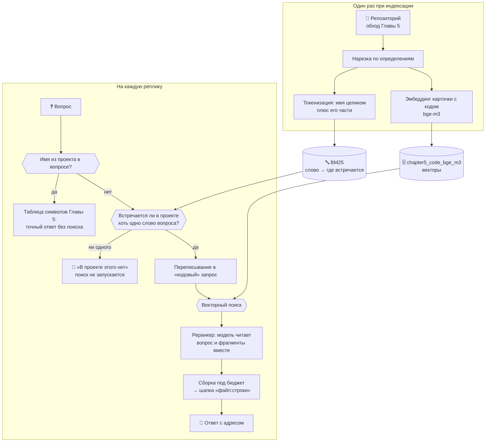

# 🔎 Глава 6. Поиск BM25: у ответа появляется ноль

> **Цель главы:** научить агента отвечать «в проекте этого нет» — не потому, что модель послушалась, а потому, что это проверено.

[Глава 5](../chapter5/README.md) закончилась двумя незакрытыми долгами, и оба — про одно и то же свойство векторной близости.

Первый: **близость слепа к точному совпадению**. `is_safe_query` не находится вопросом, в котором нет слова `is_safe_query`.

Второй, он же долг Главы 4: **порога «ответа нет» не существует**. Вопрос «Как приготовить борщ?» получил на корпусе документов лучший фрагмент с близостью 0.743 — выше, чем четыре релевантных вопроса из пяти. Все шесть вопросов уместились в полосу шириной 0.05. Отказ держался на послушании модели («в найденных фрагментах ответа нет — так и скажи»), и держался не всегда.

Оба долга выглядели как одно и то же: косинусная близость **ранжирует, но не находит**. Она говорит, что этот фрагмент похож больше остальных, и не говорит, похож ли он вообще. У неё нет нуля.

Глава строит рядом поиск по словам, у которого ноль есть: слово запроса либо встречается в корпусе, либо нет, и если не встречается ни одно — возвращать нечего.

**И попутно выясняется, что долг был один, а не два.** Второй — про точные совпадения и вообще про то, что «русский вопрос не находит английский код», — оказался не свойством векторного поиска, а свойством модели эмбеддингов, которую курс взял в Главе 4. Замена `nomic-embed-text` на многоязычную `bge-m3` подняла попадание с 1 из 12 до 10 из 12 на тех же вопросах и том же корпусе. Ни строчки нового кода поиска.

Так что глава получилась про две разные вещи, и это стоит сказать сразу:

* **ноль настоящий и остаётся** — его даёт только поиск по словам, при любой модели эмбеддингов;
* **ранжировать словами не надо** — векторы с нормальной моделью лучше во всех шести типах вопроса, которые я замерил.

Ноль при этом узкий: правило срабатывает там, где ни одно значимое слово вопроса в проекте не встречается ни разу, — это шесть посторонних вопросов из четырнадцати в замере. Остальные восемь проходят и получают обычную выдачу.



Главная мысль: **прежде чем улучшать ранжирование, спросите, есть ли у поиска ноль.** Система, которая всегда возвращает пять лучших результатов, на вопрос без ответа возвращает пять лучших неправильных — и по виду выдачи отличить этот случай нельзя.

А вторая мысль, которую глава получила не по плану: **прежде чем строить второй механизм в обход первого, проверьте, не сломан ли первый.** Здесь на обход было потрачено полглавы, а чинилось оно одной переменной окружения.

---

## 🔍 Что делаем

Поиск по словам строится здесь ради одного свойства — нуля. Ранжировать им не надо: замеры ниже показали, что векторный поиск с нормальной моделью лучше во всех типах вопроса. Но чтобы понять, откуда берётся ноль, надо разобрать, как счётчик совпадений устроен внутри, — с этого и начнём.

### Что считать словом в исходнике

Обычная текстовая токенизация на коде работает плохо, и видно это на одном имени:

```
обычная      is_safe_query  →  is_safe_query
наша         is_safe_query  →  is_safe_query, safe, query
```

Первая строка находит функцию только по имени целиком. Вторая находит её ещё и вопросом «безопасность query» — потому что имя [разбирается на слова](src/lexical.py#L156) тем же разбором, что и карточка фрагмента Главы 5. Целое имя при этом остаётся токеном и весит больше всех: оно встречается в считанных фрагментах, а `query` — в сотне с лишним.

Два решения, которые стоит проговорить.

**Пунктуация выброшена.** Скобка есть почти в каждом фрагменте кода, её вес близок к нулю, и на ранжирование она не влияет — зато заняла бы половину индекса.

**Служебные слова выброшены, и русские тоже.** Вот это не про размер индекса, а про то, на чём держится весь порог главы. Докстроки и комментарии в этом проекте написаны по-русски, поэтому вопрос «как приготовить борщ» без вычистки слова «как» совпал бы с половиной корпуса — и ноль перестал бы быть нулём.

### BM25: как устроен счётчик совпадений

BM25 — это формула, которая берёт запрос и кусок текста и выдаёт одно число: насколько этот кусок похож на то, что искали. Больше число — выше в выдаче. Больше она не делает ничего.

Придумали её в девяностых в Лондоне, для поиска по библиотечному каталогу, задолго до всяких нейросетей. Название читается буквально: Best Match — «лучшее совпадение», а 25 значит, что это была двадцать пятая по счёту попытка. Двадцать четыре предыдущие работали хуже, эта прижилась — и до сих пор по умолчанию считает релевантность в Lucene и Elasticsearch, то есть в поисковых движках, на которых работает уйма сайтов и приложений. Это не музейный экспонат.

Главное, что стоит понять про неё сразу: **BM25 ничего не понимает.** Она не знает, что «машина» и «автомобиль» — про одно и то же. Не знает, что такое функция. Не отличает код от стихов. Она умеет ровно одно: смотреть, какие слова из запроса встретились в тексте, сколько раз и насколько эти слова редкие. Всё её «понимание» — арифметика над словами.

Ровно поэтому она и оказалась нужна рядом с векторным поиском. Тот устроен наоборот: понимает смысл, но слеп к буквам. Один знает, что «машина» и «автомобиль» — синонимы, но путает `calculator` с `calculate`; вторая не догадается про синонимы, зато `is_safe_query` найдёт с первого раза. Слабости у них в разных местах.

Начать стоит с того, как это выглядит, если делать в лоб.

**Попытка первая: сколько слов запроса нашлось.** На вопрос «где оценивается количество токенов» ищем фрагменты, где есть «оценивается», «количество», «токенов». Считаем совпадения, сортируем по убыванию.

Ломается это на первом же вопросе про код. Фрагмент, где совпало только слово `text`, получит столько же, сколько фрагмент, где совпала «оценка», — при том что `text` есть в 234 фрагментах этого проекта из 1076, а «оценка» в шести. Первое совпадение не сообщает почти ничего, второе почти показывает пальцем, а счётчик засчитывает их одинаково.

Список служебных слов из предыдущего раздела эту беду не лечит, а только притупляет: `def` и `return` в него внести можно, а `text`, `query` и `chunk` — уже нет, они бывают и содержательными. Список слов — грубый выключатель, а нужен регулятор.

Отсюда и первая поправка — самая важная из трёх.

#### Первая поправка: редкое слово говорит больше, чем частое

Регулятор устроен просто: у каждого слова есть **вес**, и он тем выше, чем в меньшем числе фрагментов слово встречается. Считается [одной строкой](src/bm25.py#L131), по числу фрагментов со словом и общему их числу.

На настоящем индексе курса разброс такой (здесь и дальше в этом разделе — корпус глав 0–5, 1076 фрагментов; почему не весь репозиторий, разобрано ниже, в «Замере, который сломал сам себя»):

| Слово | В скольких фрагментах | Вес |
| :--- | ---: | ---: |
| `text` | 234 | 1.52 |
| `токенов` | 47 | 3.12 |
| `тексте` | 17 | 4.12 |
| `оценка` | 6 | 5.11 |

Слово из каждого пятого фрагмента весит втрое меньше слова из шести. Именно эта поправка делает лексический поиск пригодным для кода — где, напомним, половина текста состоит из ключевых слов языка, одинаковых во всех файлах.

Форма формулы выбрана не первая попавшаяся. У классической — с логарифмом отношения без единицы — слово, встречающееся больше чем в половине фрагментов, получает **отрицательный** вес: документ начинает штрафоваться за то, что это слово у него есть. Здесь вес частого слова стремится к нулю, но ниже не опускается.

В книгах и статьях этот вес называют **IDF** — inverse document frequency, «обратная частота по документам». Название описывает ровно то, что мы сейчас вывели: чем в большем числе документов слово встречается, тем меньше оно весит.

#### Вторая поправка: чаще — лучше, но не бесконечно

Второе соображение очевидное: если слово встречается во фрагменте пять раз, а не один, фрагмент скорее про него. Но линейно это считать нельзя — иначе фрагмент, где `token` упомянут двадцать раз, обойдёт тот, где рядом стоят `token`, `estimate` и `budget`, а нужен как раз второй.

Поэтому рост **насыщается**: первое вхождение добавляет много, второе заметно меньше, десятое почти ничего. Насколько быстро — задаёт `k1 = 1.5`:

| Вхождений слова | Вклад (при весе слова 1.0) |
| ---: | ---: |
| 1 | 1.00 |
| 2 | 1.43 |
| 3 | 1.67 |
| 5 | 1.92 |
| 10 | 2.17 |
| 50 | 2.43 |

Потолок — `k1 + 1 = 2.5`, и к нему кривая подходит уже к десятому вхождению. Практический смысл: **два разных слова запроса всегда весят больше, чем одно слово дважды**. Это ровно то, чего мы хотим от поиска.

Число вхождений слова в документ называют **TF** — term frequency, частота слова. Вместе с IDF из предыдущего подраздела это и есть знаменитая пара «TF-IDF», на которой стоит весь лексический поиск: сколько раз слово встретилось здесь, помноженное на то, насколько оно редкое вообще.

#### Третья поправка: в простыне слово встречается само собой

Третья поправка чинит перекос, который иначе виден сразу. Фрагмент на четыреста слов содержит почти любое слово просто потому, что он большой. Без поправки поиск всегда вытаскивал бы самые длинные куски.

Поэтому вклад делится на длину фрагмента относительно средней по корпусу (здесь средняя — 62 слова). Сила поправки — `b = 0.75`, общепринятая середина между «длину не учитываем вовсе» и «учитываем полностью»:

| Длина фрагмента | Вклад одного вхождения (при весе слова 1.0) |
| ---: | ---: |
| 10 слов | 1.61 |
| 30 слов | 1.31 |
| 62 слова (средняя) | 1.00 |
| 150 слов | 0.61 |
| 400 слов | 0.29 |

Одно и то же слово в короткой функции весит впятеро больше, чем в длинной. Для нарезки по определениям это удачно ложится: короткий фрагмент — это обычно одна функция целиком, и совпадение в ней говорит больше, чем совпадение где-то посреди класса на четыреста строк.

#### Всё вместе

```
                              tf · (k1 + 1)
score = Σ      IDF(слово) · ─────────────────────────────────
     слово∈запрос            tf + k1 · (1 − b + b · длина/средняя)
```

Три сомножителя — три поправки: **редкость слова** снаружи, **частота с насыщением** в числителе, **длина фрагмента** в знаменателе. Складывается по словам запроса; слова, которых во фрагменте нет, ничего не добавляют — и ничего не отнимают.

#### Один запрос до последнего числа

Запрос «оценка количества токенов в тексте» на корпусе глав 0–5. После [токенизации](src/lexical.py#L156) от него остаётся `оценка, количества, токенов, тексте` — предлог «в» выброшен как служебное слово.

Первое место, 14.96:

```
chapter3/src/context.py:45-55 · estimate_tokens
38 слов — короче средних 62, поэтому множитель длины 1.21

  слово      в скольких фрагментах    вес    раз    вклад
  оценка                 6           5.11     1      6.19
  токенов               47           3.12     1      3.78
  тексте                17           4.12     1      4.99
                                                   ───────
                                                     14.96
```

Совпали три слова из четырёх, каждое по разу. Вклад слова — это его вес, умноженный на множитель длины: 5.11 × 1.21 = 6.19. Больше всего дала «оценка», потому что она редкая, а не потому что важная: алгоритм про важность ничего не знает.

Второе место, 8.02 — и оно объясняет поправку на длину лучше любого примера:

```
chapter3/src/context.py:366-368 · Conversation.history_tokens
12 слов — впятеро короче средних, множитель длины 1.57

  слово      в скольких фрагментах    вес    раз    вклад
  оценка                 6           5.11     1      8.02
```

Совпало **одно** слово из четырёх, а фрагмент занял второе место. Потому что он крошечный: двенадцать слов против средних шестидесяти двух, и единственное совпадение в нём весит больше, чем то же слово в победителе (6.19). Короткий фрагмент, в котором нашлось нужное слово, — это, скорее всего, про него и есть.

Третье место, 7.06, показывает насыщение:

```
chapter5/src/codebase.py:279-310 · CodeIndex.build_context
119 слов — вдвое длиннее средних; множитель одного вхождения 0.71, двух — 1.10

  слово      в скольких фрагментах    вес    раз    вклад
  оценка                 6           5.10     1      3.61
  токенов               47           3.12     2      3.44
                                                   ───────
                                                      7.06
```

Здесь совпало два слова, причём «токенов» дважды — и всё равно фрагмент проиграл тому, где совпало одно. Обе поправки видны сразу: второе вхождение «токенов» подняло множитель с 0.71 до 1.10, то есть в полтора раза, а не вдвое — это насыщение; и длина срезала всё остальное — у победителя тот же множитель был 1.21.

#### Обратный индекс

Считать это для всех тысячи фрагментов на каждый запрос не нужно и не делается. Внутри лежит обратный индекс: слово → в каких фрагментах оно встречается и сколько раз. [Поиск](src/bm25.py#L153) обходит списки вхождений слов запроса, а не корпус: по слову «оценка» это шесть фрагментов из тысячи, а не тысяча.

Токенизация при этом делается один раз, при сборке индекса. Разбирать текст на слова в момент запроса — значит на каждый вопрос заново прочитать весь корпус.

### Ноль: когда агент говорит «в проекте этого нет»

Вот ради чего глава. У BM25 есть свойство, которого нет у близости: если ни одно слово запроса не встречается в корпусе, обходить нечего и складывать нечего — результат пуст. Не «плохие результаты», а ничего.

Сначала кажется, что этого достаточно: считаем вес лучшего совпадения и ставим порог. Ниже порога — «не знаю», выше — обычная выдача. Такой порог в главе был, стоял на 8.0, и первый замер показал идеальное разделение: двенадцать вопросов о проекте выше, двенадцать посторонних ниже.

Замер был неверен, и разбор его провала — в «Что не сработало». Короткая версия: те двенадцать вопросов оказались слишком удобными, а на реалистичном наборе распределения перекрываются, и порог начинает отказывать настоящим вопросам.

Осталось правило, которое переживает проверку, потому что не содержит подгоняемого числа:

> **Отказ, когда ни одно содержательное слово вопроса не встречается в проекте ни разу.**

Не «мало совпадений», а «совпадений нет вообще». Смотрит [`lexical_signal`](src/hybrid.py#L208) — доля слов вопроса, найденных в корпусе; ноль означает отказ.

Осторожность здесь намеренно однобокая, и это выбор, а не случайность. Ложное «не знаю» на настоящем вопросе — потерянный ответ; ложное «знаю» на постороннем возвращает нас к поведению Главы 5, то есть не хуже, чем было. Поэтому правило стоит в самой осторожной точке — той, где ложных отказов ноль.

Что это даёт на замере: 4 отказа из 14 посторонних вопросов и **ни одного ложного отказа** на 20 вопросах о проекте. Скромно — и это настоящее число, а не то, которое хотелось получить.

Порог считается по **исходному** вопросу, а не по переписанному. Переписывание Главы 5 придумывает правдоподобные английские имена, и на вопросе про борщ модель выдаст что-нибудь вроде `cook recipe soup` — слова, которых в проекте тоже нет, но проверять надо не их.

Отказ называет, чего именно не нашлось:

```
🚫 Похоже, в проекте этого нет (лексический вес 0.0, слов найдено 0%,
   не встречаются: рисуется, график, продаж)
```

«В проекте нет упоминаний: график, продаж» — это ответ. «Ничего не найдено» — отписка.

Отдельная деталь, которая стоила живого прогона. Блок отказа уезжает в контекст модели как **данные**, без единого повелительного наклонения. В первой версии там стояло «Так и скажи пользователю. НЕ ВЫДУМЫВАЙ ни файлы, ни номера строк» — и 3B скопировала обе фразы в ответ пользователю целиком, вместе с обращением к самой себе:

```text
✅ Ответ: В коде проекта нет ответа на вопрос «где реализовано чтение
   файлов?»… Так и скажи пользователю. НЕ ВЫДУМЫВАЙ ни файлы,
   ни номера строк.
```

Указания модели живут в системном промпте, в контекст едет только факт. Правило общее: всё, что кладётся в контекст рядом с данными, модель может принять за текст для пересказа.

### Реранкер: второй взгляд, читающий вопрос и код вместе

И векторный поиск, и BM25 обрабатывают вопрос и фрагмент **порознь**. Вектор фрагмента посчитан заранее и о вопросе ничего не знает; список вхождений слова собран заранее тоже. Сравниваются уже готовые числа — потому поиск и быстрый: тысяча фрагментов, и ни один не пришлось прочитать в момент запроса.

Реранкер работает наоборот: берёт пару «вопрос + фрагмент» целиком. Поэтому он видит то, чего не видит поиск: что имя в найденном фрагменте не определяется, а вызывается; что перед ним тест, а спрашивали про реализацию. И поэтому же он медленный — каждая пара отдельная работа. Отсюда порядок: сначала поиск сужает тысячу до восьми, потом реранкер разбирается с восемью и оставляет пять.

Такие модели называют **cross-encoder** — «перекрёстный кодировщик»: в отличие от модели эмбеддингов, которая кодирует вопрос и текст порознь, эта пропускает их через себя вместе, крест-накрест. Обычно берут небольшую готовую вроде `ms-marco-MiniLM`, обученную ровно на эту задачу и дающую оценку пары за миллисекунды. Здесь её нет: она тянет `torch` и `sentence-transformers`, около 2.5 ГБ, на курс про 6 ГБ видеопамяти, где память уже занята основной моделью и моделью эмбеддингов. Вместо неё — [та же LLM, что отвечает пользователю](src/reranker.py#L185): один запрос, в котором она видит вопрос и всех кандидатов разом и расставляет их по порядку.

Работает это заметно. На двенадцати вопросах главы, средний обратный ранг:

| Модель | без реранкера | с реранкером | прибавка | секунд на вопрос |
| :--- | ---: | ---: | ---: | ---: |
| `qwen2.5:3b` | 0.40 | 0.45 | +0.05 | 2.0 |
| `qwen2.5-coder:7b` | 0.45 | 0.52 | +0.07 | 4.9 |
| `qwen2.5-coder:7b` (повтор) | 0.43 | 0.50 | +0.07 | 4.8 |
| `llama3.1:8b` | 0.37 | 0.46 | +0.09 | 5.4 |

Помогает на всех трёх, и у модели для кода прибавка повторилась в двух прогонах подряд — значит это не разброс. Видно и поимённо: у `llama3.1:8b` определение `is_safe_query` уехало с четвёртого места на первое, `build_context` — с пятого на второе.

Одна деталь про то, как это мерить. **Число попаданий у реранкера не меняется почти никогда** — он меняет порядок, а не состав. Мерить его долей найденных ответов бессмысленно; нужен средний обратный ранг. На этом я и споткнулся в первой версии замера, о чём ниже.

Отказ здесь ничего не роняет. Не ответила модель, вернула мусор, назвала номера, которых нет, — [порядок остаётся тем, что дал поиск](src/reranker.py#L173). Приём либо улучшает, либо не меняет ничего — как переписывание запроса в Главе 5.

### Один новый инструмент, а не пять

Глава 5 оставила долг другого рода: системный промпт вырос до 4749 токенов из 8192, и на историю разговора осталось меньше трети окна. Каждый инструмент уезжает в промпт описанием и сигнатурой, поэтому добавлять их по привычке больше нельзя.

`search_code` поэтому не добавляется, а **замещается**. Реестр Главы 2 — обычный словарь «имя → функция», и повторная регистрация под тем же именем меняет реализацию, не трогая ни промпт, ни число инструментов. Модель по-прежнему видит `search_code`, а под ним теперь поиск по словам с реранкером.

Добавляется один — [`grep_code`](src/tools.py#L112), точное вхождение строки в файлах проекта. Ему здесь место потому, что это третий, самый прямолинейный способ искать, и у него, как и у BM25, есть настоящий ноль. Таблица символов Главы 5 находит **определения** по имени; `grep_code` находит любое упоминание где угодно — в теле функции, в комментарии, в строке сообщения об ошибке. На вопрос «откуда берётся вот это сообщение» ни поиск по смыслу, ни таблица символов не отвечают, а точное вхождение отвечает сразу и без модели.

---

## 🧪 Что не сработало

Шесть пунктов, за каждым замер. Три из них опровергают то, что было написано в первых версиях этой главы, и только в одном случае виноват сам приём — в двух других я неверно мерил. Первый пункт опровергает не главу, а её посылку.

### Мы чинили не то

Главы 5 и 6 стояли на утверждении: русский вопрос не находит английский код, векторная близость тут бессильна. Глава 5 это измерила (1 попадание из 12) и объяснила: `nomic-embed-text` на русском меряет «это вообще русская проза?», а не тему. Объяснение верное. Вывод из него — нет.

Из «эта модель плохо понимает русский» следует «возьмите модель, которая понимает», а не «постройте второй поиск». Проверка заняла один `ollama pull`:

| Поиск | `nomic-embed-text` (274 МБ) | `bge-m3` (1.2 ГБ) |
| :--- | ---: | ---: |
| только векторы | 1 / 12 · MRR 0.02 | **10 / 12 · MRR 0.56** |
| только BM25 | 5 / 12 · MRR 0.20 | 5 / 12 · MRR 0.20 |
| гибрид | 2 / 12 · MRR 0.12 | 8 / 12 · MRR 0.40 |

Строка BM25 совпала до сотых — как и должна, эмбеддер её не касается. А векторная выросла вдесятеро.

Полглавы было потрачено на обход препятствия, которого не было.

Модель поднимает **эта глава, у себя**: `chapter6/src/__init__.py` при импорте переключает `EMBED_MODEL` на `bge-m3`. Главы 4 и 5 остаются на `nomic-embed-text`, и их числа воспроизводятся так, как там написано. Приём не новый: Глава 5 ровно так же переопределяет размер окна Главы 1 строкой `base.NUM_CTX = ...`. Явно заданная переменная `AGENT_EMBED_MODEL` сильнее и здесь — если человек выбрал модель сам, глава не спорит.

Индекс при этом принадлежит модели: у `nomic` вектор из 768 чисел, у `bge-m3` из 1024, и в одной коллекции они не уживутся. Поэтому имя модели входит в имя коллекции — `chapter5_code_bge_m3` рядом с `chapter5_code_nomic_embed_text`. Запустили Главу 5 — работает её индекс, запустили Главу 6 — свой. Собрать придётся оба, и это единственное, чем такое разделение неудобно.

Стоит отметить и то, чего смена модели **не** дала. Ноль не появился: `bge-m3` отвечает на вопрос про борщ так же охотно, как `nomic`. Это свойство косинуса, а не модели, и никакой эмбеддер его не меняет.

### Поиск по словам как способ ранжировать

Раз векторы починились, надо было проверить, нужен ли BM25 в ранжировании вообще. Шесть типов вопроса, `bge-m3`, средний обратный ранг:

| Тип вопроса | векторы | BM25 | гибрид |
| :--- | ---: | ---: | ---: |
| описание по-русски | **0.56** | 0.20 | 0.40 |
| описание с опечаткой | **0.47** | 0.23 | 0.40 |
| описание по-английски | **0.64** | 0.24 | 0.54 |
| точное имя | 0.81 | 0.57 | **0.90** |
| имя словами | **0.92** | 0.47 | 0.85 |
| описание и имя | **0.92** | 0.62 | 0.92 |

**BM25 не выигрывает ни в одной строке.** Включая ту, ради которой он затевался: на точном имени он даёт 0.57 против 0.81 у векторов. Довод Главы 5 — «`is_safe_query` не находится вопросом без слова `is_safe_query`» — не подтвердился: когда вопрос **и есть** это слово, векторы находят его все двенадцать раз из двенадцати и ставят выше.

Видно и его природу. BM25 ровный: от 0.20 до 0.62 по всем шести типам, потому что смысла он не видит и на формулировку почти не реагирует. И ломается он там, где исчезает точный токен: разбейте `is_safe_query` на «is safe query» — и он падает с 0.57 до 0.47, пока векторы держат 0.92. Его сила не в именах, а в **буквальном совпадении**.

### Слияние двух выдач

Идея, с которой глава начиналась. Складывать оценки напрямую нельзя — шкалы несопоставимы: близость лежит в отрезке от нуля до единицы, вес BM25 ничем не ограничен сверху и на точном имени доходит до 20. Нормировка по максимуму внутри выдачи меняет одну беду на другую: лучший результат любого списка становится равным единице — и отличный, и лучший из плохих. Плюс фрагмент, который нашёл только один поиск, получил бы у второго ноль, то есть штраф, будто его отвергли.

Стандартный ответ на это — **Reciprocal Rank Fusion**: складывать не оценки, а места.

```
score(фрагмент) = Σ  1 / (k + место в списке)
```

Сумма берётся по тем спискам, где фрагмент вообще есть, поэтому шкалы приводить друг к другу не нужно. Фрагмент, найденный обоими поисками, получает два слагаемых и обгоняет тех, кого нашёл один. Константа `k = 60` — из статьи, где приём предложен: при таком `k` решает не место внутри списка, а согласие списков. Реализация — [`rrf`](src/fusion.py#L51), двадцать строк.

В таблице выше гибрид выигрывает **одну строку из шести** — на точном имени, 0.90 против 0.81. И именно этот случай Глава 5 закрывает таблицей символов: имя из вопроса находится разбором, точно, до всякого поиска и без единого вектора. То есть единственная победа слияния приходится на случай, до которого поиск не доходит.

В остальных пяти строках гибрид между половинами. Отсюда правило, которое стоит любых констант слияния: **сначала измерь каждую половину, потом складывай.** Слияние не чинит плохой поиск, оно его усредняет.

Код остался, включается через `AGENT_SEARCH_MODE=hybrid`.

### Отказ по весу: подгонка под удачную выборку

Одна из версий главы утверждала, что вопросы о проекте и посторонние разделяются весом лучшего совпадения, и приводила порог 8.0 с идеальным результатом: 12 отказов из 12 посторонних, ни одного ложного.

Замер был подогнан, хоть и не нарочно. Двенадцать вопросов о проекте я подбирал так, чтобы у каждого была ровно одна функция-ответ, — и они вышли слишком удобными: у всех двенадцати нашлись **все** слова. Стоило добавить восемь обычных вопросов, которые задал бы живой человек, как зазор исчез:

```
о проекте:   3.12 … 15.65
посторонние: 0.00 …  7.22
```

Диапазоны перекрываются, и любой порог оказывается разменом:

| порог | ложных отказов | пойманных посторонних |
| ---: | ---: | ---: |
| 3.0 | 0 из 20 | 4 из 14 |
| 7.0 | 3 из 20 | 13 из 14 |
| 8.0 | **4 из 20** | 14 из 14 |

Живой прогон показал худший случай на практике: «где реализовано чтение файлов» — обычный вопрос, ответ на который в проекте есть, — получил отказ, потому что слова «чтение» в коде нет (там «читает» и «чтения»), а морфологию русского токенизатор не знает.

Порог по весу остался ручкой `AGENT_NO_ANSWER`, по умолчанию выключенной. Заменило его правило без подгоняемого числа, разобранное выше.

### Реранкер, которого я не увидел

Ещё одна версия главы сообщала, что реранкер не даёт ничего, и он был выключен. Замер был сломан: я давал реранкеру восемь кандидатов и проверял попадание в первую **восьмёрку**. Множество при перестановке не меняется — число попаданий не могло сдвинуться в принципе, а средний обратный ранг мерился на списке, где ответ и так уже лежал.

Агент работает иначе: восемь кандидатов, перестановка, пять в контекст. На этих двух конфигурациях реранкер даёт от +0.05 до +0.09 — таблица в разделе про него.

Урок не про реранкер: **замер должен воспроизводить ту конфигурацию, в которой приём работает.** Мерить восемь из восьми там, где в жизни пять из восьми, — значит мерить не то.

### Замер, который сломал сам себя

Отдельная история, стоящая того, чтобы её рассказать.

Первый прогон отказа дал **ноль отказов из двенадцати** посторонних вопросов. Причём «как испечь шарлотку» получила лексический вес 16.94 — выше, чем любой настоящий вопрос о коде.

Разгадка в том, где лежит список посторонних вопросов. Он лежит в `chapter6/tests.py`, а это исходник проекта, и индексируется наравне с остальными. Слово «шарлотка» попало в корпус ровно в тот момент, когда я его туда записал; поиск нашёл этот самый файл первым и был совершенно прав.

```
как испечь шарлотку   →  chapter6/tests.py   16.94
где купить велосипед  →  chapter6/tests.py   15.65
```

Та же история со «старым» контрольным вопросом Главы 4: «Как приготовить борщ?» встречается в исходниках курса **семь раз** — в комментарии `chapter4/src/knowledge.py`, где разбирается этот самый замер, и в тестах трёх глав. Классический пример «вопроса, ответа на который в базе нет» перестал им быть, пока про него писали.

Дальше стало смешнее. Объясняя всё это в комментарии к коду, я написал туда пример с выдуманным именем класса — и через минуту тот же пример перестал работать, потому что имя попало в индекс. В комментарии теперь стоит буква X.

Лечится это тем, что отказ меряется на корпусе глав 0–5 — на том, каким репозиторий был до этой главы. Оговорка к замеру, а не к приёму: в обычном проекте «как испечь шарлотку» в исходниках не встречается. Но помнить о ней стоит всякому, кто строит поиск по корпусу, который сам же и описывает.

### Отказ не защищает вопросы, не похожие на вопросы о коде

Проверка на отсутствие стоит **внутри** ветки «вопрос про код». Реплика «как настроить кубернетес кластер» под маркеры кода не подходит вовсе, поэтому до проверки не доходит: уезжает в корпус документов Главы 4, где никакого нуля по-прежнему нет. Половина поверхности закрыта, половина нет.

Живой прогон показал, чем это оборачивается. Вопрос «где реализоано распознование изображений» — с двумя опечатками — не подошёл под маркер `реализов`, ушёл в документы и получил ответ: «Распознавание изображений реализовано в главе 1 курса… в этой главе описывается, как проверять запрос на инъекцию, что является частью системы распознавания изображений». Выдумка от первого слова до последнего.

---

## 🛡️ Безопасность

Начать надо не с того, что глава добавила, а с того, что она **нашла**.

**Личные данные попадали в индекс, вопреки тому, что написано в Главе 5.** Там сказано, что файлы из `.gitignore` в индекс не идут, «а значит `memory.json` с фактами о вас и `previous_session.json` с хвостом прошлого разговора». На деле шли: разбор `.gitignore` в Главе 5 понимал только имена **папок**, а правила с косой чертой (`chapter3/memory.json`) молча выбрасывал. Ваше имя, возраст и хвост прошлого разговора уезжали в модель эмбеддингов и ложились на диск в `chroma_db/` открытым текстом.

Обнаружилось это не проверкой безопасности, а по ложному отказу: слово «чтение» нашлось в корпусе ровно один раз — в записи предыдущего разговора пользователя. Починено в [`gitignore_entries`](../chapter5/src/languages.py#L122): папки и файлы разбираются отдельно, файлы отсекаются до чтения. Обход репозитория: было 76 файлов, стало 72.

Мораль общая и неприятная: **утверждение в тексте про то, чего система не делает, — такое же утверждение, как любое другое, и проверять его надо тестом.** Тест теперь есть.

Заодно из обхода убрана папка `.claude/` — настройки самого агента-помощника не исходники проекта.

Что глава меняет дальше.

**Лексический индекс не ходит в модель.** У векторного есть свойство, о котором Глава 5 предупреждала: текст всех фрагментов уезжает в Ollama и ложится на диск второй копией исходников. У лексического этого нет вовсе — он живёт в памяти процесса, собирается из файлов при запуске и умирает вместе с ним.

**Отказ сужает поверхность, а не расширяет.** Вопрос, содержательных слов которого в проекте нет, теперь **не доходит до поиска** — в контекст модели не попадает ни одного фрагмента. Раньше на такой вопрос уезжали пять «самых похожих» кусков кода. Меньше постороннего кода в контексте — меньше поводов для выдумывания.

**А вот `grep_code` показывает содержимое строк.** Он возвращает не имя и адрес, как таблица символов, а саму строку файла. Обход тот же, значит `.gitignore` и потолок размера файла работают, — но `.env.example` в индексе есть намеренно, и `grep_code` покажет его строки целиком. Пока в примере лежат примеры, это ровно то, что нужно; с настоящим ключом внутри — уже нет.

---

## 📐 Окно и бюджет

Окно то же, 8192 токена. Промпт вырос ещё на пятьсот токенов, и отдана за это снова история разговора.

| | Глава 5 | Глава 6 |
| :--- | ---: | ---: |
| Инструментов | 15 | 16 |
| Системный промпт | 4749 | 5247 |
| Бюджет истории | 2816 | 2318 |
| Из них на найденное | 1408 | 1159 |

Из пятисот токенов прироста 218 приходятся на **один few-shot пример** — тот, что показывает вызов `grep_code`. Это почти десятая часть всей истории разговора, отданная за три строки диалога в промпте. Глава 5 показала, что на 3B такие примеры решают, позовёт модель инструмент или нет, поэтому пример оставлен; но это тот случай, когда обмен виден в числах и его стоит держать в голове.

Один запрос к модели после этой главы:

```
┌─ system: промпт с описанием 16 инструментов ─ константа, 5247 токенов
├─ user:   [PREV_SESSION] пересказ прошлой сессии ── только по команде
├─ …       история разговора ──────────────── отбирается по смыслу
├─ user:   [TOOL_OUTPUT] найденный код или отказ ─── не больше 1159 токенов
└─ system: напоминание про правила ────────── константа

   chroma_db/chapter5_code ── векторы, на диске, собираются минутами
   BM25 в памяти процесса ─── слова, собираются за 0.7 с при запуске
```

Вторая половина индекса не требует ни модели, ни сети, поэтому и не хранится на диске: пересобрать её быстрее, чем следить, чтобы сохранённая не разъехалась с векторной.

---

## 🗺️ Три реплики агента целиком

Один прогон на `qwen2.5:3b` и `bge-m3`, три вопроса подряд в одном разговоре.

**Первый — то, ради чего глава.** Метод, которого в проекте нет:

```text
Вы: где реализован метод drawSalesChart?

🚫 Похоже, в проекте этого нет (лексический вес 9.1, слов найдено 0%,
   не встречаются: drawsaleschart, draw, sales, chart)
📊 Отправляем 4 сообщений, ~5457 токенов из 8192

✅ Ответ: Метод drawSalesChart не найден в проекте. Попробуйте уточнить
   запрос или проверить, не забыли ли вы написать его в коде.
```

Обратите внимание на **9.1**. Это вес лучшего лексического совпадения — выше, чем у половины настоящих вопросов о проекте. Набрали его слова «где», «реализован» и «метод», которые есть в любом файле с кодом. Порог по весу такой вопрос пропустил бы; правило «ни одного содержательного слова» отказало. Вся разница между двумя подходами на одном примере.

Поиск при этом не запускался: в контекст уехала одна строка о том, что искать нечего, а не пять «самых похожих» фрагментов кода.

**Второй — обычная работа:**

```text
Вы: где в коде оценивается количество токенов?

🔁 Запрос для поиска: где в коде оценивается количество токенов? estimate_tokens
📊 Отправляем 6 сообщений, ~6550 токенов из 8192

✅ Ответ: Метод drawSalesChart не найден в проекте. Однако, метод
   estimateTokens используется для оценки количества токенов в тексте.
   Он находится в файле chapter3/src/context.py с линиями 45-55.
```

Адрес верный: на строке 45 действительно `def estimate_tokens(text: str) -> int`. А вокруг адреса — две ошибки модели, и обе не про поиск.

Ответ начинается с фразы про `drawSalesChart` из **предыдущей** реплики: 3B зацепилась за историю разговора и приписала к новому ответу хвост старого. И имя переписано как `estimateTokens` — в проекте такого написания нет нигде, модель привела `estimate_tokens` к привычному ей camelCase. Правило системного промпта «номера строк бери только из шапок» модель выполнила; про имена такого правила там нет.

**Третий — то, что глава починила наполовину:**

```text
Вы: где встречается HISTORY_BUDGET?

📎 Точные вхождения «HISTORY_BUDGET»: 79
📊 Отправляем 8 сообщений, ~6022 токенов из 8192

✅ Ответ: Константа HISTORY_BUDGET используется в следующих местах файла
   chapter3/src/agent.py и файла chapter3/tests.py:
```

Вопрос «где встречается» — про буквы, а не про смысл, и векторному поиску его отдавать нельзя. До того как это исправили, тот же вопрос получал два фрагмента **про** бюджет истории, в которых самого имени нет ни разу, — и модель уверенно называла их местами, где константа встречается. Теперь ответ на такой вопрос собирает перебор файлов: 79 вхождений, каждое проверено.

В контекст уехало вот это:

```text
chapter3/agent.py:155: HISTORY_BUDGET = max(
chapter3/agent.py:165: HISTORY_BUDGET_RESUMED = max(200, HISTORY_BUDGET - …)
chapter3/agent.py:177: max_history_tokens=HISTORY_BUDGET_RESUMED if resume …
```

А в ответ попал файл `chapter3/src/agent.py`, которого в проекте не существует: модель вставила лишний `src/` в путь, который лежал перед ней в готовом виде. И оборвала перечисление на двоеточии, ничего после него не написав.

**Вывод тот же, что в Главе 5, и глава его не изменила.** Поиск можно довести до того, что в контексте лежат только верные адреса. Ответ от этого верным не становится: 3B перепишет имя, испортит путь и притащит хвост прошлой реплики. На таком железе правило остаётся прежним — **файлу верить можно, номеру строки только после проверки.**

---

## 🚀 Как запустить

Нужны Ollama, основная модель и модель эмбеддингов. Эта глава берёт другую модель эмбеддингов, чем главы 4 и 5, — понадобятся обе, если хотите запускать и те, и эту:

```bash
ollama pull qwen2.5:3b
ollama pull bge-m3            # эта глава
ollama pull nomic-embed-text  # главы 4 и 5
```

Запуск из корня проекта:

```bash
python -m chapter6.agent
```

При первом запуске векторный индекс кода надо собрать — команда `индекс кода` в диалоге, это минуты. Лексический собирается сам, за доли секунды, и командой не управляется: пересобрать его быстрее, чем проверять, не устарел ли он.

Индекс принадлежит модели эмбеддингов: у `bge-m3` вектор из 1024 чисел, у `nomic-embed-text` из 768, и в одной коллекции они не уживутся. Поэтому имя модели входит в имя коллекции — `chapter5_code_bge_m3`. Индекс Главы 5 лежит рядом под своим именем и не затирается; запустили ту главу — работает он.

Команды диалога: `индекс кода` — сверить оба индекса, `код` — что в них лежит, `реранкер` — сколько раз его звали и сколько это заняло, `карта` — пересобрать карту проекта, `индекс`/`база` — корпус документов Главы 4, `продолжить` — поднять прошлый разговор, `забудь` — очистить историю, `выход`.

Переключатели для сравнения — все читаются один раз при импорте:

| Переменная | Что делает |
| :--- | :--- |
| `AGENT_EMBED_MODEL=nomic-embed-text` | взять эмбеддер Глав 4–5: на гигабайт меньше памяти, заметно хуже на русских вопросах |
| `AGENT_SEARCH_MODE=bm25` | искать только словами — без векторов и без индексации |
| `AGENT_SEARCH_MODE=hybrid` | слить обе выдачи по местам (замер не подтвердил) |
| `AGENT_RERANK=0` | выключает реранкер: выдача поиска идёт как есть, ответ на 2–5 секунд быстрее |
| `AGENT_NO_ANSWER=7` | добавляет отказ по весу: отказов больше, но появляются ложные |
| `AGENT_NO_ANSWER_SUPPORT=-1` | выключает отказ совсем: агент отвечает на любой вопрос |
| `AGENT_CODE_REWRITE=0` | выключает переписывание запроса (Глава 5) |
| `AGENT_CODE_AUTO=0` | выключает автопоиск: поиск только по решению модели |

Тесты:

```bash
python -m pytest chapter6/tests.py -q
```

Замеры главы (нужна Ollama, занимают минуты):

```bash
python -m pytest chapter6/tests.py -m slow -v -s
```

---

## ⚡ Замеры и производительность

Условия у всех замеров одни: одна машина (GTX 1660 SUPER, 6 ГБ), Ollama, корпус — исходники этого курса. Прогоняются командой `python -m pytest chapter6/tests.py -m slow -v -s`.

### Отказ «в проекте этого нет» — главный результат главы

Корпус: 1076 фрагментов (главы 0–5, без `chapter6/` — почему, разобрано выше). Двадцать вопросов, ответ на которые в коде есть, против четырнадцати посторонних. Правило: отказ, если ни одно содержательное слово вопроса в проекте не встречается.

| | Вопросов | Отказано |
| :--- | ---: | ---: |
| вопросы о проекте | 20 | **0** |
| посторонние вопросы | 14 | **6** |

Отказ получили: «как настроить кубернетес кластер», «где купить велосипед», «где настраивается виртуальный хост nginx», «как испечь шарлотку», «где реализовано кэширование в redis», «где в проекте авторизация по oauth».

Восемь посторонних прошли — у них нашлись отдельные слова: «сегодня» и «курс» есть в коде инструмента времени, «схема» — в JSON Schema, «логи» — в логировании. Ловить их пришлось бы порогом по весу, а он, как показано выше, отказывает и настоящим вопросам.

Сравните с тем, чем кончилась Глава 4: там шесть вопросов уместились в полосу близости шириной 0.05, и разделить их было нечем вообще.

Живой прогон показал, почему правило считает слова, а не вес: вопрос «где реализован метод drawSalesChart» набрал вес **7.9** — выше половины настоящих вопросов, — целиком за счёт слов «где», «реализован» и «метод». По весу он бы прошёл; по содержательным словам получил отказ.

**Отказ не зависит ни от модели эмбеддингов, ни от типа вопроса.** Это единственное число в главе, которое не поехало при смене `nomic` на `bge-m3`.

### Что решает модель эмбеддингов

Двенадцать русских вопросов без единого слова из кода, 236 фрагментов, попадание в топ-5 · средний обратный ранг:

| Поиск | `nomic-embed-text` | `bge-m3` |
| :--- | ---: | ---: |
| только векторы | 1 / 12 · 0.02 | **10 / 12 · 0.56** |
| только BM25 | 5 / 12 · 0.20 | 5 / 12 · 0.20 |
| гибрид | 2 / 12 · 0.12 | 8 / 12 · 0.40 |
| векторы + переписывание | 7 / 12 · 0.40 | 9 / 12 · 0.50 |
| BM25 + переписывание | 6 / 12 · 0.25 | 6 / 12 · 0.32 |
| гибрид + переписывание | 7 / 12 · 0.36 | 8 / 12 · 0.52 |

Одна замена в одной переменной окружения двигает результат сильнее, чем весь остальной код этой главы вместе взятый.

### Шесть типов вопроса

Те же двенадцать определений, но вопрос задан шестью разными способами. Средний обратный ранг, `bge-m3`:

| Тип вопроса | векторы | BM25 | гибрид | лучший |
| :--- | ---: | ---: | ---: | :--- |
| описание по-русски | **0.56** | 0.20 | 0.40 | векторы |
| описание с опечаткой | **0.47** | 0.23 | 0.40 | векторы |
| описание по-английски | **0.64** | 0.24 | 0.54 | векторы |
| точное имя | 0.81 | 0.57 | **0.90** | гибрид |
| имя словами | **0.92** | 0.47 | 0.85 | векторы |
| описание и имя | **0.92** | 0.62 | 0.92 | поровну |

Три вещи, которые видно только на такой разбивке.

**Английский вопрос лучше русского даже на `bge-m3`** — 0.64 против 0.56. Разрыв между русским вопросом и английским кодом, с которого начиналась Глава 5, существует; хороший эмбеддер его сокращает, но не закрывает.

**Опечатка бьёт по эмбеддеру, а не по BM25.** `nomic` падает с 0.02 до нуля, `bge-m3` — с 0.56 до 0.47, BM25 не шелохнулся. Но и с опечаткой `bge-m3` вдвое лучше BM25 без неё.

**Дописать имя к описанию — самый сильный ход в таблице.** 0.92, и это же объясняет, почему переписывание запроса из Главы 5 так помогало: оно превращало «описание» в «описание и имя», то есть переводило вопрос из худшей строки в лучшую.

### Что делать с вопросом перед поиском

Один вызов модели перед поиском можно потратить по-разному. Двенадцать вопросов, векторный поиск на `bge-m3`:

| Подготовка запроса | Попаданий | MRR | Вызовов модели |
| :--- | ---: | ---: | ---: |
| как есть | 10/12 | 0.56 | 0 |
| **переписывание в имена (Глава 5)** | **11/12** | **0.62** | 1 |
| перевод на английский | 9/12 | 0.53 | 1 |
| перевод и имена вместе | 11/12 | 0.70 | 2 |

Перевод в одиночку проиграл вопросу без обработки — и это не опровергает идею, а показывает разрыв между идеей и исполнением. Таблица типов выше даёт английскому вопросу 0.64, но там переводил я, вручную. Здесь переводит `qwen2.5:3b`, и его переводы грамотные, но мимо: «trimmed by budget» вместо «trimmed to a token budget», «launches» вместо «runs». Теряются ровно те слова, по которым фрагмент находится.

Переписывание в имена оставлено включённым. Обе прибавки при этом на границе шума — см. «Границы замеров».

### Реранкер на трёх моделях

Средний обратный ранг; поиск отдаёт восемь кандидатов, в контекст едут пять.

| Модель | без реранкера | с реранкером | прибавка | секунд на вопрос |
| :--- | ---: | ---: | ---: | ---: |
| `qwen2.5:3b` | 0.40 | 0.45 | +0.05 | 2.0 |
| `qwen2.5-coder:7b` | 0.45 | 0.52 | +0.07 | 4.9 |
| `qwen2.5-coder:7b` (повтор) | 0.43 | 0.50 | +0.07 | 4.8 |
| `llama3.1:8b` | 0.37 | 0.46 | +0.09 | 5.4 |

Помогает на всех трёх, и у модели для кода прибавка повторилась в двух прогонах подряд. Разброс базовой линии между моделями — это не реранкер, а переписывание запроса: модель для кода придумывает более правдоподобные имена и находит 9–10 определений из 12 против 7–8 у остальных.

### Время и объём

| Что | Сколько |
| :--- | :--- |
| Разбор 56 файлов → 1283 фрагмента | 0.36 с |
| Лексический индекс поверх них | 0.37 с |
| Словарь индекса | 9379 слов |
| Один поиск по словам | 0.1 мс |
| Один вектор запроса, `bge-m3` | 128 мс |
| Один вектор запроса, `nomic-embed-text` | 78 мс |
| Переписывание запроса (Глава 5) | 0.6 с |
| Один запрос к реранкеру | 2.0–5.4 с |

Разница между поиском по словам и векторным — тысяча раз, 0.1 мс против 128. Но в конвейере, где переписывание занимает 0.6 с, а реранкер до пяти, эта тысяча ничего не решает: выигрыш на одном векторном запросе теряется в тени любого обращения к модели. Это стоит помнить всякий раз, когда хочется заменить обращение к модели чем-то быстрым, — считать надо весь конвейер, а не одно звено.

### Границы замеров

Всё выше снято на одном корпусе и наборах из 12, 20 и 14 вопросов. Это мало: разница между 7 и 8 попаданиями — один вопрос, и делать из неё вывод нельзя. Что на таком объёме читается надёжно — разрывы втрое и больше (1 против 10) и полное отсутствие ложных отказов на двадцати вопросах; что не читается — разница в один-два вопроса и в 0.05–0.08 среднего обратного ранга.

По этому правилу прибавка реранкера (+0.07) заявлена только потому, что повторилась в двух прогонах подряд, а превосходство «перевода и имён» над одним переписыванием (+0.08) — не заявлено вовсе.

Вопросы основного набора подобраны так, чтобы в них не было ни одного слова из кода: это худший случай для поиска по словам и лучший для эмбеддера. Именно поэтому в главе появилась разбивка по шести типам — один тип вопроса оказался плохим основанием для выводов, и первые версии этой главы на нём и погорели.

Замеры с участием LLM плавают между прогонами: строка «векторы + переписывание» на `nomic` давала 5, 6 и 7 из 12 в разных прогонах одной и той же конфигурации.

---

## 🔄 Что изменилось с Главы 5

| | Глава 5 | Глава 6 |
| :--- | :--- | :--- |
| Модель эмбеддингов | `nomic-embed-text`, 274 МБ | `bge-m3`, 1.2 ГБ — поднимает эта глава |
| Определение в первой пятёрке | 6–7 из 12 | 10–11 из 12 |
| Чем ищем | близостью векторов | ей же, но моделью, знающей русский |
| Второй индекс | — | слова в памяти, 0.7 с на сборку |
| Ответ «этого нет» | послушание модели | проверяемый факт: слов вопроса нет в проекте |
| Порядок выдачи | как дал поиск | переставляет реранкер |
| Точное вхождение строки | — | `grep_code` |
| Инструментов | 15 | 16 |
| Системный промпт | 4749 токенов | 5247 |
| Бюджет истории | 2816 | 2318 |

Строка, которой в таблице быть не должно было: **лучший прирост качества поиска за главу дала смена модели эмбеддингов, а не код этой главы.**

---

## ⚠️ Что осталось нерешённым

**Ноль узкий.** Шесть отказов из четырнадцати посторонних вопросов — половина. Другая половина проходит и получает обычную выдачу, как в Главе 5. Правило намеренно стоит в самой осторожной точке, и расширять его без нового сигнала некуда: замер показал, что порога, который ловил бы больше и не терял настоящих ответов, не существует.

**Отказ живёт только в ветке кода.** Вопрос, не похожий на вопрос о коде, уезжает в корпус документов Главы 4, где нуля по-прежнему нет. Живой прогон показал, что двух опечаток достаточно, чтобы вопрос туда уехал и получил выдуманный ответ.

**Морфологии русского токенизатор не знает.** «Чтение» и «читает» для него разные слова, и это уже один раз обернулось ложным отказом.

**Список слов-рамок вопроса — ручной.** «Класс», «метод», «функция» в него входят, «файл» — нет, потому что в вопросе «чтение файлов» файлы предмет, а не форма. Граница проведена замером, а не правилом, и на другом языке вопросов её придётся проводить заново.

**`bge-m3` стоит гигабайт видеопамяти и второго индекса.** Вместе с `qwen2.5:3b` это всё ещё влезает в 6 ГБ, но запаса почти не остаётся, а на 4 ГБ уже нет. И раз Главы 4–5 остались на своей модели, векторный индекс кода придётся собрать дважды — под каждую. `AGENT_EMBED_MODEL=nomic-embed-text` возвращает прежний расход и прежнее качество поиска.

**Английский вопрос по-прежнему лучше русского** — 0.64 против 0.56 даже на `bge-m3`. Хороший перевод помог бы, но `qwen2.5:3b` переводит хуже, чем не переводить вовсе.

**Лексический индекс собирается заново при каждом запуске.** На 1283 фрагментах это 0.7 с и незаметно. На корпусе в сто раз больше понадобится хранение и инкрементальное обновление.

**`grep_code` модель не зовёт.** Автопоиск кладёт фрагменты в контекст раньше, и 3B переключается в режим «отвечай по фрагментам». Та же беда, что измерена в Главе 5. Обойдено, а не вылечено: вопросы «где встречается X» распознаются по словам и отвечаются перебором файлов **до** модели — но список этих слов такой же неполный, как все списки слов в этом курсе.

**Модель портит верные адреса.** Поиск довели до того, что в контексте лежат только проверенные вхождения, — и в ответе всё равно появился путь `chapter3/src/agent.py`, которого нет. Имя `estimate_tokens` превратилось в `estimateTokens`. Поиском это не лечится.

---

## 🎯 Итог главы

Агент научился:

* ✅ **отвечать «в проекте этого нет» — и называть, каких именно слов не нашлось**;
* ✅ отличать «поиск не справился» от «такого тут нет»: у второго теперь проверяемое основание, а не послушание модели;
* ✅ находить по точному вхождению строки — имя константы, сообщение об ошибке, кусок текста в комментарии;
* ✅ переставлять найденное вторым проходом модели, читающей вопрос и фрагменты вместе;
* ✅ находить нужное определение в 10–11 случаях из 12 против 6–7 в Главе 5 — и это заслуга не главы, а модели эмбеддингов.

Чего он **не** умеет:

* ❌ отказывать надёжно: шесть посторонних вопросов из четырнадцати, остальные проходят;
* ❌ говорить «не знаю» на вопрос, не похожий на вопрос о коде;
* ❌ понимать, что «чтение» и «читает» — одно слово;
* ❌ переживать опечатку в маршрутизации: два неверных символа уводят вопрос в другой корпус.

### Ноль важнее ранжирования

Векторный поиск двух глав подряд отвечал на любой вопрос. Он не мог не отвечать: близость — величина относительная, она сравнивает фрагменты между собой и ничего не знает о том, отвечает ли лучший из них на вопрос вообще. Все попытки достроить к ней отказ — порог по абсолютному значению, нормировка на среднее, просьба в промпте — упирались в это. И смена модели эмбеддингов, поднявшая качество ранжирования вдесятеро, здесь тоже не помогла ничем: `bge-m3` отвечает на вопрос про борщ так же охотно, как `nomic`.

У поиска по словам в основании лежит проверяемый факт: слово либо есть в корпусе, либо нет. Ранжирует он вдвое хуже векторов — все шесть строк таблицы типов это показывают. Зато там, где ответа нет, он это **знает**, а не догадывается.

Обобщение, ради которого стоило писать главу: **прежде чем улучшать ранжирование, спросите, есть ли у поиска ноль.** Система, которая всегда возвращает пять лучших результатов, на вопрос без ответа возвращает пять лучших неправильных — и по виду выдачи отличить этот случай нельзя. Один сигнал с настоящим нулём рядом даёт больше, чем удвоение качества ранжирования: он превращает «вот пять кандидатов» в «а вот тут кандидатов нет».

### Мы чинили не то

Второй вывод глава получила не по плану, и он неудобный.

Полторы главы стояли на утверждении «русский вопрос не находит английский код». Оно было измерено, объяснено и положено в основание двух архитектурных решений: карточки фрагмента в Главе 5 и лексического поиска в Главе 6. Утверждение оказалось верным ровно про одну модель эмбеддингов весом 274 МБ. Замена её на многоязычную подняла попадание с 1 из 12 до 10 из 12 — без единой строчки нового кода поиска.

Признак, по которому это стоило заподозрить раньше, был на виду: **компонент показывал результат, близкий к случайному.** Одно попадание из двенадцати — это не «работает плохо», это «не работает». Такое число почти всегда означает, что где-то стоит неверная деталь, а не что задача трудна. Вместо проверки детали была построена обходная конструкция.

Отсюда правило, которое я хотел бы применять раньше: **прежде чем строить обход, проверьте, не сломано ли то, что вы обходите.** Замена компонента на альтернативный — самая дешёвая проверка гипотезы «дело в нём», и её стоит делать до того, как гипотеза станет фундаментом.

### И третье, про сами замеры

Три вывода этой главы пришлось переписать после того, как замеры оказались неверными: разделение по весу было подгонкой под удачную выборку, «реранкер не помогает» — следствием того, что мерилась не та конфигурация, а список посторонних вопросов сам себя обезвредил, попав в индекс.

**Замер — такой же код, и ошибки в нём такие же.** Разница в том, что ошибка в замере не падает с исключением, а выглядит как результат — и попадает в текст.

|[Назад](../chapter5/README.md) | [📚 Оглавление](../README.md) | Далее: Глава 7 (в работе)|
