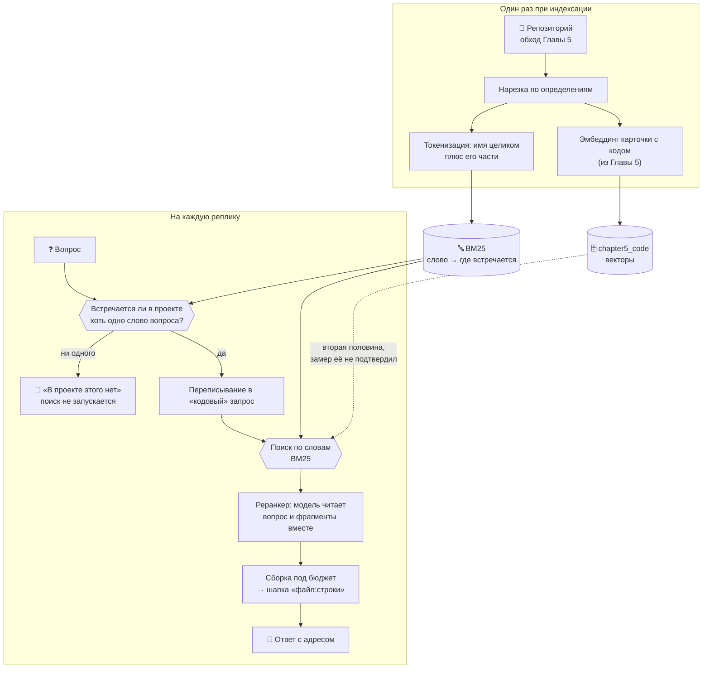

# 🔎 Глава 6. Поиск BM25: у ответа появляется ноль

> **Цель главы:** поставить рядом с векторным поиском поиск по словам — и получить то, чего у близости нет: возможность сказать «в проекте этого нет».

[Глава 5](../chapter5/README.md) закончилась двумя незакрытыми долгами, и оба — про одно и то же свойство векторной близости.

Первый: **близость слепа к точному совпадению**. `is_safe_query` не находится вопросом, в котором нет слова `is_safe_query`, — хотя по индексу оно ищется буквальным сравнением за миллисекунды.

Второй, он же долг Главы 4: **порога «ответа нет» не существует**. Вопрос «Как приготовить борщ?» получил на корпусе документов лучший фрагмент с близостью 0.743 — выше, чем четыре релевантных вопроса из пяти. Все шесть вопросов уместились в полосу шириной 0.05. Отказ держался на послушании модели («в найденных фрагментах ответа нет — так и скажи»), и держался не всегда.

Оба долга — одно и то же. Косинусная близость **ранжирует, но не находит**: она говорит, что этот фрагмент похож больше остальных, и не говорит, похож ли он вообще. У неё нет нуля.

У поиска по словам ноль есть, и он берётся из проверяемого факта: слово запроса либо встречается в корпусе, либо нет. Если не встречается ни одно — возвращать нечего, и это содержательный ответ, а не сбой.

Сразу о размере результата, чтобы дальше читалось без завышенных ожиданий. **Ноль получился настоящий, но узкий.** Он срабатывает там, где ни одно значимое слово вопроса в проекте не встречается ни разу, — это четыре посторонних вопроса из четырнадцати в замере главы. Остальные десять проходят и получают обычную выдачу, как в Главе 5. Полосы, которая отделяла бы «вопрос про этот проект» от «вопрос про что-то другое», не существует: замер это проверял и не нашёл.



Главная мысль: **прежде чем улучшать ранжирование, стоит спросить, есть ли у поиска ноль.** Система, которая всегда возвращает пять лучших результатов, на вопрос без ответа возвращает пять лучших неправильных — и по виду выдачи отличить этот случай нельзя.

Пунктирная стрелка на схеме — векторный поиск Глав 4 и 5. Он никуда не делся, но в этой главе выяснилось, что на вопросах о коде он почти не помогает, а попытка сложить его с BM25 делает результат хуже, чем чистый BM25. Разбор — в «Что не сработало»; включить его обратно можно одной переменной.

---

## 🔍 Что делаем

### Что считать словом в исходнике

Обычная текстовая токенизация на коде работает плохо, и видно это на одном имени:

```
обычная      is_safe_query  →  is_safe_query
наша         is_safe_query  →  is_safe_query, safe, query
```

Первая строка находит функцию только по имени целиком. Вторая находит её ещё и вопросом «безопасность query» — потому что имя [разбирается на слова](src/lexical.py#L156) тем же разбором, что и карточка фрагмента Главы 5. Целое имя при этом остаётся токеном и весит больше всех: оно встречается в считанных фрагментах, а `query` — в сотне с лишним.

Два решения, которые стоит проговорить.

**Пунктуация выброшена.** Скобка есть почти в каждом фрагменте кода, её вес близок к нулю, и на ранжирование она не влияет — зато заняла бы половину индекса.

**Служебные слова выброшены, и русские тоже.** Вот это не про размер индекса, а про то, на чём держится весь порог главы. Докстроки и комментарии в этом проекте написаны по-русски, поэтому вопрос «как приготовить борщ» без вычистки слова «как» совпал бы с половиной корпуса — и ноль перестал бы быть нулём.

### BM25: как устроен счётчик совпадений

BM25 — это формула, которая берёт запрос и кусок текста и выдаёт одно число: насколько этот кусок похож на то, что искали. Больше число — выше в выдаче. Больше она не делает ничего.

Придумали её в девяностых в Лондоне, для поиска по библиотечному каталогу, задолго до всяких нейросетей. Название читается буквально: Best Match — «лучшее совпадение», а 25 значит, что это была двадцать пятая по счёту попытка. Двадцать четыре предыдущие работали хуже, эта прижилась — и до сих пор по умолчанию считает релевантность в Lucene и Elasticsearch, то есть в поисковых движках, на которых работает уйма сайтов и приложений. Это не музейный экспонат.

Главное, что стоит понять про неё сразу: **BM25 ничего не понимает.** Она не знает, что «машина» и «автомобиль» — про одно и то же. Не знает, что такое функция. Не отличает код от стихов. Она умеет ровно одно: смотреть, какие слова из запроса встретились в тексте, сколько раз и насколько эти слова редкие. Всё её «понимание» — арифметика над словами.

Ровно поэтому она и оказалась нужна рядом с векторным поиском. Тот устроен наоборот: понимает смысл, но слеп к буквам. Один знает, что «машина» и «автомобиль» — синонимы, но путает `calculator` с `calculate`; вторая не догадается про синонимы, зато `is_safe_query` найдёт с первого раза. Слабости у них в разных местах.

Начать стоит с того, как это выглядит, если делать в лоб.

**Попытка первая: сколько слов запроса нашлось.** На вопрос «где оценивается количество токенов» ищем фрагменты, где есть «оценивается», «количество», «токенов». Считаем совпадения, сортируем по убыванию.

Ломается это на первом же вопросе про код. Фрагмент, где совпало только слово `text`, получит столько же, сколько фрагмент, где совпала «оценка», — при том что `text` есть в 228 фрагментах этого проекта из 1069, а «оценка» в шести. Первое совпадение не сообщает почти ничего, второе почти показывает пальцем, а счётчик засчитывает их одинаково.

Список служебных слов из предыдущего раздела эту беду не лечит, а только притупляет: `def` и `return` в него внести можно, а `text`, `query` и `chunk` — уже нет, они бывают и содержательными. Список слов — грубый выключатель, а нужен регулятор.

Отсюда и первая поправка — самая важная из трёх.

#### Первая поправка: редкое слово говорит больше, чем частое

Регулятор устроен просто: у каждого слова есть **вес**, и он тем выше, чем в меньшем числе фрагментов слово встречается. Считается [одной строкой](src/bm25.py#L131), по числу фрагментов со словом и общему их числу.

На настоящем индексе курса разброс такой (здесь и дальше в этом разделе — корпус глав 0–5, 1069 фрагментов; почему не весь репозиторий, разобрано ниже, в «Замере, который сломал сам себя»):

| Слово | В скольких фрагментах | Вес |
| :--- | ---: | ---: |
| `text` | 228 | 1.54 |
| `токенов` | 47 | 3.11 |
| `тексте` | 17 | 4.11 |
| `оценка` | 6 | 5.10 |

Слово из каждого пятого фрагмента весит втрое меньше слова из шести. Именно эта поправка делает лексический поиск пригодным для кода — где, напомним, половина текста состоит из ключевых слов языка, одинаковых во всех файлах.

Форма формулы выбрана не первая попавшаяся. У классической — с логарифмом отношения без единицы — слово, встречающееся больше чем в половине фрагментов, получает **отрицательный** вес: документ начинает штрафоваться за то, что это слово у него есть. Здесь вес частого слова стремится к нулю, но ниже не опускается.

В книгах и статьях этот вес называют **IDF** — inverse document frequency, «обратная частота по документам». Название описывает ровно то, что мы сейчас вывели: чем в большем числе документов слово встречается, тем меньше оно весит.

#### Вторая поправка: чаще — лучше, но не бесконечно

Второе соображение очевидное: если слово встречается во фрагменте пять раз, а не один, фрагмент скорее про него. Но линейно это считать нельзя — иначе фрагмент, где `token` упомянут двадцать раз, обойдёт тот, где рядом стоят `token`, `estimate` и `budget`, а нужен как раз второй.

Поэтому рост **насыщается**: первое вхождение добавляет много, второе заметно меньше, десятое почти ничего. Насколько быстро — задаёт `k1 = 1.5`:

| Вхождений слова | Вклад (при весе слова 1.0) |
| ---: | ---: |
| 1 | 1.00 |
| 2 | 1.43 |
| 3 | 1.67 |
| 5 | 1.92 |
| 10 | 2.17 |
| 50 | 2.43 |

Потолок — `k1 + 1 = 2.5`, и к нему кривая подходит уже к десятому вхождению. Практический смысл: **два разных слова запроса всегда весят больше, чем одно слово дважды**. Это ровно то, чего мы хотим от поиска.

Число вхождений слова в документ называют **TF** — term frequency, частота слова. Вместе с IDF из предыдущего подраздела это и есть знаменитая пара «TF-IDF», на которой стоит весь лексический поиск: сколько раз слово встретилось здесь, помноженное на то, насколько оно редкое вообще.

#### Третья поправка: в простыне слово встречается само собой

Третья поправка чинит перекос, который иначе виден сразу. Фрагмент на четыреста слов содержит почти любое слово просто потому, что он большой. Без поправки поиск всегда вытаскивал бы самые длинные куски.

Поэтому вклад делится на длину фрагмента относительно средней по корпусу (здесь средняя — 62 слова). Сила поправки — `b = 0.75`, общепринятая середина между «длину не учитываем вовсе» и «учитываем полностью»:

| Длина фрагмента | Вклад одного вхождения (при весе слова 1.0) |
| ---: | ---: |
| 10 слов | 1.61 |
| 30 слов | 1.31 |
| 62 слова (средняя) | 1.00 |
| 150 слов | 0.61 |
| 400 слов | 0.29 |

Одно и то же слово в короткой функции весит впятеро больше, чем в длинной. Для нарезки по определениям это удачно ложится: короткий фрагмент — это обычно одна функция целиком, и совпадение в ней говорит больше, чем совпадение где-то посреди класса на четыреста строк.

#### Всё вместе

```
                              tf · (k1 + 1)
score = Σ      IDF(слово) · ─────────────────────────────────
     слово∈запрос            tf + k1 · (1 − b + b · длина/средняя)
```

Три сомножителя — три поправки: **редкость слова** снаружи, **частота с насыщением** в числителе, **длина фрагмента** в знаменателе. Складывается по словам запроса; слова, которых во фрагменте нет, ничего не добавляют — и ничего не отнимают.

#### Один запрос до последнего числа

Запрос «оценка количества токенов в тексте» на корпусе глав 0–5. После [токенизации](src/lexical.py#L156) от него остаётся `оценка, количества, токенов, тексте` — предлог «в» выброшен как служебное слово.

Первое место, 14.94:

```
chapter3/src/context.py:45-55 · estimate_tokens
38 слов — короче средних 62, поэтому множитель длины 1.21

  слово      в скольких фрагментах    вес    раз    вклад
  оценка                 6           5.10     1      6.18
  токенов               47           3.11     1      3.77
  тексте                17           4.11     1      4.98
                                                   ───────
                                                     14.94
```

Совпали три слова из четырёх, каждое по разу. Вклад слова — это его вес, умноженный на множитель длины: 5.10 × 1.21 = 6.18. Больше всего дала «оценка», потому что она редкая, а не потому что важная: алгоритм про важность ничего не знает.

Второе место, 8.01 — и оно объясняет поправку на длину лучше любого примера:

```
chapter3/src/context.py:366-368 · Conversation.history_tokens
12 слов — впятеро короче средних, множитель длины 1.57

  слово      в скольких фрагментах    вес    раз    вклад
  оценка                 6           5.10     1      8.01
```

Совпало **одно** слово из четырёх, а фрагмент занял второе место. Потому что он крошечный: двенадцать слов против средних шестидесяти двух, и единственное совпадение в нём весит больше, чем то же слово в победителе (6.18). Короткий фрагмент, в котором нашлось нужное слово, — это, скорее всего, про него и есть.

Третье место, 7.05, показывает насыщение:

```
chapter5/src/codebase.py:279-310 · CodeIndex.build_context
119 слов — вдвое длиннее средних; множитель одного вхождения 0.71, двух — 1.10

  слово      в скольких фрагментах    вес    раз    вклад
  оценка                 6           5.10     1      3.61
  токенов               47           3.11     2      3.44
                                                   ───────
                                                      7.05
```

Здесь совпало два слова, причём «токенов» дважды — и всё равно фрагмент проиграл тому, где совпало одно. Обе поправки видны сразу: второе вхождение «токенов» подняло множитель с 0.71 до 1.10, то есть в полтора раза, а не вдвое — это насыщение; и длина срезала всё остальное — у победителя тот же множитель был 1.21.

#### Обратный индекс

Считать это для всех тысячи фрагментов на каждый запрос не нужно и не делается. Внутри лежит обратный индекс: слово → в каких фрагментах оно встречается и сколько раз. [Поиск](src/bm25.py#L153) обходит списки вхождений слов запроса, а не корпус: по слову «оценка» это шесть фрагментов из тысячи, а не тысяча.

Токенизация при этом делается один раз, при сборке индекса. Разбирать текст на слова в момент запроса — значит на каждый вопрос заново прочитать весь корпус.

### Ноль: когда агент говорит «в проекте этого нет»

Вот ради чего глава. У BM25 есть свойство, которого нет у близости: если ни одно слово запроса не встречается в корпусе, обходить нечего и складывать нечего — результат пуст. Не «плохие результаты», а ничего.

Сначала кажется, что этого достаточно: считаем вес лучшего совпадения и ставим порог. Ниже порога — «не знаю», выше — обычная выдача. Такой порог в главе был, стоял на 8.0, и первый замер показал идеальное разделение: двенадцать вопросов о проекте выше, двенадцать посторонних ниже.

Замер был неверен, и разбор его провала — в «Что не сработало». Короткая версия: те двенадцать вопросов оказались слишком удобными, а на реалистичном наборе распределения перекрываются, и порог начинает отказывать настоящим вопросам.

Осталось правило, которое переживает проверку, потому что не содержит подгоняемого числа:

> **Отказ, когда ни одно содержательное слово вопроса не встречается в проекте ни разу.**

Не «мало совпадений», а «совпадений нет вообще». Смотрит [`lexical_signal`](src/hybrid.py#L200) — доля слов вопроса, найденных в корпусе; ноль означает отказ.

Осторожность здесь намеренно однобокая, и это выбор, а не случайность. Ложное «не знаю» на настоящем вопросе — потерянный ответ; ложное «знаю» на постороннем возвращает нас к поведению Главы 5, то есть не хуже, чем было. Поэтому правило стоит в самой осторожной точке — той, где ложных отказов ноль.

Что это даёт на замере: 4 отказа из 14 посторонних вопросов и **ни одного ложного отказа** на 20 вопросах о проекте. Скромно — и это настоящее число, а не то, которое хотелось получить.

Порог считается по **исходному** вопросу, а не по переписанному. Переписывание Главы 5 придумывает правдоподобные английские имена, и на вопросе про борщ модель выдаст что-нибудь вроде `cook recipe soup` — слова, которых в проекте тоже нет, но проверять надо не их.

Отказ называет, чего именно не нашлось:

```
🚫 Похоже, в проекте этого нет (лексический вес 0.0, слов найдено 0%,
   не встречаются: рисуется, график, продаж)
```

«В проекте нет упоминаний: график, продаж» — это ответ. «Ничего не найдено» — отписка.

Отдельная деталь, которая стоила живого прогона. Блок отказа уезжает в контекст модели как **данные**, без единого повелительного наклонения. В первой версии там стояло «Так и скажи пользователю. НЕ ВЫДУМЫВАЙ ни файлы, ни номера строк» — и 3B скопировала обе фразы в ответ пользователю целиком, вместе с обращением к самой себе:

```text
✅ Ответ: В коде проекта нет ответа на вопрос «где реализовано чтение
   файлов?»… Так и скажи пользователю. НЕ ВЫДУМЫВАЙ ни файлы,
   ни номера строк.
```

Указания модели живут в системном промпте, в контекст едет только факт. Правило общее: всё, что кладётся в контекст рядом с данными, модель может принять за текст для пересказа.

### Реранкер: второй взгляд, читающий вопрос и код вместе

И векторный поиск, и BM25 обрабатывают вопрос и фрагмент **порознь**. Вектор фрагмента посчитан заранее и о вопросе ничего не знает; список вхождений слова собран заранее тоже. Сравниваются уже готовые числа — потому поиск и быстрый: тысяча фрагментов, и ни один не пришлось прочитать в момент запроса.

Реранкер работает наоборот: берёт пару «вопрос + фрагмент» целиком. Поэтому он видит то, чего не видит поиск: что имя в найденном фрагменте не определяется, а вызывается; что перед ним тест, а спрашивали про реализацию. И поэтому же он медленный — каждая пара отдельная работа. Отсюда порядок: сначала поиск сужает тысячу до восьми, потом реранкер разбирается с восемью и оставляет пять.

Такие модели называют **cross-encoder** — «перекрёстный кодировщик»: в отличие от модели эмбеддингов, которая кодирует вопрос и текст порознь, эта пропускает их через себя вместе, крест-накрест. Обычно берут небольшую готовую вроде `ms-marco-MiniLM`, обученную ровно на эту задачу и дающую оценку пары за миллисекунды. Здесь её нет: она тянет `torch` и `sentence-transformers`, около 2.5 ГБ, на курс про 6 ГБ видеопамяти, где память уже занята основной моделью и моделью эмбеддингов. Вместо неё — [та же LLM, что отвечает пользователю](src/reranker.py#L185): один запрос, в котором она видит вопрос и всех кандидатов разом и расставляет их по порядку.

Работает это заметно. На двенадцати вопросах главы, средний обратный ранг:

| Модель | без реранкера | с реранкером | прибавка | секунд на вопрос |
| :--- | ---: | ---: | ---: | ---: |
| `qwen2.5:3b` | 0.40 | 0.45 | +0.05 | 2.0 |
| `qwen2.5-coder:7b` | 0.45 | 0.52 | +0.07 | 4.9 |
| `qwen2.5-coder:7b` (повтор) | 0.43 | 0.50 | +0.07 | 4.8 |
| `llama3.1:8b` | 0.37 | 0.46 | +0.09 | 5.4 |

Помогает на всех трёх, и у модели для кода прибавка повторилась в двух прогонах подряд — значит это не разброс. Видно и поимённо: у `llama3.1:8b` определение `is_safe_query` уехало с четвёртого места на первое, `build_context` — с пятого на второе.

Одна деталь про то, как это мерить. **Число попаданий у реранкера не меняется почти никогда** — он меняет порядок, а не состав. Мерить его долей найденных ответов бессмысленно; нужен средний обратный ранг. На этом я и споткнулся в первой версии замера, о чём ниже.

Отказ здесь ничего не роняет. Не ответила модель, вернула мусор, назвала номера, которых нет, — [порядок остаётся тем, что дал поиск](src/reranker.py#L173). Приём либо улучшает, либо не меняет ничего — как переписывание запроса в Главе 5.

### Один новый инструмент, а не пять

Глава 5 оставила долг другого рода: системный промпт вырос до 4749 токенов из 8192, и на историю разговора осталось меньше трети окна. Каждый инструмент уезжает в промпт описанием и сигнатурой, поэтому добавлять их по привычке больше нельзя.

`search_code` поэтому не добавляется, а **замещается**. Реестр Главы 2 — обычный словарь «имя → функция», и повторная регистрация под тем же именем меняет реализацию, не трогая ни промпт, ни число инструментов. Модель по-прежнему видит `search_code`, а под ним теперь поиск по словам с реранкером.

Добавляется один — [`grep_code`](src/tools.py#L112), точное вхождение строки в файлах проекта. Ему здесь место потому, что это третий, самый прямолинейный способ искать, и у него, как и у BM25, есть настоящий ноль. Таблица символов Главы 5 находит **определения** по имени; `grep_code` находит любое упоминание где угодно — в теле функции, в комментарии, в строке сообщения об ошибке. На вопрос «откуда берётся вот это сообщение» ни поиск по смыслу, ни таблица символов не отвечают, а точное вхождение отвечает сразу и без модели.

---

## 🧪 Что не сработало

За каждым пунктом здесь стоит замер. Три из них опровергают то, что было написано в первой версии этой главы, и только в одном случае виноват сам приём — в двух других я неверно мерил.

### Гибрид: сложить два поиска и получить среднее

Идея, с которой глава начиналась: искать обоими способами и объединять выдачи. Векторный поиск переживает переформулировку, но слеп к точным именам; лексический наоборот. Складывать их кажется очевидно правильным.

Складывать оценки напрямую нельзя — шкалы несопоставимы. Близость лежит в отрезке [0, 1] и на этом корпусе почти всегда между 0.6 и 0.8; вес BM25 ничем не ограничен сверху и на точном совпадении имени доходит до 20. Нормировка по максимуму внутри выдачи меняет одну беду на другую: лучший результат любого списка становится равным единице — и отличный, и лучший из плохих. Плюс фрагмент, который нашёл только один поиск, получил бы у второго ноль, то есть штраф, будто его отвергли, — хотя он просто не попал в двадцатку.

Стандартный ответ на это — **Reciprocal Rank Fusion**: складывать не оценки, а места.

```
score(фрагмент) = Σ  1 / (k + место в списке)
```

Сумма берётся по тем спискам, где фрагмент вообще есть, поэтому шкалы приводить друг к другу не нужно. Фрагмент, найденный обоими поисками, получает два слагаемых и обгоняет тех, кого нашёл один. Константа `k = 60` — из статьи, где приём был предложен: при таком `k` решает не место внутри списка, а то, в скольких списках фрагмент нашёлся. Реализация — [`rrf`](src/fusion.py#L51), двадцать строк.

Всё это верно и не помогло. Двенадцать вопросов, 235 фрагментов, тот же набор, что в замерах Главы 5:

| Режим | Определение в первой пятёрке | MRR |
| :--- | :---: | ---: |
| только векторы | 1 / 12 | 0.02 |
| только BM25 | 5 / 12 | 0.20 |
| гибрид (RRF) | 2 / 12 | 0.12 |
| векторы + переписывание запроса | 5 / 12 | 0.33 |
| **BM25 + переписывание** | **8 / 12** | **0.42** |
| гибрид + переписывание | 7 / 12 | 0.40 |

Гибрид оказался **между** своими половинами, а не над ними. Причина в первой строке: векторный поиск на этом корпусе даёт одно попадание из двенадцати, то есть почти шум. RRF награждает согласие двух поисков — но когда один из них угадывает, согласие тоже угадывание.

Отсюда правило, которое стоит любых констант слияния: **сначала измерь каждую половину, потом складывай.** Гибрид не чинит плохой поиск, он его усредняет.

Векторная половина осталась в коде и включается переменной `AGENT_SEARCH_MODE=hybrid`. По умолчанию агент ищет только словами.

### RRF против взвешенной суммы: разницы нет

Абзац выше объясняет, почему складывать места правильнее, чем складывать оценки. Замер этого не подтвердил:

| Способ слияния | Определение в первой пятёрке | MRR |
| :--- | :---: | ---: |
| по местам (RRF) | 2 / 12 | 0.12 |
| по нормированным оценкам | 2 / 12 | 0.12 |

Совпадение до последней цифры, и объяснение то же: разница между способами слияния не видна, когда одна из сливаемых выдач почти случайна. Аргументы против взвешенной суммы остаются верными — на этом корпусе они просто ничего не меняют.

### Порог по весу: подгонка под удачную выборку

Первая версия этой главы утверждала, что вопросы о проекте и посторонние разделяются весом лучшего совпадения, и приводила порог 8.0 с идеальным результатом: 12 отказов из 12 посторонних, ни одного ложного.

Замер был подогнан, хоть и не нарочно. Двенадцать вопросов о проекте я подбирал так, чтобы у каждого была ровно одна функция-ответ, — и они вышли слишком удобными: у всех двенадцати нашлись **все** слова. Стоило добавить восемь обычных вопросов, которые задал бы живой человек, как зазор исчез:

```
о проекте:   3.17 … 15.64
посторонние: 0.00 …  7.21
```

Диапазоны перекрываются, и любой порог — это размен:

| порог | ложных отказов | пойманных посторонних |
| ---: | ---: | ---: |
| 3.0 | 0 из 20 | 4 из 14 |
| 7.0 | 3 из 20 | 13 из 14 |
| 8.0 | **4 из 20** | 14 из 14 |

Живой прогон показал худший случай на практике: «где реализовано чтение файлов» — обычный вопрос, ответ на который в проекте есть, — получил отказ, потому что слова «чтение» в коде нет (там «читает» и «чтения»), а морфологию русского токенизатор не знает.

Порог по весу остался ручкой `AGENT_NO_ANSWER`, по умолчанию выключенной. Заменило его правило без подгоняемого числа, разобранное выше.

### Реранкер, которого я не увидел

Первая версия главы сообщала, что реранкер не даёт ничего, и он был выключен. Замер был сломан: я давал реранкеру восемь кандидатов и проверял попадание в первую **восьмёрку**. Множество при перестановке не меняется — число попаданий не могло сдвинуться в принципе, а средний обратный ранг мерился на списке, где ответ и так уже лежал.

Агент работает иначе: восемь кандидатов, перестановка, пять в контекст. На этих двух конфигурациях реранкер даёт от +0.05 до +0.09 (таблица выше, в разделе про него).

Урок не про реранкер: **замер должен воспроизводить ту конфигурацию, в которой приём работает.** Мерить восемь из восьми там, где в жизни пять из восьми, — значит мерить не то.

### Замер, который сломал сам себя

Отдельная история, стоящая того, чтобы её рассказать.

Первый прогон порога дал **ноль отказов из двенадцати** посторонних вопросов. Причём вопрос «как испечь шарлотку» получил лексический вес 16.94 — выше, чем любой настоящий вопрос о коде.

Разгадка в том, где лежит список посторонних вопросов. Он лежит в `chapter6/tests.py`, а `chapter6/tests.py` — исходник этого проекта, и индексируется наравне с остальными. Слово «шарлотка» попало в корпус ровно в тот момент, когда я его туда записал; лексический поиск нашёл этот самый файл первым и был совершенно прав.

```
'как испечь шарлотку'  →  chapter6/tests.py   16.94
'где купить велосипед' →  chapter6/tests.py   15.65
```

Та же история со «старым» контрольным вопросом Главы 4: «Как приготовить борщ?» встречается в исходниках курса **семь раз** — в комментарии `chapter4/src/knowledge.py`, где разбирается этот самый замер, и в тестах трёх глав. Классический пример «вопроса, ответа на который в базе нет» перестал им быть, пока про него писали.

Дальше стало смешнее. Объясняя всё это в комментарии к коду, я написал туда пример с выдуманным именем класса — и через минуту тот же пример перестал работать, потому что имя попало в индекс. В комментарии теперь стоит буква X.

Лечится это тем, что порог меряется на корпусе глав 0–5 — на том, каким репозиторий был до этой главы. Оговорка к замеру, а не к приёму: в обычном проекте «как испечь шарлотку» в исходниках не встречается. Но помнить о ней стоит всякому, кто строит поиск по корпусу, который сам же и описывает.

### Отказ не защищает вопросы, не похожие на вопросы о коде

Проверка на отсутствие стоит **внутри** ветки «вопрос про код». Реплика «как настроить кубернетес кластер» под маркеры кода не подходит вовсе, поэтому до неё не доходит: уезжает в корпус документов Главы 4, где никакого нуля по-прежнему нет. Половина поверхности закрыта, половина нет.

---

## 🛡️ Безопасность

Начать надо не с того, что глава добавила, а с того, что она **нашла**.

**Личные данные попадали в индекс, вопреки тому, что написано в Главе 5.** Там сказано, что файлы из `.gitignore` в индекс не идут, «а значит `memory.json` с фактами о вас и `previous_session.json` с хвостом прошлого разговора». На деле шли: разбор `.gitignore` в Главе 5 понимал только имена **папок**, а правила с косой чертой (`chapter3/memory.json`) молча выбрасывал. Ваше имя, возраст и хвост прошлого разговора уезжали в модель эмбеддингов и ложились на диск в `chroma_db/` открытым текстом.

Обнаружилось это не проверкой безопасности, а по ложному отказу: слово «чтение» нашлось в корпусе ровно один раз — в записи предыдущего разговора пользователя. Починено в [`gitignore_entries`](../chapter5/src/languages.py#L122): папки и файлы разбираются отдельно, файлы отсекаются до чтения. Обход репозитория: было 76 файлов, стало 72.

Мораль общая и неприятная: **утверждение в тексте про то, чего система не делает, — такое же утверждение, как любое другое, и проверять его надо тестом.** Тест теперь есть.

Заодно из обхода убрана папка `.claude/` — настройки самого агента-помощника не исходники проекта.

Что глава меняет дальше.

**Лексический индекс не ходит в модель.** У векторного есть свойство, о котором Глава 5 предупреждала: текст всех фрагментов уезжает в Ollama и ложится на диск второй копией исходников. У лексического этого нет вовсе — он живёт в памяти процесса, собирается из файлов при запуске и умирает вместе с ним.

**Отказ сужает поверхность, а не расширяет.** Вопрос, содержательных слов которого в проекте нет, теперь **не доходит до поиска** — в контекст модели не попадает ни одного фрагмента. Раньше на такой вопрос уезжали пять «самых похожих» кусков кода. Меньше постороннего кода в контексте — меньше поводов для выдумывания.

**А вот `grep_code` показывает содержимое строк.** Он возвращает не имя и адрес, как таблица символов, а саму строку файла. Обход тот же, значит `.gitignore` и потолок размера файла работают, — но `.env.example` в индексе есть намеренно, и `grep_code` покажет его строки целиком. Пока в примере лежат примеры, это ровно то, что нужно; с настоящим ключом внутри — уже нет.

---

## 📐 Окно и бюджет

Окно то же, 8192 токена. Промпт вырос ещё на пятьсот токенов, и отдана за это снова история разговора.

| | Глава 5 | Глава 6 |
| :--- | ---: | ---: |
| Инструментов | 15 | 16 |
| Системный промпт | 4749 | 5247 |
| Бюджет истории | 2816 | 2318 |
| Из них на найденное | 1408 | 1159 |

Из пятисот токенов прироста 218 приходятся на **один few-shot пример** — тот, что показывает вызов `grep_code`. Это почти десятая часть всей истории разговора, отданная за три строки диалога в промпте. Глава 5 показала, что на 3B такие примеры решают, позовёт модель инструмент или нет, поэтому пример оставлен; но это тот случай, когда обмен виден в числах и его стоит держать в голове.

Один запрос к модели после этой главы:

```
┌─ system: промпт с описанием 16 инструментов ─ константа, 5247 токенов
├─ user:   [PREV_SESSION] пересказ прошлой сессии ── только по команде
├─ …       история разговора ──────────────── отбирается по смыслу
├─ user:   [TOOL_OUTPUT] найденный код или отказ ─── не больше 1159 токенов
└─ system: напоминание про правила ────────── константа

   chroma_db/chapter5_code ── векторы, на диске, собираются минутами
   BM25 в памяти процесса ─── слова, собираются за 0.7 с при запуске
```

Вторая половина индекса не требует ни модели, ни сети, поэтому и не хранится на диске: пересобрать её быстрее, чем следить, чтобы сохранённая не разъехалась с векторной.

---

## 🗺️ Три реплики агента целиком

Один прогон на `qwen2.5:3b`, три вопроса подряд в одном разговоре.

**Первый — то, ради чего глава.** Вопрос про метод, которого в проекте нет:

```text
Вы: где реализован метод drawSalesChart?

🚫 Похоже, в проекте этого нет (лексический вес 7.9, слов найдено 0%,
   не встречаются: drawsaleschart, draw, sales, chart)
🔎 Автопоиск: код — фрагменты добавлены в контекст
📊 Отправляем 4 сообщений, ~5457 токенов из 8192

✅ Ответ: Метод drawSalesChart не найден в проекте. Попробуйте уточнить
   запрос или проверить, не забыли ли вы написать его в коде.
```

Обратите внимание на число **7.9**. Это вес лучшего лексического совпадения — высокий, выше половины настоящих вопросов о проекте. Набрали его слова «где», «реализован» и «метод», которые есть в любом файле с кодом. Порог по весу такой вопрос пропустил бы; правило «ни одного содержательного слова» отказало. Вот, собственно, вся разница между двумя подходами на одном примере.

Поиск при этом не запускался: в контекст уехала одна строка о том, что искать нечего, а не пять «самых похожих» фрагментов кода.

**Второй — обычная работа:**

```text
Вы: где реализован калькулятор?

🔁 Запрос для поиска: где реализован калькулятор? calculator implementation
📊 Отправляем 6 сообщений, ~6573 токенов из 8192

✅ Ответ: …в chapter1/agent.py функция calculator реализована в диапазоне
   строк 82-91, а в chapter2/src/tools.py — в диапазоне строк 53-62.
   Функция search_code… в данном случае не нашла ничего по запросу
   «где реализован калькулятор».
```

Адреса верные: на строке 82 действительно `def calculator(expression: str) -> str`. Сравните с прогоном Главы 5, где на тот же вопрос модель выдумала строку 30 и сигнатуру `-> float`.

Последняя фраза — выдумка другого рода. Никакой `search_code` не вызывался и ничего не сообщал: модель пересказала кусок описания инструмента из системного промпта как событие, которое произошло. Ответ верный, приписка к нему — нет.

**Третий — то, что глава не починила:**

```text
Вы: где встречается HISTORY_BUDGET?

✅ Ответ: Константа HISTORY_BUDGET встречается в следующих местах проекта:
   - chapter4/agent.py:215-222, где она используется в функции budget_report.
   - chapter5/agent.py:156-181, где она используется в определении…
```

Адреса опять верные — на 215 действительно `def budget_report`, на 165 действительно `HISTORY_BUDGET = max(`. И «константа» на этот раз названа константой, а не функцией.

Неверно другое: названы два места из **семидесяти трёх**. `grep_code` на том же имени находит его в четырёх главах, включая `chapter3/agent.py:155`, где оно определяется впервые. И сам `grep_code` **не был вызван** — вопрос «где встречается» ровно тот, ради которого инструмент добавлялся, но автопоиск уже положил фрагменты в контекст, и 3B, увидев фрагменты, переключается в режим «отвечай по фрагментам».

Это в точности та беда, которую измерила Глава 5: получив выдачу, модель перестаёт видеть инструменты. Новый инструмент её не лечит — он ей подвержен.

---

## 🚀 Как запустить

Нужны Ollama, основная модель и модель эмбеддингов — как в главах 4 и 5:

```bash
ollama pull qwen2.5:3b
ollama pull nomic-embed-text
```

Запуск из корня проекта:

```bash
python -m chapter6.agent
```

При первом запуске лексический индекс собирается сам, за доли секунды, и командой не управляется: пересобрать его быстрее, чем проверять, не устарел ли он. Векторный по умолчанию не нужен вовсе — он понадобится, только если включить `AGENT_SEARCH_MODE=hybrid`, и тогда его надо собрать командой `индекс кода` (это минуты).

Команды диалога: `индекс кода` — сверить оба индекса, `код` — что в них лежит, `реранкер` — сколько раз его звали и сколько это заняло, `карта` — пересобрать карту проекта, `индекс`/`база` — корпус документов Главы 4, `продолжить` — поднять прошлый разговор, `забудь` — очистить историю, `выход`.

Переключатели для сравнения — все читаются один раз при импорте:

| Переменная | Что делает |
| :--- | :--- |
| `AGENT_SEARCH_MODE=hybrid` | добавить к словам векторную половину (замер её не подтвердил) |
| `AGENT_SEARCH_MODE=vector` | искать только по смыслу — поведение Главы 5 |
| `AGENT_RERANK=0` | выключает реранкер: выдача поиска идёт как есть, ответ на 2–5 секунд быстрее |
| `AGENT_NO_ANSWER=7` | добавляет отказ по весу: отказов больше, но появляются ложные |
| `AGENT_NO_ANSWER_SUPPORT=-1` | выключает отказ совсем: агент отвечает на любой вопрос |
| `AGENT_CODE_REWRITE=0` | выключает переписывание запроса (Глава 5) |
| `AGENT_CODE_AUTO=0` | выключает автопоиск: поиск только по решению модели |

Тесты:

```bash
python -m pytest chapter6/tests.py -q
```

Замеры главы (нужна Ollama, занимают минуты):

```bash
python -m pytest chapter6/tests.py -m slow -v -s
```

---

## 🔄 Что изменилось с Главы 5

| | Глава 5 | Глава 6 |
| :--- | :--- | :--- |
| Чем ищем | близостью векторов | совпадением слов (BM25) |
| Индекс поиска | векторы в ChromaDB, минуты на сборку | слова в памяти, 0.7 с на сборку |
| Нужна ли модель для поиска | да, эмбеддер на каждый фрагмент | нет |
| Ответ «этого нет» | послушание модели | проверяемый факт: слов вопроса нет в проекте |
| Порядок выдачи | как дал поиск | переставляет реранкер |
| Точное вхождение строки | — | `grep_code` |
| Инструментов | 15 | 16 |
| Системный промпт | 4749 токенов | 5247 |
| Бюджет истории | 2816 | 2318 |
| Определение в первой пятёрке | 6–7 из 12 | 8 из 12 |

Главное изменение снова не в таблице, и оно не то, ради которого глава задумывалась. Задумывалась она ради слияния двух поисков; слияние оказалось усреднением. Дало другое: **у поиска появился ноль**, и на этом наполовину закрылся долг, тянувшийся с Главы 4.

---

## ⚡ Замеры и производительность

Условия у всех замеров одни: одна машина (GTX 1660 SUPER, 6 ГБ), Ollama, корпус — исходники этого курса. Прогоняются командой `python -m pytest chapter6/tests.py -m slow -v -s`.

### Отказ «в проекте этого нет» — главный результат главы

Корпус: 1064 фрагмента (главы 0–5, без `chapter6/` — почему, разобрано выше). Двадцать вопросов, ответ на которые в коде есть, против четырнадцати посторонних. Правило: отказ, если ни одно содержательное слово вопроса в проекте не встречается.

| | Вопросов | Отказано |
| :--- | ---: | ---: |
| вопросы о проекте | 20 | **0** |
| посторонние вопросы | 14 | **6** |

Отказ получили: «как настроить кубернетес кластер», «где купить велосипед», «где настраивается виртуальный хост nginx», «как испечь шарлотку», «где реализовано кэширование в redis», «где в проекте авторизация по oauth».

Восемь посторонних прошли — у них нашлись отдельные слова: «сегодня» и «курс» есть в коде инструмента времени, «схема» — в JSON Schema, «логи» — в логировании. Ловить их пришлось бы порогом по весу, а он, как показано выше, отказывает и настоящим вопросам.

Сравните с тем, чем кончилась Глава 4: там шесть вопросов уместились в полосу близости шириной 0.05, и разделить их было нечем вообще.

Живой прогон показал, почему правило считает слова, а не вес: вопрос «где реализован метод drawSalesChart» набрал вес **7.9** — выше половины настоящих вопросов, — целиком за счёт слов «где», «реализован» и «метод». По весу он бы прошёл; по содержательным словам получил отказ.

### Что даёт поиск по словам на вопросах о коде

Двенадцать вопросов Главы 5, 235 фрагментов, определение в первой пятёрке:

| | без переписывания | с переписыванием |
| :--- | :---: | :---: |
| векторы (Глава 5) | 1 / 12 | 5 / 12 |
| **BM25** | **5 / 12** | **8 / 12** |

Векторный поиск сам по себе находит одно определение из двенадцати — ровно то число, которым закончилась Глава 5. BM25 без всякой помощи модели находит пять. С переписыванием запроса — восемь, и это лучший результат за две главы.

Причина простая: русский вопрос вроде «как история разговора обрезается по бюджету» содержит слова «история», «разговор», «бюджет» — и все три встречаются в русских докстроках нужной функции. Векторной близости мешает то, что русская проза вообще ближе к русской прозе; поиску по словам это безразлично.

**Переписывание запроса Главы 5 нужно поиску по словам больше, чем векторному.** У русского вопроса нет ни одного английского имени, а BM25 ищет именно слова — перевод вопроса на язык кода даёт ему то, чего иначе не будет вовсе. Приём из прошлой главы оказался полезнее в этой.

### Реранкер на трёх моделях

Средний обратный ранг на тех же двенадцати вопросах; поиск отдаёт восемь кандидатов, в контекст едут пять.

| Модель | без реранкера | с реранкером | прибавка | секунд на вопрос |
| :--- | ---: | ---: | ---: | ---: |
| `qwen2.5:3b` | 0.40 | 0.45 | +0.05 | 2.0 |
| `qwen2.5-coder:7b` | 0.45 | 0.52 | +0.07 | 4.9 |
| `qwen2.5-coder:7b` (повтор) | 0.43 | 0.50 | +0.07 | 4.8 |
| `llama3.1:8b` | 0.37 | 0.46 | +0.09 | 5.4 |

Разброс базовой линии между моделями — это не реранкер, а **переписывание запроса**: модель для кода придумывает более правдоподобные имена функций, чем общая, и находит 9–10 определений из 12 против 7–8 у остальных.

### Время и объём

| Что | Сколько |
| :--- | :--- |
| Разбор 55 файлов → 1251 фрагмент | 0.29 с |
| Лексический индекс поверх них | 0.34 с |
| Словарь индекса | 9199 слов |
| Один поиск по словам | 0.1 мс |
| Один запрос к реранкеру | 2.0–5.4 с |
| Переписывание запроса (Глава 5) | 0.6 с |

Весь поиск этой главы собирается за **семь десятых секунды на репозиторий** и не требует ни модели, ни сети, ни диска. Векторный индекс на том же корпусе — минуты и обращение к модели на каждый изменившийся фрагмент.

Это и есть довод главы про слабое железо: **самый заметный прирост качества здесь дал алгоритм, а не модель.** BM25 без всякой помощи модели нашёл впятеро больше определений, чем векторный поиск, не потратив ни одного обращения к GPU. Модель нужна ровно в двух местах — переписать запрос и переставить восемь фрагментов, — и оба раза это секунды поверх миллисекунд поиска.

### Границы замеров

Всё выше снято на одном корпусе, одной модели эмбеддингов и наборах из 12, 20 и 14 вопросов. Это мало: разница между 7 и 8 попаданиями — один вопрос, и делать из неё вывод нельзя. Что на таком объёме читается надёжно — разрывы втрое и больше (1 против 5) и полное отсутствие ложных отказов на двадцати вопросах; что не читается — разница в один-два вопроса.

Вопросы подобраны специально так, чтобы в них не было ни одного слова из кода: это худший случай для поиска, и на вопросах с именами всё выглядело бы лучше.

Замеры с участием LLM плавают между прогонами, и это видно прямо в таблицах: строка «векторы + переписывание» — та же конфигурация, что Глава 5 замеряла на том же корпусе и тех же вопросах, и там она давала 6 и 7 из 12 в двух прогонах, а здесь дала 5. Переписывание — вызов модели, а модель не детерминирована. Поэтому дельта реранкера и приведена по двум прогонам на одной модели: +0.07 дважды читается как результат, одно измерение — нет.

---

## ⚠️ Что осталось нерешённым

**Ноль узкий.** Шесть отказов из четырнадцати посторонних вопросов — это половина. Другая половина проходит и получает обычную выдачу, как в Главе 5. Правило намеренно поставлено в самую осторожную точку, и расширять его без нового сигнала некуда: замер показал, что порога, который ловил бы больше и не терял настоящих ответов, не существует.

**Отказ живёт только в ветке кода.** Вопрос, не похожий на вопрос о коде, уезжает в корпус документов Главы 4, где нуля по-прежнему нет.

**Морфологии русского токенизатор не знает.** «Чтение» и «читает» для него разные слова, и это уже один раз обернулось ложным отказом. Стемминг решил бы задачу, но тянет либо словарь, либо внешнюю библиотеку.

**Список слов-рамок вопроса — ручной.** «Класс», «метод», «функция» в него входят, «файл» — нет, потому что в вопросе «чтение файлов» файлы предмет, а не форма. Граница проведена по замеру, а не по правилу, и на другом языке вопросов её придётся проводить заново.

**Векторная половина не оправдалась, и глава не знает почему до конца.** Один вопрос из двенадцати — это свойство `nomic-embed-text` на русском, свойство корпуса или свойство вопросов, подобранных без единого слова из кода? Проверить значило бы взять вторую модель эмбеддингов; в главе этого нет.

**Лексический индекс собирается заново при каждом запуске.** На 1251 фрагменте это 0.7 с и незаметно. На корпусе в сто раз больше понадобится хранение и инкрементальное обновление.

**`grep_code` модель не зовёт.** Автопоиск кладёт фрагменты в контекст раньше, и 3B переключается в режим «отвечай по фрагментам». Та же беда, что измерена в Главе 5, и новый инструмент ей подвержен.

**Промпт вырос ещё на пятьсот токенов.** На историю разговора осталось 2318 из 8192, и 218 из потраченного — один few-shot пример.

---

## 🎯 Итог главы

Агент научился:

* ✅ искать код по совпадению слов, а не только по смыслу: `is_safe_query` находится по имени, `HISTORY_BUDGET` — по любому упоминанию, включая комментарии и строки;
* ✅ разбирать идентификатор на слова при индексации, так что одно определение находится и точным именем, и вопросом своими словами;
* ✅ **отвечать «в проекте этого нет» — и называть, каких именно слов не нашлось**;
* ✅ отличать «поиск не справился» от «такого тут нет»: у второго теперь проверяемое основание, а не послушание модели;
* ✅ переставлять найденное вторым проходом модели — единственное место, где модель сидит внутри поиска и приносит пользу.

Чего он **не** умеет:

* ❌ отказывать надёжно: шесть посторонних вопросов из четырнадцати, остальные проходят;
* ❌ говорить «не знаю» на вопрос, не похожий на вопрос о коде;
* ❌ выигрывать слиянием: гибрид на этом корпусе хуже своей лучшей половины;
* ❌ понимать, что «чтение» и «читает» — одно слово.

### Ноль важнее ранжирования

Глава задумывалась про то, как объединить два поиска. Объединение не сработало, и это оказалось не главным.

Векторный поиск двух глав подряд отвечал на любой вопрос. Он не мог не отвечать: близость — величина относительная, она сравнивает фрагменты между собой и ничего не знает о том, отвечает ли лучший из них на вопрос вообще. Все попытки достроить к ней отказ — порог по абсолютному значению, нормировка на среднее, просьба в промпте — упирались в это.

У поиска по словам в основании лежит проверяемый факт: слово либо есть в корпусе, либо нет. Ранжирует он не лучше — на половине вопросов лучше векторов, но и сам промахивается четыре раза из двенадцати. Зато там, где ответа нет, он это **знает**, а не догадывается.

Обобщение, ради которого стоило писать главу: **прежде чем улучшать ранжирование, спросите, есть ли у поиска ноль.** Система, которая всегда возвращает пять лучших результатов, на вопрос без ответа возвращает пять лучших неправильных — и по виду выдачи отличить этот случай нельзя. Один сигнал с настоящим нулём рядом даёт больше, чем удвоение качества ранжирования: он превращает «вот пять кандидатов» в «а вот тут кандидатов нет».

И второе, чему научила эта глава уже не про поиск. Три её вывода пришлось переписать после того, как замеры оказались неверными: разделение по весу было подгонкой под удачную выборку, «реранкер не помогает» — следствием того, что я мерил не ту конфигурацию, а список посторонних вопросов сам себя обезвредил, попав в индекс. **Замер — такой же код, и в нём такие же ошибки.** Разница в том, что ошибка в замере не падает с исключением, а выглядит как результат.

|[Назад](../chapter5/README.md) | [📚 Оглавление](../README.md) | Далее: Глава 7 (в работе)|
