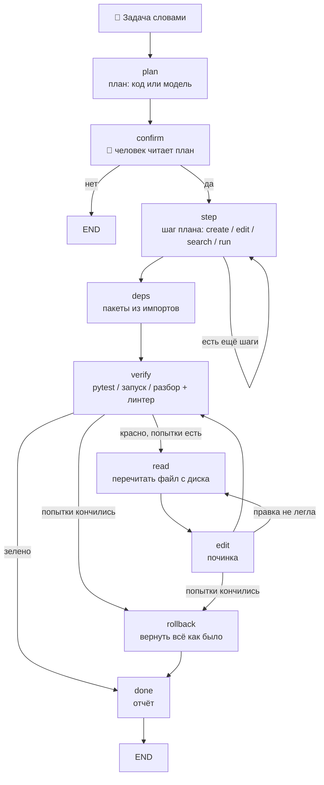

# 🛠️ Глава 8. Кодинг-агент: пишет код, проверяет запуском и откатывает неудачу

> **Цель главы:** собрать агента, который принимает задачу на написание кода обычными словами, показывает план и ждёт подтверждение, пишет файлы, проверяет работу запуском — и, если проверка не прошла, возвращает каталог в то состояние, в котором он был до начала.

Здесь агент получает право писать в файлы, ставить пакеты и запускать команды. Ошибка перестаёт быть неверным ответом и становится испорченным файлом. Поэтому первым в главе написан не инструмент, а `src/guard.py` — границы.

*Для справки. **Агент** — программа целиком, то, что запускается командой `python -m chapter8.agent`. **Конвейер** — граф из девяти узлов, по которому идёт ЗАДАЧА: план, подтверждение, шаги, проверка, починка, откат. **Исполнитель** — тот же цикл ReAct из прошлых глав, единственный оставшийся специалист; ему достаются ВОПРОСЫ («где реализован калькулятор?»), и он отвечает поиском по коду, ничего не меняя. Модель одна и та же, промпты разные.*



Что добавляется:

* **пишет код.** Двадцать новых инструментов (семь файловых, четыре запуска, пять git, четыре про окружение) и конвейер из девяти узлов, который ведёт задачу от плана до отчёта;
* **проверяет запуском.** Чем проверять — решает код, а не модель: есть тесты — `pytest`, программа ждёт ввода — запуск с подставленными строками, каркас — разбор без выполнения. Поверх любого исхода спрашивается линтер — программа, которая читает код, не запуская его;
* **откатывает неудачу.** Перед первой записью агент делает снимок каталога веткой git, прежнее содержимое файлов кладёт в его объектное хранилище, а после двух неудачных починок возвращает всё как было — вместе с файлами, которые успел создать. Журнал лежит на диске и переживает перезапуск агента.

Главная мысль: **обвязка не делает модель умнее — она режет многоходовую работу на одноходовые вопросы и делает неудачу обратимой.** Каждый приём этой главы устроен одинаково: там, где ответ вычислим, отвечает код; там, где нужна модель, ей задают вопрос с готовым списком ответов; а то, что она всё-таки сделала, проверяется запуском и при провале стирается.

---

## 🧭 Кодинг-агенты: что придумано до нас и что мы взяли

Кодинг-агент — это программа, которая получает задачу на человеческом языке и сама меняет проект: находит файлы, пишет в них код, запускает тесты и чинит то, что не прошло. От помощника, который просто дописывает строку в редакторе, его отличает право действовать без вопроса на каждый шаг; от обычного скрипта — то, что последовательность действий не задана заранее, а выводится из задачи.

Устройства таких агентов решают разные части одной проблемы: модель ошибается, а файлы настоящие. Что из них взято сюда:

### Aider: карта репозитория и формы правки

[Aider](https://aider.chat) — консольный помощник, работающий поверх git. Что у него стало общим местом.

**Карта репозитория.** Отдавать модели файлы целиком бессмысленно — они не влезают. Aider разбирает исходники и отдаёт вместо них список определений: какие функции и классы есть, где лежат. Модель выбирает место по карте, а текст просит уже точечно.

**Формат правки — параметр, а не данность.** Сказать «поменяй вот это на вот то» можно по-разному: перезаписать файл целиком, прислать кусок «было/стало», прислать номера строк, прислать unified diff. Aider реализует несколько форматов и подбирает под конкретную модель тот, который она выдаёт применимым чаще.

Взято в главу: **и то, и другое.** Карта у нас своя и мельче — не файлы, а функции с назначением каждой (`src/codemap.py`, разбор `ast`). Формы правки реализованы четырьмя и сравнены на нашей модели; ответ оказался не тем, которого я ждал.

### SWE-agent: интерфейс, придуманный для модели

[SWE-agent](https://swe-agent.com) — исследование Принстона про то, что модели нужен не человеческий интерфейс, а свой. Идея названа Agent-Computer Interface: команды, которыми агент смотрит и правит файлы, придуманы под то, как модель ошибается. Файл показывается окном с номерами строк; правка принимается только если после неё файл разбирается — иначе она просто не применяется, и агент видит ошибку вместо испорченного файла.

Взято: **номера строк во всём, что читает агент** (`42| def foo():` — и поиск Главы 5 отвечает ровно таким адресом), и **отказ применять правку, после которой файл перестал разбираться**. К этому мы добавили свою проверку: правка не применяется и тогда, когда из файла пропали определения, которых задача не касалась.

### Cline и Roo Code: подтверждение и контрольные точки

[Cline](https://cline.bot) и его ответвление Roo Code — расширения VS Code, где агент работает у человека на глазах. Два режима: план и действие. Перед каждой записью в файл и каждой командой показывается, что именно будет сделано, и человек жмёт кнопку. Пройденные точки сохраняются, к любой можно вернуться.

Взято: **узел `confirm`** — план показывается целиком до того, как хоть один файл тронут, — и **контрольная точка со своим откатом**: снимок каталога веткой git плюс журнал того, что агент изменил после него. Разница в том, что у нас откат не только ручной: конвейер сам откатывает всё, если не смог довести работу до зелёной проверки.

### OpenHands: песочница — и почему её у нас нет

[OpenHands](https://github.com/All-Hands-AI/OpenHands) (бывший OpenDevin) запускает агента в контейнере: файловая система, терминал и браузер — всё внутри изолированной среды, и то, что агент там сломает, не выходит наружу.

Взято: **ничего, и это осознанно.** Разворачивать контейнер в учебной главе значит потратить главу на контейнер. Взамен остаются две границы поменьше — рабочий каталог, за пределы которого не выходит ни один путь, и человек, читающий команду перед тем, как нажать `y`. Разница названа в разделе про безопасность, и запускать главу стоит на копии проекта.

### Plan-and-Execute вместо ReAct

Все главы до этой работали циклом ReAct из Главы 1: модель думает, вызывает инструмент, смотрит на результат, думает снова. Решение о следующем шаге принимается моделью каждый раз.

Для кодинг-агента это плохо ровно одним: **человеку нечего подтверждать.** Пока модель не сделала шаг, никто не знает, каким он будет; когда сделала — файл уже изменён. Схема, где сначала составляется весь план, а потом исполняется, называется Plan-and-Execute, и берут её обычно ради того, чтобы реже дёргать большую модель. Здесь она берётся ради другого: план — это то, что можно показать до, а не после.

Взято: **конвейер вместо свободного цикла.** Последовательность «план → подтверждение → шаги → зависимости → проверка» известна заранее, поэтому она записана графом, а не составляется моделью каждый раз.

### Reflexion: приём, который взяли, померили и выключили

Есть известное семейство приёмов — Reflexion, Self-Refine, — где модель после работы критикует собственный результат и переписывает его. Для агента, который сам пишет код, это выглядит очевидным дополнением: механические проверки отвечают на вопрос «работает ли», и ни одна не отвечает на вопрос «то ли это, о чём просили».

Приём реализован (`src/review.py`), померен и **выключен по умолчанию**: на модели курса он не ловит ничего.

### Сводка

| Приём | Откуда | Как здесь | Чем подтверждено |
| :--- | :--- | :--- | :--- |
| Карта проекта вместо файлов | Aider | карта функций из `ast`, место выбирается из готового списка | замер 8 |
| Форма правки как параметр | Aider | четыре формы, схема из `oneOf` | замеры 1 и 5 |
| Проверка сразу после правки | Aider | узел `verify`, круг починки | вся вторая половина главы |
| Номера строк в чтении файла | SWE-agent | `42\| def foo():`, адрес `файл:строки` от Главы 5 | форма правки `lines` |
| Правка не ложится, если файл сломан | SWE-agent | `syntax_ok` + `lost_definitions` | замер 1 |
| Подтверждение до действия | Cline | узел `confirm`, показ diff | раздел «Безопасность» |
| Откат к прошлому состоянию | Cline | снимок веткой git, журнал на диске, узел `rollback` | 11 тестов |
| Песочница | OpenHands | нет | сказано прямо |
| План до исполнения | Plan-and-Execute | девять узлов графа Главы 7 | замер 2 |
| Самокритика модели | Reflexion | есть, выключена | замер 9 |

---

##  Чем маленькая модель проигрывает большой

Курс идёт на `qwen2.5:3b` — модели, которая помещается в 6 ГБ видеопамяти. До этой главы разрыв с моделями побольше был виден смутно: где-то ответ поверхностнее, где-то маршрут выбран не тот. Кодинг-агент делает разрыв измеримым, потому что у его работы есть двоичный исход: тесты зелёные или нет.

Начать стоит с чужих чисел, а не своих. Вот официальные — из технического отчёта Qwen2.5-Coder и блога Qwen2.5, Instruct-версии:

| Способность | Бенчмарк | 3B | 7B | разрыв |
| :--- | :--- | ---: | ---: | ---: |
| Написать код с нуля | HumanEval | 84.1 | 88.4 | +5% |
| То же, набор построже | MBPP | 73.6 | 83.5 | +13% |
| Школьная математика | GSM8K | 86.7 | 91.6 | +6% |
| Математика посложнее | MATH | 65.9 | 75.5 | +15% |
| Понять чужой код без запуска | CRUXEval, output-CoT | 56.0 | 65.9 | +18% |
| Соблюсти формат ответа | IFEval strict-prompt | 58.2 | 71.2 | +22% |
| Знания под давлением | MMLU-Pro | 43.7 | 56.3 | +29% |
| **Править существующий код** | **Aider, pass@1** | **33.8** | **55.6** | **+64%** |

Строки про код — из отчёта Qwen2.5-Coder, то есть про coder-версии на 3B и 7B; строки про математику, формат ответа и знания — про общие Qwen2.5-Instruct тех же размеров. Сравнивать между собой стоит только числа внутри одной строки.

Читается эта таблица так: **разрыв между 3B и 7B крайне неравномерный.** Написать функцию с нуля обе умеют почти одинаково — пять процентов разницы. Править существующий код семёрка умеет в полтора раза лучше, и это самая большая разница во всём отчёте. Она ровно там, где живёт кодинг-агент: он почти всегда правит, а не пишет с чистого листа.

*Про бенчмарки, если встречаете их впервые. **HumanEval** и **MBPP** — наборы задач вида «по описанию напиши функцию», проверяются автотестами. **CRUXEval** — «предскажи, что напечатает вот этот код», то есть понимание чужого кода без запуска. **IFEval** — проверка того, что модель соблюдает форму ответа: «ответь одним словом», «не пиши пояснений», «оберни в теги». **Aider** — бенчмарк того самого консольного помощника: правки в настоящем репозитории, где надо не только придумать код, но и попасть форматом.*

### Cлабости, которые видно на нашей задаче

**Формат ответа.** Живой прогон сломался на задаче, где программа должна печатать строку `f'(x) = 4x + 5`. Ломался при этом не код, а конверт: до перехода на текстовую доставку файл приходил полем JSON, и уровней кавычек получалось три — JSON, исходник, литерал внутри исходника. Модель на 3B теряла один, и `json.loads` падал с «Unterminated string» ещё до того, как мы успевали посмотреть на Python. Официальный аналог этой беды — IFEval: 58.2 против 71.2. Чинилось это не промптом, а способом доставки: файл целиком приходит теперь обычным текстом.

**Правка существующего кода.** Официальный разрыв тут самый большой во всём отчёте: Aider даёт 33.8 против 55.6. У нас же на задачах правки все пять моделей упираются в потолок, и порядок между ними случайный. Это не значит, что модели одинаковы, — это значит, что **наш набор слишком лёгкий, чтобы их различать**: одна строка в файле из пяти, падающий тест прямо показывает, что не так. Aider меряет то же самое в настоящем репозитории, где надо ещё и попасть форматом.

**Многоходовость — и её ни один официальный отчёт не меряет.** Ближайшее, что есть, — обзоры по маленьким моделям в агентных задачах, и числа там резче кодовых: у Qwen3-4B общая точность около 62%, а на многоходовых задачах — 35%; у модели на 1.7B многоходовые падают до 17% при неплохой общей. Способность держать нить через несколько шагов рушится с уменьшением модели гораздо быстрее, чем способность ответить на один вопрос.

Последнее и объясняет, почему обвязка этой главы вообще помогает. Карта функций вместо поиска места, готовый список ответов в схеме (`enum`) вместо сочинения имени, одна функция вместо файла целиком, план из кода вместо плана от модели — **каждый приём превращает многоходовую задачу в набор одноходовых.** Модель от этого не умнеет; у неё просто перестают спрашивать то, на что она отвечает плохо.

И одно, чего в списке слабостей **нет**: длинный контекст. Qwen2.5-3B на задачах поиска в длинном контексте держится около 92%. В окно мы не упирались ни разу.

### Что из этого следует для читателя

Умолчание курса остаётся прежним — `qwen2.5:3b`, потому что глава должна работать на той же модели, что и все предыдущие. Coder-версия того же размера пишет код лучше, и по официальным данным разрыв заметный: +13% HumanEval, 74.4 против 84.1. **А вот на нашем конвейере, после всех приёмов главы, она выигрывает один случай из десяти** — и это главная мысль главы, увиденная с другой стороны: обвязка съела большую часть разрыва между моделями. Попробовать её всё равно стоит, отвечает она чуть быстрее, и меняется для этого одна переменная окружения:

```bash
$env:AGENT_CODER_MODEL = "qwen2.5-coder:3b"
```

Источники чисел: [Qwen2.5-Coder Technical Report (arXiv 2409.12186)](https://arxiv.org/abs/2409.12186), [блог Qwen2.5-LLM](https://qwenlm.github.io/blog/qwen2.5-llm/), [Small Language Models for Agentic Systems: A Survey (arXiv 2510.03847)](https://arxiv.org/abs/2510.03847).

---

## 🔍 Что делаем

### Границы пишутся до инструментов

`src/guard.py` — первый файл главы, и написан он до `write_file`. Причина простая: пока нет ответа на вопрос «что будет, если модель попросит переписать системный каталог», писать инструмент записи рано.

Что ограничено:

* **рабочий каталог** — один корень, любой путь проходит через `resolve_path`, за пределы не выходит;
* **белый список команд** — механизм есть, **по умолчанию выключен** (почему — ниже);
* **предел по времени** — зависший процесс снимается, а не держит агента вечно;
* **сухой прогон** — режим, в котором агент говорит, что сделал бы, и не делает;
* **подтверждение человеком** — перед каждым действием, которое меняет диск, ставит пакеты или запускает произвольную команду.

Вся запись идёт через одну функцию `_commit()`, и проверки стоят в ней, а не в каждом из четырёх пишущих инструментов. Забыть проверку легче всего в четвёртом однотипном месте.

Журнал изменений — там же. Перед каждой записью запоминается прежнее содержимое файла (или отметка «файла не было»), и по этому журналу работают команда «откат» и узел `rollback`. Хранится он в двух местах сразу: список в памяти отвечает на вопрос «что агент трогал в этом прогоне» и потому обязан быть быстрым, а прежнее содержимое уходит в git и в файл на диске — там оно переживает перезапуск. Как именно — в отдельном разделе ниже.

### Задача или вопрос: развилка по глаголу

У агента один вход — строка, которую набрал человек. «Напиши приложение» должно уйти в конвейер, «где реализован калькулятор?» — исполнителю. Отдельной команды для этого нет намеренно: команда, которую надо не забыть набрать, — это ещё одна вещь, которую можно забыть.

Различает их **глагол, а не предмет**: реплика, начинающаяся с «напиши», «поправь», «добавь», «сделай», — задача. Механизм тот же, что в Главе 5: `matches(text, markers)` со списком корней слов. Второй список — начала, после которых реплика задачей не является: «покажи», «расскажи», «объясни», «где ». И проверяется он **только по началу** реплики. Пока проверка шла вхождением куда угодно, слово «где» ловилось в середине задачи, и самые обычные просьбы уезжали отвечать текстом:

```
поправь функцию там, где вычисляется сумма   → вопрос
исправь место, где падает тест               → вопрос
добавь проверку туда, где ввод               → вопрос
```

Реплику определяет её главный глагол, а он стоит в начале. «Где падает тест» — вопрос; «поправь то, где падает тест» — задача; разделяет их позиция слова, а не его наличие.

### План: код там, где ответ вычислим

План — это список шагов, который показывается человеку до того, как тронут первый файл. Составить его можно двумя способами, и глава использует оба, но не поровну.

* **называет** («поправь функцию `add` в `calc.py`») — план строится кодом: найти файл, прочитать, править, проверить. Тут нечего придумывать, всё есть в самой задаче;
* **не называет** («сделай модуль корзины с тестами») — плана из кода не существует: придумать, сколько файлов завести и как их назвать, эвристикой нельзя. Спрашивают модель.

Потолок — шесть шагов. Действий, которые план может назвать, тоже шесть: `search`, `read`, `create`, `edit`, `run`, `test`. Это `enum` схемы: назвать действие, которого нет, модель физически не может.

### Подтверждение: человек читает diff, а не намерение

Узел `confirm` показывает план целиком и ждёт «да». Дальше каждая запись показывается отдельно — не словами «сейчас поправлю функцию», а настоящим diff того, что ляжет на диск:

```
  Агент собирается: заменить строки 1-11 в quadratic.py
  Подробности: --- quadratic.py (было)
+++ quadratic.py (станет)
@@ -9,6 +9,10 @@
         return root
     else:
         return None
+
+    # Добавляем вывод производной
+    derivative = 2*a*b - 4*a*c
+    print('Производная квадратного уравнения:', derivative)
```

Этот пример настоящий, и он же показывает, зачем diff нужен: формула производной здесь неверная, а код после `return` недостижим. Человек, читающий diff, видит обе беды за секунду; человек, читающий «сейчас добавлю вывод производной», — ни одной.

Три режима переключаются командами: `сухо` — ничего не писать, `спрашивать` — умолчание, `молча` — писать без вопросов.

### Четыре формы правки, и почему по умолчанию цитата

Сказать, ЧТО именно поменять в файле, можно по-разному, и слабая модель ломается как раз здесь. Что умеет агент:

* **`anchor`** — цитата «было» и текст «стало». Короткая, потерять чужой код физически не может, но цитата должна совпасть с файлом до символа;
* **`lines`** — номера строк и новый текст. Цитировать ничего не надо — и адрес у нас уже есть, поиск Главы 5 отвечает в виде `файл:строки`;
* **`full`** — файл целиком. Всегда применима, но модель на 3B файл в двести строк не перепечатывает целиком;
* **`append`** — дописать в конец. Решает другую задачу: не «замени кусок», а «добавь новое».

По умолчанию в промпте правки стоит **цитата**, хотя номера строк выглядели удобнее и были у нас на руках от поиска Главы 5. Причина в том, что происходит с ЧУЖИМ кодом: на длинном файле и номера строк, и перезапись целиком теряют определения, которых никто не просил трогать, а цитата потерять их физически не может.

Схема ответа собрана из вариантов через `oneOf`, по одному на форму. Схема с общим набором полей, где обязательны только `form` и `path`, разрешает модели назвать одну форму и заполнить поля другой — и слабая модель ровно так и делает. `enum` ограничивает значение поля, а не смысл ответа; связь между полями выражается структурой схемы или не выражается вовсе.

Пятая форма стоит особняком: **замена функции целиком**. Границы функции берутся из карты (ниже), модель получает только её текст и переписывает от `def` до последней строки. Это компромисс между «файл целиком» и «процитируй точно»: цитировать не надо, а потерять соседний код нельзя.

### Карта функций: выбор из списка вместо поиска места

Правку надо куда-то положить. Текстовый поиск справляется, пока человек цитирует свой код, и перестаёт сразу, как только он говорит по-человечески: «сделай, чтобы приложение выводило ещё и производную». Искать нечего — ни одного слова из файла в задаче нет.

Карта отвечает на этот вопрос иначе. `src/codemap.py` разбирает `ast` всех файлов каталога и собирает список: имя функции, аргументы, диапазон строк, назначение. Модель видит список и **выбирает одну** — а выбор из списка это `enum`, и его можно навязать схемой. Назвать функцию, которой нет, тогда физически невозможно.

Что считает код, а что модель, разделено жёстко: имена, аргументы и диапазоны строк — разбор `ast`, без модели; назначение — из докстринга (строки описания в начале функции), если он есть; и только назначение того, у чего докстринга нет, спрашивают у модели. Такие функции пишет сам агент — в его коде докстрингов обычно нет.

Выбрать из списка модель на 3B умеет. **Отказаться** от выбора — сказать «ни одна не подходит» — почти нет: вместо этого она называет первую попавшуюся, хотя такой пункт в перечислении есть и о нём сказано правилом промпта. Отсюда правило, записанное в код: решение «править или заводить новый файл» принимает `plan_kind`, а у модели спрашивают только «какую из этих». Вопрос, на который у неё нет хорошего ответа, ей не задают.

### Файл целиком приходит текстом, а не полем JSON

Схема ответа выигрывала в этой главе там, где ответ **короткий**: форма правки — одно поле, выбор места — одно имя.

Файл целиком — это сотни строк, и схема заставляет экранировать каждую кавычку и каждый перевод строки. Уровней кавычек получается три: JSON, исходник, литерал внутри исходника. Модель на 3B теряет один — и ломается не код, а конверт: `json.loads` падает с «Unterminated string» ещё до того, как мы успеваем посмотреть на Python.

Поэтому файл целиком приходит обычным текстом, а `_strip_fences` снимает ```-обёртку, если модель её добавила. Приём уточняет главный приём главы, а не отменяет его: **схема помогает, пока ответ короткий, и мешает, когда он длинный.**

### Зависимости считаются, а не назначаются

Какие пакеты нужны проекту, видно из импортов написанного кода. Спрашивать об этом модель — значит получить правдоподобный ответ вместо верного.

Узел `deps` разбирает импорты `ast`, отбрасывает стандартную библиотеку и то, что уже установлено, и остаток предлагает поставить. Установка проходит через подтверждение человеком: `pip install` — это команда, скачивающая код из сети.

### Проверка: чем проверять, решает код

Узел `verify` выбирает способ сам:

* есть файлы тестов — `pytest`;
* программа ждёт ввода — **запуск с подставленными строками**;
* просили каркас, или ввод спрашивается прямо при импорте — разбор файла, ничего не выполняя;
* в остальных случаях — обычный запуск.

Из-за второго случая дважды откатывалась готовая работа, с разных сторон. Сначала такую программу запускали, ничего не подавая ей на вход: она падала с `EOFError`, и конвейер объявлял рабочее приложение сломанным. Тогда её стали проверять импортом — и импорт отвечает, что файл разбирается и доходит до `__main__`, но молчит про то, ради чего программу пишут. Живой прогон: агент дописал в `__main__` строку с именами, которых там нет; файл импортировался, агент отчитался «Готово», запуск падал `NameError` на первой строке.

Подставленный ввод даёт проверке то, чего у неё не было, — пользователя. Строки подставляются числами, без пустых: программа с `while True:` читала пустую строку, `float('')` падал с `ValueError`, и правильно написанное приложение опять объявлялось сломанным. Если ввод кончился раньше, чем программа перестала спрашивать, это **наша** беда, а не программы: такой исход не проваливает проверку, а сводит её к разбору.

#### Какие именно числа — вопрос не праздный

Наборов три, потому что один запуск проходит одной веткой: программа, считающая корни через `math.sqrt` без `import math`, на отрицательном дискриминанте до этой строки не доходит и выглядит исправной.

А вот какие в наборах числа — вопрос, который стоил трёх откачённых правильных программ. Первые наборы были подобраны под одну задачу главы, квадратное уравнение: `1, -3, 2` — это коэффициенты с корнями 1 и 2, и **единица стояла первой во всех трёх**. Потом пришёл живой прогон с калькулятором логарифмов:

```
Последняя ошибка: ZeroDivisionError: float division by zero
```

`math.log(x, 1)` — это деление на `log(1)`, то есть на ноль. Программа была написана верно; невалидный ввод подали ей мы. Проверка объявила её сломанной, починка два круга чинила несуществующую беду, и всё сделанное откатилось. Трижды подряд, на двух разных моделях.

Отсюда правило, которому наборы подчиняются теперь: **каждое число годится на вход любой школьной задаче.** Ни нуля (деление), ни единицы (основание логарифма), ни отрицательных (корень, логарифм). Разнообразие веток при этом держится дискриминантом, а не вырожденными значениями:

```python
SCRIPTED_NUMBERS = (
    (2, 8, 3),   # логарифм: основание 2, число 8 — ответ ровно 3;
                 # как коэффициенты: дискриминант 40, два корня
    (3, 5, 7),   # дискриминант -59: ветка «корней нет»
    (2, 5, 2),   # дискриминант 9: корни -0.5 и -2
)
```

Первый набор — это ровно тот пример, который человек написал в задаче: логарифм 8 по основанию 2 равен 3. Программа, которая при проверке ни разу не досчитала до ответа, проверенной не является — и это не теория, а вторая половина того же живого прогона. На 3B «успешным» оказался вот такой файл:

```python
def calculate_logarithm(base, number):
    if base <= 1 or number <= 0:
        raise ValueError("Base must be greater than 1 and number must be positive.")
    return number ** (1 / base)
```

Это не логарифм, а корень степени `base`: на примере из задачи он отвечает `2.83` вместо `3`. Проверку он прошёл потому, что основание `1` попало в его собственную защиту, `ValueError` поймался в `except`, программа напечатала сообщение об ошибке и вышла с кодом 0. Ни один из трёх наборов не дошёл до вычисления. **Одна и та же беда дала два противоположных исхода: правильная работа выброшена трижды, неправильная принята один раз.**

#### Ввод называется вслух

Модель, чинившая ту программу, получала «ZeroDivisionError: float division by zero» и ничего больше — про то, что основание подали мы, в задании не было ни слова. Она искала ошибку в исправном коде — единственное, что ей оставалось. Поэтому и в отчёте человеку, и в задании на починку числа теперь названы:

```
Готово. Проверено: запуск calc.py с подставленным вводом (2, 8, 3; 3, 5, 7; 2, 5, 2).
```

```
программа запущена с подставленным вводом (2, 8, 3) и упала:
ValueError: math domain error
```

Прошли все наборы — называются все: сказать про один было бы неправдой, программа прошла три. Провалился один — называется он: именно с этими числами и надо разбираться.

Поверх любого исхода спрашивается линтер — неопределённые имена. Это статическая замена того запуска, которого у нас может не быть, и спрашивается она **всегда**, а не только когда запустить не вышло: запуск проходит одной веткой, а неопределённое имя есть свойство файла целиком. Живой прогон: `math.sqrt` без `import math`, входные числа дали отрицательный дискриминант, ветка не выполнилась, запуск зелёный. Линтер видел это с самого начала.

### Починка и откат

Проверка красная — конвейер идёт не в правку, а в **чтение**: файл на диске уже изменён прошлой попыткой, и модель должна увидеть его таким, какой он есть, а не таким, каким писала. Кругов починки два.

Дальше важное различие, которое конвейер держит явно. «Не смогли проверить» и «проверили, и оно сломано» — разные исходы, и второй из первого не следует. Агент мог сделать ровно то, о чём просили: написать батник, файл настроек, README. Объявлять такое сломанным за то, что у нас нет для него проверки, — способ выбросить правильно сделанное; поэтому есть отдельный флаг `unverifiable`, и работа остаётся на диске, а человек читает, чем её не проверили.

Если же проверка красная и круги кончились — `rollback`. Возвращается всё: правки в существующих файлах и файлы, созданные агентом с нуля. Каталог становится таким, каким был до задачи.

### Откат, который переживает смерть агента

Первая версия отката была списком в оперативной памяти: перед каждой записью запоминался прежний текст файла, «откат» шёл по списку назад. Работает — ровно до первой неприятности. Агент закрыт, упал, потерял Ollama — списка нет, и файлы остаются в том виде, в каком их застали. **Единственная настоящая страховка главы оказалась самой недолговечной её частью.**

Поэтому та же работа поручена git. Что он даёт взамен списка:

**Точка, к которой можно вернуться.** Перед первой записью агент делает снимок рабочего каталога и вешает на него ветку с временем в имени — `agent-snapshot/2026-09-04-18-27-29`. Ветка живёт в `.git` и переживает что угодно: человек может посмотреть `git diff agent-snapshot/...`, вернуть отдельный файл или весь каталог — через неделю и без агента.

**Хранилище прежнего содержимого.** Перед каждой записью прежний текст файла кладётся в объектное хранилище git (`git hash-object -w`), а путь и полученный идентификатор — в журнал на диске. Откат читает журнал и достаёт текст обратно. Новый запуск агента видит незакрытый долг прошлого и говорит о нём первой строкой:

```
⏮️ Прошлый запуск оставил изменёнными: old.py, новьё.py
   «откат» вернёт их. Начнёте новую задачу — журнал обнулится.

Вы: откат
  удалён новьё.py
  восстановлен old.py
  Снимок до работы агента остался веткой agent-snapshot/2026-09-04-18-27-29
```

Важнее того, что этот механизм делает, — то, чего он **не** делает.

**Он не трогает вашу работу в git.** Ни `HEAD`, ни рабочий каталог, ни индекс — то место, куда попадает сделанный человеком `git add`, — не меняются. Снимок собирается во временном индексе (`GIT_INDEX_FILE`), дерево пишется из него, коммит создаётся `commit-tree` напрямую, ветка ставится `git branch`. Очевидный на первый взгляд `git checkout -b` не годится ровно поэтому: он переключает `HEAD`, и агент, начавший задачу, унёс бы человека на другую ветку.

**Он не восстанавливает то, чего не трогал.** Откат идёт по журналу, файл за файлом. Правка, сделанная человеком в соседнем окне, в журнал не попадает и остаётся на месте — а вернуть каталог целиком можно веткой снимка, и делает это человек.

**Он не работает вне репозитория.** Каталог без git — обычный случай: человек попросил написать программу в пустой папке. Там остаётся прежний список в памяти, и агент пишет об этом прямо, вместо того чтобы делать вид, что защищён:

```
Откат: только в памяти этого запуска — каталог не репозиторий git.
Закроете агента, не откатив, — возвращать будет нечем.
```

Модель в этом приёме не участвует, поэтому и мерить в нём нечего: он проверяется тестами — одиннадцать штук, и половина из них про то, чего механизм делать НЕ должен: не двигать `HEAD`, не трогать индекс человека, не восстанавливать чужие файлы, не применять журнал от другого каталога.

### Память сессии

Хранилище — то же самое, что в Главе 3 (`LongTermMemory`), и взято оно не ради того, чтобы меньше писать, а чтобы показать, что механизм главы про контекст работает не только на фактах о человеке. Там агент запоминал «меня зовут Владимир»; здесь — рабочий каталог, файл, над которым работаем, и последнюю задачу.

Зачем это, видно из живых прогонов. Каждый начинался с того, что человек набирал `каталог E:\progects\...`, потому что агент про свой каталог не помнил ничего. А дальше шли задачи вроде «добавь ожидание ввода» — без имени файла, потому что человек имел в виду тот файл, который они только что писали вместе.

Из трёх фактов один общий, а два — **свои в каждом каталоге**. Рабочий каталог отвечает на вопрос «где мы работали в прошлый раз», и второго ответа у этого вопроса нет. А файл и задача принадлежат проекту: пока все три ключа были общими, работа во втором проекте молча затирала память первого, и, вернувшись, человек заставал там чужой файл.

Разъезжаются они по каталогам не путём в ключе, а его отпечатком, и причина поучительная. Ключи памяти Главы 3 **нормализуются**: точки, дефисы, косые и пробелы превращаются там в подчёркивание. Путь, положенный в ключ как есть, после такой нормализации склеивает `my-app` и `my_app` в один проект — то есть ровно та беда, от которой ключи и разъезжались. Восемь шестнадцатеричных цифр нормализацию переживают целиком, а имя каталога стоит рядом с ними, чтобы `session.json` можно было открыть глазами:

```
workspace                        = E:/progects/myapp
current_file@myapp_3f2a1b7c      = server.py
last_task@myapp_3f2a1b7c         = добавь маршрут
current_file@calc_9d17e004       = calc.py
```

Чего в памяти нет намеренно: истории разговора и содержимого файлов. Первое живёт в диалогах Главы 3, второе читается с диска и устаревает в ту же секунду, как его записали. Память — про адреса, а не про содержимое.

### Тот же конвейер на LangGraph

`src/pipeline_lg.py` — те же девять узлов и то же состояние, собранные библиотекой LangGraph вместо графа Главы 7. Работает командой `langgraph <задача>`, зависимость необязательная.

Смысл этого файла — не в том, чтобы предложить выбор, а в том, чтобы разница между «своё» и «готовое» была видна числом, а не на слух. Числа — в разделе замеров.

Вывод тот же, что в Главе 7: пока нужны узлы, рёбра и общее состояние, своё остаётся читаемым целиком и не тянет за собой ничего. Как только понадобится параллельное выполнение узлов, потоковая выдача или хранилище сложнее JSON-файла — брать готовое.

---

## 🧪 Что не сработало

### Скелет вместо файла целиком

Идея: пусть модель сначала перечислит СОСТАВ файла — определения с описанием и пустыми телами, — а потом вторым запросом заполнит тела. Многоходовую работу это разбивает на два простых хода, что для 3B обычно помогает.

Не выиграл ни у одной модели, и видно, почему: второй запрос — это ещё одно место, где ответ может не разобраться, и слабая модель теряет там больше, чем выигрывает на упрощении. Чаще всего скелет кончается тем, что файла не появляется вовсе. Режим оставлен переключателем `AGENT_WRITE_MODE=skeleton`; умолчание — `direct`.

### План от модели на задачах правки

Модель курса выдумывает пути и теряет шаги в половине планов; модель, специально обученная агентным задачам, строит их чисто — и всё равно не выигрывает у плана, собранного кодом, а берёт впятеро больше времени. Вывод узкий, и его границы надо назвать: это верно **на задачах правки, где файл назван в самой задаче**. На задачах с нуля у кода ответа нет, и там планирует модель.

### Модель как судья своей работы

На модели курса приём не ловит ничего: она отвечает «сделано» всегда, а не потому, что проверила. С 7B он начинает работать — но 7B у нас нет. Умолчание `AGENT_REVIEW=off`.

Вывод шире одного приёма и совпадает с предыдущим: **слабая модель не становится сильнее оттого, что её спрашивают о её же работе.** Схема даёт ей форму ответа, но не даёт способности заметить.

### Английский промпт планировщика

Гипотеза: русский промпт занимает у модели больше токенов и хуже ложится на то, чему её учили. Первое подтвердилось, второе — нет: планы на обоих языках выходят одинаковыми. Перевод промпта сокращает счёт токенов и не меняет результат. Переключатель `AGENT_PLANNER_LANG` остался, умолчание — русский.

### Строгие проверки при записи

Это единственный пункт раздела, за которым стоит не замер, а откат — и рассказать о нём стоит именно поэтому.

К проверкам записи (файл разбирается, определения не пропали) добавились ещё три: недостижимый код после `return`, неопределённые имена, повторное определение уже существующей функции. Каждая ловила настоящую беду из живого прогона, и каждая по отдельности выглядела разумной.

Вместе они начали отменять почти всё, что пишет 3B. Агент перестал врать — и перестал работать: правки не ложились, конвейер два круга бился о пустоту и откатывал сделанное. Пришлось вернуться к состоянию, в котором при записи проверяются только разбор и потерянные определения; остальное осталось на `verify`, где оно ловит то же самое, но **после** прогона, когда есть что чинить.

Правило, которое из этого следует: **проверку надо мерить не только по тому, сколько плохого она ловит, но и по тому, сколько хорошего отменяет.** Второе число собирать никто не любит, и оно решает.

---

## 🛡️ Безопасность

Эта глава — первая, где ошибка агента портит файл, а не ответ. Что добавилось к поверхности атаки:

* **запись в файлы.** Любой файл внутри рабочего каталога может быть перезаписан. За пределы каталога путь не выходит: `resolve_path` разворачивает `..` и символические ссылки и сверяет корень;
* **запуск произвольных команд.** Белый список программ есть, но по умолчанию выключен — кодинг-агент заранее не знает, какая программа ему понадобится, а список, который дописывают под каждую задачу, защитой быть перестаёт;
* **установка пакетов.** `pip install` скачивает и выполняет чужой код. Проходит через подтверждение всегда.

Что сужено:

* **один корень** — рабочий каталог, и он же граница поиска, чтения и записи;
* **без командной оболочки** — процесс запускается напрямую, поэтому `&&`, перенаправление вывода и подстановка переменных не работают в принципе, а не «не рекомендуются»;
* **предел по времени** — зависший процесс снимается;
* **снимок и откат** — перед первой записью каталог снимается веткой git, и всё, что агент изменил после, возвращается одной командой; журнал лежит на диске, поэтому перезапуск агента ему не мешает. В каталоге без git остаётся список в памяти — и агент об этом предупреждает;
* **сухой прогон** — режим, в котором видно намерения без последствий.

Где проходит граница. Подтверждение спрашивается перед произвольной командой и перед запуском файла, но **не** перед `run_tests` и `run_lint`: у этих форма команды фиксирована, а в конвейере они вызываются на каждом круге, и вопрос на каждом круге превратился бы в кнопку, которую жмут не глядя.

У этого удобства была дыра, и она стоит того, чтобы разобрать её отдельно. **`pytest` выполняет `conftest.py` проекта до первого теста** — а это обычный Python-файл, в котором может быть что угодно, от `shutil.rmtree` до запроса в сеть. То есть исключение, сделанное ради того, чтобы не приучать человека жать «y», пропускало исполнение чужого кода вообще без вопроса.

Закрыто это не отменой исключения, а сужением: вопрос задаётся, только если `conftest.py` в каталоге **есть**, и только **один раз на каталог**.

```
  Агент собирается: запустить pytest в этом каталоге
  Подробности: pytest выполнит conftest.py — это обычный Python-код,
  и он запустится до первого теста. Спрашиваю один раз на каталог.
  Разрешить? [y/N]
```

Нет файла — нет и вопроса, прогон идёт как раньше. Отказ при этом не превращает работу в сломанную: конвейер помечает её «нечем проверить» и оставляет на диске. Стереть правильно написанный код за то, что человек не разрешил запускать чужой `conftest.py`, было бы худшим из возможных исходов.

**Агент не заперт в песочнице.** Единственная защита, кроме рабочего каталога, — человек, читающий команду перед тем, как нажать `y`. Запускайте главу на копии проекта, а не на единственной.

**Агент не заперт в песочнице.** Единственная защита, кроме рабочего каталога, — человек, читающий команду перед тем, как нажать `y`. Запускайте главу на копии проекта, а не на единственной.

---

## 📐 Окно и бюджет

Окно то же, что во всех главах, — 8192 токена. Интересное здесь в том, что кодинг-агент **не расходует его на промпт**.

Универсальный агент Главы 6 занимал системным промптом 5249 токенов из 8192. Специалист «код» Главы 7 — 2686. Исполнитель этой главы, тот, что отвечает на вопросы, — 2618 токенов при 26 инструментах, и на историю разговора ему остаётся 4947, из них на найденное поиском не больше 2473.

А конвейер устроен иначе: у него нет длинного промпта вообще. Каждый его запрос к модели — отдельный разговор с одним правилом и одним вопросом:

| Запрос | Правила | С чем вместе уходит |
| :--- | ---: | :--- |
| Правка файла | 611 | 120 строк файла — около 1023 токенов |
| Файл целиком | 263 | текст задачи |
| Ответ обычным текстом | 59 | добавка к правилам файла |
| Замена одной функции | 323 | текст одной функции |
| Имя файла для задачи | 188 | текст задачи |

Самый тяжёлый запрос конвейера — правка: 611 токенов правил плюс до 1023 токенов файла, всего около 1634 при окне 8192. Втрое меньше, чем один только промпт агента Главы 6.

Это не оптимизация, а следствие устройства. Свободный цикл ReAct обязан держать в промпте всё, что агент **может** сделать; конвейер знает, что делает сейчас, и держит только это. Тот же приём, что и с `enum`: чем короче список возможного, тем меньше способов ошибиться.

---

## 🗺️ Реплики агента

Живой прогон на `qwen2.5-coder:3b`, задача из двух реплик подряд. Сначала приложение с нуля:

```
Вы: напиши консольное приложение на python которое будет решать квадратное
    уравнение и выводить ответ в консоль. нужен интерактив

  Агент собирается: выполнить план из 2 шагов
  Подробности: План (запасной план без модели, 0.0 с):
  1. create quadratic.py — напиши консольное приложение...
  2. test — прогнать проверку
  Разрешить? [y/N] y

  Агент собирается: создать quadratic.py
  Подробности: новый файл, 24 строк
  Разрешить? [y/N] y
🧩 Маршрут прогона: plan -> confirm -> step -> step -> deps -> verify -> done
Готово. Проверено: запуск quadratic.py с подставленным вводом.
```

Работает: план из кода собрался мгновенно, файл написан, проверка прошла запуском с подставленными числами. Дальше правка — и вот тут интересное:

```
Вы: добавь в наше приложение чтобы выводилась еще производная

  Агент собирается: заменить строки 1-11 в quadratic.py
  Подробности: --- quadratic.py (было)
+++ quadratic.py (станет)
@@ -9,6 +9,10 @@
         return root
     else:
         return None
+
+    # Добавляем вывод производной
+    derivative = 2*a*b - 4*a*c
+    print('Производная квадратного уравнения:', derivative)
```

Задача не назвала ни файла, ни функции — и агент нашёл место сам, по карте функций. Это ровно то, ради чего карта написана.

А код — неверный дважды. Производная от `ax² + bx + c` это `2ax + b`, а не `2*a*b - 4*a*c`: модель написала обрывок формулы дискриминанта. И вставлено это после `return`, то есть не выполнится никогда. Первую беду не поймает ни одна проверка главы — она про смысл. Вторую поймал бы линтер, будь она в другом месте, а тут файл разбирается, импортируется и запускается молча.

Отсюда и берётся то, что человек в этой главе делает руками: **читает diff**. Он видит обе беды за секунду.

### Когда не получается

Та же задача, но сформулированная целиком, с примером-строкой внутри: «напиши приложение, которое решает квадратное уравнение и печатает формулу производной, например для "2x^2 + 5x + 2 = 0" строку "f'(x) = 4x + 5"». Три прогона подряд, `qwen2.5:3b`:

```
прогон 1: plan -> confirm -> step -> step -> deps -> verify -> done
          Готово. Проверено: запуск с подставленным вводом.
прогон 2: ... verify -> read -> edit -> read -> edit -> rollback -> done
          Правка отменена: после неё файл перестаёт разбираться
          (строка 29: unterminated string literal). Всё сделанное откачено.
прогон 3: то же самое
```

И на `qwen2.5-coder:3b` те же три прогона — 0 из 3, причём дважды с другим финалом:

```
... verify -> read -> edit -> verify -> read -> edit -> verify -> rollback -> done
Последняя ошибка: NameError: name 'x' is not defined
```

Один из шести доходит до зелёного. Это граница главы на модели в 3B, и в маршруте видно, что механизм при этом работает как задуман: проверка поймала неопределённое имя, два круга починки не помогли, каталог вернулся в исходное состояние. **Агент не сделал работу — и не оставил после себя сломанного.**

---

## 🚀 Как запустить

```bash
# из корня проекта
python -m chapter8.agent
```

Нужны те же модели и индексы, что у Главы 7. Первым делом скажите агенту, где работать:

```
каталог E:\progects\МойПроект
```

Дальше — просто задача словами: «напиши приложение на python, которое выводит hello world», «поправь функцию add в calc.py — она вычитает вместо сложения», «добавь в calc.py функцию деления и тест к ней».

Полезные команды: `план <задача>` — только показать план, ничего не делая; `спроси <вопрос>` — заведомо вопрос, а не задача; `откат` — вернуть всё, что агент изменил; `сухо` / `спрашивать` / `молча` — режим подтверждений; `окружение`, `инструменты`, `бюджет`, `память`.

Строка `Откат:` в отчёте о каталоге говорит, чем вы застрахованы прямо сейчас: снимком в git или списком в памяти запуска. Если каталог — не репозиторий, а работа важная, `git init` перед запуском агента меняет ответ.

Переменные окружения:

| Переменная | Умолчание | Что делает |
| :--- | :--- | :--- |
| `AGENT_WORKSPACE` | текущий каталог | рабочий каталог, сильнее памяти сессии |
| `AGENT_CODER_MODEL` | модель курса | модель, которая пишет код |
| `AGENT_PLANNER` | `fallback` | `fallback` — план из кода, `model` — всегда моделью |
| `AGENT_PLANNER_MODEL` | — | отдельная модель под планирование |
| `AGENT_PLANNER_LANG` | `ru` | язык промпта планировщика |
| `AGENT_WRITE_MODE` | `direct` | `direct` — файл целиком, `skeleton` — в два запроса |
| `AGENT_WRITE_TRANSPORT` | `text` | `text` — файл обычным текстом, `schema` — полем JSON |
| `AGENT_REVIEW` | `off` | разбор написанного моделью |
| `AGENT_SESSION_FILE`, `AGENT_CODEMAP_FILE` | рядом с главой | где лежат память сессии и карта функций |
| `AGENT_HISTORY_FILE` | рядом с главой | где лежит журнал отката |

Тесты:

```bash
python -m pytest chapter8/tests.py -q
```

657 быстрых тестов, живой модели не требуют (один пропускается на Windows без прав на символические ссылки). Отдельно — 10 проверок на живой модели (`-m integration`) и 10 замеров главы (`-m slow -s`); и те, и другие по умолчанию не выбираются.

---

## 🔄 Что изменилось

| | Глава 7 | Глава 8 |
| :--- | :--- | :--- |
| Что делает с проектом | рассказывает | пишет, запускает, ставит пакеты |
| Кто отвечает на реплику | один из пяти специалистов | конвейер (задача) или исполнитель (вопрос) |
| Инструментов | 16 в реестре, по 0–6 у специалиста | 26: 20 своих и 6 на поиск по коду |
| Устройство работы | свободный цикл ReAct | девять узлов, пять условных рёбер |
| Кто решает, что делать дальше | модель на каждом шаге | план, подтверждённый человеком |
| Промпт самого тяжёлого запроса | 2686 токенов | 611 + файл, около 1634 |
| Что бывает при ошибке | неверный ответ | откат по снимку в git: каталог возвращается как был |
| Проверка результата | никакой | pytest / запуск / разбор + линтер |
| Границы | нет | рабочий каталог, подтверждение, предел по времени, сухой прогон |

---

## ⚡ Замеры

Все числа главы собраны здесь: в разделах выше приёмы описаны механизмом, а не цифрами.

Условия у всех замеров одни: ноутбук с 6 ГБ видеопамяти, Ollama, окно 8192, модели `qwen2.5:3b`, `qwen2_5coder3b_q5`, `qwen2.5-coder:3b`, `qwen2.5-coder:7b`, `llama3.1:8b`. Основных наборов задач два, и они общие для замеров 1, 2, 3, 6 и 7: пять задач правки (файл есть, ошибка в одной строке) и пять задач с нуля (каталог пустой, всё придумывает агент). У замеров 8, 9 и 10 наборы свои, они описаны на месте.

```bash
python -m pytest chapter8/tests.py -m slow -v -s
```

| № | Вопрос | Ответ |
| ---: | :--- | :--- |
| 1 | Какой формой правки просить | цитатой: 8 зелёных из 10 на длинном файле против 4 и 0 |
| 2 | Нужен ли планировщик-модель на правках | нет: у модели половина планов с претензиями и впятеро дольше |
| 3 | Какую модель ставить на код | на правке все у потолка; с нуля 6–10 из 10, разрыв невелик |
| 4 | Сколько добавляет LangGraph | 20 пакетов, 21.1 МБ, узлы те же |
| 5 | Общая схема ответа или `oneOf` | `oneOf`: 5 неполных ответов из 5 против 0 из 5 |
| 6 | Скелет вместо файла целиком | не выиграл ни у одной модели |
| 7 | Язык промпта планировщика | английский короче на 60 токенов, качество то же |
| 8 | Выбор места правки по карте функций | 8 из 8 у модели курса; отказаться она не умеет |
| 9 | Модель как судья своей работы | 0 из 8 на 3B, 5 из 8 на 7B |
| 10 | Файл полем JSON или текстом | текст: 30 из 30 против 16 из 30 |

### Замер 1. Форма правки

Форма задаётся схемой по одной, а не оставляется на выбор модели: иначе замер показал бы её предпочтения, а не пригодность форм. Мерится дважды — на файле из одной функции и на нём же, обложенном восемью посторонними, каждая из которых проверяется своим утверждением. Одного короткого файла мало: разница между формами — это разница в том, что происходит с ЧУЖИМ кодом, а чужого кода в двухстрочном файле нет.

```
файл из одной функции:
форма        применилась   тесты зелёные    секунд
anchor            10/10           10/10       16.7
lines             10/10           10/10        9.0
full               7/10            7/10        7.9
append            10/10            2/10        8.0

файл из девяти функций:
форма        применилась   тесты зелёные    секунд
anchor             8/10            8/10       14.3
lines              6/10            4/10       14.2
full               0/10            0/10       11.6
append             9/10            4/10       13.4
```

На коротком файле формы неразличимы. На длинном перезапись целиком перестаёт работать совсем, номера строк проседают вдвое, держится цитата — поэтому она и стоит в промпте по умолчанию.

Отдельно про `append`: он применяется чаще всех, 9 раз из 10, и это не достоинство. Дописать в конец файла синтаксически можно всегда, а починить дописыванием ошибку внутри функции — почти никогда; отсюда 4 зелёных при 9 применённых. **Форма, которая всегда «получается», в замере применимости выглядит лучшей и работой при этом не является** — а если бы замер считал только применимость, он бы её и выбрал.

### Замер 2. Планировщик

Только на задачах правки, и это ограничение принципиальное: на задачах с нуля плана из кода не бывает, придумать имена файлов эвристикой нельзя, и сравнивать там не с чем.

```
Задач: 5, прогонов каждой: 2, модель кода: qwen2.5:3b
планировщик                    зелёные   есть правка   без претензий   без придирки    секунд
без плана (файл назван)          10/10         10/10           10/10          10/10      48.9
план из кода                      8/10         10/10           10/10          10/10      75.6
qwen2.5:3b                        7/10         10/10            5/10           6/10     354.7
Nanbeige4.2-3B-Base.Q4_K_M        8/10         10/10           10/10          10/10     434.1
```

Первое, что видно: **по зелёным прогонам все четыре способа неразличимы.** Восемь, семь, восемь и десять из десяти — это разброс, а не порядок. Планирование в этой главе результат правки не улучшает.

Больше того, десять из десяти — у строки **«без плана»**. Приём, ради которого написан отдельный модуль, на этом наборе не выигрывает ни у чего. И это нормально ровно до тех пор, пока о нём говорят правду: план здесь нужен не агенту, а человеку — это список из трёх строк, который показывают до первой записи на диск и на который отвечают «да» или «нет». Планирование как способ поднять качество на 3B не работает; планирование как точка остановки работает всегда.

Настоящая разница между планировщиками не в зелёных, а в двух других колонках. **Претензии к самому плану** — выдуманный путь, отсутствующий шаг — у `qwen2.5:3b` в пяти планах из десяти, у кода ни в одном. И **время**: 355 секунд против 76. Специализированная на агентных задачах Nanbeige4.2-3B планы строит чисто, как и код, но берёт ещё дольше — 434 секунды. Отсюда умолчание `AGENT_PLANNER=fallback`: вторая модель не даёт ничего, чего не даёт код.

Последняя колонка — про сам замер, и появилась она после разбора его кривизны. Претензию «последний шаг не test» план из кода не получает **никогда**: он этим шагом и заканчивается по построению. То есть одна строка валидатора автоматически ставила коду плюс, а модели минус, ничего при этом не измеряя. «Без придирки» считает претензии без неё — и видно, что подыгрывание стоило модели ровно одного случая из десяти: 5/10 против 6/10. Вывод от этого не меняется, но узнать это можно было только измерив, а не рассудив.

### Замер 3. Модели

```
Задач правки: 5, задач с нуля: 5, прогонов каждой: 2
модель                         правка   секунд     с нуля   секунд
qwen2.5:3b                      10/10       34       7/10       98
qwen2_5coder3b_q5:latest        10/10       46       9/10       72
qwen2.5-coder:3b                 8/10       58       8/10       86
qwen2.5-coder:7b                10/10       62      10/10      124
llama3.1:8b                      8/10      123       6/10     1106
```

**На правке одной строки различить модели этим набором нельзя** — восемь-десять из десяти у всех пяти, и то, что `qwen2.5-coder:3b` тут ниже общей `qwen2.5:3b`, разброс, а не свойство. **На задачах с нуля порядок есть**, и он ожидаемый: семёрка 10 из 10, coder-версии 8–9, общая 3B 7, `llama3.1:8b` 6 при вдесятеро большем времени.

Самое интересное в этой таблице — то, чего в ней не видно. Тот же замер до перехода на текстовую доставку файла давал `qwen2.5:3b` на задачах с нуля 1–3 из 5, а coder-версиям 4–5 из 5. После перехода общая модель поднялась до 7 из 10, и **разрыв между ней и coder-версией сжался до одного случая из десяти.** Большая часть того, что выглядело разницей моделей, оказалась разницей в способе доставки ответа.

### Замер 4. Сколько добавляет LangGraph

```
Пакетов сверх тех, что курс ставит и так: 20
   distro, httpcore2, httpx2, jsonpatch, jsonpointer, langchain-core,
   langchain-protocol, langgraph, langgraph-checkpoint, langgraph-prebuilt,
   langgraph-sdk, langsmith, ormsgpack, requests-toolbelt, sniffio,
   truststore, uuid-utils, websockets, xxhash, zstandard
На диске: 21.1 МБ
Свой граф (chapter7/src/graph.py): 380 строк, зависимостей 0
Переходник на LangGraph (pipeline_lg.py): 192 строк
Сборка графа LangGraph: 0.01 с
Сборка своего графа: 0.0000 с
```

Считаются не все зависимости библиотеки, а только те, которых у курса ещё нет: `pydantic` и `requests` в нём уже стоят, а `langsmith` со своим http-клиентом — нет.

Строки читать надо осторожно. **Количество строк не измеряет сложность**: двадцать строк разбора `ast` бывают труднее полусотни строк объявлений, а у библиотеки строк не 380, а сотни тысяч, просто их не видно. Единственное, что это число действительно говорит, — сколько кода читатель может прочитать целиком, не покидая репозитория курса. Для главы, где механизм разбирается руками, это и есть нужное свойство.

### Замер 5. Форма схемы ответа

Форму правки выбирает сама модель; сравниваются схема с общим набором полей, где обязательны только `form` и `path`, и схема из отдельных вариантов через `oneOf`.

```
модель                    схема                     неполный ответ  правка легла
qwen2.5:3b                общая (первая версия)               0/5           4/5
qwen2.5:3b                три варианта, oneOf                 0/5           4/5
qwen2_5coder3b_q5         общая (первая версия)               5/5           0/5
qwen2_5coder3b_q5         три варианта, oneOf                 0/5           5/5
qwen2.5-coder:7b          общая (первая версия)               0/5           5/5
qwen2.5-coder:7b          три варианта, oneOf                 0/5           5/5
llama3.1:8b               общая (первая версия)               0/5           3/5
llama3.1:8b               три варианта, oneOf                 0/5           5/5
```

`oneOf` не хуже нигде и вытаскивает `qwen2_5coder3b_q5` с нуля до пяти: на общей схеме она называла одну форму и заполняла поля другой, и правка не ложилась ни разу. **`enum` ограничивает значение поля, а не смысл ответа**; связь между полями выражается структурой схемы или не выражается вовсе.

### Замер 6. Как писать файл — целиком или по скелету

```
Задач с нуля: 5, прогонов каждой: 2
модель                    режим          зелёные   файл не написан    секунд
qwen2.5:3b                direct            4/10               4/10        289
qwen2.5:3b                skeleton          4/10               6/10        118
qwen2_5coder3b_q5         direct            7/10               0/10         97
qwen2_5coder3b_q5         skeleton          2/10               6/10        419
qwen2.5-coder:3b          direct            9/10               0/10         70
qwen2.5-coder:3b          skeleton          9/10               1/10         87
qwen2.5-coder:7b          direct           10/10               0/10        144
qwen2.5-coder:7b          skeleton          9/10               0/10        228
llama3.1:8b               direct            7/10               1/10       1016
llama3.1:8b               skeleton          4/10               4/10        584
```

Колонка «файл не написан» объясняет проигрыш скелета: второй запрос — ещё одно место, где ответ может не разобраться.

### Замер 7. Язык промпта планировщика

```
модель                              язык  токенов  правка: без претензий  есть шаг  путь из проекта
qwen2.5:3b                            ru      350                    1/5       5/5              2/5
qwen2.5:3b                            en      290                    1/5       5/5              5/5
Nanbeige4.2-3B-Base.Q4_K_M            ru      371                    5/5       5/5              5/5
Nanbeige4.2-3B-Base.Q4_K_M            en      281                    5/5       5/5              5/5
```

Английский промпт короче на 60 токенов и качества планов не меняет. Язык самой ЗАДАЧИ при этом не трогается: она идёт в промпт словами человека — переводить её было бы уже вмешательством в постановку.

### Замер 8. Выбор места правки по карте функций

Ни одна задача набора не называет функцию по имени — текстовый поиск не нашёл бы ни одной. В том числе такая: «сделай, чтобы приложение выводило ещё и производную».

```
Задач с местом: 4, без места: 2, прогонов каждой: 2
модель                       нашёл нужную    сказал «ни одна»    секунд
qwen2.5:3b                           8/8                 0/4       12.8
qwen2_5coder3b_q5:latest             6/8                 0/4       22.2
qwen2.5-coder:3b                     6/8                 0/4       10.5
qwen2.5-coder:7b                     8/8                 2/4       25.3
llama3.1:8b                          2/8                 0/4       36.1
```

Две колонки — две разные способности. **Выбрать** из списка модель курса умеет: 8 из 8. **Отказаться** от выбора — почти нигде: вместо «ни одна не подходит» называется первая попавшаяся, хотя такой пункт в перечислении есть и о нём сказано правилом промпта.

Заодно вылезла особенность `enum`, которую стоит знать: грамматика не оставляет выбора вне списка, поэтому **без** пункта «ни одна» модель была бы вынуждена называть функцию всегда.

### Замер 9. Модель как судья своей работы

Файлы подобраны так, чтобы **все** механические проверки главы их пропускали: разбираются, импортируются, неопределённых имён нет. Иначе мерились бы `ruff` и `ast`, а не разбор. Среди бед — мёртвая функция, вызов с неверным числом аргументов, пропущенный `input`; каждая названа в правилах промпта прямым текстом.

```
Случаев с бедой: 4, без беды: 2, прогонов каждого: 2
модель                       поймал беду   промолчал зря нет    секунд
qwen2.5:3b                          0/8                 4/4       29.6
qwen2_5coder3b_q5                   0/8                 4/4       37.3
qwen2.5-coder:3b                    0/8                 4/4       23.8
qwen2.5-coder:7b                    5/8                 3/4       77.7
llama3.1:8b                         0/8                 4/4      170.3
```

На 3B не поймано ничего. Вторая колонка идеальная — и она же объясняет первую: модель отвечает «сделано» всегда, а не потому, что проверила. С 7B приём начинает работать: пять бед из восьми при одной ложной тревоге и 78 секундах против 24.

### Замер 10. Файл полем JSON или обычным текстом

Замер бьёт по главному приёму главы, и в этом его смысл. Три задачи, где ответ обязан содержать кавычки внутри строкового литерала, и три обычные рядом — как мера того, что способ доставки не портит простое. Считается доля ответов, из которых вышел **разбирающийся** файл: качество кода тут ни при чём, вопрос ровно в том, доезжает ли текст целым.

```
Задач с кавычками: 3, обычных: 3, прогонов каждой: 2
модель                    способ    с кавычками   обычные   секунд
qwen2.5:3b                schema            5/6       6/6
qwen2.5:3b                text              6/6       6/6       16
qwen2_5coder3b_q5         schema            2/6       6/6       34
qwen2_5coder3b_q5         text              6/6       6/6       19
qwen2.5-coder:3b          schema            2/6       6/6       28
qwen2.5-coder:3b          text              6/6       6/6       17
qwen2.5-coder:7b          schema            4/6       6/6       59
qwen2.5-coder:7b          text              6/6       6/6       39
llama3.1:8b               schema            3/6       4/6      331
llama3.1:8b               text              6/6       4/6      306
```

Текст выигрывает у всех пяти моделей и не проигрывает нигде: 30 из 30 против 16 из 30. На обычных задачах разница нулевая. И он быстрее — 17 секунд против 28 у `qwen2.5-coder:3b`, потому что экранирование это лишние токены.

### Границы применимости

**Наборы маленькие.** Пять задач правки и пять с нуля, по два прогона каждой. На таком объёме разница в один-два случая — шум, а разница вдвое читается как результат. Все выводы главы опираются на вторые.

**Второй прогон меняет выводы, и это проверено на себе.** Замер 2 сначала шёл одним прогоном и говорил «план из кода 5 из 5, план от модели 4 из 5» — то есть намекал на порядок там, где его нет. На двух прогонах стало 8 из 10 против 7, и порядок исчез: планирование результат правки не улучшает вовсе. Вывод главы от этого не перевернулся, но держался он на разнице, которой не было.

**Замеры с моделью плавают между прогонами, и здесь сильно.** Замер 3 на прежнем коде прогонялся четыре раза; у `qwen2.5:3b` на задачах с нуля выходило от 1 до 3 из 5, у `qwen2_5coder3b_q5` — от 1 до 5. Это разброс шире расстояния между соседними строками таблицы, и относиться к ней надо соответственно: различать «3B против 7B» она позволяет, «coder:3b против coder:7b» — нет.

**Числа сравнимы только внутри одной версии кода.** Таблицы выше сняты на нынешнем коде; числа из прежних прогонов приводятся отдельно и только для того, чтобы показать сдвиг от перехода на текстовую доставку. Складывать их в один ряд нельзя — это разные стенды.

**Замер, где все получают максимум, ничего не измеряет.** У нас таких два: правка в замере 3 (восемь-десять из десяти у всех пяти моделей) и обычные задачи в замере 10 (6 из 6 у всех). Оба говорят только одно — набор слишком лёгкий для этой шкалы.

**Выводы уже, чем звучат.** «План из кода лучше плана от модели» верно **на задачах правки, где файл назван в задаче**. «Скелет не помогает» верно **на пяти задачах с нуля и на моделях до 8B**. «Текст лучше схемы» верно **для ответа в сотни строк**; для коротких ответов схема выигрывала дважды.

---

## ⚠️ Что осталось нерешённым

* **Смысл проверить нечем.** Все проверки главы механические: разбирается, импортируется, запускается, имена определены. Неверная формула производной проходит их все, а калькулятор логарифмов, считающий корень вместо логарифма, прошёл запуск с кодом 0. Единственный приём, который на этот вопрос отвечает, — разбор моделью — на модели курса не ловит ничего.
* **Задача с примером внутри кавычек — граница модели, а не конвейера.** Один прогон из шести доходит до зелёного. Доставка файла текстом убрала беду с конвертом, но не научила 3B держать три уровня кавычек в голове.
* **Многофайловые задачи почти не проверялись.** Набор с нуля — это одна-две сущности; как конвейер ведёт себя на задаче из пяти файлов со связями между ними, не измерено.
* **Вне репозитория откат по-прежнему живёт в памяти.** Снимок и журнал на диске работают только там, где есть git. В обычной папке остаётся список в оперативной памяти: агент закрыт — возвращать нечем. Агент об этом предупреждает, но предупреждение защитой не является.
* **Откат не спорит с человеком за файл.** Если агент правил файл и человек правил его же в соседнем окне, откат вернёт состояние до работы агента — вместе с правкой человека. Журнал ведётся по файлам, а не по строкам, и различить в нём два источника нечем.
* **Веток снимков со временем накапливается много.** Агент их создаёт и никогда не удаляет: чистка — работа человека (`git branch -d agent-snapshot/...`).
* **Ключи памяти старого формата не переносятся.** Файл и задача, запомненные до разделения по каталогам, при первом же запуске удаляются: в старом формате нигде не записано, к какому проекту они относились, и подставить их в текущий каталог значило бы вернуть ту самую беду.
* **Починка чинит только существующее.** Если плану не хватает файла, круг починки помочь не может, и конвейер прямо говорит «проверить нечем», а не пытается.
* **Белого списка команд нет.** Механизм написан, умолчание выключено, и защита держится на человеке у клавиатуры.
* **Вопрос про `conftest.py` — не про его содержимое.** Агент говорит, что файл будет выполнен, но не показывает, что в нём написано, и не разбирает его. Решение остаётся за человеком, а посмотреть файл ему придётся самому.

---

## 🏠 Домашняя работа

**Задание.** Возьмите свой маленький проект — копию, не единственную! — и дайте агенту три задачи подряд: написать что-то с нуля, поправить написанное, добавить к нему тест. Смотрите не на результат, а на маршрут прогона: где конвейер пошёл в починку, где откатил, что написано в строке «Проверено:».

**Что стоит попробовать поменять:**

1. Поставьте `AGENT_CODER_MODEL=qwen2.5-coder:3b` и повторите те же три задачи. По замеру 3 разница в конечном результате невелика — интереснее посмотреть на время ответа и на то, сколько раз включился круг починки.
2. Включите `AGENT_REVIEW=on` и посмотрите, что скажет разбор на файле, который вы сломали нарочно.
3. Переключите `AGENT_WRITE_TRANSPORT=schema` и дайте задачу, где в ответе обязана быть строка с апострофом. Это замер 10 на одном примере, и он воспроизводится.

**Промпт для помощника,** если хотите разобрать свой прогон:

> Вот лог прогона кодинг-агента. Найди в маршруте место, где проверка стала красной, и объясни, что именно её не устроило. Отдельно скажи, была ли беда в коде или в том, как агент его доставил.

**Что проверить у себя.** Наберите `откат` после неудачного прогона и убедитесь, что каталог вернулся в исходное состояние. Потом сделайте то же самое злее: дайте агенту задачу в репозитории, дождитесь первой записи, закройте окно целиком — и запустите заново. Он должен встретить вас строкой «Прошлый запуск оставил изменёнными…», а `откат` — сработать. Если нет, ищите беду в журнале: он здесь единственное, что отделяет учебного агента от испорченного проекта.

---

## 🎯 Итог главы

**Что агент научился делать:**

* **вести задачу конвейером** — девять узлов от плана до отчёта, план показывается человеку до того, как тронут первый файл;
* **строить план кодом там, где ответ вычислим** — на задачах, где файл назван в самой задаче, план из кода и план от модели дают одинаковое число зелёных прогонов, но у модели половина планов с претензиями (выдуманный путь, отсутствующий шаг) против нуля у кода, и времени она берёт впятеро больше — 355 секунд против 76 на десяти прогонах;
* **находить место правки по карте функций** — списку определений проекта с назначением каждого: схема ответа разрешает модели назвать только функцию из этого списка, и на задачах, где имя функции не звучит в вопросе ни разу, она выбирает верно 8 раз из 8;
* **править файл четырьмя формами** — из них по умолчанию берётся цитата «было/стало»: на файле из девяти функций она доводит тесты до зелёных 8 раз из 10, замена по номерам строк — 4 раза, перезапись файла целиком — ни разу;
* **получать файл обычным текстом, а не полем JSON** — на задачах, где в коде обязана быть строка с кавычками внутри, текст даёт 30 разбирающихся файлов из 30 против 16 у схемы;
* **проверять свою работу запуском** — тремя наборами чисел там, где программа ждёт ввода, и с линтером поверх любого исхода; числа названы и в отчёте человеку, и в задании на починку, потому что без них провал неотличим от невалидного ввода;
* **откатывать неудачу** — перед первой записью каталог снимается веткой git, прежнее содержимое файлов уходит в её объектное хранилище, и после двух неудачных кругов починки всё возвращается в состояние до задачи, вместе с созданными файлами. Журнал лежит на диске, поэтому откат работает и в следующем запуске агента — например, после того как предыдущий не пережил ошибки.

**Чему научила глава.**

**Схема помогает, пока ответ короткий, и мешает, когда он длинный.** Constrained decoding — навязывание модели формы ответа схемой — выиграло в этой главе дважды: на форме правки, где схема из отдельных вариантов на каждую форму дала одной из моделей 5 применимых правок из 5 против 0 у схемы с общим набором полей, и на выборе функции, куда положить правку, — 8 из 8. Общее у обоих случаев то, что ответ там — одно поле или одно имя. Когда тем же способом попросили файл целиком, уровней кавычек стало три (JSON, исходник, литерал внутри исходника), и модель на 3B начала терять один: ломался не код, а конверт. Правило переносится за пределы курса — чем длиннее ответ, тем больше модель теряет на каждом уровне экранирования.

**Обвязка не делает модель умнее — она убирает то, в чём модель слабее всего.** Официальные данные говорят, что разрыв между 3B и 7B неравномерен: на «написать функцию с нуля» он около пяти процентов, на «править существующий код» — в полтора раза, а на многоходовых задачах маленькие модели проваливаются вдвое против своей же общей точности. Каждый приём этой главы — карта функций вместо поиска места, готовый список ответов в схеме вместо сочинения, план из кода вместо плана от модели, одна функция вместо файла целиком — превращает многоходовую работу в набор одноходовых вопросов. Ровно поэтому они и работают.

Обратное тоже верно: то, чего модель не умеет, не появляется оттого, что её об этом спросили. Разбор написанного — приём из семейства Reflexion, где модель критикует собственный результат, — на трёх моделях в 3B поймал 0 бед из 8 при идеальном молчании на здоровых файлах: она отвечает «сделано» всегда, а не потому, что проверила. На 7B тот же приём ловит 5 из 8.

**Проверку надо мерить не только по тому, сколько плохого она ловит, но и по тому, сколько хорошего отменяет.** В этой главе к проверкам при записи добавились три новые — недостижимый код, неопределённые имена, повторное определение. Каждая ловила настоящую беду из живого прогона. Вместе они начали отменять почти всё, что пишет 3B: агент перестал врать и перестал работать. Второе число никто не любит собирать, и оно решает.

|[Назад](../chapter7/README.md) | [📚 Оглавление](../README.md) | Далее: Глава 9 (в работе)|
