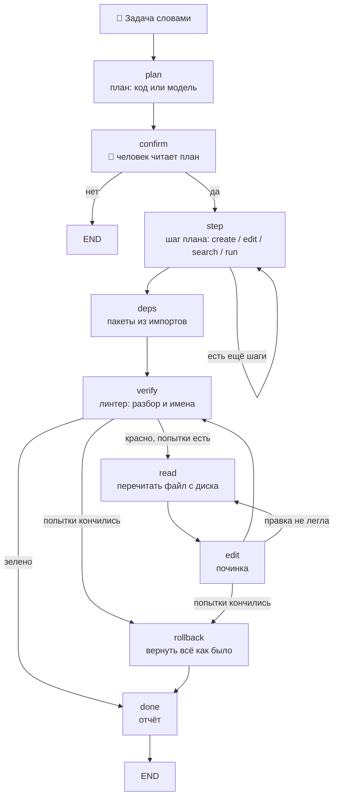

# 🛠️ Глава 8. Кодинг-агент: код, правка, ревью

> **Цель главы:** собрать агента, который по задаче обычными словами пишет код, правит уже написанное в нужном месте и показывает человеку каждую правку до того, как она попадёт на диск.

Здесь агент получает право писать в файлы, ставить пакеты и запускать команды. Ошибка перестаёт быть неверным ответом и становится испорченным файлом. Поэтому первым в главе написан не инструмент, а `src/guard.py` — границы.

*Для справки. **Агент** — программа целиком, то, что запускается командой `python -m chapter8.agent`. **Конвейер** — граф из девяти узлов, по которому идёт ЗАДАЧА: план, подтверждение, шаги, проверка, починка, откат. **Исполнитель** — тот же цикл ReAct из прошлых глав, единственный оставшийся специалист; ему достаются ВОПРОСЫ («где реализован калькулятор?»), и он отвечает поиском по коду, ничего не меняя. Модель одна и та же, промпты разные.*



Что агент умеет к концу главы:

* **читать проект** — каталоги, файлы кусками со строками, карту функций с назначением каждой;
* **искать по файлам и по символам** — текстом (`search_files`, `grep_code`) и по смыслу поиском Главы 5 (`search_code`, `find_symbol`, `project_map`);
* **писать и править несколько файлов за прогон** — четырьмя формами правки плюс замена функции целиком;
* **находить место правки, когда его не назвали** — «сделай, чтобы приложение выводило ещё и производную» тоже адрес;
* **показывать diff до записи** — не «сейчас поправлю функцию», а те самые строки, которые лягут на диск;
* **разбираться с зависимостями** — какие пакеты нужны, считается из импортов написанного кода, а не спрашивается у модели;
* **запускать тесты, линтер и саму программу** — по просьбе человека, командой или шагом плана;
* **читать ошибку и чинить по ней** — свою (линтер) или принесённую человеком («вот traceback, почини»);
* **работать с git** — состояние, diff, история, ветка, коммит только теми файлами, которых агент касался;
* **спрашивать разрешение** — перед каждой записью, установкой пакета и произвольной командой, с показом того, что именно будет сделано;
* **отчитываться** — маршрут прогона, что сделал каждый шаг, чем проверил и что откатил;
* **откатывать** — по снимку в git, и этот откат переживает перезапуск агента.

Чего он **не** умеет, чтобы список не обещал лишнего: держать в голове правила и стиль вашего проекта — ни `CONTRIBUTING.md`, ни настройки линтера он не читает; работать в песочнице; и отвечать на вопрос «то ли это, о чём просили» — на него отвечает человек.

---

## 🧭 Кодинг-агенты: что придумано до нас и что мы взяли

кодинг-агенты — это уже не просто «автодополнение кода», а системы, которые могут понимать задачу, читать репозиторий, править файлы, запускать тесты/сборку, чинить ошибки, создавать Pull Request, иногда почти автономно вести разработку от тикета до кода.

В нашем агенте используются решения из других проектов:

### Aider: карта репозитория и формы правки

[Aider](https://aider.chat) — консольный помощник, работающий поверх git. Что у него стало общим местом.

**Карта репозитория.** Отдавать модели файлы целиком бессмысленно — они не влезают. Aider разбирает исходники и отдаёт вместо них список определений: какие функции и классы есть, где лежат. Модель выбирает место по карте, а текст просит уже точечно.

**Формат правки — параметр, а не данность.** Сказать «поменяй вот это на вот то» можно по-разному: перезаписать файл целиком, прислать кусок «было/стало», прислать номера строк, прислать unified diff. Aider реализует несколько форматов и подбирает под конкретную модель тот, который она выдаёт применимым чаще.

Взято в главу: **и то, и другое.** Карта у нас своя и мельче — не файлы, а функции с назначением каждой (`src/codemap.py`, разбор `ast`). Формы правки реализованы четырьмя и сравнены на нашей модели; ответ оказался не тем, которого я ждал.

А вот третья идея Aider — прогонять после правки тесты и линтер — взята **наполовину**, и почему именно так, разбирается ниже: линтер остался приговором, тесты стали инструментом по просьбе человека.

### SWE-agent: интерфейс, придуманный для модели

[SWE-agent](https://swe-agent.com) — исследование Принстона про то, что модели нужен не человеческий интерфейс, а свой. Идея названа Agent-Computer Interface: команды, которыми агент смотрит и правит файлы, придуманы под то, как модель ошибается. Файл показывается окном с номерами строк; правка принимается только если после неё файл разбирается — иначе она просто не применяется, и агент видит ошибку вместо испорченного файла.

Взято: **номера строк во всём, что читает агент** (`42| def foo():` — и поиск Главы 5 отвечает ровно таким адресом), и **отказ применять правку, после которой файл перестал разбираться**. К этому мы добавили свою проверку: правка не применяется и тогда, когда из файла пропали определения, которых задача не касалась.

### Cline и Roo Code: подтверждение и контрольные точки

[Cline](https://cline.bot) и его ответвление Roo Code — расширения VS Code, где агент работает у человека на глазах. Два режима: план и действие. Перед каждой записью в файл и каждой командой показывается, что именно будет сделано, и человек жмёт кнопку. Пройденные точки сохраняются, к любой можно вернуться.

Взято: **узел `confirm`** — план показывается целиком до того, как хоть один файл тронут, — и **контрольная точка со своим откатом**: снимок каталога веткой git плюс журнал того, что агент изменил после него. Разница в том, что у нас откат не только ручной: конвейер сам откатывает всё, если не смог довести работу до зелёной проверки.

### OpenHands: песочница — и почему её у нас нет

[OpenHands](https://github.com/All-Hands-AI/OpenHands) (бывший OpenDevin) запускает агента в контейнере: файловая система, терминал и браузер — всё внутри изолированной среды, и то, что агент там сломает, не выходит наружу.

Взято: **ничего, и это осознанно.** Разворачивать контейнер в учебной главе значит потратить главу на контейнер. Взамен остаются две границы поменьше — рабочий каталог, за пределы которого не выходит ни один путь, и человек, читающий команду перед тем, как нажать `y`. Разница названа в разделе про безопасность, и запускать главу стоит на копии проекта.

### Plan-and-Execute вместо ReAct

Все главы до этой работали циклом ReAct из Главы 1: модель думает, вызывает инструмент, смотрит на результат, думает снова. Решение о следующем шаге принимается моделью каждый раз.

Для кодинг-агента это плохо ровно одним: **человеку нечего подтверждать.** Пока модель не сделала шаг, никто не знает, каким он будет; когда сделала — файл уже изменён. Схема, где сначала составляется весь план, а потом исполняется, называется Plan-and-Execute, и берут её обычно ради того, чтобы реже дёргать большую модель. Здесь она берётся ради другого: план — это то, что можно показать до, а не после.

Взято: **конвейер вместо свободного цикла.** Последовательность «план → подтверждение → шаги → зависимости → проверка» известна заранее, поэтому она записана графом, а не составляется моделью каждый раз.

### Reflexion: приём, который взяли, померили и выключили

Есть известное семейство приёмов — Reflexion, Self-Refine, — где модель после работы критикует собственный результат и переписывает его. Для агента, который сам пишет код, это выглядит очевидным дополнением: механические проверки отвечают на вопрос «работает ли», и ни одна не отвечает на вопрос «то ли это, о чём просили».

Приём реализован (`src/review.py`), померен и **выключен по умолчанию**: на модели курса он не ловит ничего.

---

## 🪫 Чем маленькая модель проигрывает большой

Курс идёт на `qwen2.5:3b`, и до этой главы разрыв с моделями побольше был виден смутно: где-то ответ поверхностнее, где-то маршрут выбран не тот. Кодинг-агент делает разрыв измеримым, потому что у его работы двоичный исход. Ниже — три слабости, которые видно на наших задачах, и рядом с ними чужие числа: из технического отчёта Qwen2.5-Coder и блога Qwen2.5. **HumanEval** там — «по описанию напиши функцию», **IFEval** — «соблюди форму ответа: одним словом, без пояснений, в теги», **Aider** — правки в настоящем репозитории, где надо не только придумать код, но и попасть форматом.

**Формат ответа.** Живой прогон сломался на задаче, где программа должна печатать строку `f'(x) = 4x + 5`. Ломался при этом не код, а конверт: до перехода на текстовую доставку файл приходил полем JSON, и уровней кавычек получалось три — JSON, исходник, литерал внутри исходника. Модель на 3B теряла один, и `json.loads` падал с «Unterminated string» ещё до того, как мы успевали посмотреть на Python. Официальный аналог этой беды — IFEval: 58.2 против 71.2. Чинилось это не промптом, а способом доставки: файл целиком приходит теперь обычным текстом.

**Правка существующего кода.** Официальный разрыв тут самый большой во всём отчёте: Aider даёт 33.8 против 55.6. У нас же на задачах правки все пять моделей упираются в потолок, и порядок между ними случайный. Это не значит, что модели одинаковы, — это значит, что **наш набор слишком лёгкий, чтобы их различать**: одна строка в файле из пяти, падающий тест прямо показывает, что не так. Aider меряет то же самое в настоящем репозитории, где надо ещё и попасть форматом.

**Многоходовость — и её ни один официальный отчёт не меряет.** Ближайшее, что есть, — обзоры по маленьким моделям в агентных задачах, и числа там резче кодовых: у Qwen3-4B общая точность около 62%, а на многоходовых задачах — 35%; у модели на 1.7B многоходовые падают до 17% при неплохой общей. Способность держать нить через несколько шагов рушится с уменьшением модели гораздо быстрее, чем способность ответить на один вопрос.

Последнее и объясняет, почему обвязка этой главы вообще помогает. Карта функций вместо поиска места, готовый список ответов в схеме (`enum`) вместо сочинения имени, одна функция вместо файла целиком, план из кода вместо плана от модели — **каждый приём превращает многоходовую задачу в набор одноходовых.** Модель от этого не умнеет; у неё просто перестают спрашивать то, на что она отвечает плохо.

И одно, чего в списке слабостей **нет**: длинный контекст. Qwen2.5-3B на задачах поиска в длинном контексте держится около 92%. В окно мы не упирались ни разу.

### Что из этого следует для читателя

Умолчание курса остаётся прежним — `qwen2.5:3b`, потому что глава должна работать на той же модели, что и все предыдущие. Coder-версия того же размера пишет код лучше, и по официальным данным разрыв заметный: +13% HumanEval, 74.4 против 84.1. **А вот на нашем конвейере, после всех приёмов главы, она выигрывает один случай из десяти** — и это главная мысль главы, увиденная с другой стороны: обвязка съела большую часть разрыва между моделями. Попробовать её всё равно стоит, отвечает она чуть быстрее, и меняется для этого одна переменная окружения:

```bash
$env:AGENT_CODER_MODEL = "qwen2.5-coder:3b"
```

---

## 🔍 Что делаем

### Границы пишутся до инструментов

`src/guard.py` — первый файл главы, и написан он до `write_file`. Причина простая: пока нет ответа на вопрос «что будет, если модель попросит переписать системный каталог», писать инструмент записи рано.

Что ограничено:

* **рабочий каталог** — один корень, любой путь проходит через `resolve_path`, за пределы не выходит;
* **белый список команд** — механизм есть, **по умолчанию выключен** (почему — ниже);
* **предел по времени** — зависший процесс снимается, а не держит агента вечно;
* **сухой прогон** — режим, в котором агент говорит, что сделал бы, и не делает;
* **подтверждение человеком** — перед каждым действием, которое меняет диск, ставит пакеты или запускает произвольную команду.

Вся запись идёт через одну функцию `_commit()`, и проверки стоят в ней, а не в каждом из четырёх пишущих инструментов. Забыть проверку легче всего в четвёртом однотипном месте.

Журнал изменений — там же. Перед каждой записью запоминается прежнее содержимое файла (или отметка «файла не было»), и по этому журналу работают команда «откат» и узел `rollback`. Хранится он в двух местах сразу: список в памяти отвечает на вопрос «что агент трогал в этом прогоне» и потому обязан быть быстрым, а прежнее содержимое уходит в git и в файл на диске — там оно переживает перезапуск. Как именно — в отдельном разделе ниже.

### Задача или вопрос: развилка по глаголу

У агента один вход — строка, которую набрал человек. «Напиши приложение» должно уйти в конвейер, «где реализован калькулятор?» — исполнителю. Отдельной команды для этого нет намеренно: команда, которую надо не забыть набрать, — это ещё одна вещь, которую можно забыть.

Различает их **глагол, а не предмет**: реплика, начинающаяся с «напиши», «поправь», «добавь», «сделай», — задача. Механизм тот же, что в Главе 5: `matches(text, markers)` со списком корней слов. Второй список — начала, после которых реплика задачей не является: «покажи», «расскажи», «объясни», «где ». И проверяется он **только по началу** реплики. Пока проверка шла вхождением куда угодно, слово «где» ловилось в середине задачи, и самые обычные просьбы уезжали отвечать текстом:

```
поправь функцию там, где вычисляется сумма   → вопрос
исправь место, где падает тест               → вопрос
добавь проверку туда, где ввод               → вопрос
```

Реплику определяет её главный глагол, а он стоит в начале. «Где падает тест» — вопрос; «поправь то, где падает тест» — задача; разделяет их позиция слова, а не его наличие.

### План: код там, где ответ вычислим

План — это список шагов, который показывается человеку до того, как тронут первый файл. Составить его можно двумя способами, и глава использует оба, но не поровну.

* **называет** («поправь функцию `add` в `calc.py`») — план строится кодом: найти файл, прочитать, править, проверить. Тут нечего придумывать, всё есть в самой задаче;
* **не называет** («сделай модуль корзины с тестами») — плана из кода не существует: придумать, сколько файлов завести и как их назвать, эвристикой нельзя. Спрашивают модель.

Потолок — шесть шагов. Действий, которые план может назвать, тоже шесть: `search`, `read`, `create`, `edit`, `run`, `test`. Это `enum` схемы: назвать действие, которого нет, модель физически не может.

### Подтверждение: человек читает diff, а не намерение

Узел `confirm` показывает план целиком и ждёт «да». Дальше каждая запись показывается отдельно — не словами «сейчас поправлю функцию», а настоящим diff того, что ляжет на диск:

```
  Агент собирается: заменить строки 1-11 в quadratic.py
  Подробности: --- quadratic.py (было)
+++ quadratic.py (станет)
@@ -9,6 +9,10 @@
         return root
     else:
         return None
+
+    # Добавляем вывод производной
+    derivative = 2*a*b - 4*a*c
+    print('Производная квадратного уравнения:', derivative)
```

Этот пример настоящий, и он же показывает, зачем diff нужен: формула производной здесь неверная, а код после `return` недостижим. Человек, читающий diff, видит обе беды за секунду; человек, читающий «сейчас добавлю вывод производной», — ни одной.

Три режима переключаются командами: `сухо` — ничего не писать, `спрашивать` — умолчание, `молча` — писать без вопросов.

### Четыре формы правки, и почему по умолчанию цитата

Сказать, ЧТО именно поменять в файле, можно по-разному, и слабая модель ломается как раз здесь. Что умеет агент:

* **`anchor`** — цитата «было» и текст «стало». Короткая, потерять чужой код физически не может, но цитата должна совпасть с файлом до символа;
* **`lines`** — номера строк и новый текст. Цитировать ничего не надо — и адрес у нас уже есть, поиск Главы 5 отвечает в виде `файл:строки`;
* **`full`** — файл целиком. Всегда применима, но модель на 3B файл в двести строк не перепечатывает целиком;
* **`append`** — дописать в конец. Решает другую задачу: не «замени кусок», а «добавь новое».

По умолчанию в промпте правки стоит **цитата**, хотя номера строк выглядели удобнее и были у нас на руках от поиска Главы 5. Причина в том, что происходит с ЧУЖИМ кодом: на длинном файле и номера строк, и перезапись целиком теряют определения, которых никто не просил трогать, а цитата потерять их физически не может.

Схема ответа собрана из вариантов через `oneOf`, по одному на форму. Схема с общим набором полей, где обязательны только `form` и `path`, разрешает модели назвать одну форму и заполнить поля другой — и слабая модель ровно так и делает. `enum` ограничивает значение поля, а не смысл ответа; связь между полями выражается структурой схемы или не выражается вовсе.

Пятая форма стоит особняком: **замена функции целиком**. Границы функции берутся из карты (ниже), модель получает только её текст и переписывает от `def` до последней строки. Это компромисс между «файл целиком» и «процитируй точно»: цитировать не надо, а потерять соседний код нельзя.

### Карта функций: выбор из списка вместо поиска места

Правку надо куда-то положить. Текстовый поиск справляется, пока человек цитирует свой код, и перестаёт сразу, как только он говорит по-человечески: «сделай, чтобы приложение выводило ещё и производную». Искать нечего — ни одного слова из файла в задаче нет.

Карта отвечает на этот вопрос иначе. `src/codemap.py` разбирает `ast` всех файлов каталога и собирает список: имя функции, аргументы, диапазон строк, назначение. Модель видит список и **выбирает одну** — а выбор из списка это `enum`, и его можно навязать схемой. Назвать функцию, которой нет, тогда физически невозможно.

Что считает код, а что модель, разделено жёстко: имена, аргументы и диапазоны строк — разбор `ast`, без модели; назначение — из докстринга (строки описания в начале функции), если он есть; и только назначение того, у чего докстринга нет, спрашивают у модели. Такие функции пишет сам агент — в его коде докстрингов обычно нет.

Выбрать из списка модель на 3B умеет. **Отказаться** от выбора — сказать «ни одна не подходит» — почти нет: вместо этого она называет первую попавшуюся, хотя такой пункт в перечислении есть и о нём сказано правилом промпта. Отсюда правило, записанное в код: решение «править или заводить новый файл» принимает `plan_kind`, а у модели спрашивают только «какую из этих». Вопрос, на который у неё нет хорошего ответа, ей не задают.

### Файл целиком приходит текстом, а не полем JSON

Схема ответа выигрывала в этой главе там, где ответ **короткий**: форма правки — одно поле, выбор места — одно имя.

Файл целиком — это сотни строк, и схема заставляет экранировать каждую кавычку и каждый перевод строки. Уровней кавычек получается три: JSON, исходник, литерал внутри исходника. Модель на 3B теряет один — и ломается не код, а конверт: `json.loads` падает с «Unterminated string» ещё до того, как мы успеваем посмотреть на Python.

Поэтому файл целиком приходит обычным текстом, а `_strip_fences` снимает ```-обёртку, если модель её добавила. Приём уточняет главный приём главы, а не отменяет его: **схема помогает, пока ответ короткий, и мешает, когда он длинный.**

### Зависимости считаются, а не назначаются

Какие пакеты нужны проекту, видно из импортов написанного кода. Спрашивать об этом модель — значит получить правдоподобный ответ вместо верного.

Узел `deps` разбирает импорты `ast`, отбрасывает стандартную библиотеку и то, что уже установлено, и остаток предлагает поставить. Установка проходит через подтверждение человеком: `pip install` — это команда, скачивающая код из сети.

### Проверка: только то, что не зависит от задачи

Этот раздел главы переписан после живых прогонов, и переписан сильно. Сначала — что было, потом почему это пришлось выбросить.

Узел `verify` умел проверять тремя способами. Есть файлы тестов — `pytest`. Программа ждёт ввода — запуск с подставленными числами. В остальных случаях — обычный запуск. Каждый способ выбирался кодом, а не моделью, и это выглядело сильной стороной.

Слабой стороной оказалось другое: **чтобы подставить ввод, надо знать область определения задачи.** Числа были подобраны под квадратное уравнение — `1, -3, 2` даёт корни 1 и 2, — и единица стояла первой в каждом наборе. Пришёл калькулятор логарифмов:

```
Последняя ошибка: ZeroDivisionError: float division by zero
```

`math.log(x, 1)` — деление на `log(1)`, то есть на ноль. Программа была написана верно, невалидный ввод подали ей мы. Три прогона подряд, на двух моделях: проверка объявляла сломанным исправное, починка два круга чинила несуществующую беду, откат стирал правильный код.

Числа заменили на «годные любой школьной задаче» — ни нуля, ни единицы, ни отрицательных. Следующей же сломалась задача «прочитай ячейку A1 из файла Excel»: там подставлять было нечего вовсе, программа падала `FileNotFoundError`, потому что файла нет и взять его негде.

Вывод, к которому это привело, короткий: **любой фиксированный набор входных данных — это утверждение о задаче, которой мы не видели.** Не «числа подобраны плохо», а «числа подобрать нельзя».

#### Три разряда проверок

Проверка индивидуальна ровно настолько, насколько она знает задачу. Отсюда разделение, по которому теперь и проходит граница.

**Универсальные — свойства файла, а не замысла.** Файл разбирается; имён из ниоткуда нет. Эти верны, что бы человек ни просил: неразбирающийся модуль сломан при любой задаче, и `math.sqrt` без `import math` — тоже.

**Индивидуальные, написанные тем, кто знает задачу.** Их две: тесты, которые агент написал рядом с кодом, и ошибка, которую принёс человек. Здесь «что значит работает» формулирует тот, кто в курсе.

**Индивидуальные, выдуманные нами.** Подставленный ввод и запуск программы, которой нужен внешний мир. Здесь мы делаем вид, что знаем задачу.

Приговор выносит только первый разряд. Второй — работает по просьбе: `run_tests` остался инструментом, человек говорит «прогони тесты», агент прогоняет и показывает. Третий убран целиком.

#### Что делает узел проверки теперь

```python
checked = [path for path in state.extra.get("touched", []) if path.endswith(".py")]
problems = []
for path in checked:
    problems += lint_problems(path)
green = not problems
```

Всё. Ни одной строки кода агента при проверке не выполняется — на это есть отдельный тест, который считает вызовы запуска и требует, чтобы их было ноль.

Проверяются **все** файлы прогона, а не точка входа: прежний узел смотрел на один файл, и беда в соседнем модуле оставалась невидимой, хотя писал его тот же агент в том же прогоне.

Линтер отвечает и за синтаксис — `--select F821` его не отключает, ошибка разбора приезжает отдельной строкой `invalid-syntax`. Без её разбора сломанный файл выглядел бы чистым: правил в нём линтер просто не проверял.

Кроме линтера, осталось два исхода, и оба тоже не требуют знания задачи. План обещал написать тесты, а их нет — файла либо нет, либо есть. И проверять нечего вовсе: агент написал батник или файл настроек, питоновского файла в прогоне не появилось.

#### Что агент теряет и что возвращает

Теряет он право говорить «работает». Вместо этого он говорит, что именно проверил:

```
Готово. Проверено: линтер: calc.py.
```

И это не потеря, а возврат к правде. Зелёная проверка и раньше почти ничего не значила: калькулятор логарифмов на 3B, посчитавший корень вместо логарифма, прошёл запуск с кодом 0 — потому что упал в свой же `except` на нашем вводе и напечатал сообщение об ошибке. Ни один из трёх наборов не дошёл до вычисления. Программа, которая при проверке ни разу не сделала того, ради чего написана, проверенной не была и тогда.

Что остаётся человеку: увидеть diff до записи, запустить программу самому и прислать ошибку словами. Агент это чинит — и чинит по настоящей ошибке, а не по выдуманной нами. Живой прогон показал, чего стоило обратное: получив `ZeroDivisionError` без единого слова о том, что основание подали мы, 7B угадала причину («основание не может быть равно 1»), дописала обработку — и всё равно провалилась, потому что дописала её после точки входа.

### Починка и откат

Проверка красная — конвейер идёт не в правку, а в **чтение**: файл на диске уже изменён прошлой попыткой, и модель должна увидеть его таким, какой он есть, а не таким, каким писала. Кругов починки два.

Дальше важное различие, которое конвейер держит явно. «Не смогли проверить» и «проверили, и оно сломано» — разные исходы, и второй из первого не следует. Агент мог сделать ровно то, о чём просили: написать батник, файл настроек, README. Объявлять такое сломанным за то, что у нас нет для него проверки, — способ выбросить правильно сделанное; поэтому есть отдельный флаг `unverifiable`, и работа остаётся на диске, а человек читает, чем её не проверили.

Если же проверка красная и круги кончились — `rollback`. Возвращается всё: правки в существующих файлах и файлы, созданные агентом с нуля. Каталог становится таким, каким был до задачи.

### Откат, который переживает смерть агента

Первая версия отката была списком в оперативной памяти: перед каждой записью запоминался прежний текст файла, «откат» шёл по списку назад. Работает — ровно до первой неприятности. Агент закрыт, упал, потерял Ollama — списка нет, и файлы остаются в том виде, в каком их застали. **Единственная настоящая страховка главы оказалась самой недолговечной её частью.**

Поэтому та же работа поручена git. Что он даёт взамен списка:

**Точка, к которой можно вернуться.** Перед первой записью агент делает снимок рабочего каталога и вешает на него ветку с временем в имени — `agent-snapshot/2026-09-04-18-27-29`. Ветка живёт в `.git` и переживает что угодно: человек может посмотреть `git diff agent-snapshot/...`, вернуть отдельный файл или весь каталог — через неделю и без агента.

**Хранилище прежнего содержимого.** Перед каждой записью прежний текст файла кладётся в объектное хранилище git (`git hash-object -w`), а путь и полученный идентификатор — в журнал на диске. Откат читает журнал и достаёт текст обратно. Новый запуск агента видит незакрытый долг прошлого и говорит о нём первой строкой:

```
⏮️ Прошлый запуск оставил изменёнными: old.py, новьё.py
   «откат» вернёт их. Начнёте новую задачу — журнал обнулится.

Вы: откат
  удалён новьё.py
  восстановлен old.py
  Снимок до работы агента остался веткой agent-snapshot/2026-09-04-18-27-29
```

Важнее того, что этот механизм делает, — то, чего он **не** делает.

**Он не трогает вашу работу в git.** Ни `HEAD`, ни рабочий каталог, ни индекс — то место, куда попадает сделанный человеком `git add`, — не меняются. Снимок собирается во временном индексе (`GIT_INDEX_FILE`), дерево пишется из него, коммит создаётся `commit-tree` напрямую, ветка ставится `git branch`. Очевидный на первый взгляд `git checkout -b` не годится ровно поэтому: он переключает `HEAD`, и агент, начавший задачу, унёс бы человека на другую ветку.

**Он не восстанавливает то, чего не трогал.** Откат идёт по журналу, файл за файлом. Правка, сделанная человеком в соседнем окне, в журнал не попадает и остаётся на месте — а вернуть каталог целиком можно веткой снимка, и делает это человек.

**Он не работает вне репозитория.** Каталог без git — обычный случай: человек попросил написать программу в пустой папке. Там остаётся прежний список в памяти, и агент пишет об этом прямо, вместо того чтобы делать вид, что защищён:

```
Откат: только в памяти этого запуска — каталог не репозиторий git.
Закроете агента, не откатив, — возвращать будет нечем.
```

Модель в этом приёме не участвует, поэтому и мерить в нём нечего: он проверяется тестами — одиннадцать штук, и половина из них про то, чего механизм делать НЕ должен: не двигать `HEAD`, не трогать индекс человека, не восстанавливать чужие файлы, не применять журнал от другого каталога.

### Память сессии

Хранилище — то же самое, что в Главе 3 (`LongTermMemory`), и взято оно не ради того, чтобы меньше писать, а чтобы показать, что механизм главы про контекст работает не только на фактах о человеке. Там агент запоминал «меня зовут Владимир»; здесь — рабочий каталог, файл, над которым работаем, и последнюю задачу.

Зачем это, видно из живых прогонов. Каждый начинался с того, что человек набирал `каталог E:\progects\...`, потому что агент про свой каталог не помнил ничего. А дальше шли задачи вроде «добавь ожидание ввода» — без имени файла, потому что человек имел в виду тот файл, который они только что писали вместе.

Из трёх фактов один общий, а два — **свои в каждом каталоге**. Рабочий каталог отвечает на вопрос «где мы работали в прошлый раз», и второго ответа у этого вопроса нет. А файл и задача принадлежат проекту: пока все три ключа были общими, работа во втором проекте молча затирала память первого, и, вернувшись, человек заставал там чужой файл.

Разъезжаются они по каталогам не путём в ключе, а его отпечатком, и причина поучительная. Ключи памяти Главы 3 **нормализуются**: точки, дефисы, косые и пробелы превращаются там в подчёркивание. Путь, положенный в ключ как есть, после такой нормализации склеивает `my-app` и `my_app` в один проект — то есть ровно та беда, от которой ключи и разъезжались. Восемь шестнадцатеричных цифр нормализацию переживают целиком, а имя каталога стоит рядом с ними, чтобы `session.json` можно было открыть глазами:

```
workspace                        = E:/progects/myapp
current_file@myapp_3f2a1b7c      = server.py
last_task@myapp_3f2a1b7c         = добавь маршрут
current_file@calc_9d17e004       = calc.py
```

Чего в памяти нет намеренно: истории разговора и содержимого файлов. Первое живёт в диалогах Главы 3, второе читается с диска и устаревает в ту же секунду, как его записали. Память — про адреса, а не про содержимое.

### Тот же конвейер на LangGraph

`src/pipeline_lg.py` — те же девять узлов и то же состояние, собранные библиотекой LangGraph вместо графа Главы 7. Работает командой `langgraph <задача>`, зависимость необязательная.

Смысл этого файла не в том, чтобы предложить выбор, а в том, чтобы разница между «своё» и «готовое» была видна числом, а не на слух: LangGraph тянет 20 пакетов сверх тех, что курс ставит и так, и 21.1 МБ на диске, а свой граф — 380 строк без единой зависимости.

Вывод тот же, что в Главе 7: пока нужны узлы, рёбра и общее состояние, своё остаётся читаемым целиком и не тянет за собой ничего. Как только понадобится параллельное выполнение узлов, потоковая выдача или хранилище сложнее JSON-файла — брать готовое.

---

## 🧪 Что не сработало

### Скелет вместо файла целиком

Идея: пусть модель сначала перечислит СОСТАВ файла — определения с описанием и пустыми телами, — а потом вторым запросом заполнит тела. Многоходовую работу это разбивает на два простых хода, что для 3B обычно помогает.

Не выиграл ни у одной модели, и видно, почему: второй запрос — это ещё одно место, где ответ может не разобраться, и слабая модель теряет там больше, чем выигрывает на упрощении. Чаще всего скелет кончается тем, что файла не появляется вовсе. Режим оставлен переключателем `AGENT_WRITE_MODE=skeleton`; умолчание — `direct`.

### План от модели на задачах правки

Модель курса выдумывает пути и теряет шаги в шести планах из десяти; модель, специально обученная агентным задачам, строит их чисто — и всё равно не выигрывает у плана, собранного кодом, а берёт впятнадцатеро больше времени. Вывод узкий, и его границы надо назвать: это верно **на задачах правки, где файл назван в самой задаче**. На задачах с нуля у кода ответа нет, и там планирует модель.

### Модель как судья своей работы

На модели курса приём не ловит ничего: она отвечает «сделано» всегда, а не потому, что проверила. С 7B он начинает работать — но 7B у нас нет. Умолчание `AGENT_REVIEW=off`.

Вывод шире одного приёма и совпадает с предыдущим: **слабая модель не становится сильнее оттого, что её спрашивают о её же работе.** Схема даёт ей форму ответа, но не даёт способности заметить.

### Английский промпт планировщика

Гипотеза: русский промпт занимает у модели больше токенов и хуже ложится на то, чему её учили. Первое подтвердилось, второе — нет: планы на обоих языках выходят одинаковыми. Перевод промпта сокращает счёт токенов и не меняет результат. Переключатель `AGENT_PLANNER_LANG` остался, умолчание — русский.

### Проверка запуском

Самый крупный приём, который глава выбросила, — и выбросила уже после того, как он был написан и описан.

Идея выглядела бесспорной: агент, который пишет код, должен его запустить. Есть тесты — прогнать; программа ждёт ввода — подставить числа; в остальных случаях просто выполнить и посмотреть на код возврата. Живые прогоны показали, что бесспорного тут нет ничего.

Чтобы подставить ввод, надо знать, какие значения задача считает допустимыми. Числа были подобраны под квадратное уравнение — единица первой в каждом наборе, — и калькулятор логарифмов трижды подряд объявлялся сломанным: `math.log(x, 1)` есть деление на ноль. Числа заменили на «годные любой школьной задаче»; следующей сломалась задача с чтением файла Excel, где подставлять было нечего вовсе.

Ложный красный при этом не проходит бесследно: два круга починки делают код хуже, а откат стирает правильную работу. Ложный зелёный не лучше — программа, упавшая в собственный `except` на нашем вводе, выходит с кодом 0 и объявляется проверенной.

Правило, которое из этого следует, шире одного приёма: **проверка индивидуальна ровно настолько, насколько она знает задачу.** Универсальны только свойства файла — разбирается ли он, нет ли в нём имён из ниоткуда. Остальное знает либо тот, кто задачу поставил, либо никто.

### Строгие проверки при записи

К проверкам записи (файл разбирается, определения не пропали) добавились ещё три: недостижимый код после `return`, неопределённые имена, повторное определение уже существующей функции. Каждая ловила настоящую беду из живого прогона, и каждая по отдельности выглядела разумной.

Вместе они начали отменять почти всё, что пишет 3B. Агент перестал врать — и перестал работать: правки не ложились, конвейер два круга бился о пустоту и откатывал сделанное. Пришлось вернуться к состоянию, в котором при записи проверяются только разбор и потерянные определения; остальное осталось на `verify`, где оно ловит то же самое, но **после** прогона, когда есть что чинить.

Правило, которое из этого следует: **проверку надо мерить не только по тому, сколько плохого она ловит, но и по тому, сколько хорошего отменяет.** Второе число собирать никто не любит, и оно решает.

---

## 🛡️ Безопасность

Эта глава — первая, где ошибка агента портит файл, а не ответ. Что добавилось к поверхности атаки:

* **запись в файлы.** Любой файл внутри рабочего каталога может быть перезаписан. За пределы каталога путь не выходит: `resolve_path` разворачивает `..` и символические ссылки и сверяет корень;
* **запуск произвольных команд.** Белый список программ есть, но по умолчанию выключен — кодинг-агент заранее не знает, какая программа ему понадобится, а список, который дописывают под каждую задачу, защитой быть перестаёт;
* **установка пакетов.** `pip install` скачивает и выполняет чужой код. Проходит через подтверждение всегда.

Что сужено:

* **один корень** — рабочий каталог, и он же граница поиска, чтения и записи;
* **без командной оболочки** — процесс запускается напрямую, поэтому `&&`, перенаправление вывода и подстановка переменных не работают в принципе, а не «не рекомендуются»;
* **предел по времени** — зависший процесс снимается;
* **снимок и откат** — перед первой записью каталог снимается веткой git, и всё, что агент изменил после, возвращается одной командой; журнал лежит на диске, поэтому перезапуск агента ему не мешает. В каталоге без git остаётся список в памяти — и агент об этом предупреждает;
* **сухой прогон** — режим, в котором видно намерения без последствий.

Где проходит граница. Подтверждение спрашивается перед произвольной командой и перед запуском файла, но **не** перед `run_tests` и `run_lint`: у этих форма команды фиксирована, а зовут их подряд по многу раз, и вопрос на каждый превратился бы в кнопку, которую жмут не глядя.

У этого удобства была дыра, и она стоит того, чтобы разобрать её отдельно. **`pytest` выполняет `conftest.py` проекта до первого теста** — а это обычный Python-файл, в котором может быть что угодно, от `shutil.rmtree` до запроса в сеть. То есть исключение, сделанное ради того, чтобы не приучать человека жать «y», пропускало исполнение чужого кода вообще без вопроса.

Закрыто это не отменой исключения, а сужением: вопрос задаётся, только если `conftest.py` в каталоге **есть**, и только **один раз на каталог**.

```
  Агент собирается: запустить pytest в этом каталоге
  Подробности: pytest выполнит conftest.py — это обычный Python-код,
  и он запустится до первого теста. Спрашиваю один раз на каталог.
  Разрешить? [y/N]
```

Нет файла — нет и вопроса. Отказ при этом ничего не ломает: `run_tests` возвращает «Отказано», и на этом всё — приговор прогону выносит линтер, а он чужой код не выполняет.

> [!WARNING]**Агент не заперт в песочнице.** Единственная защита, кроме рабочего каталога, — человек, читающий команду перед тем, как нажать `y`. Запускайте главу на копии проекта, а не на единственной.

---

## 📐 Окно и бюджет

Окно то же, что во всех главах, — 8192 токена. Интересное здесь в том, что кодинг-агент **не расходует его на промпт**.

Универсальный агент Главы 6 занимал системным промптом 5249 токенов из 8192. Специалист «код» Главы 7 — 2686. Исполнитель этой главы, тот, что отвечает на вопросы, — 2618 токенов при 26 инструментах, и на историю разговора ему остаётся 4947, из них на найденное поиском не больше 2473.

А конвейер устроен иначе: у него нет длинного промпта вообще. Каждый его запрос к модели — отдельный разговор с одним правилом и одним вопросом:

| Запрос | Правила | С чем вместе уходит |
| :--- | ---: | :--- |
| Правка файла | 611 | 120 строк файла — около 1023 токенов |
| Файл целиком | 263 | текст задачи |
| Ответ обычным текстом | 59 | добавка к правилам файла |
| Замена одной функции | 323 | текст одной функции |
| Имя файла для задачи | 188 | текст задачи |

Самый тяжёлый запрос конвейера — правка: 611 токенов правил плюс до 1023 токенов файла, всего около 1634 при окне 8192. Втрое меньше, чем один только промпт агента Главы 6.

Это не оптимизация, а следствие устройства. Свободный цикл ReAct обязан держать в промпте всё, что агент **может** сделать; конвейер знает, что делает сейчас, и держит только это. Тот же приём, что и с `enum`: чем короче список возможного, тем меньше способов ошибиться.

---

## 🚀 Как запустить

```bash
# из корня проекта
python -m chapter8.agent
```

Нужны те же модели и индексы, что у Главы 7. Первым делом скажите агенту, где работать. Дальше — просто задача словами: «напиши приложение на python, которое выводит hello world», «поправь функцию add в calc.py — она вычитает вместо сложения», «добавь в calc.py функцию деления и тест к ней».

Полезные команды: `план <задача>` — только показать план, ничего не делая; `спроси <вопрос>` — заведомо вопрос, а не задача; `откат` — вернуть всё, что агент изменил; `сухо` / `спрашивать` / `молча` — режим подтверждений; `окружение`, `инструменты`, `бюджет`, `память`.

Строка `Откат:` в отчёте о каталоге говорит, чем вы застрахованы прямо сейчас: снимком в git или списком в памяти запуска. Если каталог — не репозиторий, а работа важная, `git init` перед запуском агента меняет ответ.

Переменные окружения:

| Переменная | Умолчание | Что делает |
| :--- | :--- | :--- |
| `AGENT_WORKSPACE` | текущий каталог | рабочий каталог, сильнее памяти сессии |
| `AGENT_CODER_MODEL` | модель курса | модель, которая пишет код |
| `AGENT_PLANNER` | `fallback` | `fallback` — план из кода, `model` — всегда моделью |
| `AGENT_PLANNER_MODEL` | — | отдельная модель под планирование |
| `AGENT_PLANNER_LANG` | `ru` | язык промпта планировщика |
| `AGENT_WRITE_MODE` | `direct` | `direct` — файл целиком, `skeleton` — в два запроса |
| `AGENT_WRITE_TRANSPORT` | `text` | `text` — файл обычным текстом, `schema` — полем JSON |
| `AGENT_REVIEW` | `off` | разбор написанного моделью |
| `AGENT_SESSION_FILE`, `AGENT_CODEMAP_FILE` | рядом с главой | где лежат память сессии и карта функций |
| `AGENT_HISTORY_FILE` | рядом с главой | где лежит журнал отката |

Тесты:

```bash
python -m pytest chapter8/tests.py -q
```

669 быстрых тестов, живой модели не требуют (один пропускается на Windows без прав на символические ссылки). Отдельно — 10 проверок на живой модели (`-m integration`) и 10 замеров главы (`-m slow -s`); и те, и другие по умолчанию не выбираются.

---

## 🔄 Что изменилось

| | Глава 7 | Глава 8 |
| :--- | :--- | :--- |
| Что делает с проектом | рассказывает | пишет, запускает, ставит пакеты |
| Кто отвечает на реплику | один из пяти специалистов | конвейер (задача) или исполнитель (вопрос) |
| Инструментов | 16 в реестре, по 0–6 у специалиста | 26: 20 своих и 6 на поиск по коду |
| Устройство работы | свободный цикл ReAct | девять узлов, пять условных рёбер |
| Кто решает, что делать дальше | модель на каждом шаге | план, подтверждённый человеком |
| Промпт самого тяжёлого запроса | 2686 токенов | 611 + файл, около 1634 |
| Что бывает при ошибке | неверный ответ | откат по снимку в git: каталог возвращается как был |
| Проверка результата | никакой | линтер: разбор файла и имена из ниоткуда |
| Границы | нет | рабочий каталог, подтверждение, предел по времени, сухой прогон |

---

## 🏠 Домашняя работа

**Задание.** Возьмите свой маленький проект — копию, не единственную! — и дайте агенту три задачи подряд: написать что-то с нуля, поправить написанное, добавить к нему тест. Смотрите не на результат, а на маршрут прогона: где конвейер пошёл в починку, где откатил, что написано в строке «Проверено:».

**Что стоит попробовать поменять:**

1. Поставьте `AGENT_CODER_MODEL=qwen2.5-coder:3b` и повторите те же три задачи. Разница в конечном результате невелика — интереснее посмотреть на время ответа и на то, сколько раз включился круг починки.
2. Включите `AGENT_REVIEW=on` и посмотрите, что скажет разбор на файле, который вы сломали нарочно.
3. Переключите `AGENT_WRITE_TRANSPORT=schema` и дайте задачу, где в ответе обязана быть строка с апострофом. Файл приедет полем JSON — и, скорее всего, не приедет вовсе.

**Промпт для помощника,** если хотите разобрать свой прогон:

> Вот лог прогона кодинг-агента. Найди в маршруте место, где проверка стала красной, и объясни, что именно её не устроило. Отдельно скажи, была ли беда в коде или в том, как агент его доставил.

**Что проверить у себя.** Наберите `откат` после неудачного прогона и убедитесь, что каталог вернулся в исходное состояние. Потом сделайте то же самое злее: дайте агенту задачу в репозитории, дождитесь первой записи, закройте окно целиком — и запустите заново. Он должен встретить вас строкой «Прошлый запуск оставил изменёнными…», а `откат` — сработать. Если нет, ищите беду в журнале: он здесь единственное, что отделяет учебного агента от испорченного проекта.

---

## 🎯 Итог главы

**Что агент научился делать:**

* **вести задачу конвейером** — девять узлов от плана до отчёта, план показывается человеку до того, как тронут первый файл;
* **строить план кодом там, где ответ вычислим** — на задачах, где файл назван в самой задаче, план из кода и план от модели дают одинаковое число зелёных прогонов, но у модели претензии к шести планам из десяти (выдуманный путь, отсутствующий шаг) против нуля у кода, и времени она берёт вдвое больше — 48 секунд против 20 на десяти прогонах;
* **находить место правки по карте функций** — списку определений проекта с назначением каждого: схема ответа разрешает модели назвать только функцию из этого списка, и на задачах, где имя функции не звучит в вопросе ни разу, она выбирает верно 8 раз из 8;
* **править файл четырьмя формами** — из них по умолчанию берётся цитата «было/стало»: на файле из девяти функций она доводит тесты до зелёных 8 раз из 10, замена по номерам строк — 4 раза, перезапись файла целиком — ни разу;
* **получать файл обычным текстом, а не полем JSON** — на задачах, где в коде обязана быть строка с кавычками внутри, текст даёт 30 разбирающихся файлов из 30 против 16 у схемы;
* **проверять то, что проверяется без знания задачи** — разбирается ли файл и нет ли в нём имён, которых нигде нет; всё остальное — тесты и запуск — агент делает по просьбе человека и приговором не считает;
* **откатывать неудачу** — перед первой записью каталог снимается веткой git, прежнее содержимое файлов уходит в её объектное хранилище, и после двух неудачных кругов починки всё возвращается в состояние до задачи, вместе с созданными файлами. Журнал лежит на диске, поэтому откат работает и в следующем запуске агента — например, после того как предыдущий не пережил ошибки.

**Чему научила глава.**

**Схема помогает, пока ответ короткий, и мешает, когда он длинный.** Constrained decoding — навязывание модели формы ответа схемой — выиграло в этой главе дважды: на форме правки, где схема из отдельных вариантов на каждую форму дала одной из моделей 5 применимых правок из 5 против 0 у схемы с общим набором полей, и на выборе функции, куда положить правку, — 8 из 8. Общее у обоих случаев то, что ответ там — одно поле или одно имя. Когда тем же способом попросили файл целиком, уровней кавычек стало три (JSON, исходник, литерал внутри исходника), и модель на 3B начала терять один: ломался не код, а конверт. Правило переносится за пределы курса — чем длиннее ответ, тем больше модель теряет на каждом уровне экранирования.

**Обвязка не делает модель умнее — она убирает то, в чём модель слабее всего.** Официальные данные говорят, что разрыв между 3B и 7B неравномерен: на «написать функцию с нуля» он около пяти процентов, на «править существующий код» — в полтора раза, а на многоходовых задачах маленькие модели проваливаются вдвое против своей же общей точности. Каждый приём этой главы — карта функций вместо поиска места, готовый список ответов в схеме вместо сочинения, план из кода вместо плана от модели, одна функция вместо файла целиком — превращает многоходовую работу в набор одноходовых вопросов. Ровно поэтому они и работают.

Обратное тоже верно: то, чего модель не умеет, не появляется оттого, что её об этом спросили. Разбор написанного — приём из семейства Reflexion, где модель критикует собственный результат, — на трёх моделях в 3B поймал 0 бед из 8 при идеальном молчании на здоровых файлах: она отвечает «сделано» всегда, а не потому, что проверила. На 7B тот же приём ловит 5 из 8.

**Проверку надо мерить не только по тому, сколько плохого она ловит, но и по тому, сколько хорошего отменяет.** В этой главе к проверкам при записи добавились три новые — недостижимый код, неопределённые имена, повторное определение. Каждая ловила настоящую беду из живого прогона. Вместе они начали отменять почти всё, что пишет 3B: агент перестал врать и перестал работать. Второе число никто не любит собирать, и оно решает.

**Проверка индивидуальна ровно настолько, насколько она знает задачу.** Это тот же вывод, дочитанный до конца, и он стоил главе её заглавного приёма. Агент запускал написанную программу и подставлял ей числа со stdin — а чтобы подставить ввод, надо знать область определения задачи. Числа, годные квадратному уравнению, убивали калькулятор логарифмов; числа, годные любой школьной задаче, ничего не могли сказать программе, которой нужен файл на диске. Универсальны только свойства файла: разбирается ли он и нет ли в нём имён из ниоткуда. Всё остальное знает либо тот, кто поставил задачу, либо никто, — и агент, который делает вид, что знает, ошибается в обе стороны сразу: стирает правильную работу и заверяет неправильную.

|[Назад](../chapter7/README.md) | [📚 Оглавление](../README.md) | Далее: Глава 9 (в работе)|
